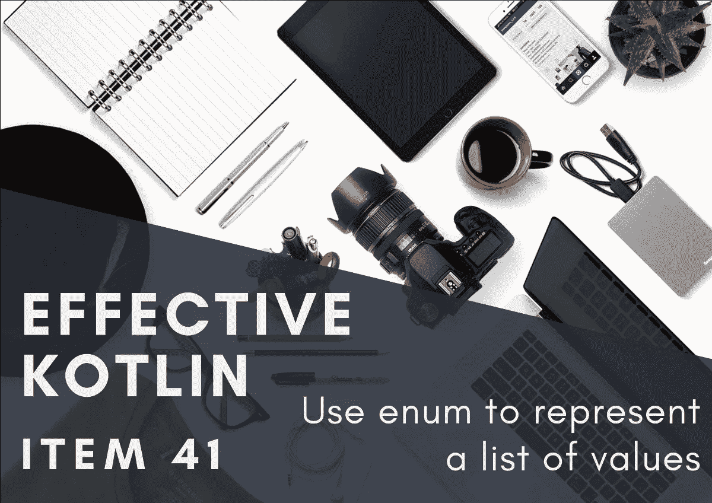
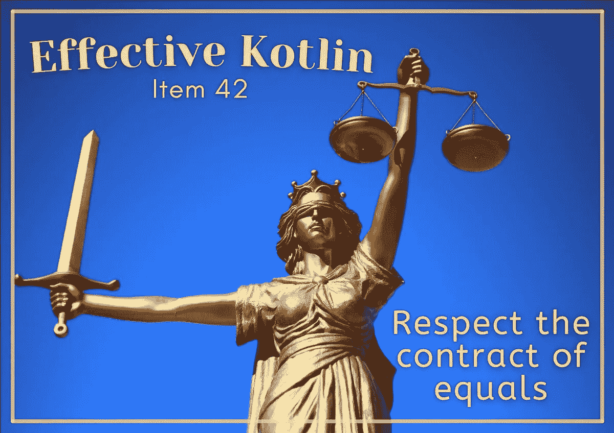
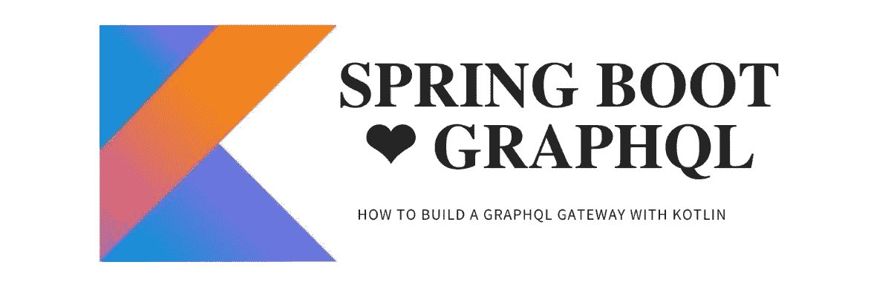

# 来自堪萨斯城的科特林文章和新闻。学院🤩

> 原文：<https://blog.kotlin-academy.com/kotlin-articles-news-from-kt-academy-128d7ef714df?source=collection_archive---------3----------------------->

你好，
Kt。这里是学院**👋**

以下是您将在此简讯中找到的内容的快捷方式:

✅ 2 篇文章是有效的科特林书的一部分:
👉使用枚举来表示一个值列表
👉尊重平等的契约
✅如何用 Spring Boot 和 Kotlin 构建 GraphQL 网关让-米歇尔·法亚德
✅·kt 著。学院新 logo！

尽情享受吧！⏬

什么时候应该使用枚举类，什么时候应该使用密封类？两者各有什么优点？🧐
要找到答案，请阅读文章 [**使用枚举来表示值列表**](https://kt.academy/article/ek-enum) ，这是有效的科特林书的一部分，作者是**马辛·莫斯卡兹拉·⤵️**

在文章 [**尊重平等契约**](https://kt.academy/article/ek-equals) **中，Marcin moska a**解释了什么是平等契约以及为什么我们应该关注平等契约👇

使用 Spring Boot +科特林+协同程序+ GraphQL-java-kickstart，您可以用最少的样板文件构建一个 GraphQL 网关。

要了解如何做到这一点，请阅读文章 [**如何用 Spring Boot 和科特林**](/how-to-build-a-graphql-gateway-with-spring-boot-and-kotlin-97a186d93d46) 构建 GraphQL 网关，作者是**让-米歇尔·法亚德**👇

**我们换了 logo！**🔥

卡帕头。Academy 不再只关注 Kotlin，我们对编程充满热情！

为了更好地理解新标志对我们的意义，请阅读这篇短文👇
[Kt。学院新 logo:凤凰](https://kt.academy/article/phoenix-logo)

今天就到这里吧！

谢谢，再见！

卡帕头。学院团队

www:[Kt . academy](https://kt.academy/)
Twitter EN:[@ ktdotsacademy](https://twitter.com/ktdotacademy)
Twitter PL:[@ ktdoacademypl](https://twitter.com/ktdotacademyPL)
FB:[@ ktdotsacademy](https://www.facebook.com/KtDotAcademy)
LinkedIn:[@ Kt。学院](https://www.linkedin.com/company/kt-academy/)