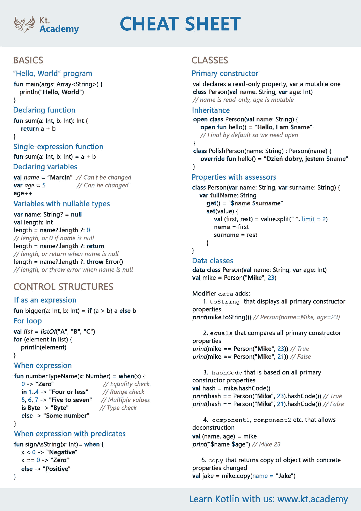
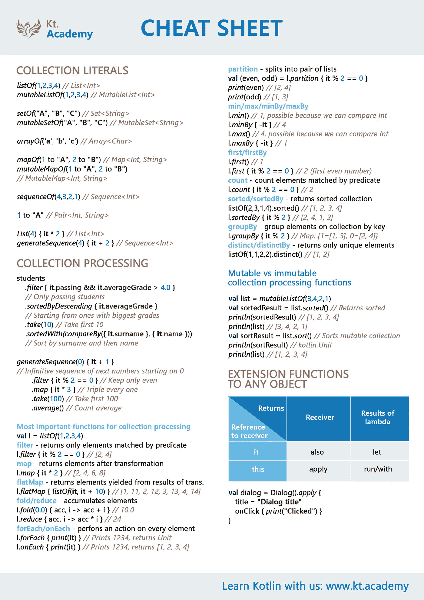
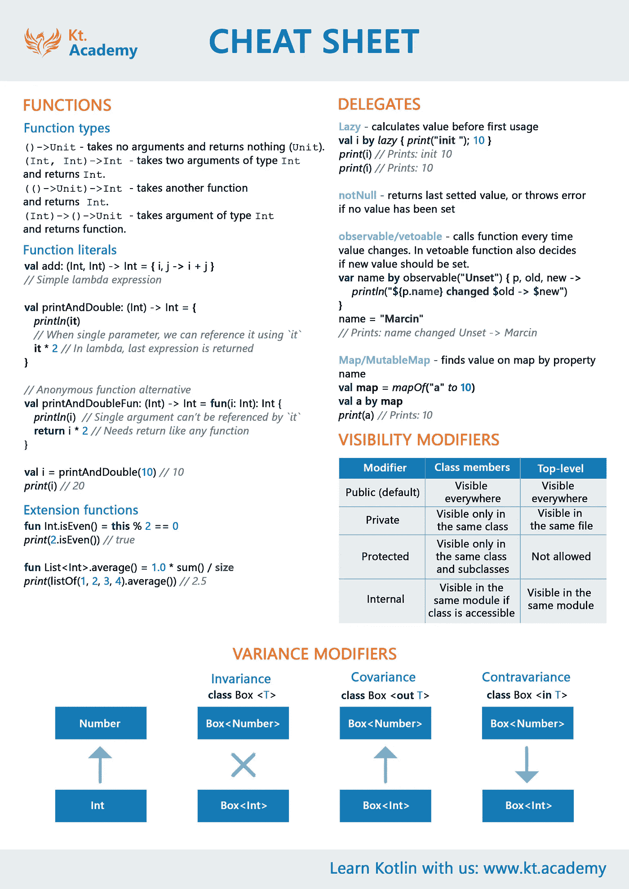

# 科特林备忘单

> 原文：<https://blog.kotlin-academy.com/kotlin-cheat-sheet-1137588c75a?source=collection_archive---------0----------------------->

如你所知卡帕头。学院的使命是简化 Kotlin 学习——我们尽最大努力做到这一点！

我们为您准备了 **Kotlin 备忘单，**以便您可以将最重要的元素放在手边——这是对 Kotlin 开发人员最好的日常支持。 [**报名我们的简讯**](http://eepurl.com/diMmGv) **免费获取 PDF 版本！**

你可以看看下面的 png 版本:

> 要获得 PDF 版本，[注册我们的简讯](http://eepurl.com/diMmGv)。你会很快在你的电子邮件中收到它。

## 单击👏说“谢谢！”并帮助他人找到这篇文章。

如果你认为这是有帮助的，与他人分享。

你需要 Kotlin 工作室吗？请访问我们的网站，看看我们能为您做些什么。

了解最新的 [Kt 重大新闻。学院](http://portal.kotlin-academy.com/)、[订阅时事通讯](https://kotlin-academy.us17.list-manage.com/subscribe?u=5d3a48e1893758cb5be5c2919&id=d2ba84960a)、[观察推特](https://twitter.com/ktdotacademy)关注。