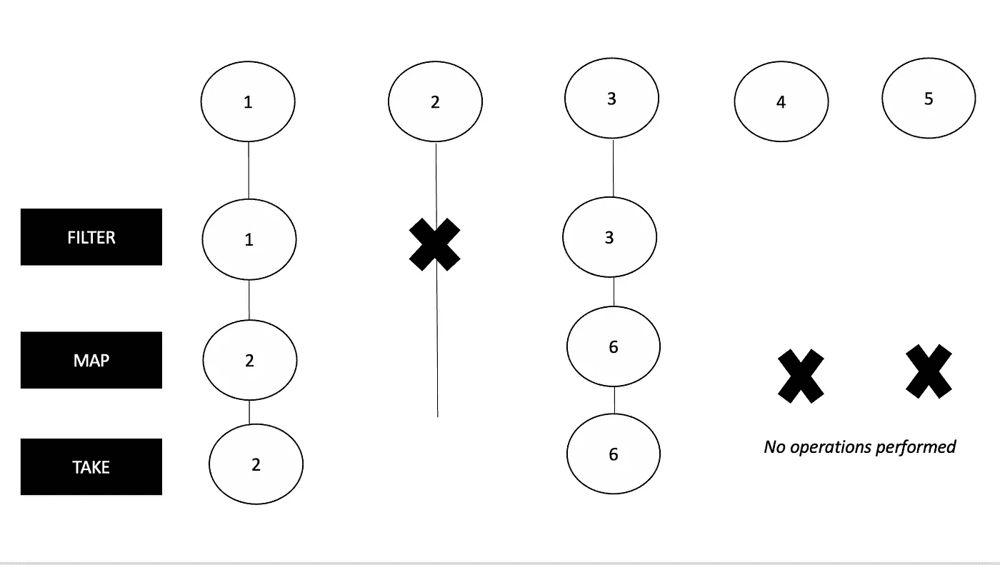

# 科特林系列与序列仅用 5 分钟

> 原文：<https://blog.kotlin-academy.com/kotlin-collections-vs-sequences-in-just-5minutes-70a3c3ec94a8?source=collection_archive---------0----------------------->


让我们通过一个简单的例子来理解集合和序列之间的区别:

```
**val** *operations* = (1..10)
    .*filter***{it** % 2 == 1**}** .*map* **{ it** * 2 **}** .*take*(2)
```

# 收集

在上面的集合*操作*中，我们首先循环从 1 到 10 的数字，然后创建奇数的集合，然后通过将前一个集合的元素乘以 2 来创建另一个集合，然后通过取前一个集合的前 2 个元素来创建一个集合。

对于上述集合示例，每个步骤的结果如下:

```
val operations = (1..10) 
    .*filter* **{ it** % 2 == 1 **}** *// 1, 3, 5, 7, 9* .*map* **{ it** * 2 **}** *// 2, 6, 10, 14, 18* .*take*(2)               *// 2, 6*
```

现在，让我们来看看地图功能的集合。

```
public inline fun <T, R> Iterable<T>.map(transform: (T) -> R): List<R> {
    return *mapTo*(ArrayList<R>(*collectionSizeOrDefault*(10)), transform)
}
```

正如您在这里看到的，集合的 map 函数是一个内联函数，它接收一个集合并返回另一个集合。

所以，收藏是，

1.**热切评价**。
这意味着，应用于集合的所有操作总是被评估，并且它们被评估的顺序与它们被应用的顺序相同。

2.每个变换都在整个集合上执行**。**

3.在对初始集合应用转换之后，一个**新集合被创建**。

4.适用于较小的列表，不适用于较大的列表，因为处理中间收集等式变得很昂贵。

# 顺序

现在，让我们通过序列来理解上面的内容。

我们可以使用 asSequence()函数将集合转换为序列，因此上面的代码可以编写如下:

```
**val** *operations* = (1..10).*asSequence*()
    .*filter***{it** % 2 == 1**}** .*map* **{ it** * 2 **}** .*take*(2)
    .*toList*()
```

在上面的序列*、*中，我们将首先遍历从 1 到 10 的数字，然后逐个查看每个元素，然后将过滤转换(这是一个中间操作)放入序列要执行的操作列表中，但不执行过滤操作，对于映射操作也是如此，一旦我们遇到终端操作，在本例中是“take”操作符，所有转换都将被应用

对于上面的代码片段，将对序列执行以下操作。



现在，让我们来看看序列的映射函数。

```
public fun <T, R> Sequence<T>.map(transform: (T) -> R): Sequence<R> {
    return TransformingSequence(this, transform)
}
```

序列的 map 函数不会创建新的集合，而是创建一个保存转换函数的 TransformingSequence。

所以，序列是，

1.**延迟评估，**即根据需要，基于终端操作。

2.对**逐个元素**执行每个转换。

3.**没有创建新的收藏库**。

4.**适合较大的列表**。

# 点击👏说“谢谢！”并帮助他人找到这篇文章。

了解卡帕头最新的重大新闻。学院，[订阅时事通讯](https://kotlin-academy.us17.list-manage.com/subscribe?u=5d3a48e1893758cb5be5c2919&id=d2ba84960a)，[观察 Twitter](https://twitter.com/ktdotacademy) 并在媒体上关注我们。

如果您需要 Kotlin 工作室，请查看我们如何帮助您: [kt.academy](https://kt.academy/) 。

[](https://kotlin-academy.us17.list-manage.com/subscribe?u=5d3a48e1893758cb5be5c2919&id=d2ba84960a)