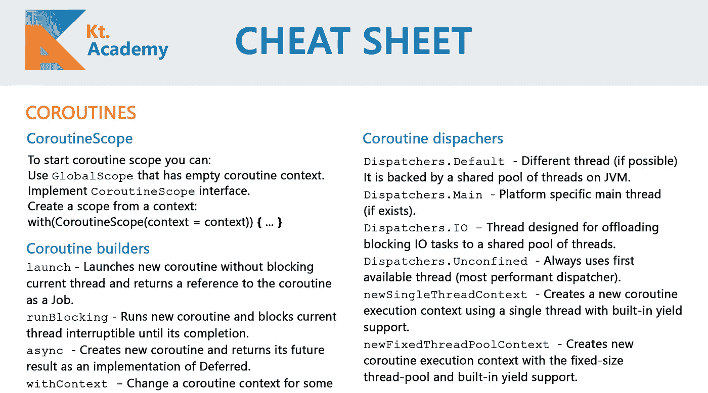
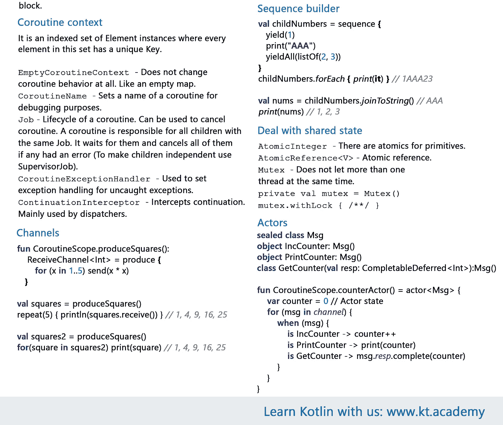

# 科特林协同程序备忘单

> 原文：<https://blog.kotlin-academy.com/kotlin-coroutines-cheat-sheet-8cf1e284dc35?source=collection_archive---------1----------------------->

前段时间我们准备了一个 [**科特林小抄**](/kotlin-cheat-sheet-1137588c75a)**，我们听到很多声音说它很有用。我们还听说您想要一个类似的 Kotlin 协程的备忘单。这就是为什么我们准备了一个关于 **Kotlin 协程**的特别页面。享受:)**

**[**报名我们的简讯**](http://eepurl.com/diMmGv) **免费获取 PDF 版本！您还会在同一封电子邮件中收到 general** [**Kotlin 备忘单**](/kotlin-cheat-sheet-1137588c75a) **。****

**你可以看看下面的 png 版本:**

********

> **要获得 PDF 版本，[注册我们的简讯](http://eepurl.com/diMmGv)。你会很快收到你的邮件。**

**如果您已经在我们的邮件列表中，那么您已经在 1 月 18 日星期五收到了新的备忘单，只需查看电子邮件并下载它:)**

## **单击👏说“谢谢！”并帮助他人找到这篇文章。**

**为您带来最新的 [Kt 重大新闻。学院](http://blog.kotlin-academy.com)、[订阅快讯](https://kotlin-academy.us17.list-manage.com/subscribe?u=5d3a48e1893758cb5be5c2919&id=d2ba84960a)、[观察推特](https://twitter.com/ktdotacademy)关注。**

**你需要 Kotlin 工作室吗？请访问我们的网站 ( [kt.academy](http://www.kt.academy) )，看看我们能为您做些什么。**

****