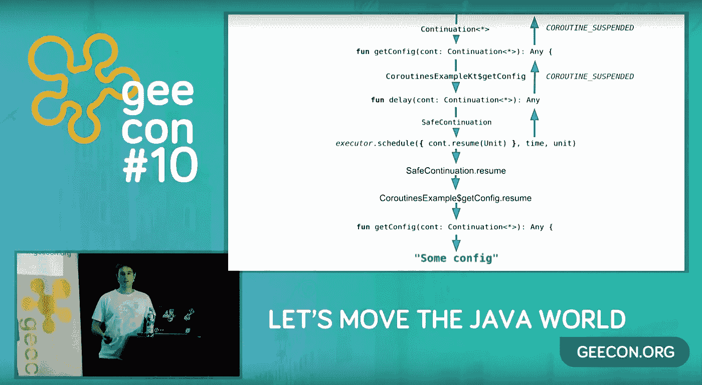

# 科特林协程在行动

> 原文：<https://blog.kotlin-academy.com/kotlin-coroutines-in-action-8ba96bfc7343?source=collection_archive---------3----------------------->

我个人试图解释协程是如何工作的。

# 关于会议

GeeCon 是一个关于技术的大型会议。尤其是基于 Java 和 JVM 的技术、动态语言、企业架构、模式、分布式计算、软件工艺和移动。[本届 GeeCon](https://2018.geecon.org/) 于 2018 年在克拉科夫举行。

# 关于作者

[Marcin moska la](http://marcinmoskala.com/)([@ Marcin moskala](https://twitter.com/marcinmoskala))是一名培训师兼顾问，目前专注于给**Android 中的 Kotlin 和高级 Kotlin 工作坊** ( [填写表格](https://marcinmoskala.typeform.com/to/iwKnN9)，我们可以谈谈你的需求)。他也是一名演讲者，撰写了关于 kot Lin Android 开发的文章和书籍。

你需要 Kotlin 工作室吗？请访问我们的网站,看看我们能为您做些什么。

了解卡帕头最新的重大新闻。学院，[订阅时事通讯](https://kotlin-academy.us17.list-manage.com/subscribe?u=5d3a48e1893758cb5be5c2919&id=d2ba84960a)，[观察推特](https://twitter.com/ktdotacademy)关注媒体。

在 Twitter 上引用我，用 [@MarcinMoskala](https://twitter.com/marcinmoskala) 。使用以下链接订阅时事通讯:

喜欢的话记得**拍**。请注意，如果您按住鼓掌按钮，您可以留下更多的掌声。