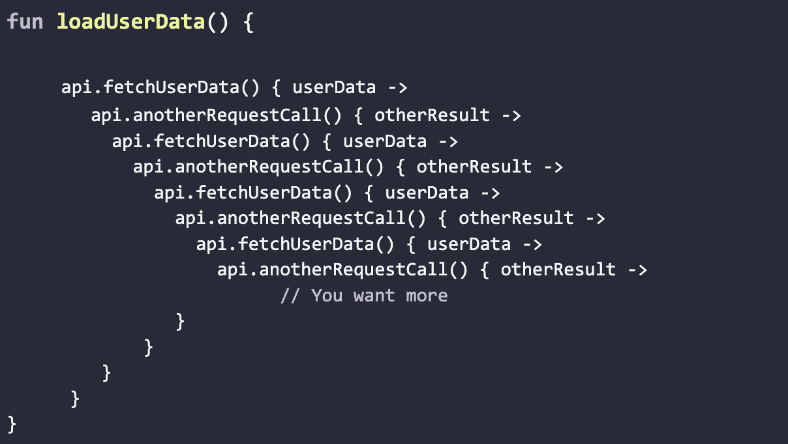
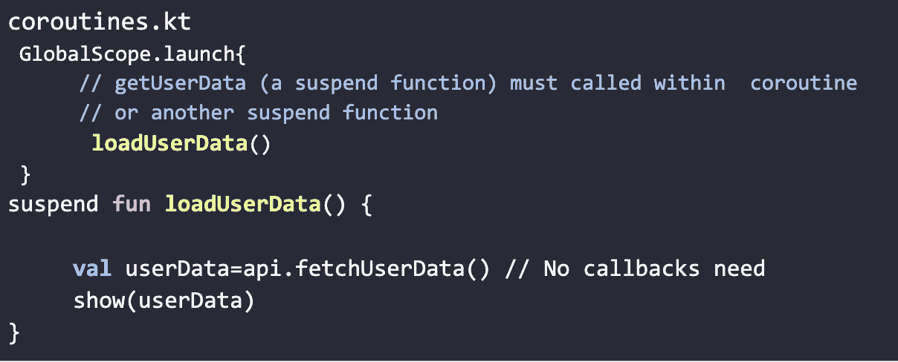
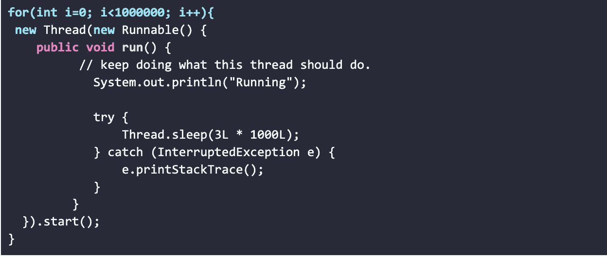
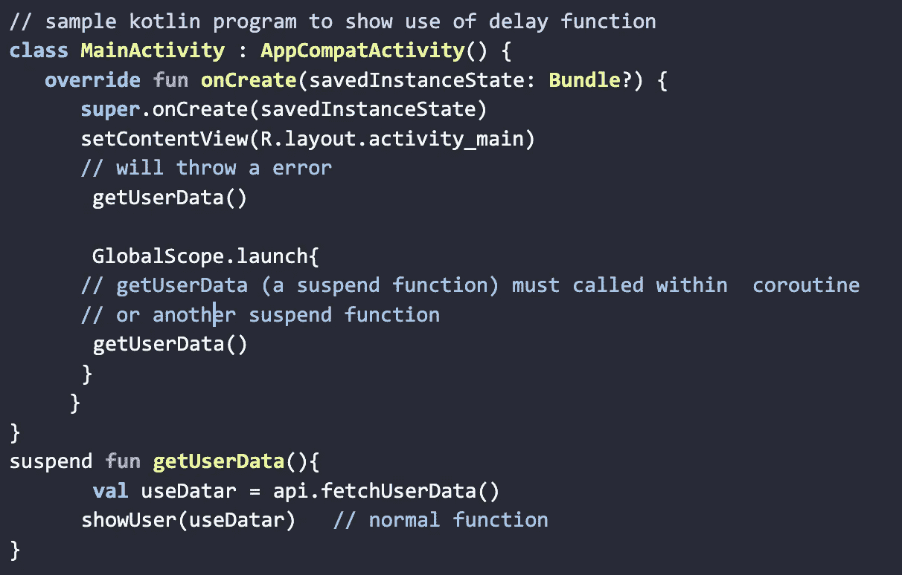
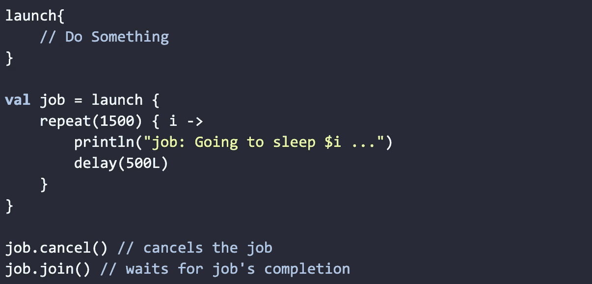

# 科特林协程第 1 部分:基础

> 原文：<https://medium.com/globant/kotlin-coroutines-part-1-basic-febca09b66d4?source=collection_archive---------2----------------------->

使用协程的异步编程最佳选择。

Referred from [https://github.com/Kotlin/kotlinx.coroutines](https://www.google.com/imgres?imgurl=https%3A%2F%2Frepository-images.githubusercontent.com%2F61722736%2F08e87280-62dc-11ea-8fed-a8a4a4ea865d&imgrefurl=https%3A%2F%2Fgithub.com%2FKotlin%2Fkotlinx.coroutines&tbnid=jlQYUzxmAhWpdM&vet=12ahUKEwjanbacxNf4AhULaMAKHWs9CacQMygBegUIARC5AQ..i&docid=g-5vbHfe9yVteM&w=5573&h=2778&q=kotlin%20coroutines&ved=2ahUKEwjanbacxNf4AhULaMAKHWs9CacQMygBegUIARC5AQ)

最近，协同程序在 Android 开发人员中非常流行。毫无疑问，与传统的异步实践相比，协程给我们带来了惊人的好处。

我首先想说的是**协程试图解决什么问题？**

协程解决的主要问题是通过替换回调来简化异步编程；它还有助于管理生命周期和避免内存泄漏。所以在讨论异步编程之前，我们先来看看同步编程问题。当我们同步执行某个任务时，我们会等待它完成，然后再继续下一个任务。因此，我们面临着应用程序块等问题。这里有一个例子。

假设我们发出一个请求调用来获取一些用户数据，在获取数据之后，我们只需更新 UI。
**如**

当我们执行上述代码时，我们会注意到它触发了错误“应用程序没有响应(ANR)”，应用程序将被冻结或没有响应。

Image referred from [https://proandroiddev.com/kotlin-coroutines-in-andriod-ff0b3b399fa0](https://proandroiddev.com/kotlin-coroutines-in-andriod-ff0b3b399fa0)

为了解决上面的问题，我们需要用回调把我们的代码移到不同的线程中。类似这样的。

这里我们在不同的线程上执行这个方法，这样我们的主线程就可以自由地执行其他操作。看下面的图片，我们会得到更多的想法。

[https://proandroiddev.com/kotlin-coroutines-in-andriod-ff0b3b399fa0](https://proandroiddev.com/kotlin-coroutines-in-andriod-ff0b3b399fa0)

这里我们已经解决了回调的问题，但回调也有其局限性，即回调地狱。

当有太多嵌套回调时，代码变得难以阅读，也难以处理异常和维护代码。让我们看看协程如何解决我们的问题。
Kotlin 协同程序的工作方式与*异步。*

**

***什么是协程？
我们可以说协程类似于线程。同步执行**和异步执行**需要一段代码。***

*嗯协程是轻量级线程，这意味着，与默认的 Java 线程相比，协程占用更少的内存和时间。例如，对于传统的线程方式，如果我们创建了数千个线程，它们可能会消耗大量内存和时间，并引发内存不足错误。*

**

*Consume too much memory and throw an out-of-memory error.*

*协程是可挂起计算的一个实例。协程可以在一个线程中暂停其执行，稍后在某个特定时间或在另一个线程中继续。*

***暂停功能***

*暂停功能是一种可以暂停并在稍后恢复的功能。暂停函数的语法与常规的**函数**相同，但是增加了 ***暂停*** 关键字。让我们来看看这个场景:如果我们想执行长时间运行的操作，并等待它们完成并返回结果，在这里，对于普通函数，我们可能会被引入回调，而且我们会被阻塞，直到结果返回。为了克服这个问题，我们可以使用一个挂起函数，挂起函数能够挂起代码而不阻塞它，并返回结果。*

*注意:我们只能从协程或另一个挂起函数中调用挂起函数。
**例如:***

**

*什么是协程构建器？
协程生成器用于创建协程。下面列出了三个协同程序构建器。*

1.  ***发射***
2.  ***异步***
3.  ***运行阻塞***

*让我们来详细探讨一下它们*

***1。启动生成器***

*所以基本上它会启动一个新的协程，而不会阻塞当前线程。它返回对作业对象的引用。使用作业对象，我们可以取消协程或等待协程完成。
**如:***

**

***2。异步生成器***

*这和发射建造者是一样的。唯一的区别是它返回一个延迟的对象。使用延迟对象，我们可以取消协同程序，等待协同程序完成，或者检索返回的结果。
**例如:***

**

*注意:这个启动和同步永远不会阻塞运行的线程*

***3。运行阻塞生成器:***

*它启动了一个新的协程，但它阻塞了一个当前线程，并等待协程完成执行。那么，当我们清楚地聚焦于避免阻塞主线程时，为什么还需要 runBlocking 呢？*

*通常， **runBlocking** 它用于 Android 中的单元测试或者其他一些同步代码的情况。*

***例如:***

**

***回顾:** 我希望我们现在理解了协程的基础知识。我们之前关于协程的问题是什么？用协程进行异步编程是最好的选择。使用协程，管理回调、处理异常和避免内存泄漏变得非常容易。*

*我们在第一部分学习了协程的基础，现在我们要学习作用域和调度程序 [*科特林协程第二部分:作用域&调度程序*](/@mahesh.jadkar/kotlin-coroutines-part-2-scope-dispatchers-4d67e17eae82)*

***信用标签**
这里是我参考的几个参考链接。
[https://kotlinlang.org/docs/coroutines-overview.html](https://kotlinlang.org/docs/coroutines-overview.html)
[https://developer.android.com/kotlin/coroutines](https://developer.android.com/kotlin/coroutines)
[https://proandroiddev . com/kotlin-coroutines-in-andr iod-ff 0 b 399 fa 0](https://proandroiddev.com/kotlin-coroutines-in-andriod-ff0b3b399fa0)*