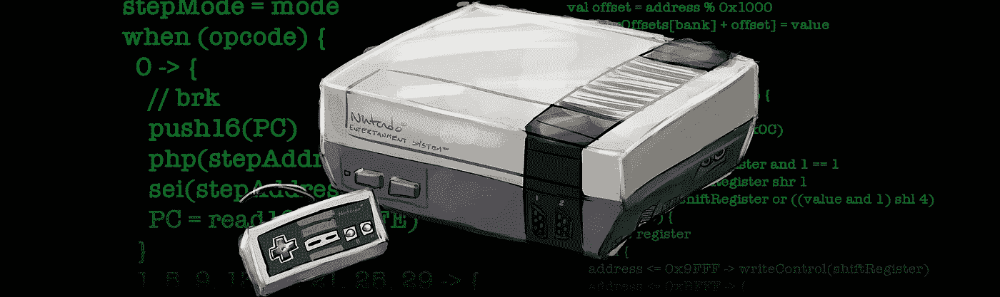

# 科特林揭秘:“何时”的力量

> 原文：<https://medium.com/androiddevelopers/kotlin-demystified-the-power-of-when-f0ac616ddd1a?source=collection_archive---------1----------------------->



NES image by [Dale M.A. Johnson](http://www.visionriders.com/)

我要坦白一件事。我有点像游戏玩家。塞尔达传说游戏是特别受欢迎的。想象一下当我得知有“随机程序”时我的兴奋，这些程序会在游戏中打乱物品、地牢入口、地图布局和角色统计，这样即使是有经验的玩家也会有新鲜的体验。一些我绝对喜欢的游戏的随机化器，包括最初的 [*塞尔达传说*](https://github.com/tetraly/zelda-randomizer) 和*林克的冒险*。由于我们中的许多人不再有原来的硬件，我们转向模拟器。

通常，模拟器实现起来会非常复杂。但事实证明，在任何现代计算机上模拟像 NES 这样的系统并不特别具有挑战性。从本质上来说，NES 仿真器是一个非常简单的循环，它寻找下一条指令并执行它。

# 基础

我们可以写一个包含所有指令的巨大的 if-else-if 列表，但是这很难维护。相反，我们用`[when](https://kotlinlang.org/docs/reference/control-flow.html#when-expression)`。

```
val instruction = fetchNextInstruction()
when (instruction) {
    0x0 -> handleBreak()
    0x8 -> handlePushProcessorStatus()
    0x10 -> handleBranchOnPlus()
    // Many other instructions...
    else -> throw IllegalStateException("Unknown instruction: ${instruction.toHex()}")
}
inline fun Int.toHex() = this.toString(16)
```

在这个实现中，`when`与 C++或 Java 中的`switch`语句几乎相同。

只有*与*几乎相同的原因是，正如来自 C++或 Java 的人会注意到的，没有任何`break`语句。属于`when` *的语句不会失败。*

这仅仅是触及表面。

# 作为一种表达

NES 的游戏卡带有许多不同的种类，尽管它们大多使用相同的连接器。他们有不同类型和数量的 ROM 和 RAM，包括有电池的 RAM 来保存游戏。一些盒式磁带甚至在盒式磁带本身上包括额外的硬件。处理这种情况的墨盒上的电路被称为“[映射器](https://wiki.nesdev.com/w/index.php/Mapper)”。

基于在 Kotlin 中`when`像`switch`一样被使用的认识，像这样的代码是决定哪个映射器用于特定游戏的一种方式:

```
fun getCartridgeMapper(rom: Cartridge): Mapper {
    var mapper: Mapper? = null
    when (rom.mapperId) {
        1 -> mapper = MMC1(rom)
        3 -> mapper = CNROM(rom)
        4 -> mapper = MMC3(rom)
        // Etc…
    }
    return mapper ?: throw NotImplementedError("Mapper for ${rom.mapperId} not yet implemented")
}
```

这个还可以，但是不理想。[引用文档](https://kotlinlang.org/docs/reference/control-flow.html#when-expression)将`when`描述为一个表达式，意思是它可以有一个值(就像 Kotlin 中的`if`)。考虑到这一点，上面的函数可以简化:

```
fun getCartridgeMapper(rom: Cartridge): Mapper = when (rom.mapperId) {
    1 -> MMC1(rom)
    3 -> CNROM(rom)
    4 -> MMC3(rom)
    // Etc...
    else -> throw NotImplementedError("Mapper for ${rom.mapperId} not yet implemented")
}
```

这就去掉了临时变量，并将该函数的块体转换为表达式体，从而将焦点保持在代码的重要部分。

# 超越简单的`case`语句

`switch`的另一个限制是值仅限于常量表达式。相反，`when`允许使用各种各样的表达式，比如范围检查。例如，仿真器需要根据仿真硬件的哪一位保存数据来区别对待要读取的内存地址。完成这项工作的代码存在于我们的映射器中。

```
val data = when (addressToRead) {
    in 0..0x1fff -> {
        // With this mapper, the graphics for the game can be in one of two locations.
        // We can figure out which one to look in based on the memory address.
        val bank = addressToRead / 0x1000
        val bankAddress = addressToRead % 0x1000
        readBank(bank, bankAddress)
    }
    in 0x6000..0x7fff -> {
        // There's 8k of program (PRG) RAM in the cartridge mapped here.
        readPrgRam(addressToRead - 0x6000)
    }
    // etc...
}
```

您也可以使用`is`操作符来检查`when`的参数类型。这在使用密封类时尤其有用:

```
sealed class Interrupt
class NonMaskableInterrupt : Interrupt()
class ResetInterrupt : Interrupt()
class BreakInterrupt : Interrupt()
class InterruptRequestInterrupt(val number: Int) : Interrupt()
```

然后…

```
interrupt?.let {
    val handled = when (interrupt) {
        is NonMaskableInterrupt -> handleNMI()
        is ResetInterrupt -> handleReset()
        is BreakInterrupt -> handleBreak()
        is InterruptRequestInterrupt -> handleIRQ(interrupt.number)
    }
}
```

请注意，这里不需要`else`。这是因为`Interrupt`是一个密封类，编译器知道`interrupt`所有可能的类型。如果我们错过了一个类型，或者后来添加了一个新的中断类型，编译器将失败，并显示一个错误，指示`when`必须是穷举的，或者必须添加一个`else`分支。

`when`也可以不带参数使用。在这种情况下，它就像一个 if-then-else 表达式，其中每种情况都作为一个布尔表达式进行计算。从上到下读取，执行评估为`true`的第一个案例。

```
when {
    address < 0x2000 -> writeBank(address, value)
    address >= 0x6000 && address < 0x8000 -> writeSRam(address, value)
    address >= 0x8000 -> writeRegister(address, value)
    else -> throw RuntimeException("Unhandled write to address ${address.toHex()}")
}
```

# 还有一点

以前，为了在`when`表达式中使用函数的返回，唯一的方法是这样的:

```
getMapper().let { mapper ->
    when (mapper) {
        is MMC5 -> mapper.audioTick()
        is Mapper49 -> mapper.processQuirks()
        // Etc... 
    }
}
```

从 [Kotlin 1.3M1](https://blog.jetbrains.com/kotlin/2018/07/see-whats-coming-in-kotlin-1-3-m1/) 开始，可以通过在`when`表达式的参数中创建一个变量来优化这段代码。

```
when (val mapper = getMapper()) {
    is MMC5 -> mapper.audioTick()
    is Mapper49 -> mapper.processQuirks()
    // Etc... 
}
```

类似于使用`let`的例子，`mapper`的作用域是`when`表达式本身。

# 结论

我们已经看到`when`的工作方式类似于 C++和 Java 中的`switch`,并且它可以以许多强大的方式使用，例如充当表达式，包括`Comparable`类型的范围，以及简化长的 if-then-else 块。

如果你有兴趣了解更多关于 NES 仿真(和 Kotlin)的信息，请查看 Felipe Lima 在 GitHub 上的 [KTNES 项目。](https://github.com/felipecsl/ktnes)

请务必关注 [Android Developers](https://medium.com/androiddevelopers) 出版物，了解更多精彩内容，并关注更多关于 Kotlin 的文章！