# Kotlin DSL、BuildSrc、产品风味、风味图标等

> 原文：<https://blog.kotlin-academy.com/kotlin-dsl-buildsrc-product-flavors-flavor-icon-and-more-abf30c65e8fd?source=collection_archive---------1----------------------->

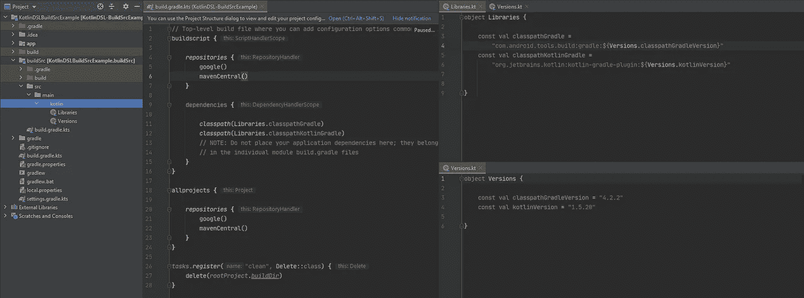

很长一段时间，我想将 Gradle 文件迁移到 Kotlin DSL，但我总是拖延。我终于结束了它，我还实现了 buildSrc。检查依赖项和版本非常重要。特别是在有多个模块的应用程序中，我们可以用 buildSrc 模块来防止每个模块中不同的依赖管理。
科特林 DSL🤝建筑 Src

让我们看看，我们能做什么？

我们将在这篇文章中做什么？

1.  将`settings.gradle`重构为`settings.gradle.kts`，
2.  创建`buildSrc`包到项目根目录，
3.  将`.gradle` 文件改为`.kts` 文件，
4.  将版本和依赖字符串移动到 Kotlin 文件中，
5.  从`build.gradle`中提取密钥并移动`key.properties`文件，
6.  使用 Kotlin DSL 创建产品风格和设置配置。

默认的项目目录如下所示:

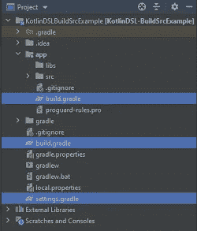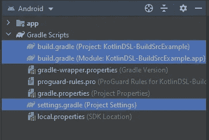

# **1。将** `**settings.gradle**` **重构到 settings.gradle.kts**

重命名`settings.gradle` 文件`settings.gradle.kts` 并更改几行代码:

```
*//before* rootProject.name = "KotlinDSL-BuildSrcExample"
include ':app'*// after*
rootProject.name = "KotlinDSL-BuildSrcExample"
include(":app")
```

# **2。创建 buildSrc 包**

将“buildSrc”模块创建到项目根目录。并在其中创建`build.gradle.kts`文件。

```
import org.gradle.kotlin.dsl.*`kotlin-dsl`* plugins **{** *`kotlin-dsl`* **}** *repositories* **{** mavenCentral()
**}**
```

现在重建项目。

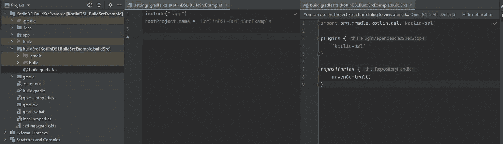

我们有一个 buildSrc 模块。因此，我们可以在模块中创建 Kotlin 文件。

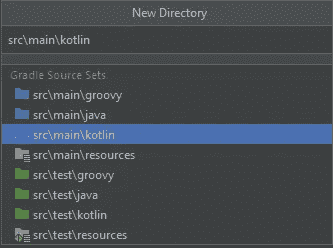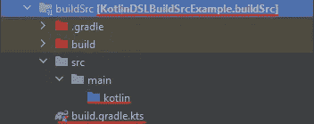

稍后我们会将`Configs.kt`、`Versions.kt`、`Libraries.kt`添加到`buildSrc/src//main/kotlin`目录中。

# 3.将`.gradle` 文件重构为`.kts` 文件

我们必须将`.gradle` 文件改为`.gradle.kts`。这是最难的部分:

*   **build.gradle(项目)**

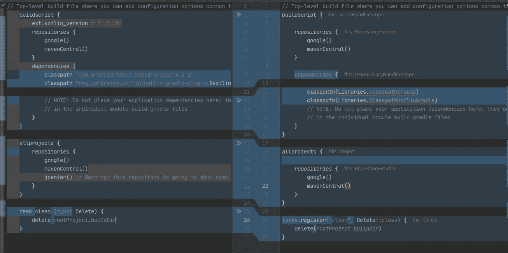

我们在 Gradle 文件中使用 Kotlin。让我们把定义`Libraries.kt`和`Versions.kt`的科特林对象交给`buildSrc/src/main/kotlin`

你好科特林·✋


*   **build.gradle(app 模块)**

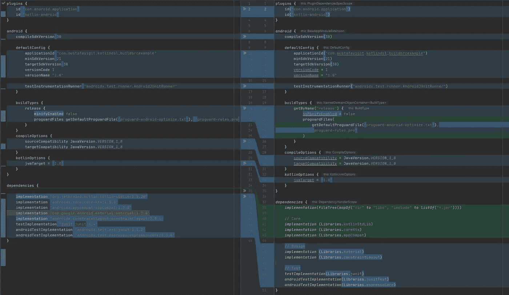

# 4.将版本和依赖字符串移动到 Kotlin 文件

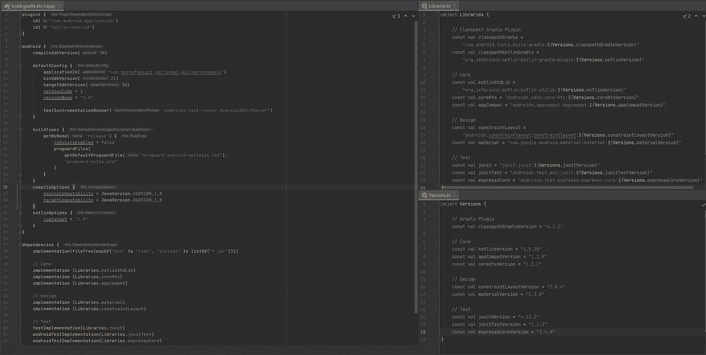

现在，我们将应用配置从`defaultConfig` 移至`Configs.kt`。

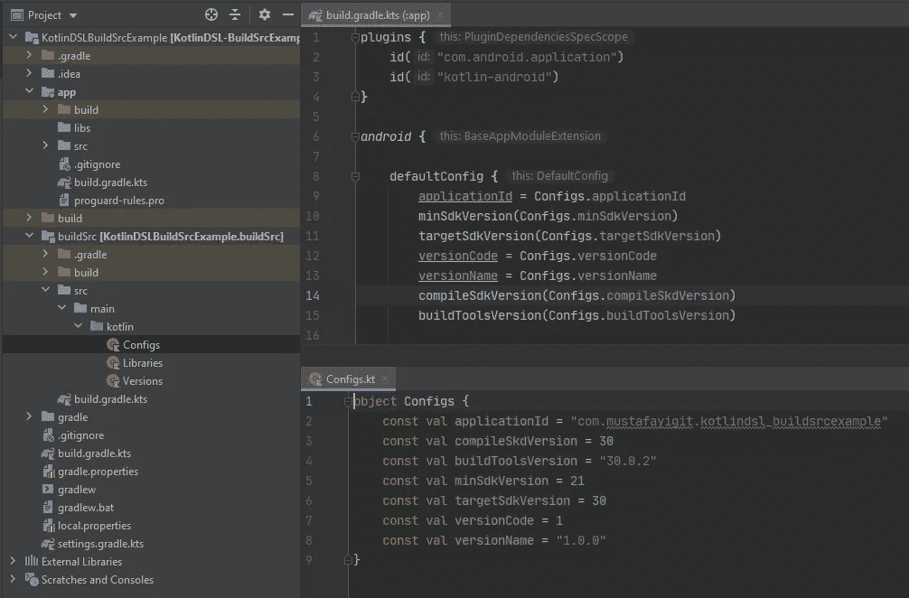

# 5.从 Gradle 文件中提取密钥(key.properties)

为了更可靠的代码，我们必须从 Gradle 中提取密钥，并像`key.properties:`一样移动另一个文件

*   在项目根目录下创建`key.properties`文件，
*   在该文件中存储密钥(如签名密钥)，
*   创建一个助手类来获取键值。

```
// build.gradle.kts (module :app)
signingConfigs **{** create("signingConfigRelease") **{** storeFile = file(KeyHelper.getValue(KeyHelper.KEY_STORE_FILE))
        storePassword = KeyHelper.getValue(KeyHelper.KEY_STORE_PASS)
        keyAlias = KeyHelper.getValue(KeyHelper.KEY_ALIAS)
        keyPassword = KeyHelper.getValue(KeyHelper.KEY_PASS)
    **}
}****--------------------------------------------------------------------**// KeyHelper.kt
object KeyHelper {

    const val KEY_STORE_FILE = "storeFile"
    const val KEY_STORE_PASS = "storePassword"
    const val KEY_ALIAS = "keyAlias"
    const val KEY_PASS = "keyPassword"

    private val properties by *lazy* **{** Properties().*apply* **{** load(FileInputStream(File("key.properties"))) **}
    }** fun getValue(key: String): String {
        return properties.getProperty(key)
    }
}
```

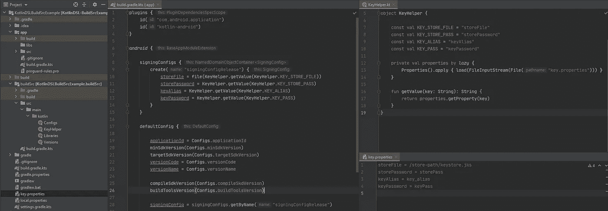

# 6.产品口味和配置

让我们一起创造风味，并用 Kotlin DSL 设置配置。

创建至少一个`flavorDimensions`和你的`productFlavors`。如果您有特定于环境的值，您可以在 productFlavors 中定义:

```
flavorDimensions("appType")
productFlavors **{** create("_dev") **{** dimension = "appType"
        applicationIdSuffix = ".dev"
        versionNameSuffix = "-dev"

        manifestPlaceholders(
            *mapOf*(
                "appIcon" *to* "@mipmap/ic_launcher_prod",
                "appIconRound" *to* "@mipmap/ic_launcher_prod_round"
            )
        )
        resValue("string", "app_name", "KotlinDslExample$versionNameSuffix")
        buildConfigField("String", "ONESIGNAL_APP_ID", KeyHelper.KEY_ONESIGNAL_APP_ID_DEV)
    **}**
```

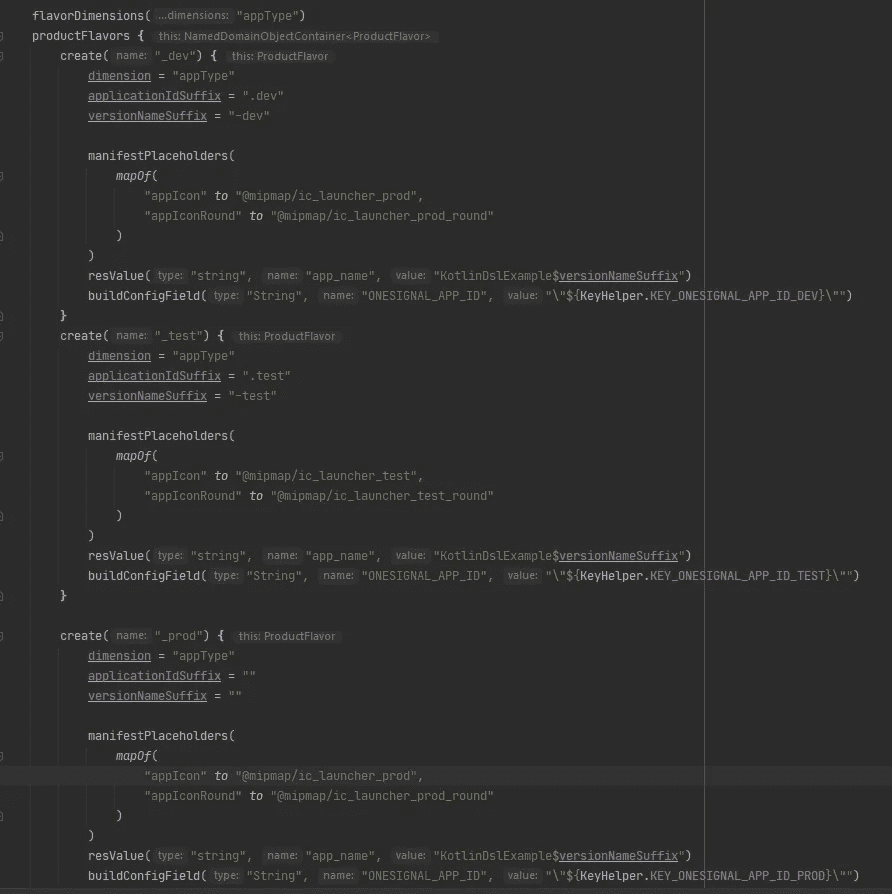

> *在我的例子中，除了完全改变的值之外，基本 url 的改变只是在扩展部分。而我是在* `*applicationVariants.all*` *挡处理的。*

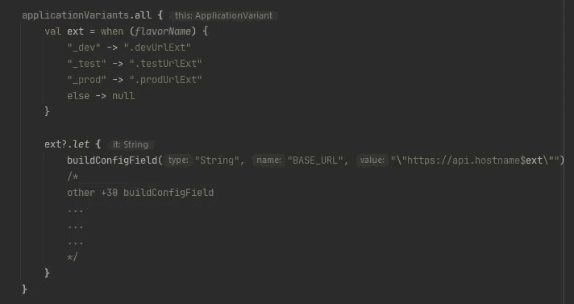

仅此而已。我知道这花了一些时间，但我想谈谈细节。如果你发现任何错误的信息，请留下评论。我会修好它的。

如果这篇文章对你有帮助，请鼓掌👏

# 资源

项目:[https://github.com/mustafayigitt/KotlinDSL-BuildSrcExample](https://github.com/mustafayigitt/KotlinDSL-BuildSrcExample)

领英:[https://www.linkedin.com/in/mustafayigitt/](https://www.linkedin.com/in/mustafayigitt/)

网址:[https://www.mustafayigit.net/](https://www.mustafayigit.net/)

# 点击👏说“谢谢！”并帮助他人找到这篇文章。

了解卡帕头最新的重大新闻。学院，[订阅时事通讯](https://kotlin-academy.us17.list-manage.com/subscribe?u=5d3a48e1893758cb5be5c2919&id=d2ba84960a)，[观察 Twitter](https://twitter.com/ktdotacademy) 并在 Medium 上关注我们。

如果您需要 Kotlin 工作室，请查看我们如何帮助您: [kt.academy](https://kt.academy/) 。

[](https://kotlin-academy.us17.list-manage.com/subscribe?u=5d3a48e1893758cb5be5c2919&id=d2ba84960a)