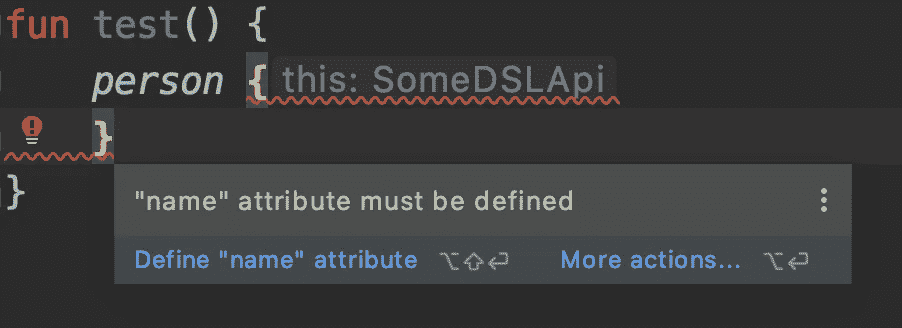

# kot Lin DSL—定义强制参数

> 原文：<https://blog.kotlin-academy.com/kotlin-dsl-know-your-limits-2deaef1bab66?source=collection_archive---------1----------------------->

或者为什么我写了另一个 Android 库


自从 Kotlin 推出以来，多个库都选择了它们 API 的 DSL 实现。
Kotlin DSL 是一个很棒的工具，它让你的 API 可读性更好，也更容易使用，如果你还没有时间使用它，我强烈建议你试一试。

但是这篇文章并不是要解释如何实现一个基于 Kotlin DSL 的 API，有一些关于它的很棒的文章。
我也不会谈论 Kotlin DSL 有多棒(确实如此)。
相反，我将把重点放在当我试图把它应用到我自己的用例中时所面临的问题上。

# 第一

DSL 的一个很好的例子可以在名为 [Anko](https://github.com/Kotlin/anko) 的 Android 库中找到，它允许以编程方式布置 UI 组件(Flutter/Jetpack 开发人员可能会很熟悉):

```
verticalLayout {
   editText {
    hint = "Name"
    textSize = 24f
  }  
   button("Say Hello") {
    onClick { toast(“Hello!”) }
  }
}
```

看起来很容易理解，对吧？

# 那么，关键在哪里？

让我们仔细看看:

```
button("Say Hello") {
    onClick { toast("Hello!") }
}
```

正如您所看到的，按钮文本是作为参数提供的，因为它是创建按钮所必需的，而`onClickListener`是可选的，因此是在 lambda 块中定义的。

对于单个参数来说，这似乎仍然很容易理解，但是如果有多个强制参数呢？

在尝试了 DSL 之后，我很快发现我遇到了和普通老构建者一样的问题——接收强制参数。

# 那解决办法是什么？

显而易见的解决方案是验证所有强制参数都被设置为最终对象构建的一部分，但这是一个运行时解决方案，在我看来是糟糕的 API 的标志。

我在构建器中使用的另一个解决方案是在构造函数中定义强制参数。同样的技巧也适用于 DSL，但是我发现这违背了 DSL 的一个目的——可读。

我尝试的最后一个选项是使用 [Kotlin 契约](https://kotlinlang.org/docs/reference/whatsnew13.html#contracts)，我很快排除了它，原因有两个:我觉得它不够成熟。
2。他们只申请顶级功能，不完全是我在寻找的。

我的目标很明确——强制参数的编译时验证。我想要一个简单的方法来解决这个常见的问题。

# DSLint 简介

最终，我决定成为自己最好的朋友，并使用自定义的 Android linter 库(抱歉，非 Android 开发者)来实现这个问题的解决方案。

这就是它的工作原理，假设我要使用 DSL 实现一个`Person`构建器，并希望确保设置了这个人的名字。
我需要做的就是注释类和 name 属性，让我的自定义 linter 发挥魔力:

```
@DSLint
class Person {

    @set:DSLMandatory
    var name: String
}
```



干净简单。我把它开源了，所以你可以在你的项目中使用它，或者克隆 repo 并基于它创建你的定制解决方案。

你可以看看这里:

[](https://github.com/ironSource/dslint) [## 铁源/dslint

### 在您希望 DSLint 验证的 DSL 类/接口上使用。@DSLMandatory 用于强制 DSL 属性设置器或…

github.com](https://github.com/ironSource/dslint) 

# 综上

正如我前面所说的，DSL 是一个很好的工具，我鼓励您尝试它，但也要意识到它的局限性。
我希望您喜欢阅读，并期待听到您在尝试 DSL 时所面临的挑战以及您是如何应对这些挑战的。

# 单击👏说“谢谢！”并帮助他人找到这篇文章。

了解卡帕头最新的重大新闻。学院、[订阅时事通讯](https://kotlin-academy.us17.list-manage.com/subscribe?u=5d3a48e1893758cb5be5c2919&id=d2ba84960a)、[观察 Twitter](https://twitter.com/ktdotacademy) 并在 medium 上关注我们。

如果您需要 Kotlin 工作室，请查看我们如何帮助您: [kt.academy](https://www.kt.academy/) 。

[](https://kotlin-academy.us17.list-manage.com/subscribe?u=5d3a48e1893758cb5be5c2919&id=d2ba84960a)