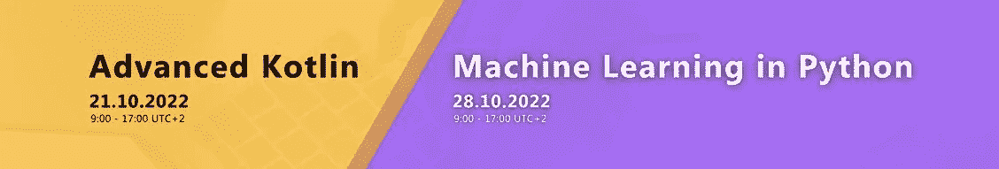
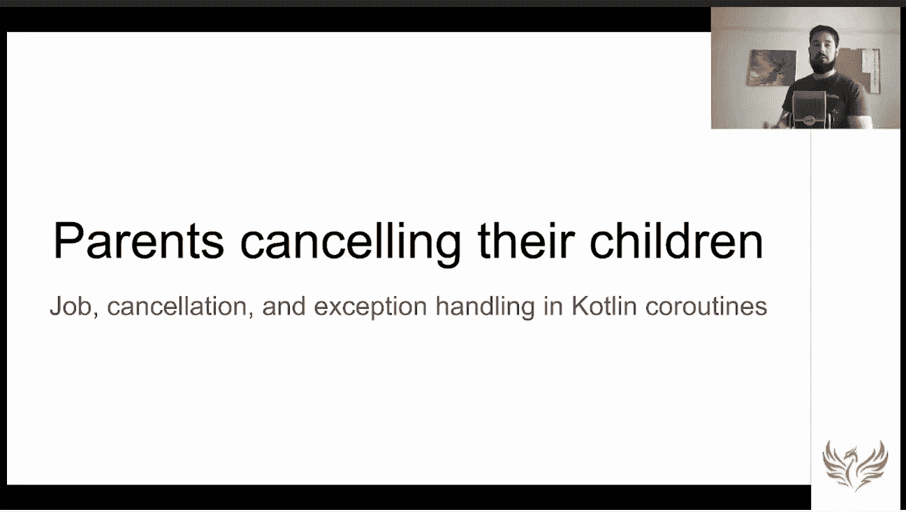
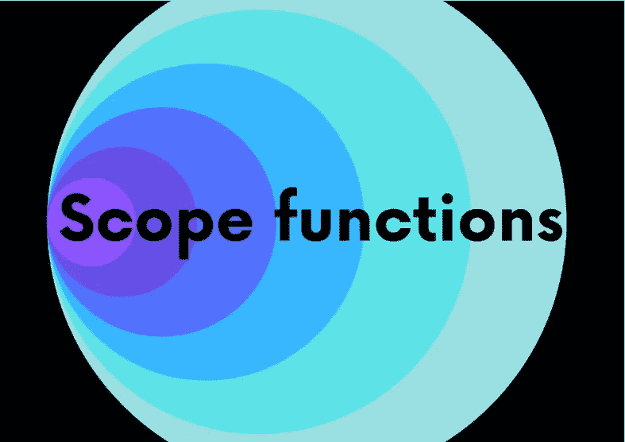
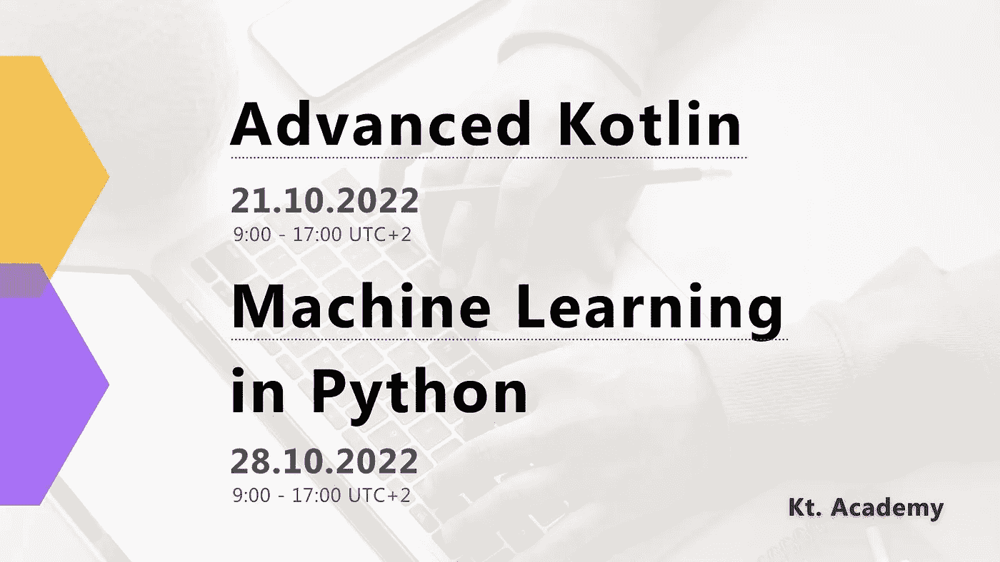
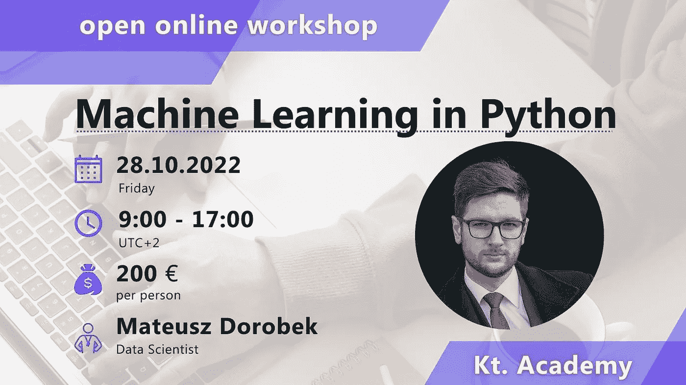
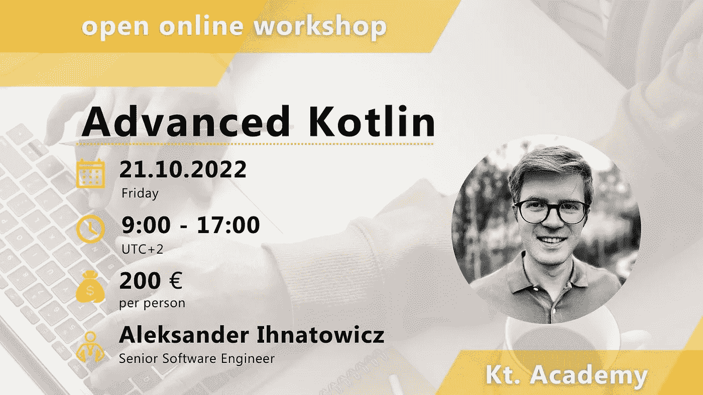

# Kotlin 无处不在:功能性 Kotlin 文章&协同程序电影&有效的 Kotlin 文章&移动应用程序，字体建模&开放式研讨会最后一次呼叫

> 原文：<https://blog.kotlin-academy.com/kotlin-everywhere-functional-kotlin-articles-coroutines-movie-effective-kotlin-articles-fad67b6ed7c9?source=collection_archive---------1----------------------->

亲爱的程序员们！🙂

我们正在开发面向开发者的 Kotlin 系列丛书。📚
首映定于早春。

我们正在为秋季准备许多**车间**！
更多详情在简讯末尾。👇

今天我们有很多**编程文章**，甚至还有一部**电影**。🎬

下面是今天特别新闻简报内容的简要列表:

**Kotlin Coroutines** 演讲由**Marcin moska a**准备:
🎬[父母在科特林 2022 年取消他们的孩子](https://www.youtube.com/watch?v=khI8i_Tx2bo)

**更新有效科特林**文章撰稿**马尔钦**
👉[第 1 项:极限可变性](https://kt.academy/article/ek-mutability)
👉[第 3 项:尽快淘汰平台类型](https://kt.academy/article/ek-platform-types)
👉[第 5 项:说明你对争论的期望，并陈述](https://kt.academy/article/ek-expectations)

文章是来自**有效科特林**书的部分。这里可以找到[。📖
❗coming·索恩—第二部书 edition❗](https://leanpub.com/effectivekotlin)

**科特林式安全**文章作者**扬·弗拉迪米尔·莫斯特:**
👉[科特林式造型](https://kt.academy/article/type-modelling-kotlin)

**由**Venkateswaran Sivasailem**撰写的 Kotlin** 文章中的异常处理:
👉[kot Lin 中的编译时异常处理](/compile-time-exception-handling-in-kotlin-1126c55387ce)

**Functional Kotlin** 文章作者**Marcin moskaa**:
👉[范围功能](https://kt.academy/article/fk-scope-functions)
👉[语境接收者](https://kt.academy/article/fk-context-receivers)

这是《功能科特林》一书中的一章。你可以在 [LeanPub](https://leanpub.com/kotlin_functional/) 上找到它。

**手机 app** 文章作者 **Ngenge 学长** :
👉[使用 MVVM 架构在 Jetpack Compose 中进行 Firebase 电话认证](/firebase-phone-authentication-in-jetpack-compose-using-mvvm-architecture-258775059aa7)

❗ **上次打电话**❗
t14】开研讨会 t16】👉[Python 开放工作坊中的机器学习](https://kt.academy/workshop/machineLearningPython/form/public/machineLearningPythonOct2022/register)
👉[高级科特林开放式车间](https://kt.academy/workshop/kotlinAdvanced/form/public/advancedKotlinOct2022/register)

更多信息请见时事通讯的末尾

开始吧！🙃

每个协程都需要一份工作。令人惊讶的是，这就是他们和孩子之间的关系。这不是一个简单的关系——它涉及继承、等待、取消和异常处理。即使这些机制看起来可怕而复杂，但一旦我们从正确的角度来看，它们实际上是非常直观和合理的。让我们做那件事，并且在路上，让我们有一些乐趣。
**Marcin moska-父母在科特林 2022 年取消他们的孩子**👇

[Parents cancelling their children in Kotlin 2022](https://www.youtube.com/watch?v=khI8i_Tx2bo)

🎥🎥🎥🎥🎥🎥🎥🎥🎥🎥🎥🎥🎥🎥🎥🎥🎥🎥🎥🎥🎥🎥🎥🎥

为什么限制可变性如此重要，以及 Kotlin 如何支持它。
**第 1 项:极限可变性**👇

[Item 1: Limit mutability](https://kt.academy/article/ek-mutability)
🔻 You can find the whole book below
[https://leanpub.com/effectivekotlin](https://leanpub.com/effectivekotlin)

为什么平台类型如此危险，我们应该如何处理它们。
**第三项:尽快淘汰平台类型👇**

[Item 3: Eliminate platform types as soon as possible](https://kt.academy/article/ek-platform-types)
🔻 You can find the whole book below
[https://leanpub.com/effectivekotlin](https://leanpub.com/effectivekotlin)

我们如何在 Kotlin 中指定需求和期望。
**第 5 项:明确你对论点的期望，并陈述**👇

[Item 5: Specify your expectations on arguments and state](https://kt.academy/article/ek-expectations)
🔻 You can find the whole book below
[https://leanpub.com/effectivekotlin](https://leanpub.com/effectivekotlin)

类型安全在大多数软件项目中被低估，并在全世界范围内造成巨大的经济损失。改变一些坏习惯可以带来更可靠的软件。读一读 Jan Vladimir Mostert 写的文章。
**kot Lin**中的造型类型👇

[Type modelling in Kotlin](https://kt.academy/article/type-modelling-kotlin)

在 Kotlin 中，没有类似 Java 的检查异常的概念。我们要么处理异常，要么让它在运行时崩溃。读一读[**Venkateswaran Sivasailem**](https://medium.com/@venketeswaran2015)写的文章。
**kot Lin 中的编译时异常处理**👇

[Compile time exception handling in Kotlin](/compile-time-exception-handling-in-kotlin-1126c55387ce)

什么是 let，以及如何在我们的应用程序中使用它们。
**范围功能**👇

[Scope functions](https://kt.academy/article/fk-scope-functions)
🔻 You can find the whole book below
[https://leanpub.com/kotlin_functional/](https://leanpub.com/kotlin_functional/)

所有你需要知道的关于 Kotlin 的新的和强大的特性:在一个出版物中的上下文接收器。
**语境接受者**👇

[Context receivers](https://kt.academy/article/fk-context-receivers)
🔻 You can find the whole book below
[https://leanpub.com/kotlin_functional/](https://leanpub.com/kotlin_functional/)

这次 [**Ngenge 高级**](https://ngengesenior.medium.com/) 向你展示如何使用短信进行 Firebase 认证。
**使用 MVVM 架构在 Jetpack 中构建 Firebase 电话认证**👇

[Firebase Phone Authentication in Jetpack Compose using MVVM architecture](/firebase-phone-authentication-in-jetpack-compose-using-mvvm-architecture-258775059aa7)

❗最后呼叫❗
如果你想过加入我们的公开工作坊，你还有机会。
不要犹豫！

👉[Python 开放工作坊](https://kt.academy/workshop/machineLearningPython/form/public/machineLearningPythonOct2022/register)中的机器学习由[**Mateusz Dorobek**](https://kt.academy/workshop/machineLearningPython#trainer)进行

👉[高级科特林开放式工作坊](https://kt.academy/workshop/kotlinAdvanced/form/public/advancedKotlinOct2022/register)由[亚历山大**伊纳托维奇**主持](https://kt.academy/workshop/kotlinAdvanced#trainer)。

选择最适合您的一个，并立即注册。

🌍🌍🌍🌍🌍🌍🌍🌍🌍🌍🌍🌍🌍🌍🌍🌍🌍🌍🌍🌍🌍🌍🌍🌍🌍

这就是我们今天的全部内容🙂

如果你有什么想告诉我们的，请回复这封邮件让我们知道！💌

敬请期待！👌
Kt。学院团队

www: [kt.academy](https://kt.academy/)
博客:[blog.kotlin-academy.com](http://blog.kotlin-academy.com/)
推特 EN:[@ ktdotsacademy](https://twitter.com/ktdotacademy)
推特 PL:[@ ktdotsacademypl](https://twitter.com/ktdotacademyPL)
FB:[@ ktdotsacademy](https://www.facebook.com/KtDotAcademy)
LinkedIn:[@ Kt。学院](https://www.linkedin.com/company/kt-academy/)

