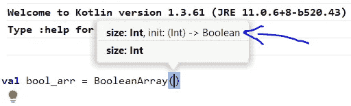
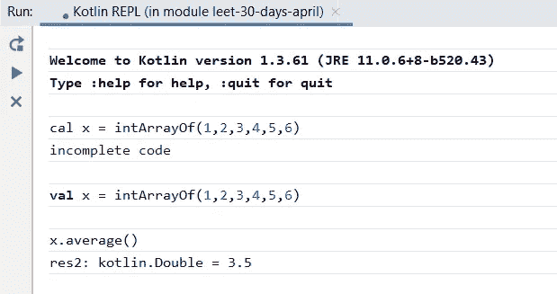

# 竞争编程的科特林

> 原文：<https://blog.kotlin-academy.com/kotlin-for-competitive-programming-803ef03e8683?source=collection_archive---------0----------------------->

## 选择的新语言


Speed and Elegance — Photo by [Sarah Bedu](https://unsplash.com/@sarahbedu?utm_source=unsplash&utm_medium=referral&utm_content=creditCopyText) on [Unsplash](/s/photos/racing-animals?utm_source=unsplash&utm_medium=referral&utm_content=creditCopyText)

几个月前，我开始使用 Kotlin 进行竞争性编程。我终于能够享受解决问题的过程，而不会迷失在语法或设置中。我写这篇文章是希望能激励你也尝试 Kotlin 进行竞争性编程。

如果你已经有了灵感，你应该看看这篇文章:

[](/setting-up-your-workflow-for-competitive-programming-in-kotlin-b1e84e6a6670) [## 在 Kotlin 中设置竞争性编程的工作流程

### 几分钟内开始！

blog.kotlin-academy.com](/setting-up-your-workflow-for-competitive-programming-in-kotlin-b1e84e6a6670) 

JetBrains 的人确实有一个讨论 Kotlin 的竞争性编程的页面。但是我感觉那个页面的内容有点超前，特别是对于刚入门的人来说。希望这篇文章可以作为一个温和的介绍。

我将这篇文章分成了两个部分:

1.  首先，我将分享一些我用 Kotlin 编写的示例解决方案。我选择了这些例子来介绍一些我认为非常有用的不同的 Kotlin 特性。
2.  在第二篇文章中，我将详细讨论 Kotlin 如何与竞争性编程中使用的其他流行语言进行比较。

# 例子

让我们开始吧！

## 例子 1:糖果数量最多的孩子

如果您需要参考原始问题陈述，以下是链接:

[](https://leetcode.com/problems/kids-with-the-greatest-number-of-candies/) [## 拥有最多糖果的孩子- LeetCode

### 给定糖果数组和整数 extraCandies，其中 candies[i]表示孩子得到的糖果数量…

leetcode.com](https://leetcode.com/problems/kids-with-the-greatest-number-of-candies/) 

每个测试用例的输入是:

1.  表示每个孩子拥有的糖果数量的整数数组
2.  表示额外糖果数量的整数。

问题归结为:对于每个孩子，你需要确定给孩子所有额外的糖果是否会让他/她在小组中拥有最多的糖果。我们需要输出一个布尔数组来表达这一点。函数签名是:

```
**fun** kidsWithCandies(candies: **IntArray**, extraCandies: **Int**): **BooleanArray**
```

在科特林，我们可以用两行来解决这个问题:

```
**fun** kidsWithCandies(candies: **IntArray**, extraCandies: **Int**): **BooleanArray** { **val** maxCandies = candies.*max*()

    **return** BooleanArray(
        candies.**size**,
        **{ index** **->** candies[**index**] + extraCandies >= maxCandies!! **}** )}
```

最后一行是所有奇迹发生的地方:

```
**return** BooleanArray(
    candies.size,
    { **index** -> candies[**index**] + extraCandies >= maxCandies!! }
)
```

在其中，我们构造并返回一个`BooleanArray`。`BooleanArray`构造函数的签名如下:

```
BooleanArray(size: **Int**, init: **(Int) -> Boolean**)
```



Boolean Array constructor signature

构造函数的第一个参数是数组的大小——在本例中是`candies.**size**`。第二个参数是一个`init`函数，类型为`(Int) -> Boolean` —它接受一个`Int`(索引)，并输出一个`Boolean`(在该索引处填充的值)。我们可以在第二个参数中封装任何我们想要的初始化逻辑。

注意这是多么的方便…Kotlin 给了我们一种方法，只用一行代码就可以优雅地构造*和*初始化任何数组！

为了进一步简化这一点，我们可以利用 Kotlin 的两个语法规则:

> [传递尾随 lambdas](https://kotlinlang.org/docs/reference/lambdas.html#passing-a-lambda-to-the-last-parameter)—“…如果函数的最后一个参数是函数，那么作为相应参数传递的 lambda 表达式可以放在括号外。”

所以，我们可以简化成这样:

```
**return** BooleanArray(candies.size) { **index** ->
    candies[**index**] + extraCandies >= maxCandies!!
}
```

> [单个参数的隐式名称](https://kotlinlang.org/docs/reference/lambdas.html#it-implicit-name-of-a-single-parameter)——“lambda 表达式只有一个参数是很常见的……该参数将以名称`it`隐式声明。”

因此，我们可以进一步简化为:

```
**return** BooleanArray(candies.size) {
    candies[**it**] + extraCandies >= maxCandies!!
}
```

这是最终代码。花几秒钟去理解和消化语法。

```
**fun** kidsWithCandies(**candies**: IntArray, **extraCandies**: Int): **BooleanArray** { **val** maxCandies = candies.*max*()

    **return** BooleanArray(candies.**size**) **{** candies[**it**] + extraCandies >= maxCandies!!
    **}**}
```

## 示例 2:厨师和价格控制

以下是问题的链接:

 [## 竞赛页面| CodeChef

### CodeChef -一个为有抱负的程序员提供的平台 CodeChef 是一个帮助程序员在…

www.codechef.com](https://www.codechef.com/problems/PRICECON) 

输入是:

1.  表示一组商品的原始销售价格的整数数组
2.  一个整数，表示必须应用于所有商品的新价格上限。

我们需要计算由于引入价格上限而造成的总损失。问题归结为:对于每件商品，如果上限低于原价，我们需要计算原价和价格上限之间的差额，然后输出这些值的总和:

```
**fun** solve(**prices**: IntArray, **priceCeiling**: Int): Int
```

这是一行解决方案:

```
**fun** solve(**prices**: IntArray, **priceCeiling**: Int): Int { **return** prices.*fold*(0) **{ agg**, **e ->
        agg** + (**e**- minOf(priceCeiling, **e**))
    **}**}
```

`fold`函数允许你聚集数组中的值；`fold`遍历数组，并将提供的函数应用于聚合值`agg`和下一个元素`e`。`fold`的第一个参数是用来初始化聚合值的——在本例中是`0`。

如您所见，这用一行代码优雅地解决了问题。从聚合值`0`开始，然后不断将`e-minOf(priceCeiling,e)`加到聚合值上。如果价格上限没有导致商品价格下降，该表达式将为`0`，否则，它将等于该商品发生的损失。

## 示例 3:链表的中间

空值在许多数据结构中扮演着重要的角色。例如，在二叉树中，当一个节点没有左/右子节点时，`node`的`left` / `right`属性的值被设置为 null。类似地，当下一个节点为空值时，您知道已经到达了链表的最后一个节点。

有时人们会认为科特林中没有空值。但这不是真的。Kotlin 只要求你明确程序中的空值。[kot Lin 关于零安全的官方文件](https://kotlinlang.org/docs/reference/null-safety.html)指出:

> Kotlin 的类型系统旨在消除代码中空引用的危险

每当您将变量赋给可能为空的表达式时，变量的类型必须是*可空的*:

```
>>> **val** x = 3>>> **var** y: **Int** = **if** (x>2) x **else** nullerror: null can not be a value of a non-null type Int>>> **var** y: **Int?** = **if** (x>2) x **else** null>>> **print**(y)
3
```

这里，`Int?`是`Int`的可空版本。

还有一些方法可以从程序中删除空值。其中一种方式是使用由`?:`表示的 [elvis 操作器](https://kotlinlang.org/docs/reference/null-safety.html#elvis-operator):

```
>>> **var** z: **Int** = y **?:** 0>>> **print**(z)
3
```

注意，尽管`y`是可空类型`Int?`，但是`z`是类型`Int`。正如文件中所解释的:

> [猫王运算符](https://kotlinlang.org/docs/reference/null-safety.html#elvis-operator)——“如果`?:`左边的表达式不为空，猫王运算符返回，否则返回右边的表达式。请注意，只有当左侧为空时，才会计算右侧的表达式。

事实上，`?:`的右边不一定是表达式，你也不一定要给变量赋值:

```
>>> y **?:** print("y is null")
3>>> y = null
>>> y **?:** print("y is null")
y is null
```

有了这个基本的理解，让我们来看看最后一个示例问题:

[](https://leetcode.com/problems/middle-of-the-linked-list/) [## 链表的中间- LeetCode

### 提高你的编码技能，迅速找到工作。这是扩展你的知识和做好准备的最好地方…

leetcode.com](https://leetcode.com/problems/middle-of-the-linked-list/) 

我们需要返回给定头部的单链表的中间节点。我们还获得了这个起始代码:

```
**class** ListNode(**var value**: Int) {
    **var next**: ListNode? = **null** }
```

`next`属性具有可为空的类型。这是因为对于最后一个节点，`next`必须为空。

我们将使用双指针方法来解决这个问题。一个指针遍历列表的速度是另一个指针的两倍。当较快的指针到达列表末尾时，较慢的指针将位于中间。

我们将在第一个节点初始化慢速指针，在第二个节点初始化快速指针:

```
**fun** middleNode(**head**: ListNode?): ListNode? { **var** slow = head
    **var** fast = head?.**next** ?: **return** head *//* ***TODO...***}
```

我们必须用`head?.next`而不是仅仅用`head.next`进行“安全调用”，因为`head`可能为空(它属于可空类型)；但是不要太担心这个——智能感知会告诉您自动进行更改。需要注意的重要事情是我们如何使用 elvis 操作符。万一在`head`之后没有节点，我们知道我们有一个大小为 1 的链表，我们可以只返回`head`。

对于所有其他非拐角情况，我们有`while`循环:

```
**fun** middleNode(**head**: ListNode?): ListNode? { **var** slow = head
    **var** fast = head?.next **?:** **return** head **while**(**true**) {
        slow = slow?.nextfast = fast.next?.next **?:** **return** slow
    }}
```

我们每次都将快速指针向前移动两个节点，将慢速指针向前移动一个节点。如果快速指针变为空，这意味着它已经到达了链表的末尾，我们可以返回中间的节点。

花一分钟去理解和消化上面的语法。

# 科特林与其他语言

现在我们已经看到了一些例子，让我们更深入地讨论一下 Kotlin 与竞争编程中常用的其他语言相比如何。

## 科特林 vs Java

Kotlin 本质上是 Java 的改进。它像 Java 一样在 JVM 上运行，但是它扩展了许多 Java 类——尤其是 Java 集合库——并且它消除了对大量样板代码的需求。

以 Java `ArrayList<Integer>`为例。每次你想给`ArrayList`添加一个 int，你首先要把它转换成一个`Integer`对象。当你在比赛中时，这尤其令人沮丧。

另一方面，Kotlin 有一个非常容易使用的阵列系统。每个原始类型数组都有一个内置的类，还有一个参数化的`Array<T>`类型，它们都带有[完全加载的](https://kotlinlang.org/api/latest/jvm/stdlib/kotlin/-array/)便利和扩展功能，正如我们在示例中看到的。

更详尽的对比，可以参考官网[本页](https://kotlinlang.org/docs/reference/comparison-to-java.html)。

## 科特林 vs Python

我们都知道使用 Python 进行竞争性编程的根本问题——它非常慢。因为它没有被编译成可执行文件，所以它是逐行运行的(这就是人们所说的 Python 是一种“解释型”语言的意思)。这导致了非常大的性能开销。Kotlin 代码是在 JVM 中编译和运行的，因此速度要快得多。

但是我们不用 Python，因为它速度快；我们用它是因为它容易写。“基本都是英语！”我们说。嗯，我希望这些例子能让你相信 Kotlin 语法非常直观，也很像英语。更重要的是，Kotlin 设法做到了这一点，同时又是类型安全的(不像 Python，在 Python 中，您经常会绞尽脑汁想知道您编写的函数是否接受列表或元组作为参数)。

## Kotlin vs C++

我知道 C++近年来发展了很多，语法变得更有表现力。尽管如此，我认为 Kotlin 至少比 C++有两个明显的优势:

1.  Kotlin 的函数语法非常优雅。从我在网上找到的东西来看，它远远优于 C++。
2.  科特林有一个 REPL(像 Python 控制台)！您可以使用它来快速测试代码片段。在 C++中，如果不创建可执行文件或启动调试器，这是不可能的。



The Kotlin REPL in action

## Kotlin 与 C++:性能

可以肯定地说，如果你正在寻找原始速度，现在没有比 C++更好的选择了。一旦你超越了最初的学习曲线，并在竞赛中争夺前几名，你将*有*切换到 C++。

C++如此之快的主要原因是它可以编译成系统“本地”的可执行文件。因此，如果你的在线法官在 Linux 服务器上运行你的 C++代码，这些代码会被编译，然后由 Linux 自己运行(这就是为什么 Windows 和 Linux 有不同的 C++编译器——分别是 MSVC 和 g++)。另一方面，Kotlin 将代码编译到 JVM 级别(运行在操作系统之上)。JVM 引入了抽象，使得相同的 Java 代码可以在任何操作系统上运行；不幸的是，这些抽象导致了性能开销。

但这在未来可能会改变。有*有*一组[‘Kotlin/Native’编译器](https://kotlinlang.org/docs/reference/native-overview.html#why-kotlinnative)，它们将 kot Lin 代码编译成操作系统可执行文件。目前，针对 Windows、Mac *和* Linux 的 Kotlin/Native 编译器已经存在！不幸的是，几乎所有在线法官都在 JVM 中运行 Kotlin 代码。如果这种情况在未来发生变化，Kotlin 将成为真正可以与 C++相媲美的竞争性编程工具……甚至对于专业人士来说也是如此！

# 结论

我希望这篇文章已经让你开始在 Kotlin 中进行竞争性编程。要立即开始，我建议您通读这篇文章:

[](/setting-up-your-workflow-for-competitive-programming-in-kotlin-b1e84e6a6670) [## 在 Kotlin 中设置竞争性编程的工作流程

### 几分钟内开始！

blog.kotlin-academy.com](/setting-up-your-workflow-for-competitive-programming-in-kotlin-b1e84e6a6670)