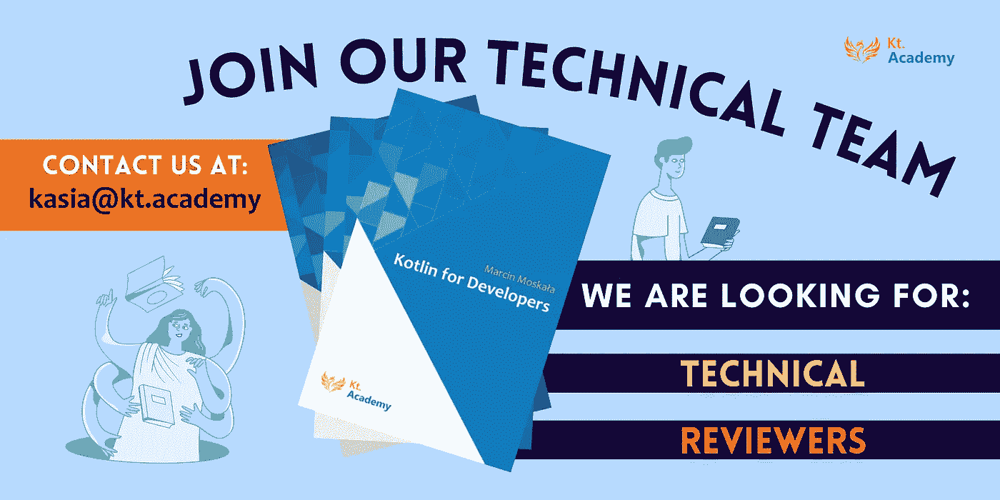
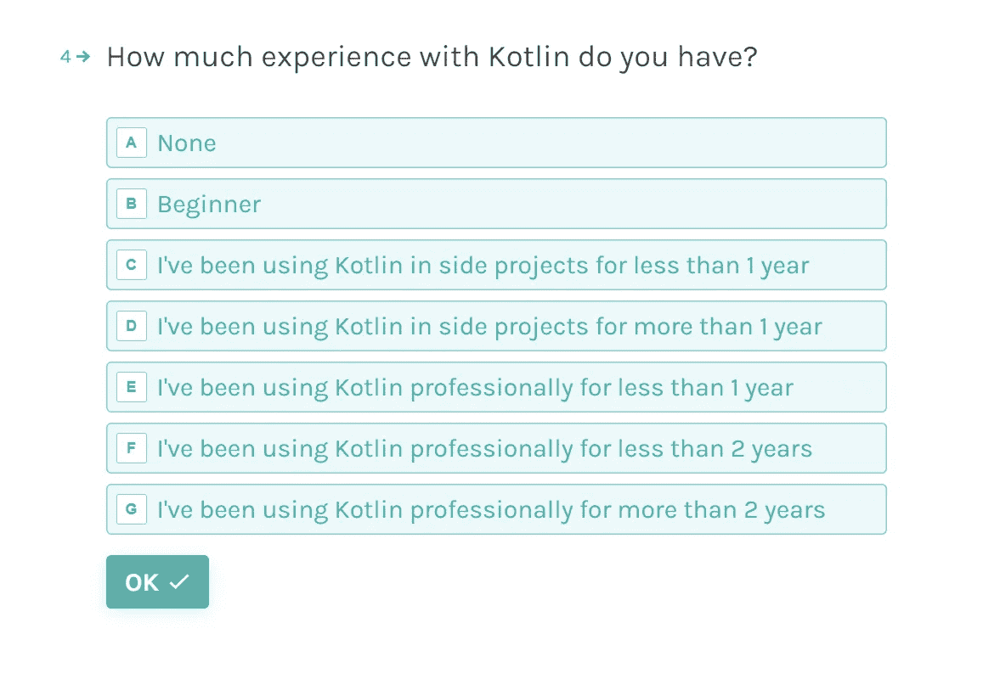

# 面向开发人员的 kot Lin——招聘技术审查人员！

> 原文：<https://blog.kotlin-academy.com/kotlin-for-developers-technical-reviewers-wanted-97ae6ed542b1?source=collection_archive---------0----------------------->

马尔钦·莫斯卡兹拉，你可能会从他的**书中了解他**:

*   [有效的科特林](https://leanpub.com/effectivekotlin)；
*   [科特林协程](https://leanpub.com/coroutines)；
*   [使用 Kotlin 进行 Android 开发](https://helion.pl/ksiazki/android-development-with-kotlin-marcin-moskala-igor-wojda,e_15oq.htm#format/e)

或者说[工作室](https://kt.academy/workshop)开始为开发人员制作名为 **Kotlin 的新书系列。**

它将包含:

第一本书:**kot Lin for developers:Essentials**

第二册:**功能性科特林**

第三册:**高级科特林。**

这就是为什么，今天，我们想邀请你来**参加《T21》一书的创作。我们很高兴地宣布，我们启动了 EAP(早期接入计划)您可以参与其中。**

# 它是如何工作的？

要参与该计划，您需要**填写下面的表格**:👇
[【科特林书评(typeform.com)】](https://marcinmoskala.typeform.com/to/ayFlXQBk)

在发送的提案中，我们将选择一组审阅者。如果你被选中，我们将在接下来的几周内陆续向你发送《Kotlin for Developers》系列丛书中的章节。对于每一章，我们将征求您的意见。不仅仅是修正还有感受，喜欢什么，困惑什么，听起来怪怪的却不知道为什么……一切！你给我们的评论越多越好。

# 要求:

*   填写表格；
*   **英语**至少中上水平；
*   复习所选书籍中至少一半的章节；

# 每个活跃的评审者将:

*   免费提前阅读这本书；
*   在图书致谢中提及(大多数活跃的评论者也会将他们的**简历发表在图书**中)；
*   将获得**一份** **签名的书的副本，并附有个人确认**；
*   会对书产生影响。

觉得服气？💪

我们迫不及待地收集您的申请！

