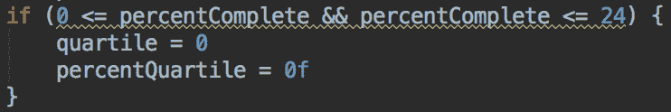
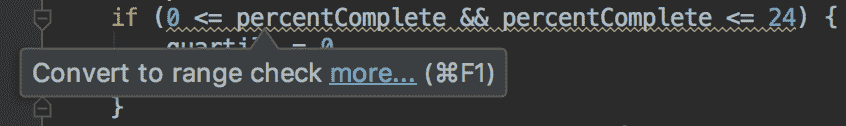
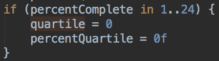

# 面向脾气暴躁的 Java 开发人员的 Kotlin

> 原文：<https://medium.com/pinterest-engineering/kotlin-for-grumpy-java-developers-8e90875cb6ab?source=collection_archive---------1----------------------->

Sha Sha Chu | Android 平台技术领先，核心体验

所以你是一个 Android 开发者。你已经编写 Java 代码很多年了，你的代码是干净的、可测试的、架构良好的。然后 Google 在 Google I/O 上宣布了对 Kotlin 的官方支持，震惊了开发者世界。突然间，你的团队都在谈论 Kotlin，你的午餐谈话充满了诸如“带有接收器的 lambdas”、“可空性”和“扩展函数”之类的词汇。你继续埋头写你伟大的 Java 代码。毕竟没有什么是 Kotlin 能做而 Java 做不到的，对吗？但是日复一日，越来越多。kt 文件出现在你的代码库中，直到你明白你不能永远呆在你的 Java 泡泡里——你必须学习 Kotlin。不要害怕！因为我曾经像你一样。我可以指导你，坏脾气的 Java 开发者，通过你的第一行 Kotlin。

## 学习基础知识

好消息是，在进入 Kotlin 之前，您只需要了解一些基础知识。坏消息是，在你开始之前，你需要学习一些基础知识。幸运的是，因为 Kotlin 一直在稳步普及，所以有大量的[资源](https://fabiomsr.github.io/from-java-to-kotlin/index.html)和[资源](https://www.youtube.com/watch?v=X1RVYt2QKQE)用于学习 Kotlin 的基本语法。当你第一次开始时，试着把注意力集中在非常基本的概念上，比如`val`和`var`、`Type`和`Type?`之间的区别，以及 Java 和 Kotlin 之间的句法差异；包括变量和函数声明之后的类型。

## Kotlin 代码看起来很像 Java……这没关系

新 Kotlin 开发人员陷入的一个常见陷阱是直接进入完全惯用的代码，然后不知所措。虽然它的好处之一是简洁，但没有必要将 Kotlin 文件精简到最少的行数，尤其是如果您是这门语言的新手。

考虑这个完全有效的 Kotlin 块:

```
fun logVideoQuartile(player: VideoPlayer?) {
    if (player == null) {
        return
    } // playPercentage is a property on VideoPlayer
    val percentComplete: Int = player.playPercentage
    val quartile: Int
    val percentQuartile: Float if (percentComplete >= 0 && percentComplete < 25) {
        quartile = 0
        percentQuartile = 0f
    } else if (percentComplete >= 25 && percentComplete < 50) {
        quartile = 1
        percentQuartile = .25f
    } else if (percentComplete >= 50 && percentComplete < 75) {
        quartile = 2
        percentQuartile = .50f
    } else if (percentComplete >= 75 && percentComplete < 95) {
        quartile = 3
        percentQuartile = .75f
    } else if (percentComplete >= 95 && percentComplete < 97) {
        quartile = 3
        percentQuartile = .95f
    } else if (percentComplete >= 97 && percentComplete < 100) {
        quartile = 3
        percentQuartile =.97f
    } else if (percentComplete == 100) {
        quartile = 4
        percentQuartile = 1f
    } else {
        quartile = -1
        percentQuartile = -1f
    } println(“Quartile is $quartile and percent quartile is $percentQuartile”)
}
```

你会注意到它看起来很像 Java 代码——没关系！即使您让这段代码保持原样，Kotlin 已经在两个方面帮助了您。首先，因为`player`是一个可空类型，所以您被迫添加一个空检查。第二，由于`quartile`和`percentQuartile`被声明为 val，您被迫添加`else` case，它将捕获错误的输入值。

## 依靠你的 IDE

一旦熟悉了 Kotlin 的基础知识，就可以开始钻研更有趣的语言特性了。因为 Kotlin 是由 IntelliJ(Android Studio 基于 IntelliJ)的作者编写的，所以它有很好的 IDE 支持。再次考虑视频四分位数代码，您会注意到 IDE 在每个 if 语句下添加了弯弯曲曲的线条:



如果您将鼠标悬停在该语句上，将会看到 IDE 建议您将这些检查转换为范围检查。



您不知道什么是范围检查，但可以使用 option+Enter 尝试以下建议:



就这样，你学会了一种新的语言特征。您的支票现在应该是这样的:

```
if (percentComplete in 0..24) {
    quartile = 0
    percentQuartile = 0f
} else if (percentComplete in 25..49) {
    quartile = 1
    percentQuartile = .25f
} else if (percentComplete in 50..74) {
    quartile = 2
    percentQuartile = .50f
} else if (percentComplete in 75..95) {
    quartile = 3
    percentQuartile = .75f
} else if (percentComplete in 95..96) {
    quartile = 3
    percentQuartile = .95f
} else if (percentComplete in 97..99) {
    quartile = 3
    percentQuartile = .97f
} else if (percentComplete == 100) {
    quartile = 4
    percentQuartile = 1f
} else {
    quartile = -1
    percentQuartile = -1f
}
```

注意:功能是完全相同的，但是范围符号更容易阅读，也更接近于开发人员对代码的理解。

更进一步，虽然 IDE 没有明确地调用它，但是您可能会注意到，如果您在`if`语句上按下 option-Enter，您会看到另一个将`if`语句转换为`when`的建议。通过接受这个建议，代码现在变成了:

```
when (percentComplete) {
    in 0..24 -> {
        quartile = 0
        percentQuartile = 0f
    }
    in 25..49 -> {
        quartile = 1
        percentQuartile = .25f
    }
    in 50..74 -> {
        quartile = 2
        percentQuartile = .50f
    }
    in 75..94 -> {
        quartile = 3
        percentQuartile = .75f
    }
    in 95..96 -> {
        quartile = 3
        percentQuartile = .95f
    }
    in 97..99 -> {
        quartile = 3
        percentQuartile = .97f
    }
    100 -> {
        quartile = 4
        percentQuartile = 1f
    }
    else -> {
        quartile = -1
        percentQuartile = -1f
    }
}
```

同样，我们没有改变功能，但块变得更容易阅读。

尝试 IDE 建议是探索不同 Kotlin 语言特性的好方法，所有这些都在您已经知道的代码的上下文中进行。此外，使用‘导航到声明’(默认情况下是 command-B)会提示您各种语言特性是如何实现的。例如，跳转到`in`的定义显示它实际上调用了`IntRange.contains`。

最后，IntelliJ/Android Studio 支持自动将 Java 代码转换为 Kotlin，既可以使用整个文件，也可以通过将 Java 代码片段复制粘贴到 Kotlin 文件中。当您不能完全理解 Kotlin 语法时，这可能会有所帮助。当我第一次开始时，我不知道向 Android 动画添加监听器(作为匿名类)的语法，所以我用 Java 编写代码并复制粘贴进去。(对于那些想知道的人，我漏掉了关键字`object`。)

## 扩大你的科特林词汇

一旦你花了一周左右的时间编写 Kotlin 代码，就该开始探索一些更有趣的语言特性了。让我们重温一下 quartile 日志记录代码，看看我们是否可以应用一些新的技巧。

我不太喜欢函数中的早期返回，因为当你移动代码时，它会导致错误。对于`player`上的初始空值检查，我们可以使用一个 Kotlin 函数来代替早期返回:

```
fun logVideoQuartile(player: VideoPlayer?) {
    player?.apply {
        val quartile: Int
        val percentQuartile: Float
        when (playPercentage) {
            in 0..24 -> {
                quartile = 0
                percentQuartile = 0f
            }
            ...
        }
    }
}
```

apply 块中的代码只有在 player 不为 null 时才会运行(注意`?.`操作符)。用 Java 中的`if (player != null)`块可以达到同样的效果，但是 apply 操作符也将块的`this`上下文设置为`player`实例，所以我们可以直接引用`playPercentage`，而不必引用`player`。

接下来，IDE 提出的另一个建议是“将赋值从 when 中取出”如果您应用它，它会做一些有趣但不太理想的事情:

```
val quartile: Int
val percentQuartile: Float
percentQuartile = when (playPercentage) {
    in 0..24 -> {
        quartile = 0
        0f
    }
    in 25..49 -> {
        quartile = 1
        .25f
    }
    ...
}
```

你会注意到，它不是在每个`in`块中重复`percentQuartile`赋值，而是在`when`块之外做一个单独的赋值。然而，我们会有重复的`quartile`任务。如果能把这些变量一起赋值不是很好吗？在 Java 中，你必须创建一个新的类，但是在 Kotlin 中，我们可以使用一个名为`Pair`的标准库类:

```
player?.apply {
    val(quartile, percentQuartile) = when (playPercentage) {
        in 0..24 -> {
            Pair(0, 0f)
        }
        in 25..49 -> {
            Pair(1, .25f)
        }
        in 50..74 -> {
            Pair(2, .50f)
        }
        in 75..94 -> {
            Pair(3, .75f)
        }
        in 95..96 -> {
            Pair(3, .95f)
        }
        in 97..99 -> {
            Pair(3, .97f)
        }
        100 -> {
            Pair(4, 1f)
        }
        else -> {
            Pair(-1, -1f)
        }
    }
    println(“Quartile is $quartile and percent quartile is $percentQuartile”)
}
```

(对于 Java 开发人员来说，这个赋值可能看起来很奇怪，因为每个`in`块都返回一个`Pair`实例，但是赋值的左边是两个独立的变量，`quartile`和`percentQuartile`。这被称为[析构声明](https://kotlinlang.org/docs/reference/multi-declarations.html)，是在一条语句中声明和赋值多个变量的一种简单方便的语法。)

我们越来越近了！针对每个`in`块的另一个 IDE 建议是从`when`条目中移除括号。我们的代码现在变成了:

```
fun logVideoQuartile(player: VideoPlayer?) {
    player?.apply {
        val(quartile, percentQuartile) = when (playPercentage) {
            in 0..24 -> Pair(0, 0f)
            in 25..49 -> Pair(1, .25f)
            in 50..74 -> Pair(2, .50f)
            in 75..94 -> Pair(3, .75f)
            in 95..96 -> Pair(3, .95f)
            in 97..99 -> Pair(3, .97f)
            100 -> Pair(4, 1f)
            else -> Pair(-1, -1f)
        }
        println(“Quartile is $quartile and percent quartile is $percentQuartile”)
    }
}
```

该函数现在很紧凑，但仍然可读。这种结构的一个微妙的好处是，如果我们的逻辑在将来发生变化，块的更新变得更加容易和直观。(注意:有些人可能会指出，我们可以通过将 Pair 语句转换为使用`to`函数来进一步缩短代码:`in 0..24 -> 0 to 0`。保持代码原样只是我个人的偏好，因为对我来说，`to`函数读起来更像是一个范围，而不是映射/元组。此外，对范围使用`until`函数可能更清楚，它类似于`..`范围操作符，但它不包括结束值。这只是用 Kotlin 编写同一行代码的多种方法中的一个例子。)

## 科特林不会让糟糕的代码变好

归根结底，Kotlin 只是另一个工具。它不会神奇地让你的应用程序崩溃率为零，尽管你可能听说过，但在 Kotlin 代码中仍有可能出现 NullPointerExceptions，尤其是在 Java 和 Kotlin 的边界处。当 Kotlin 第一次被引入我们的代码库时，我拒绝学习它好几个月。我认为它不能做 Java 做不到的事情。然而，当我开始开发一个专门用 Kotlin 编写的功能时，这个问题就出现了。我采用了这里概述的方法，令我惊讶的是，我在大约一周内就感觉到了 Kotlin 的“对话性”,并且只花了我另外两周的时间就感觉到我已经学会了许多中级到高级的语言特性。

Kotlin 不是银弹，但它确实有许多强大的特性，可以直接解决 Java 的一些缺点。这有助于将您的一些认知负荷转移到编译器上，因此您可以专注于简单地制作好的产品。也许，只是也许，那会让你少一点坏脾气。

*鸣谢:Pinterest 的所有 Android 开发人员，感谢他们让每天的工作变得有趣。特别要感谢 Matt Beattie、Dom Bhuphaibool、Ryan Cooke、Vy Phan 和 Zach Westlake，感谢他们帮助撰写和编辑这篇博文，感谢 Christina Lee 在 Pinterest 支持 Kotlin，并最终让这位脾气暴躁的开发人员学会了这门语言。*