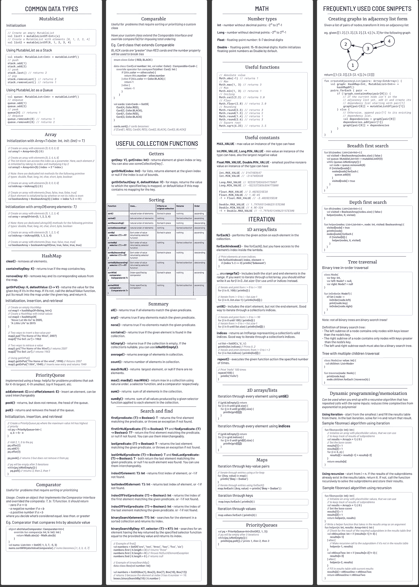

# 科特林面试-小抄

> 原文：<https://blog.kotlin-academy.com/kotlin-for-interviews-cheatsheet-88a9831e9d55?source=collection_archive---------0----------------------->

我花了五月和六月的大部分时间准备面试，我说的准备面试是指做大量的 Leetcode。自从我申请 Android 职位以来，我决定解决 Kotlin 中的大多数问题，并注意到我写的 Kotlin 与我在工作中使用的 Kotlin 非常不同。我决定将面试准备过程中经常出现的代码片段汇总成一个备忘单，然后在 5 篇中型文章中深入研究这些代码片段。

深潜包括:

*   [常见数据类型](/kotlin-for-interviews-part-1-common-data-types-886ea1e40645)
*   [收藏功能](/kotlin-for-interviews-part-2-collection-functions-a4a488fa0a14)
*   [数字和数学](/kotlin-for-interviews-part-3-numbers-and-math-786660295cea)
*   [迭代](/kotlin-for-interviews-part-4-iteration-b176dee4f1ae)
*   [常用代码片段](/kotlin-for-interviews-part-5-frequently-used-code-snippets-444ad4d137f5)

这是备忘单，你可以在这里找到高分辨率版本。

