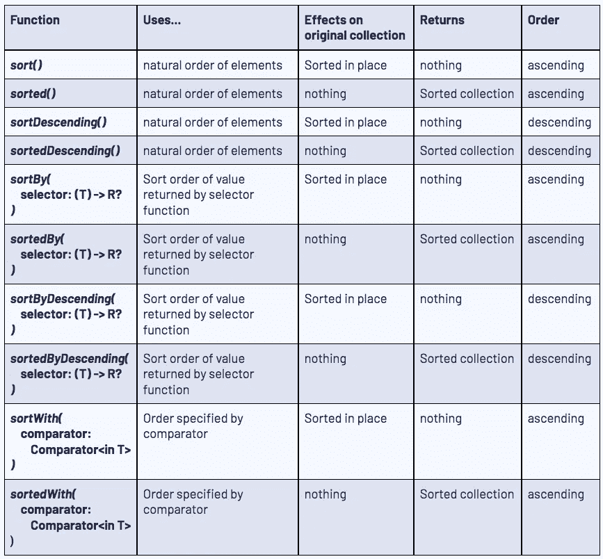

# 面试考林第 2 部分:集合函数

> 原文：<https://blog.kotlin-academy.com/kotlin-for-interviews-part-2-collection-functions-a4a488fa0a14?source=collection_archive---------3----------------------->


Photo by [Susan Yin](https://unsplash.com/@syinq?utm_source=medium&utm_medium=referral) on [Unsplash](https://unsplash.com?utm_source=medium&utm_medium=referral)

这是 Kotlin for Interviews 的第 2 部分，在这个系列中，我回顾了在 Android 面试准备期间经常出现的 Kotlin 函数和代码片段。我还编辑了一个备忘单，涵盖了这个系列的所有 5 个部分，你可以在这里找到。

你可以在这里找到第 1 部分:常用数据类型[，在这里](/kotlin-for-interviews-part-1-common-data-types-886ea1e40645)找到第 3 部分:数字和数学[，在这里](/kotlin-for-interviews-part-3-numbers-and-math-786660295cea)找到第 4 部分:迭代和第 12 部分，在这里找到第 5 部分:常用代码片段[。](/kotlin-for-interviews-part-5-frequently-used-code-snippets-444ad4d137f5)

这一部分包括:

1.  [吸气剂](#b776)
2.  [搜索并找到](#6f94)
3.  [排序](#9820)
4.  [布尔汇总](#79c6)
5.  [统计汇总](#dae6)

Kotlin 标准库提供了许多对集合执行操作的函数。我将只涉及我在面试问题中经常用到的那些，但是这里有一篇很棒的文章对它们进行了概述。

# 吸气剂

*   `get(key: V)` 是基本的 getter，返回你传入的任何索引或键的值。在 Kotlin 中，还可以使用`someCollection[key]`作为 getter。
*   `getOrDefault(key: K, defaultValue: V)` 返回指定键映射到的值，如果此映射不包含键的映射，则返回 defaultValue。这对于使用地图非常有用。
*   `getOrNull(index: Int)` 返回给定索引处的元素，如果索引越界，则返回`null`。这对于处理数组和列表很有用。

# 搜索和查找

*   `first(predicate: (T) -> Boolean): T`返回匹配给定谓词的第一个元素。如果没有元素与谓词匹配，它将抛出一个异常。
*   `firstOrNull(predicate: (T) -> Boolean): T?`和`find(predicate: (T) -> Boolean): T?`都返回匹配给定谓词的第一个元素，如果没有找到这样的元素，则返回`null`。你可以互换使用它们。

```
*// Example of first()*
**val numbers = listOf("one", "two", "three", "four", "five", "six")**
**numbers.first { it.length > 3 }** *// returns “three”*
**numbers.first { it.length > 8 }** *// throws NoSuchElementException* **numbers.firstOrNull { it.length > 8 }** *// returns null* **numbers.find { it.length > 8 }** *// returns null*
```

*   `last(predicate: (T) -> Boolean): T`返回匹配给定谓词的最后一个元素。如果没有元素与谓词匹配，它将抛出一个异常。
*   `lastOrNull(predicate: (T) -> Boolean): T` 和`findLast(predicate: (T) -> Boolean): T` 都返回与给定谓词匹配的最后一个元素，如果没有找到这样的元素，则返回`null`。你可以互换使用它们。
*   `indexOf(element: T): Int`返回元素的第一个索引，如果数组不包含元素，则返回`-1`。
*   `lastIndexOf(element: T): Int`返回元素的最后一个索引，如果数组不包含元素，则返回`-1`。
*   `indexOfFirst(predicate: (T) -> Boolean): Int` 返回与给定谓词匹配的第一个元素的索引，如果数组不包含元素，则返回`-1`。
*   `indexOfFirst(predicate: (T) -> Boolean): Int` 返回与给定谓词匹配的最后一个元素的索引，如果数组不包含元素，则返回`-1`。
*   `binarySearch(element: T?): Int`在排序的集合中搜索元素并返回其索引。
*   `binarySearchBy(key: K?, selector: (T) -> K?): Int`搜索由指定选择器函数返回的键等于所提供的键值的元素，并返回其索引。

```
*// Example of binarySearchBy()* **data class Box(val number: Int)****val numbers = listOf(Box(1), Box(3), Box(7), Box(10), Box(12))** *// returns 3 because the element at index 3 has it.number == 10.* **boxes.binarySearchBy(10) { it.number }**
```

# 整理

*   `sort()` 使用元素的自然顺序按升序排序。sort 方法将给定的集合就地排序，并且不返回任何内容。
*   `sorted(): List<T>` 使用元素的自然顺序按升序排序并返回结果。
*   `sortBy(selector: (T) -> R?)` 根据指定选择器函数返回值的排序顺序，按升序对元素进行就地排序。它不返回任何内容。
*   `sortedBy(selector: (T) -> R?): List<T>` 使用指定选择器函数返回值的排序顺序，按升序排序并返回结果。
*   `sortWith(comparator: Comparator<in T>)` 使用给定比较器指定的顺序按升序对集合进行就地排序。它不返回任何内容。科特林有一个`[compareBy()](https://kotlinlang.org/api/latest/jvm/stdlib/kotlin.comparisons/compare-by.html)`功能，可以帮助轻松创建`Comparator`对象。
*   `sortedWith(comparator: Comparator<in T>): List<T>` 使用给定比较器指定的顺序对集合进行升序排序并返回结果。
*   `sortDescending()` *、* `sortedDescending()` *、* `sortByDescending()` *、*、`sortedByDescending()` 与上述功能效果相同，但按降序排列。

```
*// Need to use a mutableList since sort() mutates the list*
**val sortNumbers = mutableListOf(1, 2, 7, 6, 5, 6)
sortNumbers.sort()** *// sortNumbers becomes [1, 2, 5, 6, 7]***val sortValues = mutableListOf(1 to "a", 5 to "c", 2 to "c", 7 to "b", 6 to "d")
sortValues.sortBy { it.second }** 
*// sortValues becomes [(1, a), (7, b), (5, c), (2, c), (6, d)]* *// sort by letter, and then by number* **sortValues.sortWith(compareBy({it.second}, {it.first}))** *// sortValues becomes [(1, a), (7, b), (2, c), (5, c), (6, d)]*
```

大量不同的排序函数可能会让人感到困惑，所以我创建了下表来总结它们:



# 布尔汇总

这些函数都通过所有相关元素计算一个谓词，并返回一个布尔结果。

*   `all()` 如果所有元素都匹配给定的谓词，则返回 true。
*   `any()` 如果有任何元素匹配给定的谓词，则返回 true。
*   `none()` 如果没有元素匹配给定的谓词，则返回 true。
*   `contains()`如果在集合中找到给定元素，则返回 true。
*   `isEmpty()`如果集合为空，则返回 true。如果集合是可空的，您可以使用`isNullOrEmpty()`。对于琴弦，可以使用`isNullOrBlank()` *。*这些通常用作 while 循环的退出条件，或者作为递归函数中基本情况的检查。

# 统计摘要

这些函数返回一个数字，表示评估所有元素后的统计结果。

*   `average()`返回集合中元素的平均值。
*   `count()`返回集合中元素的个数。
*   `maxOrNull()`返回最大的元素，如果没有元素，则返回 null。
*   我们还有`max()`、**、*、*、**、`maxWith()`，它们分别使用自然排序、选择器函数和比较器返回集合中的最大值。它们遵循与排序函数相同的命名模式。
*   `min()`、**、*、*、**、`minWith()`、*、*分别使用自然排序、选择器函数和比较器返回集合中的最小值。
*   `sum()`返回集合中所有元素的总和。
*   `sumBy()`返回应用于集合中每个元素的给定选择器函数产生的所有值的总和。

这里是到备忘单的[链接，再次涵盖所有 5 个零件。](/kotlin-for-interviews-cheatsheet-88a9831e9d55)

第二部分到此结束！在第三部分中，我用科特林语复习了数字和数学。

# 点击👏说“谢谢！”并帮助他人找到这篇文章。

了解卡帕头最新的重大新闻。学院，[订阅时事通讯](https://kotlin-academy.us17.list-manage.com/subscribe?u=5d3a48e1893758cb5be5c2919&id=d2ba84960a)，[观察 Twitter](https://twitter.com/ktdotacademy) 关注我们 Medium。

如果你需要一个 Kotlin 工作室，看看我们如何帮助你: [kt.academy](https://kt.academy/) 。

[](https://kotlin-academy.us17.list-manage.com/subscribe?u=5d3a48e1893758cb5be5c2919&id=d2ba84960a)