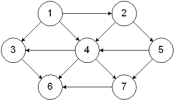
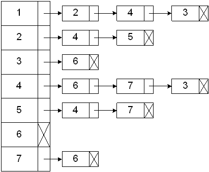

# 面试用 Kotlin 第 5 部分:常用代码片段

> 原文：<https://blog.kotlin-academy.com/kotlin-for-interviews-part-5-frequently-used-code-snippets-444ad4d137f5?source=collection_archive---------0----------------------->


Photo by [Fabrice Villard](https://unsplash.com/@fabulu75?utm_source=medium&utm_medium=referral) on [Unsplash](https://unsplash.com?utm_source=medium&utm_medium=referral)

这是 Kotlin for Interviews 的第 5 部分，在这个系列中，我回顾了在 Android 面试准备期间经常出现的 Kotlin 函数和代码片段。我还编辑了一个备忘单，涵盖了这个系列的所有 5 个部分，你可以在这里找到。

你可以在这里找到第 1 部分:通用数据类型[，](/kotlin-for-interviews-part-1-common-data-types-886ea1e40645)第 2 部分:集合函数[这里](/kotlin-for-interviews-part-2-collection-functions-a4a488fa0a14)，第 3 部分:数字和数学[这里](/kotlin-for-interviews-part-3-numbers-and-math-786660295cea)，第 4 部分:迭代[这里](/kotlin-for-interviews-part-4-iteration-b176dee4f1ae)。

这一部分包括:

*   [以邻接表形式创建图形](#7ff6)
*   [广度优先搜索](#41f6)
*   [深度优先搜索](#04fe)
*   [树遍历](#de2a)
*   [动态编程/记忆](#a810)

我们将回顾我发现自己经常用于许多不同问题的代码块。例如，许多面试问题归结为深度优先搜索，我使用了基本的深度优先搜索代码片段的变体来解决它们。

# 以邻接表形式创建图形

对于许多图形问题，你会得到一个节点对列表，其中第二个节点依赖于第一个节点(反之亦然，取决于你的访问者)。例如，看起来像[0，1]的对意味着要访问节点 1，必须先访问 0。然而，大多数图算法需要一个[邻接表表示](https://www.geeksforgeeks.org/graph-and-its-representations/)，所以这里有一个算法，它接受一个节点对列表，并将其转换成一个邻接表。

给定这个样本输入:

[[1, 2], [1, 3], [1, 4], [2, 4], [2, 5], [3, 6], [4, 3], [4,6], [4, 7], [5, 4], [5, 7], [7, 6]]

它代表了这个图表:



我们想要创建以下邻接表:

[[1: [2, 4, 3]], [2: [4, 5]], [3: [6]], [4: [6, 7, 3]], [5: [4, 7]], [7: [6]]]



```
**fun createAdjacencyList(pairs: Array<IntArray>) {
    val graph: HashMap<Int, MutableList<Int>> = *hashMapOf*()
    pairs.*forEach* { pair ->
        if (!graph.containsKey(pair[0])) {**
 *// If the current node isn't in the adjacency list yet, 
            // add it and create its dependency list starting with 
            // pair[1]*
            **graph[pair[0]] = *mutableListOf*(pair[1])**
        **} else {**
 *// Otherwise, append pair[1] to its existing dependency  
            // list.* **val dependencies = graph[pair[0]]                 
            dependencies.add(pair[1])
            graph[pair[0]] = dependencies
        }
    }
}**
```

注意这个算法是针对有向图的。如果你被告知这个图是无向的——意思是对[0，1]仅仅意味着 0 和 1 之间有一条边——只要将`pair[0]`和`pair[1]`交换，重复`forEach()`循环中的代码，这样图中的`MutableList`代表所有相邻节点，而不仅仅是有向依赖。

# 广度优先搜索

许多面试问题都需要遍历图形——从查找节点到检查循环，再到查找两个节点之间的路径长度。广度优先搜索是一种方法。该算法从图中的某个节点开始，在队列的帮助下，在移动到下一个深度级别的节点之前，探索当前深度的所有邻居节点。

这是一个基本版本，遍历从第一个节点可到达的所有节点。您可以根据您正在解决的图形问题来修改它。

```
**fun bfs(nodes: List<List<Int>>) {
    val visited = BooleanArray(nodes.size) { false }** *// Create a queue and add 0 to represent the index of the 
    // first node* **val queue: MutableList<Int> = mutableListOf(0)
    while (queue.isNotEmpty()) {** *// Dequeue a node from queue*
 **val node = queue.removeAt(0)** *// Add all of the node's unvisited neighbors to the queue*
 **if (!visited[node]) {
            nodes[node].forEach {
                queue.add(it)
            }** *// Mark the dequeued node as visited* **visited[node] = true
        }
    }
}**
```

# 深度优先搜索

深度优先搜索也可以用于图的遍历问题。该算法使用堆栈代替队列，在被迫回溯并扩展到其他节点之前，尽可能地探索当前节点分支。

这是一个递归版本，它依赖于函数调用堆栈，而不是显式的堆栈变量。您也可以使用堆栈变量编写算法的迭代版本。

```
**fun dfs(nodes: List<List<Int>>) {
    val visited = BooleanArray(nodes.size) { false }
    helper(nodes, 0, visited)
}

fun helper(nodes: List<List<Int>>, node: Int, visited: BooleanArray){
    visited[node] = true
    nodes[node].forEach { 
        if (!visited[it]) {
            helper(nodes, it, visited)
        }
    }
}**
```

# 树遍历

树问题在面试中很常见。一些例子是寻找两个节点的最低共同祖先，对树中所有节点的值求和，等等。

## 二叉树

二叉树是你在面试中最常见的树。二叉树的一个节点看起来像这样:

```
**class Node(
    var key: Int, 
    var left: Node? = null, 
    var right: Node? = null
)**
```

注意，不是所有的二叉树都是二分搜索法树，除非你的面试官确认，否则你不应该认为你得到了 BST。如果二叉树也满足以下条件，则它只是一个 BST:

*   节点的左子树只包含键小于该节点键的节点。
*   节点的右边子树只包含键大于节点键的节点。
*   左侧和右侧的子树都必须是二叉查找树。

让我们使用这棵树(它不是 BST！)举个例子:


您可以使用以下代码来构造它:

```
**val node4 = Node(4)
val node7 = Node(7)
val node6 = Node(6, node4, node7)
val node11 = Node(11)
val node9 = Node(9, node6, node11)
val node2 = Node(2)
val node5 = Node(5)
val node12 = Node(12, node2, node5)
val node3 = Node(3, node12)
val node1 = Node(1, node9, node3)**
```

下面是一个前序遍历的样子:

```
**fun preOrder(n: Node?) {
    n?.let { node ->
        print(node.key)
        preOrder(node.left)
        preOrder(node.right)
    }
}****preOrder(node1)** *// prints 1 9 6 4 7 11 3 12 2 5*
```

下面是一个有序遍历的样子:

```
**fun inOrder(n: Node?) {
    n?.let { node ->
        inOrder(node.left)
        print(node.key)
        inOrder(node.right)
    }
}****inOrder(node1**) *// prints 4 6 7 9 11 1 2 12 5 3*
```

以下是后序遍历的样子:

```
**fun postOrder(n: Node?) {
    n?.let { node ->
        postOrder(node.left)
        postOrder(node.right)
        print(node.key)
    }
}****postOrder(node1)** *// prints 4 7 6 11 9 2 5 12 3 1*
```

## 有多个孩子的树

您还可能遇到有一系列子节点而不是左右节点的树。这种数据结构的一个例子是 Android 视图层次结构，其中每个视图可能有多个子视图。

```
**class Node(var value: Int) {
  val children: List<Node>
}**
```

在这种情况下，您必须在所有子节点上递归调用您的函数，代码如下所示:

```
**fun traverse(node: Node) {
    print(node.key)
    node.children.forEach {
        traverse(it)
    }
}**
```

# 动态编程/记忆

无论何时，当您最终得到一个具有相同输入的重复调用的递归算法时，您都可以使用动态编程来优化它。这个想法是将子问题的结果存储在一个表中，这样我们就不必在以后需要时重新计算它们。这将时间复杂度从指数降低到多项式。它可以使用迭代或递归来实现。

## 循环

我们从最小的`i`开始，从那里填充结果表。我们在当前迭代中需要的每个子问题都应该已经解决了。在最后一次迭代中，我们求解`i=n`并返回结果。

```
**fun fibonacci(n: Int): Int {**
    *// Initialize an array to keep track of results of subproblems
    // We'll use 0 as the placeholder initial value*
    **val results = Array(n + 1) { 0 }
** *// Set the base cases* **results[1] = 1
    results[2] = 1
    for (i in 3..n) {
        results[i] = results[i-1] + results[i-2]
    }
    return results[n]**
**}**
```

## 递归

我们从`i = n`开始。如果我们当前迭代需要的子问题的结果已经存在于结果表中，我们可以使用它们。如果没有，我们将递归调用函数来求解它们并存储结果。

```
**fun fibonacci(n: Int): Int {
** *// Initialize an array to keep track of results of subproblems
    // We'll use 0 as the placeholder initial value* **val results = Array(n + 1) { 0 }** *// Set the base cases* **results[1] = 1
    results[2] = 1
    return helper(n, results)
}***// Write a helper function that takes in the results array as an 
// argument* **fun helper(n: Int, results: Array<Int>): Int {** *// Check for the result of the subproblem you need in the 
    // results table first* **val nMinusOne: Int = if (results[n-1] != 0) {
        results[n-1]
    } else {** *// Only make the recursive call to the subproblem if it's 
        // not in the results table yet* **helper(n-1, results)
    }
    val nMinusTwo: Int = if (results[n-2] != 0) {
        results[n-2]
    } else {
        helper(n-2, results)
    }** *// Fill in the results table with the current results* **results[n] = nMinusOne + nMinusTwo
    return nMinusOne + nMinusTwo
}**
```

Kotlin for Interview 系列到此结束。这里是[链接到备忘单](/kotlin-for-interviews-cheatsheet-88a9831e9d55)再次涵盖所有 5 个部分。祝你面试好运！

# 点击👏说“谢谢！”并帮助他人找到这篇文章。

了解卡帕头最新的重大新闻。学院，[订阅时事通讯](https://kotlin-academy.us17.list-manage.com/subscribe?u=5d3a48e1893758cb5be5c2919&id=d2ba84960a)，[观察 Twitter](https://twitter.com/ktdotacademy) 并在 Medium 上关注我们。

如果您需要 Kotlin 工作室，请查看我们如何帮助您: [kt.academy](https://kt.academy/) 。

[](https://kotlin-academy.us17.list-manage.com/subscribe?u=5d3a48e1893758cb5be5c2919&id=d2ba84960a)