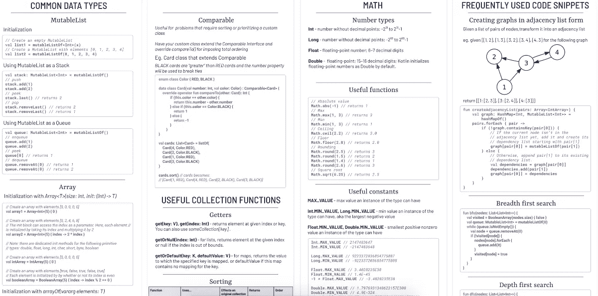
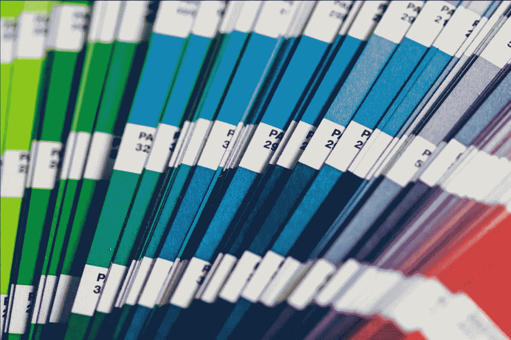
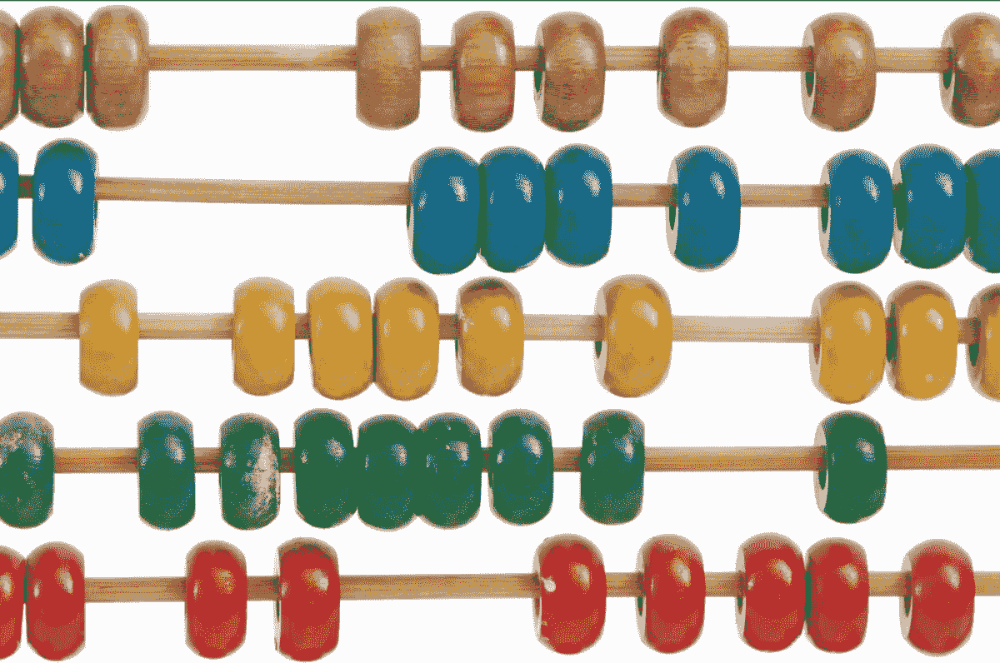

# 科特林访谈系列

> 原文：<https://blog.kotlin-academy.com/kotlin-for-interviews-series-def58e229e23?source=collection_archive---------4----------------------->

你好，星期五快乐！

11 月上半月，我们连续发表了 5 篇由[袁雪莉](https://medium.com/@sherryyuan)撰写的采访柯特林的文章。它们涵盖了数据结构、集合函数、数学、通用算法以及 Kotlin 中对于技术面试来说很重要的其他部分。

你会在下面找到它们！

**但首先**，查看“[kot Lin for interview](/kotlin-for-interviews-cheatsheet-88a9831e9d55)”备忘单，该备忘单汇总了面试中经常出现的代码片段的概述。

**第一部分:** [**常见数据类型**](/kotlin-for-interviews-part-1-common-data-types-886ea1e40645)

涵盖了算法和数据结构题中经常出现的几种常见数据类型，例如:MutableList、HashMap 或 PriorityQueue。

**第二部分:** [**集合函数**](/kotlin-for-interviews-part-2-collection-functions-a4a488fa0a14)

本部分涵盖集合函数主题:getters、搜索和查找、排序、布尔汇总和统计汇总。

**第三部分:** [**数字和数学**](/kotlin-for-interviews-part-3-numbers-and-math-786660295cea)

它涵盖了数字和数学主题，像数字类型和数学运算符，以及有用的函数和常数。

**第 4 部分:** [**迭代**](/kotlin-for-interviews-part-4-iteration-b176dee4f1ae)

这部分包括范围、1D 数组/列表、2D 数组/列表、地图和优先级队列的复习。

**第 5 部分:** [**常用代码片段**](/kotlin-for-interviews-part-5-frequently-used-code-snippets-444ad4d137f5)

它涵盖了常用的代码片段，比如以邻接表形式创建图形、广度和深度优先搜索、树遍历和动态编程/记忆。

*快乐编码！
Kt。学院队*

