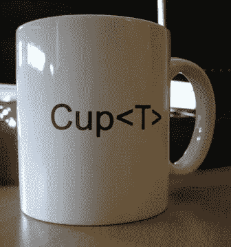

# 科特林通用方差修改器

> 原文：<https://blog.kotlin-academy.com/kotlin-generics-variance-modifiers-36b82c7caa39?source=collection_archive---------3----------------------->

即使对于有经验的开发人员来说，泛型有时也令人困惑。最后还是简单明了吧。

假设我们有下面的[泛型类](/programmer-dictionary-class-vs-type-vs-object-e6d1f74d1e2e?source=collection_detail----e57b304801ef-----21----------------):

```
class Cup<T>
```



Cup of T

上面声明中的[类型参数](/programmer-dictionary-parameter-vs-argument-type-parameter-vs-type-argument-b965d2cc6929?source=collection_detail----e57b304801ef-----26----------------) `T`没有任何方差修饰符(`out`或`in`)，默认为**不变量**。这意味着由这个泛型类生成的任何两个类型之间都没有关系。例如，`Cup<Int>`和`Cup<Number>`、`Cup<Any>`或`Cup<Nothing>`之间没有关系。

```
fun main(args: Array<String>) {
  val anys: Cup<Any> = Cup<Int>() // Error: Type mismatch
  val nothings: Cup<Nothing> = Cup<Int>() // Error: Type mismatch
}
```

如果我们需要这样的关系，那么我们应该使用方差修饰符:`out`或`in`。`out`使[型参数](/programmer-dictionary-parameter-vs-argument-type-parameter-vs-type-argument-b965d2cc6929?source=collection_detail----e57b304801ef-----26----------------) **协变**。这意味着当`A`是`B`的子类型`Cup`是**的协变**时，那么类型`Cup<A>`就是`Cup<B>`的子类型:

```
class Cup<out T>open class B
class A: B()fun main(args: Array<String>) {
  val b: Cup<B> = Cup<A>() // OK
  val a: Cup<A> = Cup<B>() // Error: Type mismatch

  val anys: Cup<Any> = Cup<Int>() // OK
  val nothings: Cup<Nothing> = Cup<Int>() // Error: Type mismatch
}
```

使用`in`修改器可以达到相反的效果，使[类型参数](/programmer-dictionary-parameter-vs-argument-type-parameter-vs-type-argument-b965d2cc6929?source=collection_detail----e57b304801ef-----26----------------) **逆变**。这意味着当`A`是`B`的子类型`Cup`是**的逆变**时，那么`Cup<A>`类型就是`Cup<B>`的超类型:

```
class Cup<in T>open class B
class A: B()fun main(args: Array<String>) {
  val b: Cup<B> = Cup<A>() // Error: Type mismatch
  val a: Cup<A> = Cup<B>() // OK

  val anys: Cup<Any> = Cup<Int>() // Error: Type mismatch
  val nothings: Cup<Nothing> = Cup<Int>() // OK
}
```

你可以看看这 3 个方差修饰符，就像数学运算一样，当类型为等于、大于等于或小于等于时，允许进行子类型化。但是方差修饰符的含义要深得多，我将使用 Java 大问题来解释它，这个问题来自于 Java 数组是协变的，并且它们允许值设置。

## 数组协方差的 Java 问题

在 Java 中，数组是**协变的**。许多资料表明，这一决定背后的原因是为了能够创建函数，如`sort`，对每种类型的数组进行泛型操作。但是这个决定有一个很大的问题。为了理解它，让我们分析下面的有效操作，它们不产生编译时错误，而是抛出运行时错误:

```
// Java
Integer[] numbers = {1, 4, 2, 1};
Object[] objects = numbers;
objects[2] = "B"; // Runtime error
```

结果:运行时异常:线程“main”中的异常 Java . lang . array store 异常:java.lang.String

正如您所看到的，`numbers`转换为`Object[]`并没有改变结构中使用的实际类型(它仍然是`Integer`，所以当我们试图将类型`String`的值赋给这个数组时，就会出现错误。这真的很糟糕！编译器应该在编译时防止这种错误。

> Kotlin 比 Java 安全多了。Kotlin 中的数组具有不变的类型参数。`List`接口有协变类型参数，因为它是不可变的。可变列表具有不变类型参数。

## 协方差问题

如你所见，**协方差**的问题在于向上转换后的可变性。如果你更深入地分析一下，**协变的**类型参数——不仅在 setter 上，而且在位置(公共方法参数或公共属性)的任何*上——是潜在的错误源。这就是 Kotlin 禁止在位置*的*上使用协变类型参数的原因。*

```
class Cup<out T>(
   var elem: T // Error: T not allowed on invariant position
) {
  fun set(new: T) { // Error: T not allowed on in position
    elem = new
  } fun get(): T = elem
}
```

我们可以通过只在 *out 位置*(公共方法返回类型)上使用类型参数，而不在 *位置*(公共方法参数)或不变位置(公共属性)上使用类型参数来纠正上述代码:

```
class Cup<out T>(
  private var elem: T
) {
  fun get(): T = elem
}
```

请注意，这就是`out`方差修饰符名称的来源:**协变**类型参数允许出现在*输出位置*上，它们是使用`out`方差修饰符生成的。

## 方差问题

想象一下，如果 Java 设计者决定默认使用数组**逆变**会发生什么。我们在设置值方面不会有任何问题:

```
// Java
Number[] nums = {1, 1.0, 1F};
Integer[] ints = nums; // 1
ints[2] = 12;
```

1.  这在 Java 中是不允许的，但在我们想象的场景中会出现

相反，我们在获取值时会遇到问题，因为即使我们可以获得任何类型的数字，我们也会期望`Integer`:

```
// Java
Integer i = ints[1]; // Runtime error
```

甚至在这个例子之前，你可能已经猜到**逆变**参数，是使用 Kotlin 中的`in`修改器制作的，只允许在位置的*上使用。如果你这样做了，那么你是完全正确的。这种限制背后的原因是，这是上述问题的唯一解决方案。让我们在实践中看看:*

```
class Cup<in T>(
  var elem: T // Error: T not allowed on invariant position
) {
  fun set(new: T) { 
    elem = new
  } fun get(): T = elem // Error: T not allowed on out position
}
```

我们可以通过只在位置的*上使用类型参数(公共方法参数)来纠正它，而不在位置*的*上使用类型参数(公共方法返回类型)或不变位置(公共属性):*

```
class Cup<in T>(
  private var elem: T
) {
  fun set(new: T) { 
    elem = new
  }
}
```

## 缺少具有不变性的问题

请注意，所有位置都允许使用不变类型参数:

```
class Cup<T>(
  var elem: T
) {
  fun set(new: T) {
    elem = new
  } fun get(): T = elem
}
```

## 摘要

这些都使得 Kotlin variance 比 Java 安全得多。默认情况下，`in`和`out`修饰符可能不直观，但是你需要记住的是:

*   类型参数的默认方差行为是**不变性**。如果`Cup`是**不变量**并且`A`是`B`的子类型，那么 `**Cup<A>**` **和** `**Cup<B>**`之间没有关系。
*   `out`使类型参数**协变**。如果`Cup`是**协变**并且`A`是`B`的子类型，那么`Cup<A>`是`Cup<B>`的子类型。**协变**型可用在*出位*上。
*   `in`使类型参数**逆变**。如果`Cup`是**逆变**并且`A`是`B`的子类型，那么`Cup<B>`就是`Cup<A>`的子类型。**逆变型**可以用在*的*位置。

为了帮助你学习，我制作了 [Anki 牌抽认卡](https://ankiweb.net/shared/info/551783526)。

在我们的工作室中，我们通过实践练习更深入地挖掘泛型。这是下一个:

[](https://www.kt.academy/#workshops-offer)

这篇文章是[科特林程序员词典](https://medium.com/kotlin-academy/kotlin-programmer-dictionary-2cb67fff1fe2)的第十四部分。要了解最新的新部件，只需关注这个媒体或[在 Twitter 上观察我](https://twitter.com/marcinmoskala)。如果你需要帮助，记得[我随时准备咨询](https://medium.com/@marcinmoskala/ive-just-opened-up-for-online-consultations-640349aaba55)。

喜欢的话记得**拍**。请注意，如果您按住鼓掌按钮，您可以留下更多的掌声。

[](http://eepurl.com/diMmGv)

以下是《科特林程序员词典》的其他部分:

*   [实参对形参，类型实参对类型形参](https://medium.com/kotlin-academy/programmer-dictionary-parameter-vs-argument-type-parameter-vs-type-argument-b965d2cc6929)
*   [语句 vs 表达式](https://medium.com/kotlin-academy/kotlin-programmer-dictionary-statement-vs-expression-e6743ba1aaa0)
*   [功能 vs 方法 vs 程序](https://medium.com/kotlin-academy/kotlin-programmer-dictionary-function-vs-method-vs-procedure-c0216642ee87)
*   [字段对属性](/kotlin-programmer-dictionary-field-vs-property-30ab7ef70531)
*   [类 vs 类型 vs 对象](/programmer-dictionary-class-vs-type-vs-object-e6d1f74d1e2e)
*   [对象表达式 vs 对象声明](/kotlin-programmer-dictionary-object-expression-vs-object-declaration-791b183ad16b)
*   [接收器](/programmer-dictionary-receiver-b085b1620890)
*   [隐式接收者 vs 显式接收者](/programmer-dictionary-implicit-receiver-vs-explicit-receiver-da638de31f3c)
*   [分机接收机 vs 调度接收机](/programmer-dictionary-extension-receiver-vs-dispatch-receiver-cd154e57e277)
*   [接收器类型与接收器对象](/programmer-dictionary-receiver-type-vs-receiver-object-575d2705ddd9)
*   [函数类型 vs 函数文字 vs Lambda 表达式 vs 匿名函数](/kotlin-programmer-dictionary-function-type-vs-function-literal-vs-lambda-expression-vs-anonymous-edc97e8873e)
*   [高阶函数](/programmer-dictionary-higher-order-function-9cadb07df94e)
*   [带接收方的函数文字与带接收方的函数类型](/programmer-dictionary-function-literal-with-receiver-vs-function-type-with-receiver-cc21dba0f4ff)
*   [事件监听器 vs 事件处理器](/programmer-dictionary-event-listener-vs-event-handler-305c667d0e3c)
*   [代表团 vs 组合](/programmer-dictionary-delegation-vs-composition-3025d9e8ae3d)

