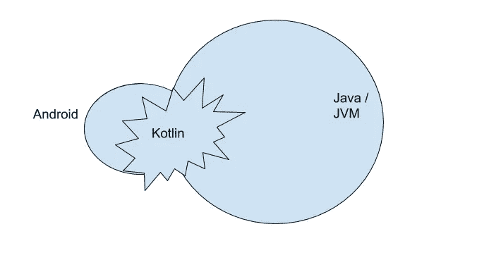
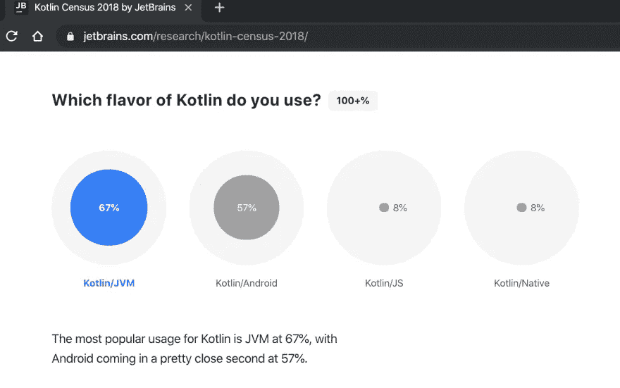

# 科特林不是机器人

> 原文：<https://blog.kotlin-academy.com/kotlin-is-not-android-c96984730c35?source=collection_archive---------1----------------------->

> *“kot Lin 为 Java 和 JVM 所做的，就像 Spring 对 J2EE 所做的”
> —Spring rod 的 Spring 创建者*

我注意到**安卓**和**科特林**越来越成为**同义词，**尤其是在 IT 招聘人员的心目中。

这是一个*非常*可以理解的 错误。他们在做不同的工作，一个好的招聘人员不需要知道我们所知道的一切，他需要做好自己的工作。

但这是错误的。

正如您在这个模式中看到的，Kotlin 在 Android 中的使用份额比在 JVM 中的大。但是由于 JVM 是一个更大的平台，做 Android 或其他东西的 Kotlin 开发者的数量大致相似。

# 在 Android 世界，Kotlin 正在取代 Java

其背景是 Android 世界正变得越来越快**首先是 Kotlin。**

这与苹果/iOS 世界有一个非常诱人的相似之处，即 **Swift** 正在取代 **Objective C.**

苹果力推 Swift。

似乎谷歌正在以完全相同的方式推动科特林。

一些早期文章甚至明确使用了这种类比:

[**“科特林，安卓之迅捷**”](https://blog.gouline.net/kotlin-the-swift-of-android-d664f8997e7f)

…但事情没那么简单。

# Kotlin 是为 Java 和 JVM 设计的，而不是为 Android 设计的

Kotlin 是由 JetBrains 创建的，不是为 Android，而是为 Java 和 JVM。

这与 Swift/iOS 有很大的不同。

对 Swift 感兴趣的程序员和对 iOS/macOS 感兴趣的程序员基本是一样的。

另一方面，Android 是一个大平台，而 Java 和 JVM 是一个更大的平台。

这很好地解释了，虽然 Kotlin 在 Android 上大受欢迎，但仍然有很多甚至更多的 Kotlin 开发者没有为 Android 编程。

来源:[https://www.jetbrains.com/research/kotlin-census-2018/](https://www.jetbrains.com/research/kotlin-census-2018/)

# Android 上的 Kotlin 完全是关于产品与市场的契合度

那么，如果 Kotlin 不是为 Android 设计的，为什么它会在 Android 上获得巨大成功呢？

很简单，这是产品与市场契合的经典例子。

JetBrains 并没有针对 Android 开发者。

Android 开发人员在几年前就非常清楚地意识到，Android 编程已经崩溃，需要改变。我在这里写到:

 [## Android 的十亿美元错误

### 你听说过十亿美元的报价吗？大概是:

blog.kotlin-academy.com](/androids-billion-dollar-mistake-s-63518cc3ba26) 

因此，Android 开发人员积极寻求新的解决方案，尝试一切，直到他们找到坚持的东西。其中之一就是科特林。事情开始于 2015 年初，当时杰克·沃顿分享了这份文件，倡导在 Square 使用科特林

所以它实际上并不像 Swift 那样是由苹果公司为 iOS 开发者发明和推动的。

> 相反，Kotlin 旨在取代 Java，Android 开发者首先发现并使用了它。
> 
> 然后 Android 框架团队决定跟随他们。

我当然很高兴他们这样做了。

它确实开启了让 Android 开发变得不那么痛苦的新希望。

这也使得信号传递变得更加容易。

这就是为什么亲爱的招聘人员，你会听到这样的消息:在 Android 中使用 Kotlin 是可以的。

但事实上，即使在宣布之前，这也是完全可以的。

# Java/JVM 世界今天处于非常相似的位置

今天，在 JVM 上使用 Kotlin 完全没问题。

只是作为一名 It 招聘人员，你可能不会被明确告知为 Kotlin 后端开发人员招聘。

我提出这个经验法则:

> ***如果说*** *Java 是解决给定问题的好办法，* ***那么*** *Kotlin 也是解决同一问题的好办法，而且可能是伟大的办法*

**更新:**这个经验法则是为了**更好地说明什么时候使用 Kotlin** 更有意义。它不是用来抨击 Java 的。

正如 Jetbrains 的 Roman Elizarov 清楚地解释的那样，Kotlin 之所以是一门伟大的语言，最重要的一个原因是 Java 正确地处理了一些重要的事情。

 [## 向 Java 致敬

### 抨击 Java 是一种流行的过去时，我也不例外，但 Java 是目前的顶级编程语言…

medium.com](https://medium.com/@elizarov/a-tribute-to-java-c184cd97db8f) 

我同意艾萨克·牛顿的观点:

> 笛卡尔所做的是很好的一步。你增加了许多方法，特别是把薄板的颜色纳入哲学考虑。如果说我看得更远，那是因为 T21 站在巨人的肩膀上。

# 用于后端编程的 Kotlin

尤其是 Kotlin 是后端开发人员的绝佳选择。

它有自己非常有趣的原生框架，比如 ktor、http4k 等等。

 [## ktorio/ktor

### Ktor 是一个用 Kotlin 快速创建 web 应用程序的框架。在…上运行嵌入式 web 服务器

github.com](https://github.com/ktorio/ktor)  [## http4k/http4k

### http4k 是一个轻量级但功能齐全的 http 工具包，用纯 Kotlin 编写，支持服务和消费…

github.com](https://github.com/http4k/http4k) 

它也是由来自春天和 Spring Boot 的大家伙推动的

Kotlin 是一个很好的解决方案，因为它利用了 Java 生态系统十年的实践经验。

特别是协程正在改变游戏规则，因为你不再需要在简单代码和非阻塞代码之间做出选择。为什么不两者都要？

# 概述

*   从开发人员开始使用一项技术到招聘人员被告知要为这项技术进行招聘之间有一个时间差
*   Android 首先成为 Kotlin，50%的 Kotlin 开发者使用 Android
*   kot Lin+Android dev 非常显眼，很难找到。如果我在寻找一个 Android 开发者，我会关注那些目前正在使用 Java 的优秀 Android 开发者。这些可以很容易地学习科特林。另一方面，学习 Android 很难。
*   请记住，50%的 Kotlin 开发人员都在做 Android 以外的事情。那些人因为做 Android 得到了很多工作机会，并对此感到厌烦。因此，如果你的公司在后端是 Kotlin-first，你可能需要做更多的营销工作。

# 单击👏说“谢谢！”并帮助他人找到这篇文章。

了解卡帕头最新的重大新闻。学院，[订阅时事通讯](https://kotlin-academy.us17.list-manage.com/subscribe?u=5d3a48e1893758cb5be5c2919&id=d2ba84960a)，[观察推特](https://twitter.com/ktdotacademy)并在媒体上关注我们。

如果你需要一个科特林工作室，看看我们如何能帮助你: [kt.academy](https://www.kt.academy/) 。

