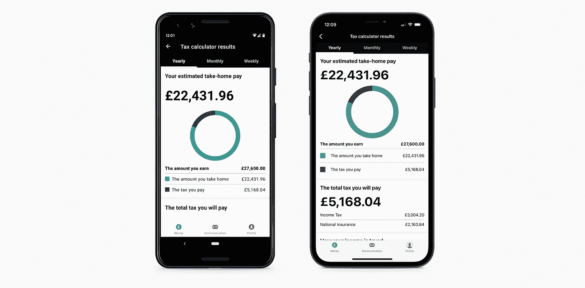

# HMRC 的科特林多平台

> 原文：<https://blog.kotlin-academy.com/kotlin-multiplatform-at-hmrc-3e5e895c2fcc?source=collection_archive---------1----------------------->

大家好，我叫 George Herbert，是 HMRC 移动应用团队的首席开发人员。HMRC 是英国的税收、支付和海关当局。该应用程序帮助用户访问他们的帮助，以保存帐户，管理他们的税收抵免，以及审查他们的个人纳税情况等功能。该团队由 iOS、Android 和后端开发人员组成。我们鼓励所有开发人员尝试团队中的其他学科，这给了我们合理的交叉技能水平。我在团队中的角色是后端微服务的首席开发人员。

## 关于 HMRC 应用程序

HMRC 的应用程序自 2012 年就已经存在，最初是一个简单的税收计算器。在 2016 年期间，该团队通过完善现有功能进行了重建，并为用户添加了登录和管理个人税务事务的能力，例如帮助他们保存账户或税收抵免。这意味着他们不必打电话给 HMRC 或填写任何表格。目前，我们每月有 50 万用户，用户平均每月回访 7 次。该应用面向个人税务用户，与同等的网络服务相比，它占个人税务领域总流量的 50%。该应用程序最受欢迎和历史最悠久的功能之一是税收计算器。这方面的计算逻辑与 web 共享。网络和移动计算器加起来每年有 570 万次访问，其中移动设备占 200 万次。

从科特林的角度来看，Android 团队一直在逐步迁移应用程序。在撰写本文时，86%的应用程序是用科特林语编写的

## Kotlin 多平台的使用

大约 18 个月前，我的技术主管召开了一次会议，讨论使用 Kotlin 多平台(KMP)和其他技术来帮助简化和整合应用程序和服务中的业务逻辑。双方商定，HMRC 移动应用团队将与凯捷合作，从 simple 开始，研究这款开源产品在应用中的应用可能性，并以此为起点。

我们希望用户界面(UI)是本地的，因为这已经建成。我们还认为，构建一个可以共享的业务逻辑核心，不管选择什么样的 UI，都可以让我们更容易地与 web 共享。

如上所述，该应用程序的主要功能之一是能够根据你的工资、支付频率和税收代码计算出你的税收和税后工资的估计值。每年更新计算器需要数天的手动测试，以确保一切按预期工作，并且必须为每个平台完成！我们认为这是一个真正需要彻底改革的领域，以帮助维护，在每个新的纳税年度增加新的税级，并减少测试工作。挑战在于支持 iOS、Android 和 web 的任何新东西。

Results screen of the tax calculator within the HMRC App for iOS and Android

我不是 Android 开发者，甚至不是 Kotlin 开发者，我的背景是 Scala 开发者。我渴望学习科特林语，这似乎是一个好机会。几周之内，tax-kalculator(看看我们在那里做了什么)诞生了:一个 Kotlin 多平台库，覆盖率达 98%，可以在 Android 和 iOS 上使用，甚至可以在 web 版本的 tax calculator 上使用。现在，添加新的纳税年度只需不到一个小时的时间，而且只需很少的人工测试，因此节省了我们数天的精力和时间。

随着时间的推移，我们已经开始向该应用程序添加其他多平台方面，例如帮助节省计算器，它将帮助预测您作为该计划的一部分可以节省的金额。展望未来，我们正在研究 KMP 更复杂的用途，这将有助于减少重复，改善跨平台的用户体验。

## 了解 KMP

当我们开始使用 KMP 时，我们作为一个团队经历了一些挑战。第一个是关于设置 Gradle 来支持平台，因为我们看到的每个例子都略有不同，我们使用的是 Gradle.kts，在查看一个例子时它甚至更稀疏。随着 KMP 越来越受欢迎，围绕有限文档或过时示例的问题变得不那么困难了。此外，作为 1.4.0 的一部分，Gradle 配置已经通过分层项目结构进行了简化，这使得它变得更加简单和直接。

The struggle when looking for KMP examples, especially for gradle.kts

我们面临的一个挑战是，如何让 iOS 框架处于可以在我们的应用程序中使用的状态，而无需在 Xcode 构建中直接链接它们。该团队的一名 iOS 开发人员发现了一个 shell 脚本，我们将其添加到了 CI 中，它创建了这个脚本并将其导出到我们的 GitHub。这个 shell 的一个例子在名为 package-ios.sh 的项目的存储库中。

最后，iOS 团队面临着在同一个 iOS 应用程序中使用多个 KMP 项目的挑战。这个问题已经在 KMP 的新版本中解决了。至于后者，我们暂时(直到 1.3.70 中添加了修复程序)将所有的 KMP 项目放在一个“超级”库中，这个库包含了 iOS 的所有 KMP 功能。

## 摘要

我的建议是，如果你想尝试 KMP，从小事做起。例如，只需编写一些纯 Kotlin 的业务逻辑，不需要特定于平台的实现，所有代码都应该在 commonMain 中。这使得最初掌握 KMP 很简单，因为你不需要使用实际的和期望的关键字。一旦你对项目和它们的结构等感到满意，并且它们在你各自的应用程序中工作，期待展开你的翅膀进入更具挑战性的 KMP(比如巩固你的网络逻辑和错误处理)。

我希望这很有趣。如果您对使用 KMP 或我们下面链接的项目有任何疑问，请随时在 Twitter ( [@georgeherby](https://twitter.com/georgeherby) )上给我发消息。

# 有用的链接

## HMRC KMP 图书馆

税务顾问

 [## hmrc/税务-审计员

### 首先创建一个 Calculator 实例，按照下面的例子传入值:默认值是…

github.com](https://github.com/hmrc/tax-kalculator/) 

帮助拯救卡勒波特

 [## hmrc/救助-kalculator

### 这将返回 CalculatorResponse 类型的对象。这提供了最终结果的标题数字…

github.com](https://github.com/hmrc/help-to-save-kalculator) 

## HMRC 应用程序

游戏商店

 [## HMRC-Google Play 上的应用

### 这是唯一一款能让你获得 HMRC 个人税务信息的应用。感觉控制着你的…

play.google.com](https://play.google.com/store/apps/details?id=uk.gov.hmrc.ptcalc&hl=en_GB) 

应用商店

 [## HMRC

### 这是唯一一款让您访问 HMRC 个人税务信息的应用程序。感觉控制着你的…

apps.apple.com](https://apps.apple.com/us/app/hmrc/id514561561) 

## **当你在这里的时候，一些额外的东西…**

最近，HMRC 应用团队开源了其 Android 和 iOS 的 UI 组件，允许任何人构建具有与 [GOV.UK 设计系统](https://design-system.service.gov.uk/)相同外观和感觉的无障碍应用。

Android 组件

 [## hmrc/Android-组件

### 使用具有 HMRC 外观的组件构建应用程序。将 Github 包存储库添加到您的顶层…

github.com](https://github.com/hmrc/android-components) 

iOS 组件

 [## hmrc/IOs-组件

### 使用具有 HMRC 外观的组件构建应用程序。该库被设置为通过 Swift 包使用…

github.com](https://github.com/hmrc/ios-components)