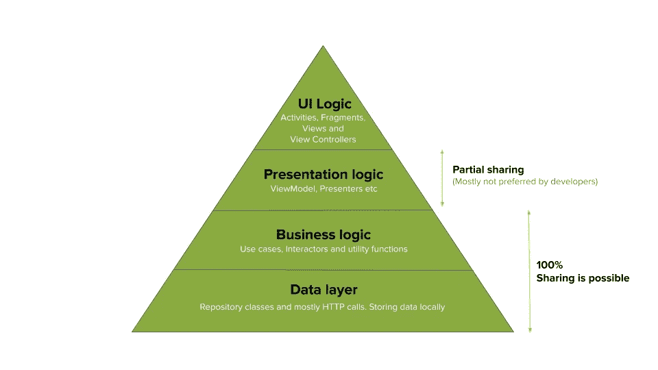
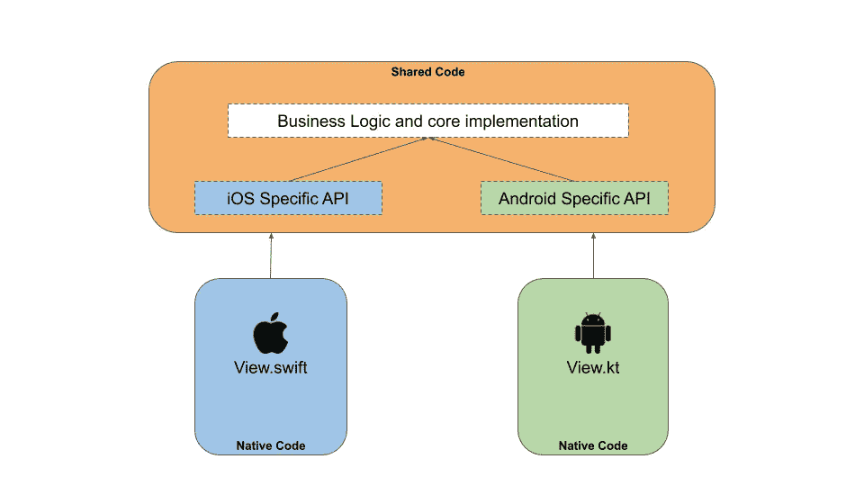
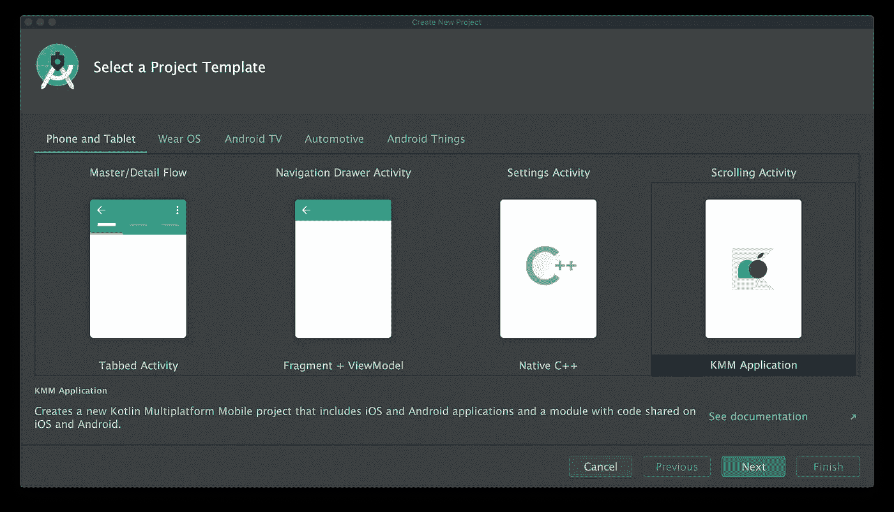
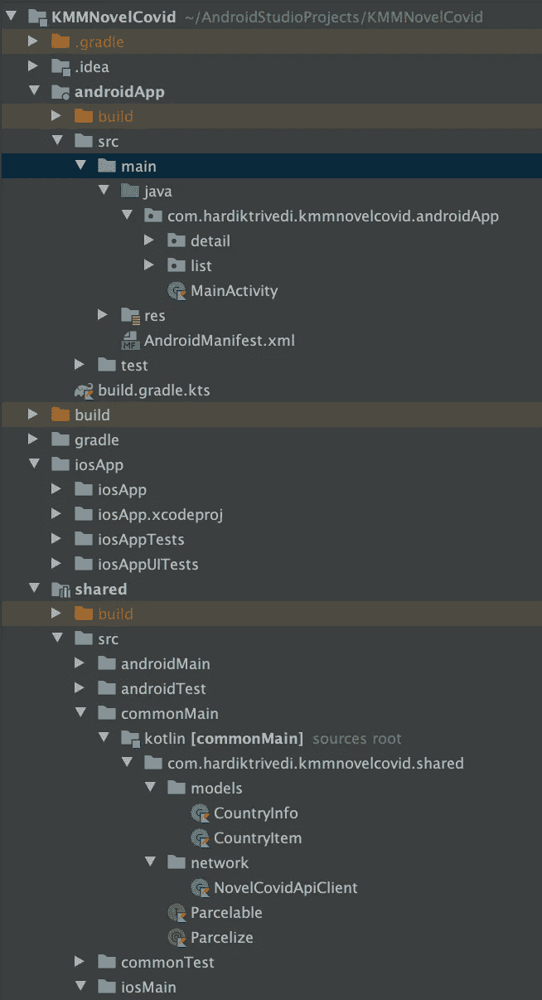
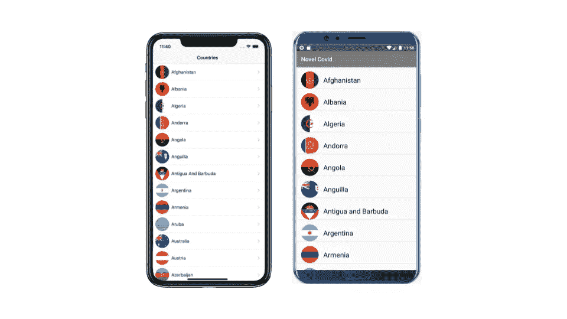
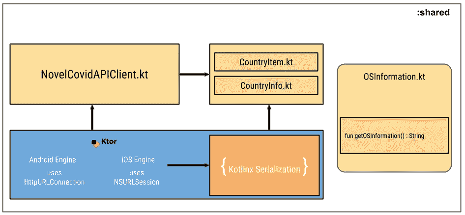
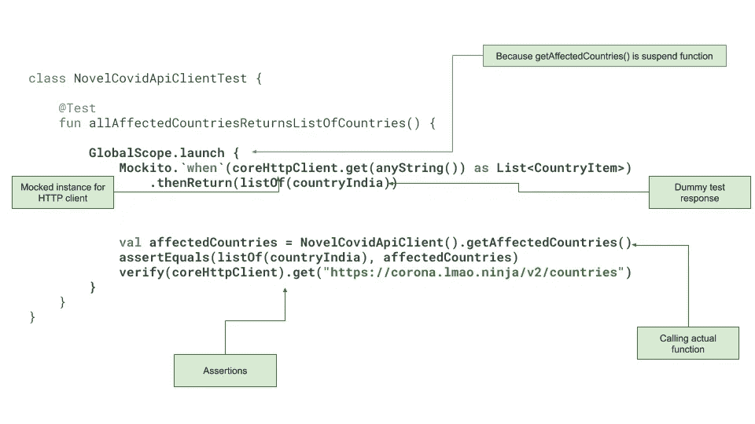
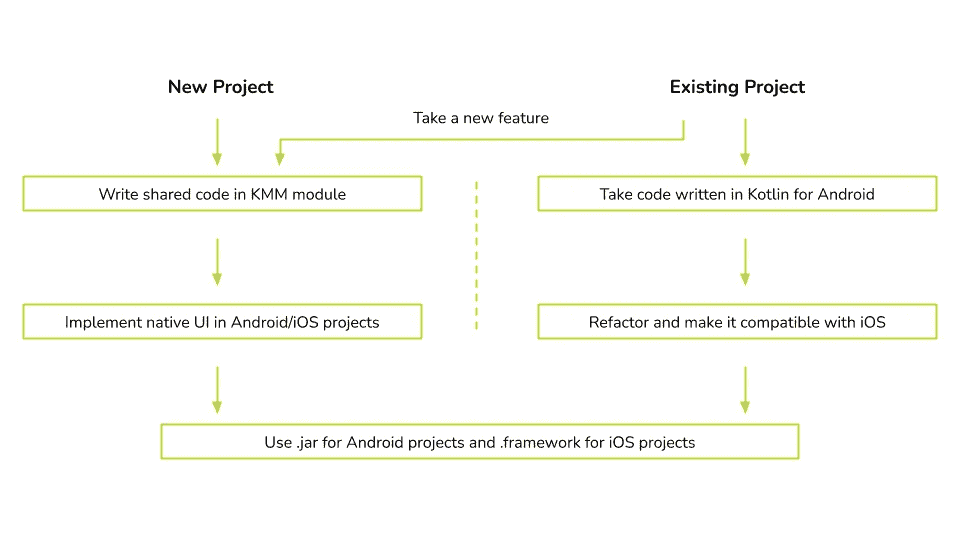
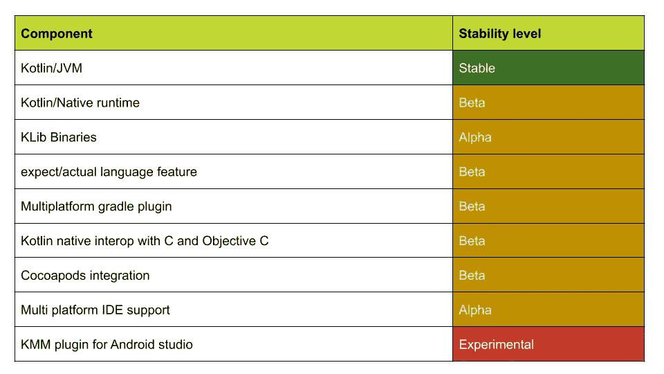

# Kotlin 多平台移动(KMM):Android 和 iOS 之间的代码共享

> 原文：<https://medium.com/globant/kotlin-multiplatform-mobile-kmm-code-sharing-between-android-and-ios-9a9af66e2655?source=collection_archive---------0----------------------->

With KMM Android and iOS can be BFF

这个博客将帮助你了解 Kotlin 多平台移动设备(又名 KMM)在 Android 和 iOS 之间共享代码的潜力。我为我们的项目评估了 KMM，现在在这里与你们分享我们的经验。

# **动机**

*   第一个动机因素是你想开发 Android 和 iOS 应用程序？但是不想把工作做两遍！
*   你简直爱干(不重复自己)校长！却不知道如何开始。
*   或者你在 iOS 方面的专业知识较少。
*   作为一名优秀的软件工程师，您也希望快速交付高质量的特性。
*   但是由于某种原因不喜欢现有的跨平台技术。

如果以上几点足够激励你，让我们来了解一下 KMM 到底是什么。

# 什么是 KMM？

*   允许您一次编写代码，并在 Android 和 iOS 等多个平台上使用。
*   它减少了测试工作。
*   维护问题较少，因为修改简单快捷。
*   它使用 Kotlin，这是一种静态类型的语言，具有本地编程语言的优势。
*   对于 Android 工程师来说，没有什么真正的变化，对于 iOS 项目，我们只是导入一个框架，就像任何基于 Swift 的框架一样。
*   如果你计划得当，iOS 的开发时间可以减少 30-40 %,他们只需要为它编写 UI 层。

# KMM 与现代应用架构

现代需要现代应用，现代应用需要现代架构。Android 和 iOS 生态系统都处于一个阶段，它们不太适合刻板的架构模式。他们要求更多。我们有缓存、维护视图状态、了解生命周期变化等概念，下图解释了应用程序的哪一层可以共享。你会有一些想法，在哪里你可以利用 KMM 的概念。

What can be shared in the modern architecture

从上图中你可以很容易地理解，在数据层上，负责网络调用和数据库查询的类可以 100%共享。KMM 在 [Ktor](https://ktor.io/) 的帮助下为你提供这种力量。Ktor 是一个框架，使您能够进行异步网络调用。还有另一个框架叫做 [SQLDelight](https://www.kotlinresources.com/library/sqldelight/) ，来自 square.io，它与 KMM 兼容，允许你编写代码来进行一些 SQLite 数据库操作。

# KMM 是如何运作的？

所以你一定在想这整个事情是怎么运作的。让我用图表来帮助你理解这一点。

How KMM works? Icons by [Freepik](https://www.flaticon.com/authors/freepik)

在上面的可视化表示中，你可以看到我是如何将 idea 分为三个主要层的，即共享代码、iOS 原生代码和 Android 原生代码。

共享代码将具有围绕网络调用和其他核心实用类型功能的业务逻辑的通用实现。

KMM 足够灵活，它允许开发者在需要的时候使用 Android 和 iOS 的特定 API 实现。它使用预期/实际机制来实现这一点。在本文中，我们将很快了解 expect/actual。

一旦构建了共享模块，共享模块的最终结果是。iOS 和的框架文件。Android 的 jar 文件。所以从逻辑上讲，你的 Android 和 iOS 项目甚至不知道共享模块是用 Kotlin 编写的，对他们来说，这只是另一种依赖。

# KMM:循序渐进指南

在这一点上，你应该对 KMM 在概念上如何适用于 Android 和 iOS 有了足够的理解。现在是以一步一步的方式实际实现整个概念的时候了。

## 1.您需要的工具

要开发任何 KMM 项目，你需要以下四种工具。

**Android Studio :** 你需要 AS 4.0 及以上版本来编写你的共享代码和 Android 应用。

**Xcode :** XCode 11.3.1 及更高版本允许您编写 iOS 应用程序，它也是编译和构建您的 iOS 应用程序所必需的

**KMM 插件:** KMM 插件允许你使用向导创建 KMM 项目，并附带定制的升级任务来构建 iOS 应用程序。

由于整个 iOS 生态系统都在 macOS 上运行，你需要 macOS 来编写和测试 iOS 应用程序。

## 2.设置 KMM 项目

从 AndroidStudio 的`Preference ->Plugins-> Marketplace`部分安装 KMM 插件。KMM 插件需要 Kotlin 1.3 及以上版本。

一旦插件安装完毕，重启 AndroidStudio，创建一个新的 Android 应用程序，并在项目模板中选择 KMM 应用程序。请看下图。

Select KMM application in project template

一旦您选择了应用程序，您需要提供更多的细节，如应用程序名称和名称为您的 Android，iOS 和共享模块。一旦你提供了这些细节，你将有你的项目创建。我将我的项目命名为 KMMNovelCovid，并在项目创建后获得了以下目录结构。

KMM Directory structure

现在一切都准备好了，可以开始编码了！

## 3.问题陈述/用例

我们采用了足够好的问题陈述来测试所有典型的 Android 和 iOS 项目范例和复杂性。

我们想要建造

*   一个简单的应用程序，显示 covid 19 受影响国家的列表。
*   将从远程服务器获取数据。
*   提取的数据将显示在用户的设备上。
*   应用程序将使用本地组件开发。
*   需要编写测试用例。

下图将帮助你想象我们正在开发的东西。

Visualize application UI

## 4.我们在分享什么？

基于以上几点，下面是我们将如何开发我们的共享模块的图表。

Shared module diagram

让我们花一些时间来理解这个图。

在最底层，我保留了`Ktor`。我们的 HTTP 客户端。幕后 Ktor 分别针对 Android 和 iOS 应用使用 HttpURLConnection 和 NSURLSession。它可以配置所有东西，如重试和超时机制，为安全起见添加证书和公共 pin。最重要的是，它支持一些基于 JSON 的 ORM 库，例如`Moshi`、`Jackson`和`Gson`。Kotlin 团队也提出了他们自己的序列化库，即`Kotlinx Serialisation`。我们的项目使用 Kotlinx 序列化。最重要的是，Ktor 还支持 Kotlin 协程。是不是很神奇？

现在网络层直接用在一个名为`NovelCovidAPIClient.kt`的类中。这个类单独负责使用核心 ktor 类连接到远程服务器，解析 json 响应并将其发送回消费者类。

`NovelCovidAPIClient.kt`可以直接访问像`CountryItem.kt` 和`CountryInfo.kt`这样的实体/数据类。这些类以类属性的形式保存 JSON 数据。

还要注意上图中的独立块。该类允许您获取每个平台的操作系统信息。我将向您展示`expect/actual`机制是如何工作的，您可以在共享模块中有一个代码，但对于您的 Android 和 iOS 应用程序却有不同的实现。

## 5.配置:共享模块

内部:共享模块您需要打开`build.gradle.kts`文件并添加一些依赖项，如下面的代码片段所示。

查看如何创建各种源集，即`commonMain`、`androidMain`和`iOSMain`。在每个源集中，我们都添加了所需的依赖项。这些依赖关系最终将用于编写网络层。

还要注意属性，即`packForXcode`。这个性质是在做一个创造现象的任务。iOS 项目的框架文件。

## 6.编写共享网络客户端

现在我们需要创建进行网络调用的共享类。我们称之为`NovelCovidApiClient`。检查代码片段，看看我们是如何用 Kotlin 编写这个类的。

在上面的代码片段中，你还可以看到我们如何配置`kotlinx.serialization` lib 来将 JSON 解析成`CountryItem`和`CountryInfo`数据类。

现在，您可以在类的存储库类型中使用它，也可以直接使用该类。将这个类作为 repository 类的一部分是一个好主意，因为它将对 Ktor 的依赖从主应用程序中分离出来。

## 7.在 Android 中使用共享网络类

要在 Android 中使用这个类，你通常可以使用`Presenter`或`ViewModel`。KMM 的美妙之处在于，它不会在平台上强加任何东西。您的`ViewModel`类通常如下所示。

这很简单。我不是一开始就说过吗？这就是为什么对于 Android 工程师来说，它不会改变任何事情。

现在这个视图模型类可以在`Fragment`或`Activity`级别使用。当您在任何视图层上使用视图模型实例时，KMM 不在范围内。UI 层完全不知道 KMM 的存在

## 8.在 iOS 中使用共享网络类

现在的你，可能不是 iOS 工程师。但是为了让您对如何在 iOS 中使用 KMM 有一个完整的了解，让我来介绍一下如何使用这个共享的网络类。就像 Android 一样，你可以直接使用这个类，也可以用某个类来包装它。检查以下要点，它会给你更多的信息，我如何在 iOS 中使用这个类。

就是这样！任务完成。

现在，让我们花些时间来了解一下，一切是如何走到一起的。

有两个因素使得这一切成为可能。KMM 插件和一个定制的`gradle`任务。参考步骤 5 中`:shared:build.gradle.kts` 文件中的`packForXcode`属性。KMM 插件在 Xcode 的构建阶段配置这个任务。所以每次你运行 Xcode 构建并触发 iOS 构建时，`packForXcode`就会运行并为你创建一个`.framework` 文件。KMM 插件也链接并嵌入这个`.framework`文件到你的 Xcode 设置中。这是免费的，不需要任何努力，因为所有这些都是由 KMM 插件自动完成的。

当`packForXcode`任务运行时，它实际上将所有 Kotlin 代码转换成 Swift 和 ObjectiveC 头文件。

# 针对每个平台的不同实现

假设我们想要获得操作系统的名称和版本。但是我们希望将这些代码保存在共享模块中。你怎么能做到这一点。KMM 允许您使用 expect 关键字定义期望。无论你用 expect 关键字定义什么，实际的实现都将由 Android 和 iOS 项目提供。

## 预期

这是一种给 KMM 编译器的指令，期望它稍后实现，并且它不会在`commonMain`源集中。稍后`androidMain`和`iOSMain`源集将提供它的实际实现。

## 实际的

`androidMain`和`iOSMain`都使用这个关键字提供了实现。原则上，这看起来就像使用 expect 关键字声明抽象，然后使用实际的关键字实现。

在下面的代码片段中，您可以看到 expect/actual 在运行。

Android Android 和 iOS 都可以调用这个函数，就像从共享模块调用任何其他函数一样。

# 测试

测试是评估 KMM 的能力和潜力的非常重要的参数。现在每个工程师都知道单元测试的重要性，并且非常重视它。当我试着写一个测试用例时，它对我来说非常自然，没有任何虚假。我也使用了流行的 Mockito 框架。我使用这个模仿库来模仿核心 http 客户端。看到下图，知道我是如何围绕 share networking 客户端编写单元测试的。

Unit testing Shared API client

# 如果我的项目不是绿地项目怎么办？

在新项目中设置和使用 KMM 非常简单。但是让我们现实一点。你不能指望在整个科特林社区，你总是会开始新的项目。如果你有现有的项目，仍然想使用 KMM。以下是 JetBrains 的 Kotlin 团队在 2020 年举行的 Kotlin 1.4 活动中分享的一些指南。

Use KMM in existing project. Reference from [Kotlin 1.4 event](https://youtu.be/PW-jkOLucjM?t=466)

# KMM 准备好生产了吗？

在了解了这个令人兴奋的框架和方法之后，我相信您已经迫不及待地开始着手这项工作了。但是等一下，不要着急。因为您可能想知道我们所了解的一切实际上是稳定的，并且可以用于生产。下表将帮助您了解稳定性。

KMM Stability guide

*   该图在 2020 年 12 月 5 日仍然有效。查看最新的[https://kotlinlang . org/docs/reference/evolution/components-stability . html](https://kotlinlang.org/docs/reference/evolution/components-stability.html)
*   科特林生态系统的组成部分有实验性的、阿尔法的、贝塔的和稳定的。
*   KMM 处于阿尔法状态。这意味着 Kotlin 团队完全致力于改进和发展这项技术，不会突然放弃它。

# 参考

我从下面的链接中找到了很多有用的信息，我相信你也会发现这些链接很有用。

*   [动手教程](https://play.kotlinlang.org/hands-on/Networking%20and%20Data%20Storage%20with%20Kotlin%20Multiplatfrom%20Mobile/01_Introduction)
*   [与现有应用集成](https://kotlinlang.org/docs/mobile/integrate-in-existing-app.html#decide-what-to-share)
*   [KMM 稳定](https://kotlinlang.org/docs/mobile/kmm-evolution.html)
*   [关于 KMM 的常见问题](https://kotlinlang.org/docs/mobile/introduce-your-team-to-kmm.html#prepare-for-questions)
*   [科特林懈对 KMM 的支持](https://kotlinlang.slack.com/?redir=%2Farchives%2FC3PQML5NU)

# 演示视频

本月早些时候，我和我的同事 Rohit Jankar 也就此发表了演讲。请检查视频

关于 KMM，我要说的就是这些。祝你代码共享愉快。😄