# 科特林/原生 iOS

> 原文：<https://medium.com/quick-code/kotlin-native-ios-8ad0a45a9b46?source=collection_archive---------2----------------------->

## 2.**创建简单的框架，描述一些 K/N 特性**

# Kotlin 中的 iOS 特定代码

我们之前配置了 K/N 项目[。](/@yuyaHorita/kotlin-native-ios-e6480299e02f)

在本章中，让我们创建一个具有 K/N 特性的简单框架。

首先，创建`iosMain/kotlin/actual.kt`目录和文件，就像我们在这里创建[一样。](/@yuyaHorita/kotlin-native-ios-e6480299e02f)

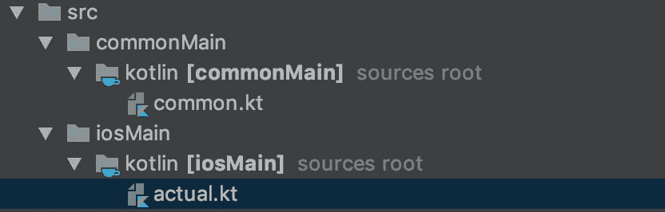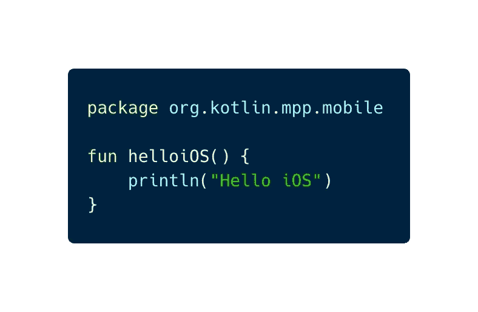

这是脚本。如果您将 Xcode 项目配置为[本章](/@yuyaHorita/kotlin-native-ios-e6480299e02f)，在 Xcode 中构建会调用构建这个共享模块。

一旦构建完成，Xcode 就会引用上面定义的函数。

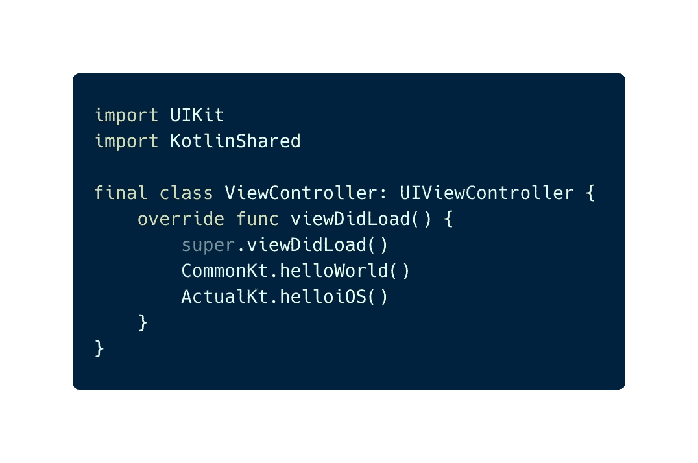

你好！！！

# 预期和实际

我们有时希望在每个平台上分离行为。我们可以使用`expect`和`actual`关键字来实现。

`helloWorld()`和`helloiOS()`不再需要了。

相反，请定义以下函数。

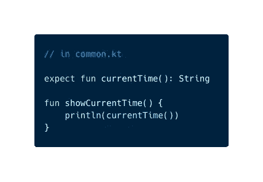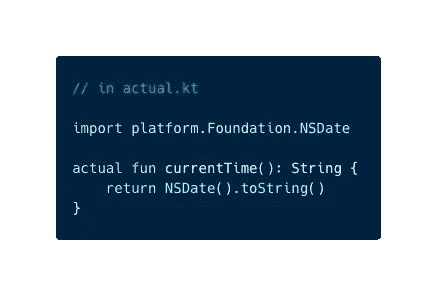

在这里，你不必键入`import platf.......`。当你在 actual.kt 中键入`NSDate`时，所需的包会被 Android Studio 自动补充。如果没有，请再次尝试 gradle sync。

在 iosMain 部分，你用了 Kotlin 的基础框架！！也可以使用其他框架。

> 目前，还不支持纯 swift 模块。可以使用其 API 用`@objc`导出到 Objective-C 的 swift 库。(2018/12/20)

我们用了`expect`和`actual`。`expect`仅在`commonMain`中可用。`expect`指定功能的行为取决于各平台模块的`actual`功能。

如果没有定义实际函数，就会出现这个错误。安全地。


让我们调用`showCurrentTime()`函数。

```
CommonKt.showCurrentTime()// on Console
**2018-12-20 08:43:54 +0000**
```

🎉 🎉

> `expect`和`actual`也可以用于上课。这意味着 **expect 注释类**被支持。这一点很重要，尤其是对于 Android 开发者来说。

`OptionalExpectation`在不需要为特定平台添加注释的情况下可用。实际示例在下面的`Expect Annotation Class`部分。

# 互操作性。

Kotlin 和 Swift 之间有互操作性，Objective-C。

## 基本接口 vs 协议

Kotlin 中定义的接口被导出到 Swift/Objective-C 协议。

```
interface Common {
    val languageName: String
}
```

在`common.kt`中定义该接口，则该接口在 Swift 中可用。比如，

```
final class SwiftCommon: Common {
    let languageName: String = "swift"
}
```

在 Swift 中，通用接口成为通用协议。仔细看看这个协议。

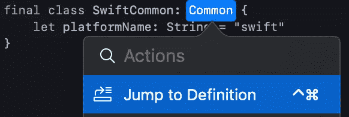

在 Xcode 中，它的`Jump to Definition`。(按住 command 键并点按会显示菜单)

然后，你会看到。

```
__attribute__((swift_name("Common")))
@protocol SharedNativeCommon
@required
@property (readonly) NSString *languageName;
@end;
```

> 事实上，Kotlin/Native 目前还没有直接与 Swift 互操作，只是通过 Objective-C。(2018/12/20)

多亏了`__attribute__`，Swift 可以将这种 Objective-C 协议称为通用协议。

## 与@Throws 和 Throws 的注释互操作性

Kotlin 注释和 Swift 关键字之间有一些互操作。其中之一是`@Throws`注释和`throws`关键字。

> 注意，`@Throws` annotation 是在 kotlin-stdlib / kotlin.native 中定义的注释类。这意味着您只能在本机模块的`actual.kt`中使用它。

所以，在`actual.kt`中定义这个类。

```
class Interop {
    @Throws
    fun sometimesErrorThrown(id: Int): String {
        if (id != 0) {
            return "OK"
        } else {
            throw Exception()
        }
    }
}
```

我们在 ViewController.swift 中称之为。带有`@Throws`注释的函数被导出为`throws`函数。

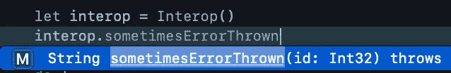

让我们抓住一些错误。

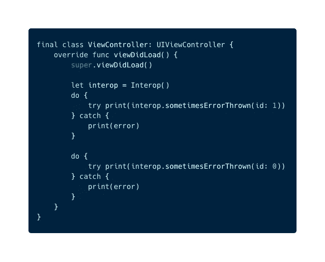

输出如下。


Catching error from @Throws function.

我们可以捕捉错误🎉。

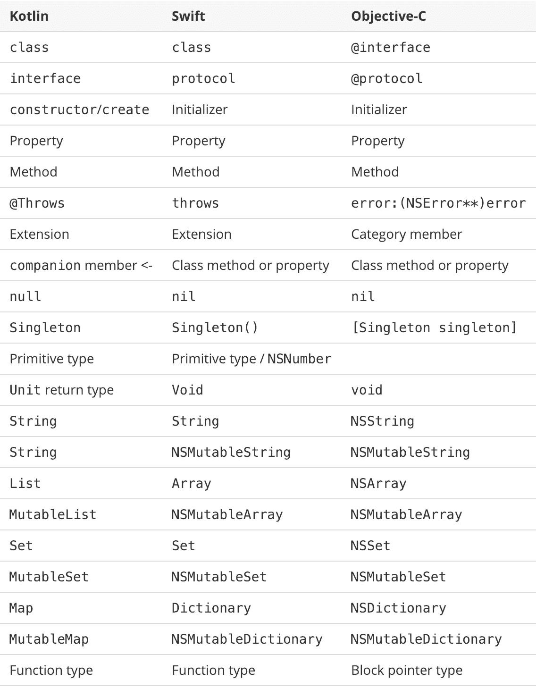

Kotlin, Swift, Objective-C mapping from [reference](https://kotlinlang.org/docs/reference/native/objc_interop.html)

还有许多其他映射。你可以在这里查看它们[。](https://kotlinlang.org/docs/reference/native/objc_interop.html)

## 期望注释类

在上一节中，我们在 actual.kt 中定义了`class Interop`。

但是，如果你想在其他平台上使用这个类呢？

这个类使用`@Throw`注释，它只在本机模块中可用，在 Android 中不可用。

在这种情况下，`expect annotation class`是有用的。

首先，将互操作类定义从`actual.kt`移到`common.kt`。*未解决的参考*错误在这一刻出现。


要解决这个问题，请定义 expect 注释类并将`@Throws`注释替换为`@NativeThrows`。

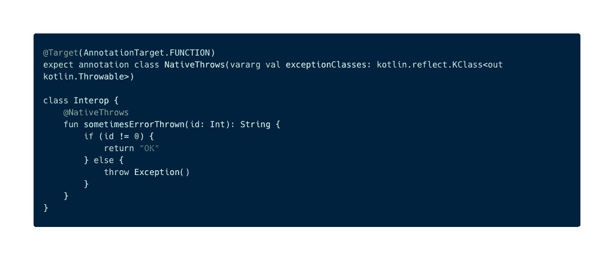

接下来，对 actual.kt 中的类使用 typealias，

```
actual typealias NativeThrows = Throws
```

NativeThrows 批注类具有带长参数的主构造函数，`vararg val expectionCla....`。这与 native Throws 批注类主构造函数的参数类型相同。

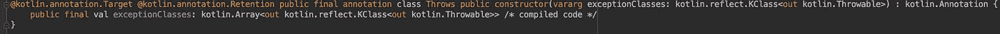

Native module’s @Throws annotation definition.

在本节中，我们只修改了 Kotlin 代码，没有修改 swift 代码。但是以前的代码工作正常。

一个很大的变化是你可以使用其他平台代码的类，比如 Android，可以共享代码🎉 🎉

我们在这里没有准备其他模块，但是如果你准备了并且不需要任何注释，使用 **OptionalExpectation** 。在这种情况下，

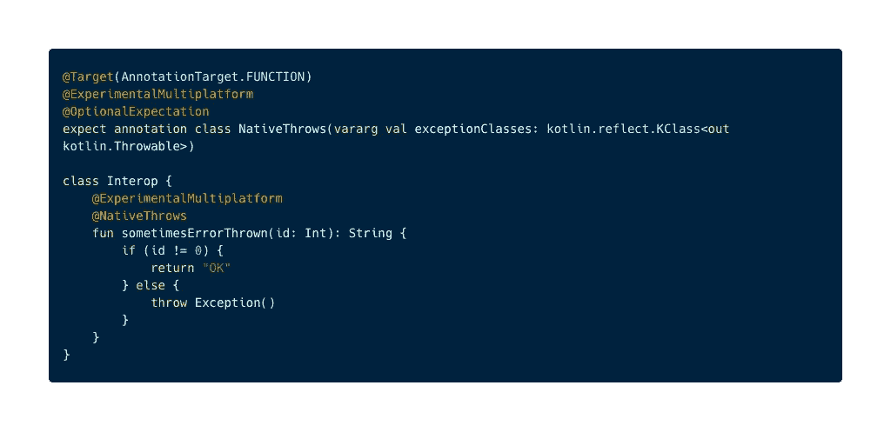

然后，就不用打`actual typealias …`了。没有它构建也会成功。

试试看。只是注释掉。

```
//actual typealias NativeThrows = Throws
```

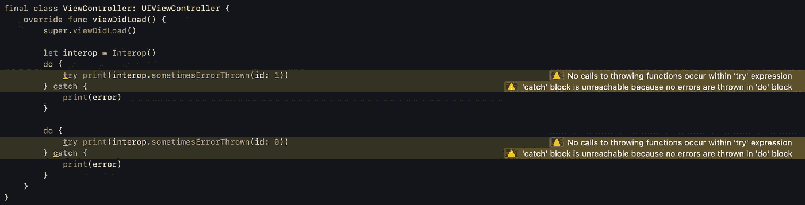

并运行 Xcode。会出现如上的一些警告，因为`sometimesErrorThrown`功能不再是`throws`功能。

这表明`@NativeThrows`注释从`@Throws`注释类型别名变为无。

Swift 无法捕捉错误，但是当参数 id == 0 时，在`sometimesErrorThrown`中执行 throw Exception()。所以，它崩溃了😱

小心点。

> **可选期望**是实验性的，所以你需要额外的`@ExperimentalMultiplatform`注释。参考:[此处](https://kotlinlang.org/api/latest/jvm/stdlib/kotlin/-optional-expectation/index.html)

# 摘要

我们开发了 Kotlin 的简单框架。我介绍了 Kotlin/Native、互操作性、expect & actual 关键字和本机特定 API 的一些特性。

我还有其他文章。请检查一下🙏谢谢你。

*   [**协程与 K/N 的不变性**](/@yuyaHorita/kotlin-native-ios-a1a73d7390fe)
*   **K/N+反应式编程+架构示例。(*即将推出* )**