# 科特林/原生 iOS

> 原文：<https://medium.com/quick-code/kotlin-native-ios-e6480299e02f?source=collection_archive---------0----------------------->

## 1.用 Gradle 在 Android Studio 上配置 K/N 项目

# 最新更新🎉

*   2019 年 3 月 1 日
*   科特林
*   Gradle 5.1.1
*   Android Studio 3.3

# 项目配置

首先从在 Android Studio，ver 3.3 上配置 K/N 项目开始。

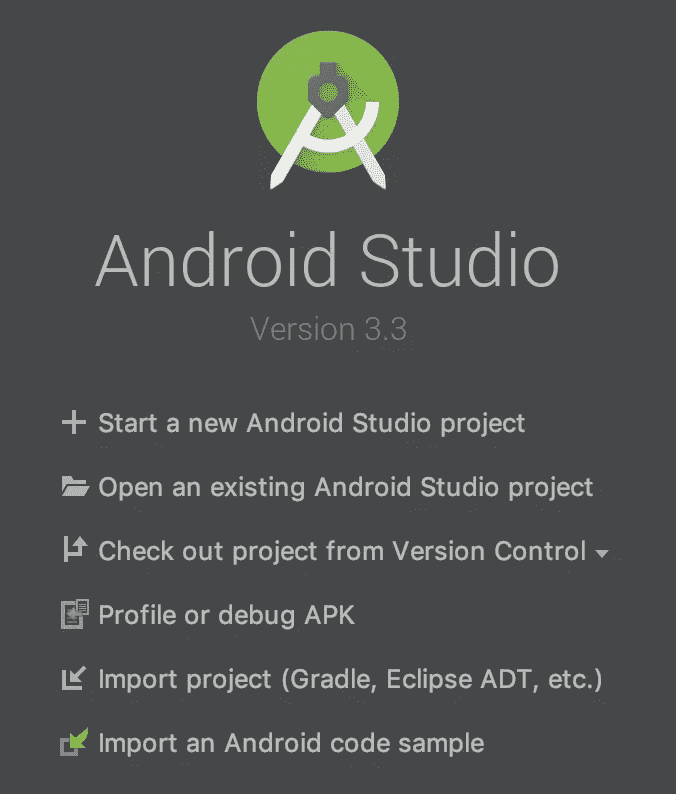

点击`Start a new Android Studio project`，选择`Empty Acticity`。

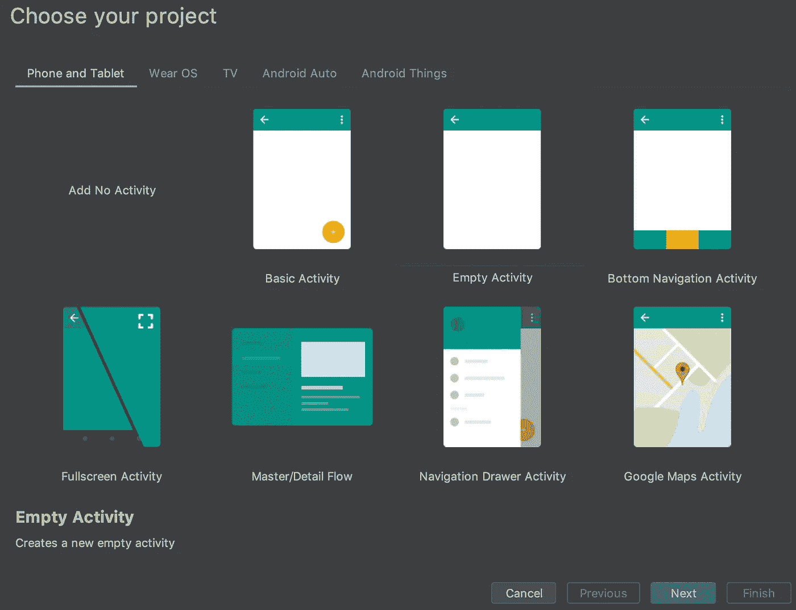

接下来，输入

*   申请名称，此处为`KotlinNativeiOS`
*   包名
*   保存位置
*   语言`Kotlin`
*   最低 API 级别，这里是 API 28，但任何东西都可以。

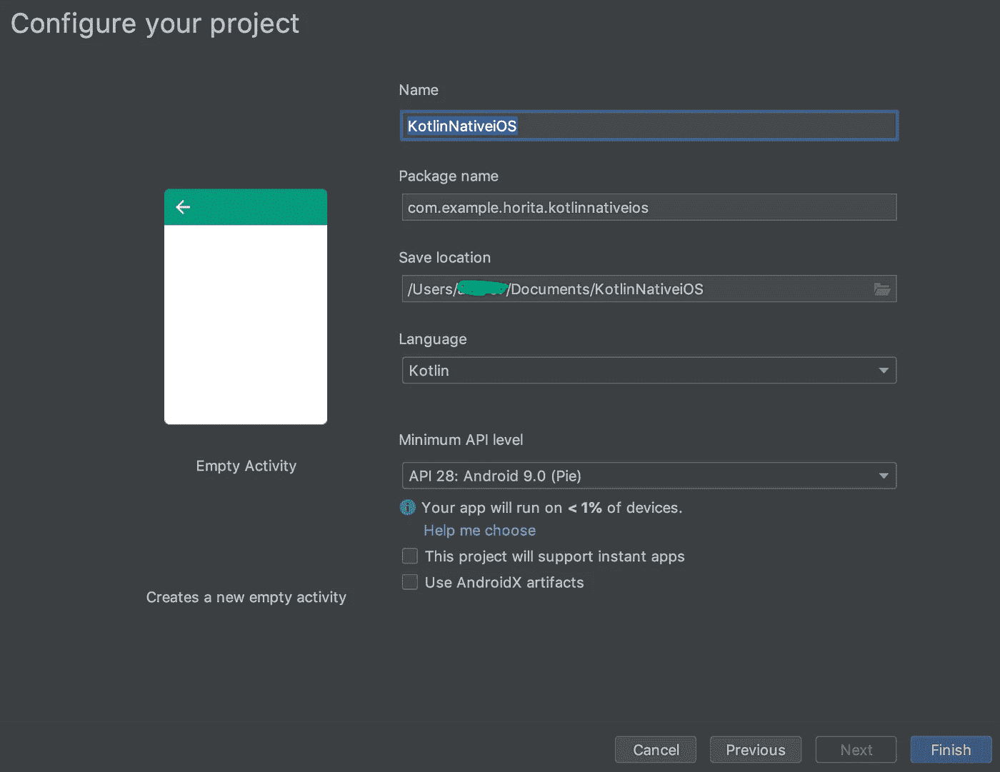

完成以上设置。

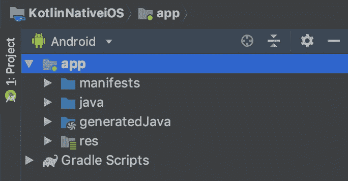

`KotlinNativeiOS`项目将自动打开，并执行梯度同步。之后，你会在左边的栏中看到上面的图片。

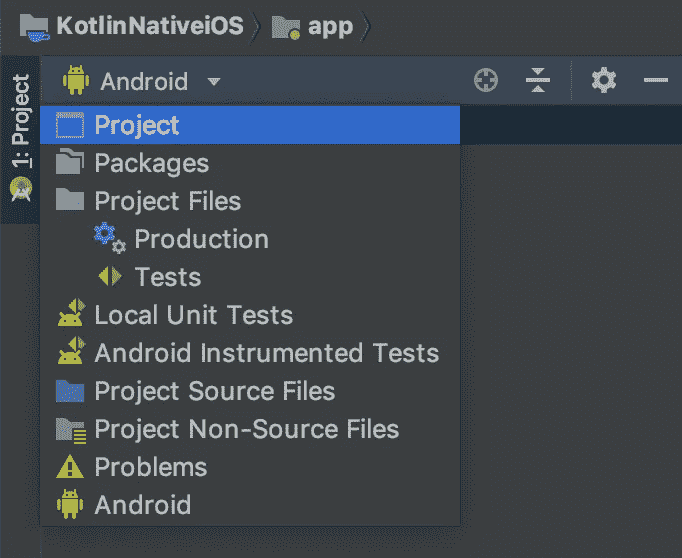

要设置目录，将此`Android`选项卡切换到`Project`选项卡。

有一些目录和文件。比如，

*   **。格雷尔/**
*   **。想法/**
*   **app/**
*   **格雷尔/**
*   **build.gradle**
*   等等..

让我们看看一些文件。

在`build.gradle`中，`ext.kotlin_version = '1.3.20'`写成了`buildscript`。这表明我们显然在使用 Kotlin 版本 1.3.20。现在，kot Lin 1 . 3 . 21 版本已经推出。我们使用它，所以如果需要的话替换变量。

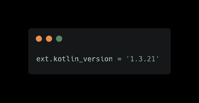

在`gradle/wrapper/gradle-wrapper.properties`中，`distributionUrl`被定义。在我的情况下，`gradle-4.10-1-all.zip`被设定。我改成下面的。

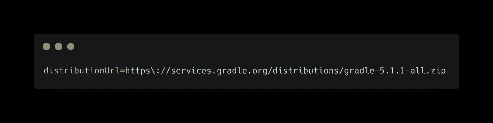

然后，`Sync Now`按钮出现在顶部。点击它，gradle sync 将开始。

# 创建共享模块

本节的目标是从 Kotlin 代码中创建一个 iOS 框架。

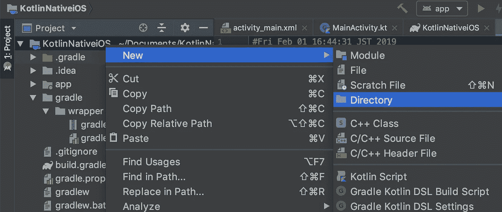

右键单击 KotlinNativeiOS 目录。并选择新建->目录。

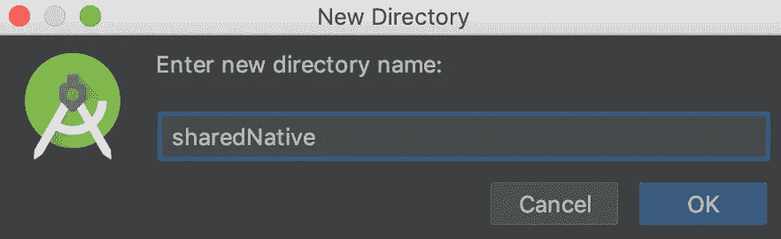

输入`sharedNative`(或者任何你喜欢的名字)。该目录将成为共享模块。

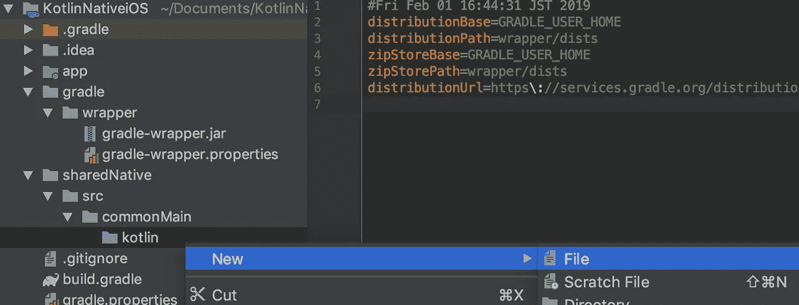

用同样的方法，创建`sharedNative/src/commonMain/kotlin`目录。

并在`kotlin`目录下创建`common.kt`文件。我们在这里定义`helloWorld`功能如下。

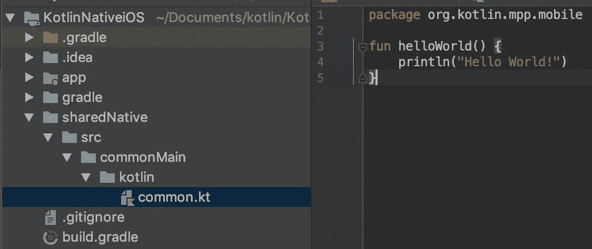

```
package org.kotlin.mpp.mobilefun helloWorld() {
    println("Hello World!")
}
```

**我们想从 Swift** 调用这个函数。让我们更新一下剧本。

首先，我们需要将新项目添加到`settings.gradle`中，只需在末尾添加下面一行。

```
include ':sharedNative'
```

接下来，创建`sharedNative/build.gradle`。

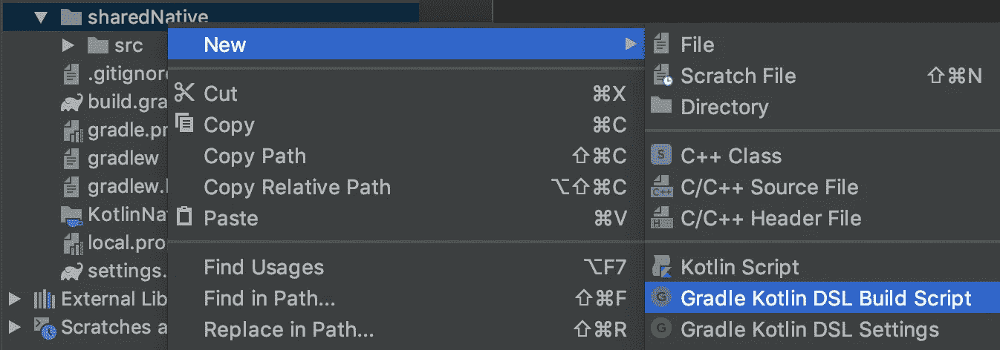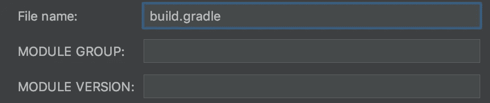

之后，写下面的代码。

```
apply plugin: 'kotlin-multiplatform'buildscript {
    ext.ios_framework_name = 'KotlinShared'
}kotlin {
    targets {
        fromPreset(presets.iosX64, 'ios') {
            binaries {
                framework("$ios_framework_name") {
                    embedBitcode('disable')
                }
            }
        }
    }
    sourceSets {
        commonMain.dependencies {
            implementation 'org.jetbrains.kotlin:kotlin-stdlib-common'
        }
    }
}
```

这是一个使用 kotlin 多平台的 gradle 脚本。预置是`iosX64`，对于 ios 模拟器，在这里。如果您想要为 ios 设备构建，请将此预设更改为`iosArm64`。定义以下变量可能会有所帮助。

```
final def iosTarget = System.getenv('SDK_NAME')?.startsWith("iphoneos") \
                              ? presets.iosArm64 : presets.iosX64
```

但是，没关系。用 presets.iosX64 前进，这里需要`Sync Now`。

我们将创建框架。

打开终端，转到 KotlinNativeiOS 根目录，或者使用 Android Studio 的终端。


我们在这里。接下来，运行以下命令。

```
./gradlew :sharedNative:build
```

gradlew 命令可以运行`:Module`的`:task`。以上将执行构建共享的本地模块。

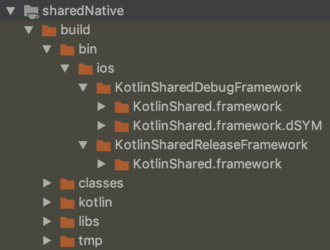

我们在`sharedNative/build/bin/ios`目录中找到了**调试**和**发布**目录。每个里面都有`.framework`。创建了框架🎉。

```
ext.ios_framework_name = 'KotlinShared'
```

我们在 build.gradle 中定义了一个上面的变量，并将其设置为`framework("$ios_framework_name")`。没有它默认的名字是`main.framework`。

你看。同一目录中的 dSYM。Crashlytics 或其他服务使用此调试符号文件来标记崩溃日志。但是它只在调试时出现。对于发布，[本期](https://github.com/JetBrains/kotlin-native/issues/2422)报道。

你还需要一块积木。这是将框架打包到 Xcode 的任务。你的 Xcode 项目直接引用上述调试或发布目录中的框架并不好，因为它有构建配置`DEBUG`或`RELEASE`。框架引用应该根据它进行更改。

接下来的任务就是为了这个。在`sharedNative/build.gradle`中定义该任务。

同理，`Sync Now`也运行这个任务。


或者，点击此按钮进行`Gradle Sync`。

```
./gradlew :sharedNative:packForXcode
```

该命令执行上面定义的`sharedNative`模块的`packForXcode`任务。

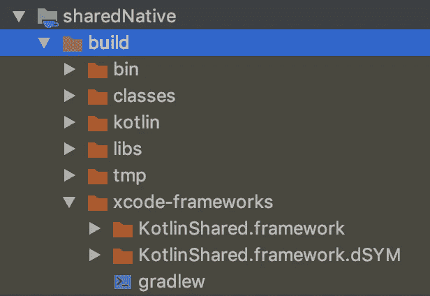

最后，`xcode-frameworks`目录和框架出现。Xcode 会引用这个框架。 [Kotlin 教程](https://blog.coursesity.com/best-kotlin-tutorials/)是 Android 初学者了解更多 Kotlin 的好方法。

# Xcode 中的 Hello World

在本节中，我们调用 sharedNative framework 的 helloWorld()函数。但是，这并不困难。简单来说，它只是框架的一个功能。它是否是从这里的科特林生成的并不重要。

所以，我想介绍一些小技巧。

*   相对路径适用于 Xcode 项目中的`xcode-frameworks`。
*   `packForXcode`在*构建阶段的`Compile Sources`之前。*

## 相对路径

首先，用这个配置创建`KotlinNativeiOS/ios`目录和 Xcode 项目。

*   单一视图应用程序
*   产品名称:SampleiOS
*   语言:Swift

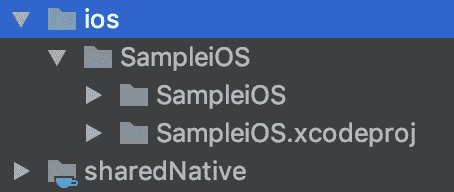

和上面一样，`.xcodeproj`路径是相对于共享目录(其中的框架)的。路径是`$SRCROOT/../../sharedNative`。使用相对路径，我们可以用环境变量配置 Xcode 设置。

K/N 生成动态框架，所以嵌入到二进制中。

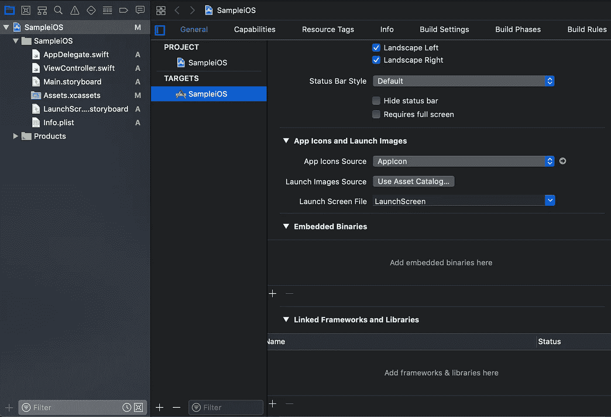

移动到 Xcode 项目的`General`标签。在`Embedded Binaries`部分，点击`+`并点击`Add Other...`。

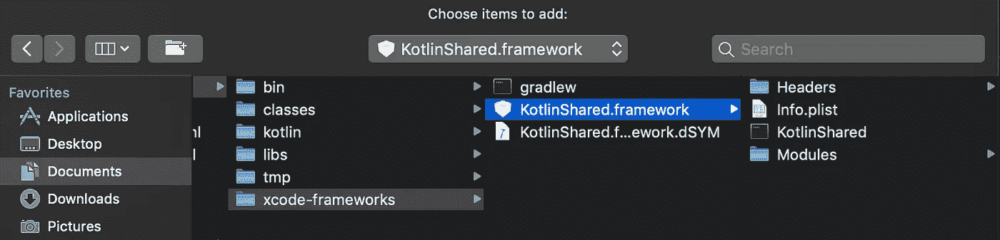

在`xcode-frameworks`目录中选择框架。

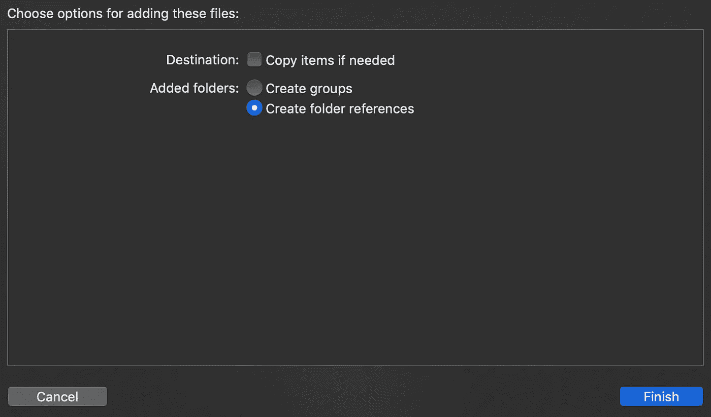

创建参考。

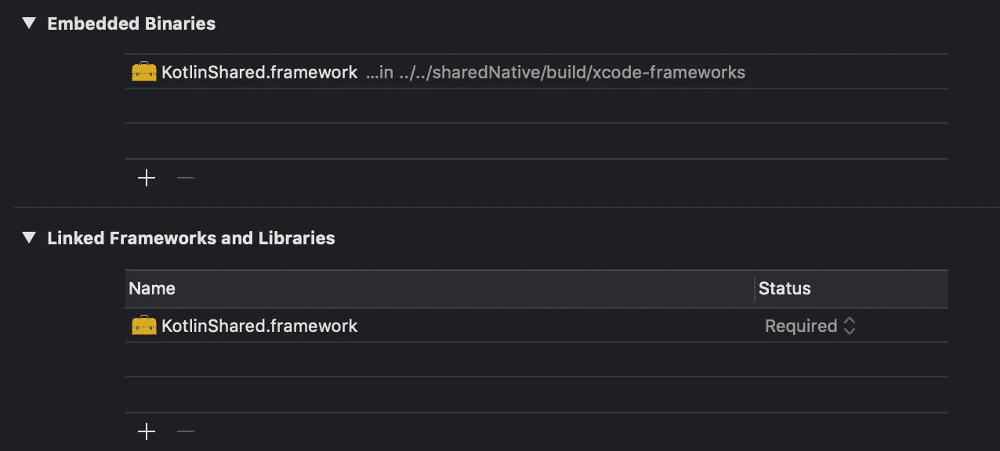

完成嵌入。

现在我们需要将这个路径添加到`Framework Search Path`中。在这里，我使用 xcconfig 文件。右击 SampleiOS 组并选择`Configuration Settings File`

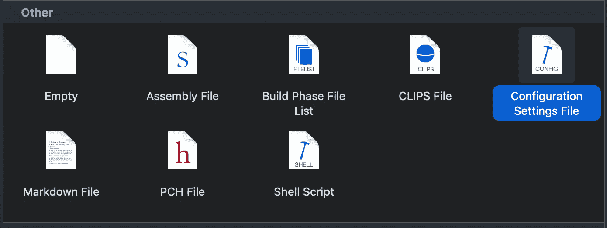

`Config.xcconfig`被创建。设置路径。

```
FRAMEWORK_SEARCH_PATHS = $(inherited) $SRCROOT/../../sharedNative/build/xcode-frameworks
```

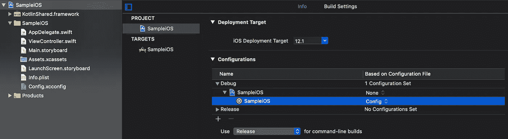

告诉您的项目使用哪个配置文件。如果您已经在构建设置中直接设置了框架搜索路径，将其替换为 **$(继承)**将反映 xcconfig 文件的设置。

现在我们可以使用共享的本地框架。在 ViewController.swift 中，

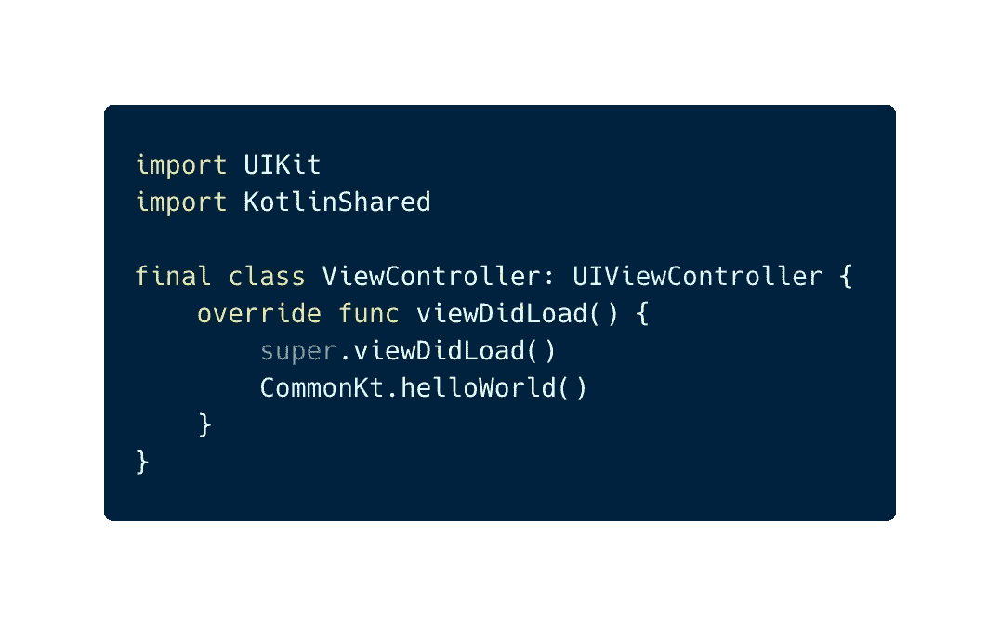

🎉 🎉 🎉

## `packForXcode`在构建阶段的`Compile Sources`之前

正如我上面提到的，`packForXcode`是一个渐变的任务，将框架转换成一个适当配置的框架，`DEBUG`或`RELEASE`。

它应该在编译源代码之前运行。

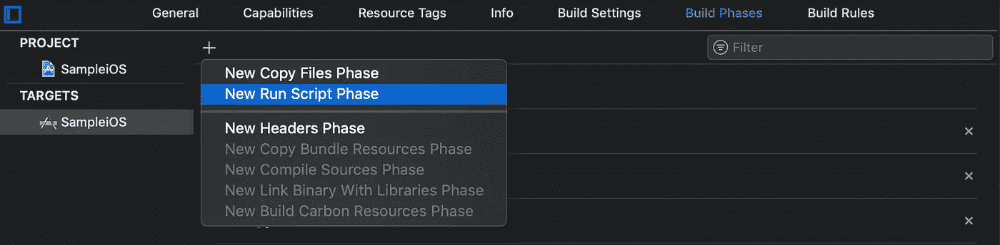

在构建阶段，添加新的运行脚本阶段。它是作为运行脚本生成的。我把它改名为**科特林/原生**。脚本如下。

```
cd $SRCROOT/../../sharedNative/build/xcode-frameworks./gradlew :sharedNative:packForXCode -PXCODE_CONFIGURATION=${CONFIGURATION}
```

**拖动将前一阶段移动到编译源阶段**。

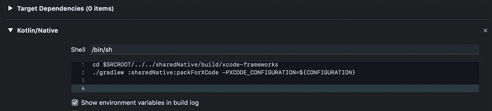

Kotlin/Native Run Script Phase

检查您是否可以成功构建。

## 摘要

我解释了如何配置 Kotlin/Native 项目，由 Android Studio 设置，由 Gradle 构建，在 Xcode 中使用框架。

现在，你可以把 Kotlin 代码转换成 Swift(严格的 Objective-C)。所以尝试你想做的任何事情，比如使用协程。

我有其他文章主要集中在实际使用。

*   [**创建简单框架，描述一些 K/N 特性。**](/@yuyaHorita/kotlin-native-ios-8ad0a45a9b46)
*   [**【协程与 K/N 的不变性】**](/@yuyaHorita/kotlin-native-ios-a1a73d7390fe)
*   **K/N+反应式编程+架构示例。(*即将推出* )**