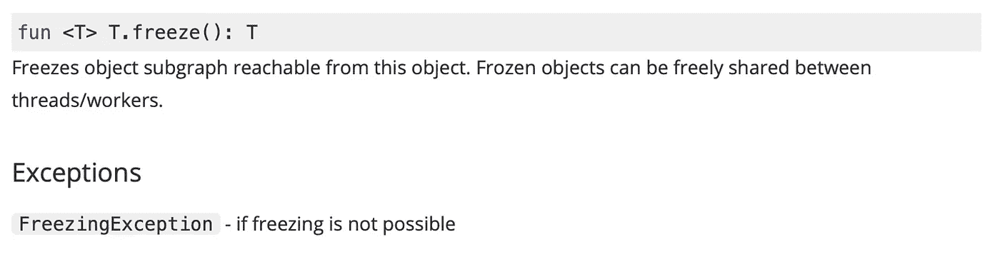
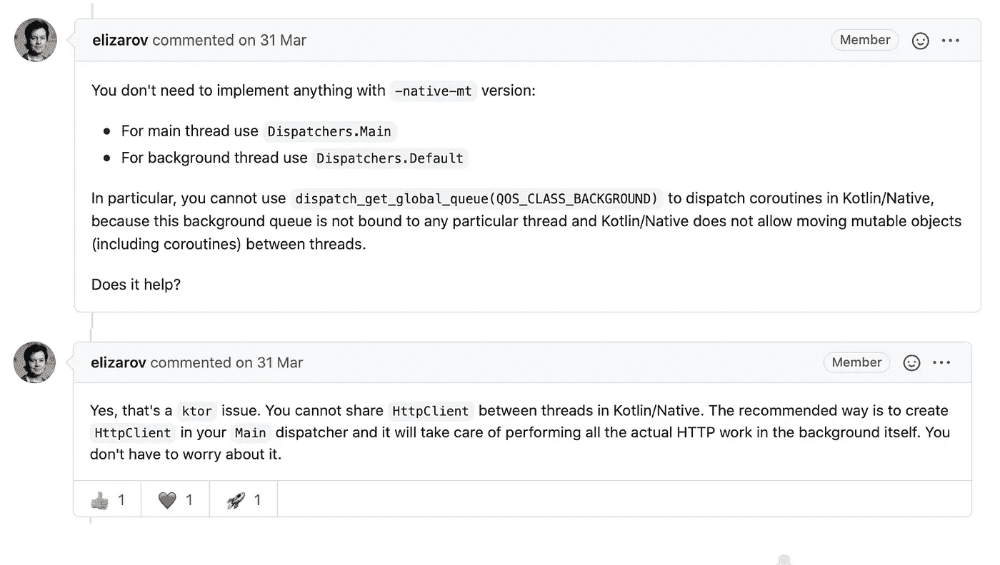

# 科特林本地人。使用协程的多线程

> 原文：<https://medium.com/google-developer-experts/kotlin-native-multithreading-with-coroutines-373663bf5a09?source=collection_archive---------0----------------------->

Kotlin Multiplatform 以及其他跨平台 SDK 的主要思想是通过编写一次代码并在不同平台之间共享来优化开发。然而，有一些细微的差别应该根据平台的具体情况来解决。一个这样的时刻是并发性。KMM SDK 为每个本机平台版本的 Kotlin 使用特定的:Kotlin/JVM、Kotlin/JS 或 Kotlin/Native。Kotlin Native 与 Kotlin JVM 确实不同，因为它取决于 iOS 平台的具体情况。大多数适用于 JVM 的默认解决方案根本不适合 Kotlin Native。在这个故事中，我们将讨论在 Kotlin 多平台中处理 iOS 和 Kotlin 本地并发的基本方法。

Kotlin 多平台提供了实现多线程的通用方法。它使用 Kotlin，所以我们可以对所有目标使用*协程*:

接下来，我们需要设置协程的作用域和上下文，以便与主线程和后台线程一起工作:

由于平台特定的代码，我们需要使用预期/实际机制来为我们使用的每个平台设置正确的版本。
对于 Android 和 iOS，我们可以使用*默认*和*主*调度程序:

JVM 和 Android 中不存在并发性问题，所以我们将只关注 Kotlin Native。在那里，我们将面对一些细微的差别。
如果我们使用默认调度程序，并在主线程和后台线程之间共享一些对象，我们可以得到 *FreezingException* :

[在 Kotlin Native 中，我们只能在线程间共享不可变的对象](https://kotlinlang.org/api/latest/jvm/stdlib/kotlin.native.concurrent/freeze.html)。**为了使一个对象或代码块不可变，我们应该使用 freeze()命令**。为了封装和隐藏所有冻结的工作，我们可以创建自己的*协程调度程序*:

使用 MainDispatcher 处理主队列是绝对正确的。但是*DISPATCH _ get _ Global _ QUEUE(DISPATCH _ QUEUE _ PRIORITY _ default . tolong()，0.toULong())* 不能用于*全局队列*，因为在 Kotlin Native 中它没有绑定到任何特定的线程。主线程和后台线程都可以使用 *MainDispatcher* :

ThreadLocal 注释用于使单例对象在线程间可共享。

使用 *MainDispatcher* 看起来真的很奇怪。但是当我们把它和像 *Ktor* 这样的库一起使用时，这是可以的。因为 Ktor 已经实现了一个异步机制。

但是如果我们不想使用 *Ktor* 呢？在这种情况下，我们如何处理后台线程？
我们可以尝试使用*全局范围*。但是不建议这样做，因为在此范围内启动的所有协程都存在潜在的泄漏和缺乏控制:

我们可以使用简单的变通方法来管理*全局范围*中的所有协程。但是仍然不安全。

我们可以在其他范围内运行我们定制的调度程序:

它会成功的。我们还可以使用特殊的 native-mt 版本的协同程序库，它允许我们使用多线程协同程序，例如 1.5.2-native-mt 。因为`kotlinx.coroutines`的主版本是单线程的，所以库几乎肯定会依赖这个版本。这种情况下我们可以面对`InvalidMutabilityException`。另一个问题是使用多线程协程时的内存泄漏。

在 Kotlin Native 中使用协程似乎很棘手。如何在没有协程的情况下处理并发，我们将在[讨论下一个故事](/p/56599ea33620)。

 [## 并发和协同程序| Kotlin

### 协程是轻量级线程，允许您编写异步非阻塞代码。科特林提供了…

kotlinlang.org](https://kotlinlang.org/docs/kmm-concurrency-and-coroutines.html)