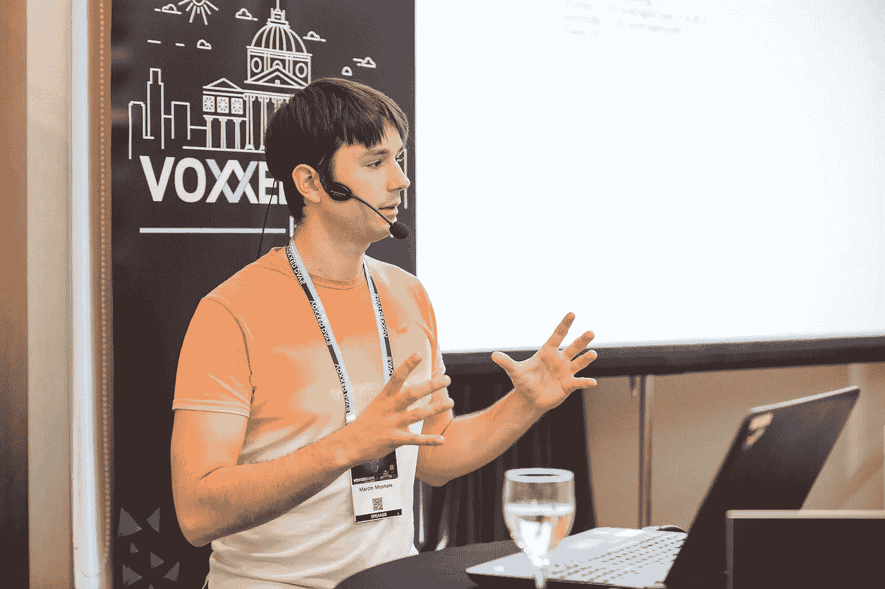

# 科特林:Android 开发的下一个层次

> 原文：<https://blog.kotlin-academy.com/kotlin-next-level-of-android-development-95bce2f43a24?source=collection_archive---------5----------------------->

为什么 Kotlin 成为 Android 开发的下一个阶段，它是如何发生的？观看来自布加勒斯特[voxed Days](https://voxxeddays.com/romania/bucharest/2018-03-22/?utm_source=Incremental+Community&utm_campaign=c8b1f88cd7-EMAIL_CAMPAIGN_2018_04_27&utm_medium=email&utm_term=0_c72a22a5cc-c8b1f88cd7-372339141&mc_cid=c8b1f88cd7&mc_eid=bfb2e0c042#media)的视频，由[Marcin moskaa](https://twitter.com/marcinmoskala)进行演示:

# 关于作者

[Marcin moska la](http://marcinmoskala.com/)([@ Marcin moskala](https://twitter.com/marcinmoskala))是一名培训师兼顾问，目前专注于给**Android 中的 Kotlin 和高级 Kotlin 工作坊** ( [填写表格](https://marcinmoskala.typeform.com/to/iwKnN9)，我们可以谈谈你的需求)。他也是一名演讲者，撰写了关于 kot Lin Android 开发的文章和书籍。

你需要 Kotlin 工作室吗？请访问我们的网站,看看我们能为您做些什么。

了解卡帕头最新的重大新闻。学院，[订阅时事通讯](https://kotlin-academy.us17.list-manage.com/subscribe?u=5d3a48e1893758cb5be5c2919&id=d2ba84960a)，[观察 Twitter](https://twitter.com/ktdotacademy) 并在媒体上关注我们。

在 Twitter 上引用我，用 [@MarcinMoskala](https://twitter.com/marcinmoskala) 。使用以下链接订阅时事通讯:

喜欢的话记得**拍**。请注意，如果您按住鼓掌按钮，您可以留下更多的掌声。