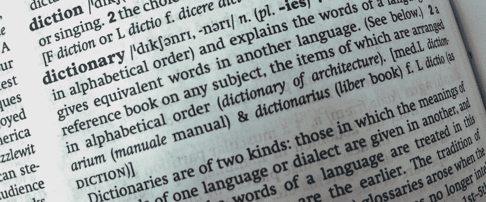

# 科特林程序员词典

> 原文：<https://blog.kotlin-academy.com/kotlin-programmer-dictionary-2cb67fff1fe2?source=collection_archive---------3----------------------->

当[我](https://twitter.com/marcinmoskala)和[伊戈尔·沃依达](https://twitter.com/igorwojda)一起写一本关于科特林的[书](https://www.packtpub.com/application-development/android-development-kotlin)时，我们面临的一大挑战是学习并完全理解专业术语。当然，人们在日常对话中使用它们，但是他们经常不关心他们是否正确使用它们。经典的例子就是[*自变量*和*参数*](https://medium.com/kotlin-academy/programmer-dictionary-parameter-vs-argument-type-parameter-vs-type-argument-b965d2cc6929) 的区别。人们可以互换使用它们，但它们代表了两种不同的东西。类似地，人们经常谈论 *lambda 表达式*，而它们实际上指的是任何*函数字面量*。我们必须提取这些词，并理解它们的确切含义。这比我想象的要难多了。这就是为什么我决定让其他人更容易，并写一系列关于我所学到的东西的文章。文章列表如下:

*   [实参对形参，类型实参对类型形参](https://medium.com/kotlin-academy/programmer-dictionary-parameter-vs-argument-type-parameter-vs-type-argument-b965d2cc6929)
*   [语句 vs 表达式](https://medium.com/kotlin-academy/kotlin-programmer-dictionary-statement-vs-expression-e6743ba1aaa0)
*   [功能 vs 方法 vs 程序](https://medium.com/kotlin-academy/kotlin-programmer-dictionary-function-vs-method-vs-procedure-c0216642ee87)
*   [字段对属性](/kotlin-programmer-dictionary-field-vs-property-30ab7ef70531)
*   [类对类型对对象](/programmer-dictionary-class-vs-type-vs-object-e6d1f74d1e2e)
*   [对象表达式 vs 对象声明](/kotlin-programmer-dictionary-object-expression-vs-object-declaration-791b183ad16b)
*   [接收器](/programmer-dictionary-receiver-b085b1620890)
*   [隐式接收者 vs 显式接收者](/programmer-dictionary-implicit-receiver-vs-explicit-receiver-da638de31f3c)
*   [分机接收机 vs 调度接收机](/programmer-dictionary-extension-receiver-vs-dispatch-receiver-cd154e57e277)
*   [接收者类型与接收者对象](/programmer-dictionary-receiver-type-vs-receiver-object-575d2705ddd9)
*   [函数类型 vs 函数文字 vs Lambda 表达式 vs 匿名函数](/kotlin-programmer-dictionary-function-type-vs-function-literal-vs-lambda-expression-vs-anonymous-edc97e8873e)
*   [高阶函数](/programmer-dictionary-higher-order-function-9cadb07df94e)
*   [带接收方的函数文字与带接收方的函数类型](/programmer-dictionary-function-literal-with-receiver-vs-function-type-with-receiver-cc21dba0f4ff)
*   [不变性 vs 协方差 vs 逆变](/kotlin-generics-variance-modifiers-36b82c7caa39)
*   [事件监听器 vs 事件处理器](/programmer-dictionary-event-listener-vs-event-handler-305c667d0e3c)
*   [代表团 vs 组成](/programmer-dictionary-delegation-vs-composition-3025d9e8ae3d)

毕竟，我们会定义很多技术术语:

*   [论证](https://medium.com/kotlin-academy/programmer-dictionary-parameter-vs-argument-type-parameter-vs-type-argument-b965d2cc6929)
*   [参数](https://medium.com/kotlin-academy/programmer-dictionary-parameter-vs-argument-type-parameter-vs-type-argument-b965d2cc6929)
*   [类型参数](https://medium.com/kotlin-academy/programmer-dictionary-parameter-vs-argument-type-parameter-vs-type-argument-b965d2cc6929)
*   [类型参数](https://medium.com/kotlin-academy/programmer-dictionary-parameter-vs-argument-type-parameter-vs-type-argument-b965d2cc6929)
*   [声明](https://medium.com/kotlin-academy/kotlin-programmer-dictionary-statement-vs-expression-e6743ba1aaa0)
*   [表情](https://medium.com/kotlin-academy/kotlin-programmer-dictionary-statement-vs-expression-e6743ba1aaa0)
*   [功能](https://medium.com/kotlin-academy/kotlin-programmer-dictionary-function-vs-method-vs-procedure-c0216642ee87)
*   [方法](https://medium.com/kotlin-academy/kotlin-programmer-dictionary-function-vs-method-vs-procedure-c0216642ee87)
*   [程序](https://medium.com/kotlin-academy/kotlin-programmer-dictionary-function-vs-method-vs-procedure-c0216642ee87)
*   [字段](/kotlin-programmer-dictionary-field-vs-property-30ab7ef70531)
*   [物业](/kotlin-programmer-dictionary-field-vs-property-30ab7ef70531)
*   [级](/programmer-dictionary-class-vs-type-vs-object-e6d1f74d1e2e)
*   [型](/programmer-dictionary-class-vs-type-vs-object-e6d1f74d1e2e)
*   [对象](/programmer-dictionary-class-vs-type-vs-object-e6d1f74d1e2e)
*   [对象声明](/kotlin-programmer-dictionary-object-expression-vs-object-declaration-791b183ad16b)
*   [对象表达式](/kotlin-programmer-dictionary-object-expression-vs-object-declaration-791b183ad16b)
*   [接收方](/programmer-dictionary-receiver-b085b1620890)
*   [隐式接收方](/programmer-dictionary-implicit-receiver-vs-explicit-receiver-da638de31f3c)
*   [显式接收方](/programmer-dictionary-implicit-receiver-vs-explicit-receiver-da638de31f3c)
*   [分机接收](/programmer-dictionary-extension-receiver-vs-dispatch-receiver-cd154e57e277)
*   [发送接收方](/programmer-dictionary-extension-receiver-vs-dispatch-receiver-cd154e57e277)
*   [接收器类型](/programmer-dictionary-receiver-type-vs-receiver-object-575d2705ddd9)
*   [接收方对象](/programmer-dictionary-receiver-type-vs-receiver-object-575d2705ddd9)
*   [功能类型](/kotlin-programmer-dictionary-function-type-vs-function-literal-vs-lambda-expression-vs-anonymous-edc97e8873e)
*   [功能文字](/kotlin-programmer-dictionary-function-type-vs-function-literal-vs-lambda-expression-vs-anonymous-edc97e8873e)
*   [Lambda 表达式](/kotlin-programmer-dictionary-function-type-vs-function-literal-vs-lambda-expression-vs-anonymous-edc97e8873e)
*   [匿名功能](/kotlin-programmer-dictionary-function-type-vs-function-literal-vs-lambda-expression-vs-anonymous-edc97e8873e)
*   [高阶函数](/programmer-dictionary-higher-order-function-9cadb07df94e)
*   [带接收器的函数文字](/programmer-dictionary-function-literal-with-receiver-vs-function-type-with-receiver-cc21dba0f4ff)
*   [带接收器的功能类型](/programmer-dictionary-function-literal-with-receiver-vs-function-type-with-receiver-cc21dba0f4ff)
*   [不变性](/kotlin-generics-variance-modifiers-36b82c7caa39)
*   [协方差](/kotlin-generics-variance-modifiers-36b82c7caa39)
*   [逆变](/kotlin-generics-variance-modifiers-36b82c7caa39)
*   [事件监听器](/programmer-dictionary-event-listener-vs-event-handler-305c667d0e3c)
*   [事件处理程序](/programmer-dictionary-event-listener-vs-event-handler-305c667d0e3c)
*   [代表团](/programmer-dictionary-delegation-vs-composition-3025d9e8ae3d)
*   [构图](/programmer-dictionary-delegation-vs-composition-3025d9e8ae3d)

这是很多术语。有了这些想法，你应该为写文章和书做好准备。对我来说，现在最大的挑战是描述它们。我将每周发布新的文章和新的描述。

如果你想保持联系，请关注这篇文章或在 Twitter 上关注我。您也可以订阅我们的时事通讯:

喜欢就鼓掌；)请记住，如果你按住鼓掌按钮，那么你可以留下更多的掌声(我相信超过 40 次)。如果你需要一些帮助，那么请记住我愿意接受咨询。

