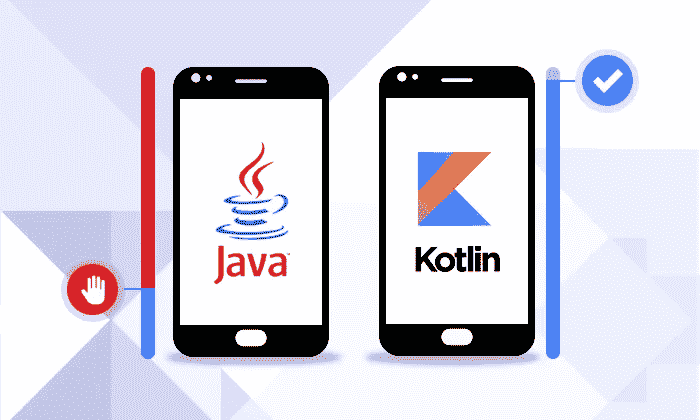

# 科特林程序员词典:字段与属性

> 原文：<https://blog.kotlin-academy.com/kotlin-programmer-dictionary-field-vs-property-30ab7ef70531?source=collection_archive---------2----------------------->



这是一个 Java **字段**的例子:

```
**public** String **name** = **"Marcin"**;
```

下面是一个 Kotlin **属性**的例子:

```
**var** *name*: String = **"Marcin"**
```

两者看起来很像，但这是两个不同的概念。上述 Kotlin **属性**的直接 Java 等效项如下:

```
**private** String **name** = **"Marcin"**;**public** String getName() {
    **return name**;
}**public void** setName(String name) {
    **this**.**name** = name;
}
```

Kotlin **属性**的默认实现包括**字段**和访问器(getter 用于`val`，getter 和 setter 用于`var`)。由于这一点，我们总是可以用自定义的访问器来替换默认的实现。例如，如果我们只想接受非空值，那么我们可以定义下面的 setter:

```
**var** *name*: String = **"Marcin"
    set**(value) {
        **if** (value.*isNotBlank*())
            **field** = value
    }*name* = **"Marcin"** *name* = **""** *print*(*name*) *// Prints: Marcin*
```

如果我们想确保返回的属性值是大写的，我们可以定义一个自定义的 getter 来大写它:

```
**var** *name*: String = **"Marcin"
    get**() = **field**.*capitalize*()*name* = **"marcin"** *print*(*name*) *// Prints: Marcin*
```

关于**属性**的关键事实是它们实际上是由它们的访问器定义的。一个**属性**根本不需要包含任何字段。当我们定义不使用任何**字段**的自定义访问器时，则不会生成**字段**:

```
**var** *name*: String **get**() = **"Marcin"**
```

这就是为什么我们可以使用*属性委托*。请参见下面的属性委托示例:

```
**var** name: String **by** NameDelegate()
```

上面的代码被编译成以下实现:

```
**val** name$delegate = NameDelegate()
**var** name: String
    get() = name$delegate.getValue(this, this::name)
    set(value) { name$delegate.setValue(this, this::name, value) }
```

此外，虽然属性是由其访问器定义的，但我们可以在接口中指定它:

```
**interface** Person {
    **val** name: String
}
```

这样的声明意味着在实现接口`Person`的[类](/programmer-dictionary-class-vs-type-vs-object-e6d1f74d1e2e)中必须定义一个 getter。

你可以清楚地看到，Kotlin **属性**比 Java **字段**给了开发者更大的可能性。然而，它们看起来几乎一样，Kotlin 属性可以像 Java 字段一样使用。这是一个很好的例子，Kotlin 如何将复杂性隐藏在地毯下，并为我们提供了可能性，即使一些开发人员仍然没有意识到这一点。

这篇帖子是[科特林程序员词典](https://medium.com/kotlin-academy/kotlin-programmer-dictionary-2cb67fff1fe2)的第四部分。要了解最新的新部件，只需关注此媒体或[在 Twitter 上观察我](https://twitter.com/marcinmoskala)。

如果你需要一些帮助，那么请记住[我愿意接受咨询](https://medium.com/@marcinmoskala/ive-just-opened-up-for-online-consultations-640349aaba55)。

喜欢的话记得**拍**。请注意，如果您按住鼓掌按钮，您可以留下更多的掌声。

[](http://eepurl.com/diMmGv)

以下是《科特林程序员词典》的其他部分:

*   [形参 vs 实参，类型形参 vs 类型实参](https://medium.com/kotlin-academy/programmer-dictionary-parameter-vs-argument-type-parameter-vs-type-argument-b965d2cc6929)
*   [语句 vs 表情](https://medium.com/kotlin-academy/kotlin-programmer-dictionary-statement-vs-expression-e6743ba1aaa0)
*   [函数 vs 方法 vs 过程](https://medium.com/kotlin-academy/kotlin-programmer-dictionary-function-vs-method-vs-procedure-c0216642ee87)
*   [类 vs 类型 vs 对象](/programmer-dictionary-class-vs-type-vs-object-e6d1f74d1e2e)
*   [对象表达式 vs 对象声明](/kotlin-programmer-dictionary-object-expression-vs-object-declaration-791b183ad16b)
*   [接收器](/programmer-dictionary-receiver-b085b1620890)
*   [隐式接收者 vs 显式接收者](/programmer-dictionary-implicit-receiver-vs-explicit-receiver-da638de31f3c)
*   [分机接收机 vs 调度接收机](/programmer-dictionary-extension-receiver-vs-dispatch-receiver-cd154e57e277)
*   [接收方类型与接收方对象](/programmer-dictionary-receiver-type-vs-receiver-object-575d2705ddd9)
*   [函数类型 vs 函数字面 vs Lambda 表达式 vs 匿名函数](/kotlin-programmer-dictionary-function-type-vs-function-literal-vs-lambda-expression-vs-anonymous-edc97e8873e)
*   [高阶函数](/programmer-dictionary-higher-order-function-9cadb07df94e)
*   [带接收方的函数文字与带接收方的函数类型](/programmer-dictionary-function-literal-with-receiver-vs-function-type-with-receiver-cc21dba0f4ff)
*   [不变性 vs 协方差 vs 逆变](/kotlin-generics-variance-modifiers-36b82c7caa39)
*   [事件监听器 vs 事件处理器](/programmer-dictionary-event-listener-vs-event-handler-305c667d0e3c)
*   [代表团 vs 组合](/programmer-dictionary-delegation-vs-composition-3025d9e8ae3d)

