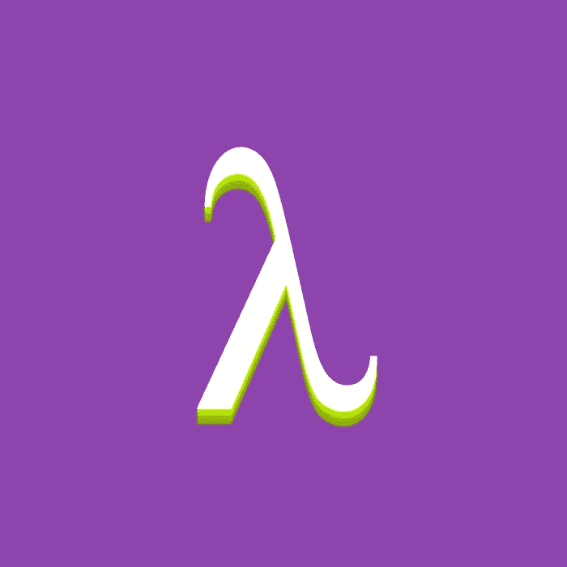

# Kotlin 程序员词典:函数类型 vs 函数文字 vs Lambda 表达式 vs 匿名函数

> 原文：<https://blog.kotlin-academy.com/kotlin-programmer-dictionary-function-type-vs-function-literal-vs-lambda-expression-vs-anonymous-edc97e8873e?source=collection_archive---------0----------------------->



Yes, this article is introducing terms that are connected to functional programming in Kotlin

在科特林，职能是*一等公民*。这意味着函数可以赋给变量，作为参数传递或者从另一个函数返回。虽然 Kotlin 是静态类型的，但要实现这一点，函数需要有一个类型。它存在并且被称为**函数类型**。这里有几个例子:

*   `()->Unit`—不返回任何有用信息(`Unit`)且不带参数的函数类型。
*   `(Int)->Int` —返回`Int`并接受类型`Int`的单参数的函数类型。
*   `()->()->Unit` —返回另一个不返回任何有用信息的函数的函数类型(`Unit`)。两个函数都没有参数。

**函数类型**只是一个接口的语法糖，但是接口不能显式使用。然而，我们可以像使用接口一样使用**函数类型**，包括将它们用作[类型参数](https://medium.com/kotlin-academy/programmer-dictionary-parameter-vs-argument-type-parameter-vs-type-argument-b965d2cc6929)或实现它们:

```
**class** MyFunction: ()->Unit {

    **override fun** invoke() {
        *println*(**"I am called"**)
    }
}

**fun** main(args: Array<String>) {
    **val** function = MyFunction()
    function() *// Prints: I am called* }
```

我们还可以使用它们来键入局部变量、[属性](/kotlin-programmer-dictionary-field-vs-property-30ab7ef70531)或[参数](https://medium.com/kotlin-academy/programmer-dictionary-parameter-vs-argument-type-parameter-vs-type-argument-b965d2cc6929):

```
val greet: ()->Unit
val square: (Int)->Int
val producePrinter: ()->()->Unit
```

以上变量都不包含任何值。让我们指定一些。提供函数的最简单方法是使用引用实际函数的**函数引用**。这是它的使用方法:

```
fun greetFunction() {
    println("Hello")
}val greet = ::greetFunction
```

函数引用就是反射的一个例子。它返回对该函数的引用，该函数还实现了一个表示**函数类型**的接口。这就是为什么它可以这样使用。

[](https://leanpub.com/effectivekotlin/c/3YYtCtqCC6a4)

提供函数的另一种方法是使用**函数字面量**。一般来说，编程中的**文字**是一种语法糖，用于表示该语言认为特别重要的某些类型的值。因此**函数文字**是一种特殊的符号，用于简化函数的定义。Kotlin 中有两种类型的**函数文字**:

*   **λ表达式**
*   **匿名功能**

**Lambda 表达式**是定义函数的一种简称。让我们用它来填充上面的变量:

```
val greet: ()->Unit = { println("Hello") }
val square: (Int)->Int = { x -> x * x }
val producePrinter: ()->()->Unit = { { println("I am printing") } }// Usage
greet() // Prints: Hello
println(square(2)) // Prints: 4
producePrinter()() // Prints: I am printing
```

请注意，`square`中的参数类型是从[属性](/kotlin-programmer-dictionary-field-vs-property-30ab7ef70531)类型中推断出来的。我们可以改为显式地键入它，然后可以从 lambda 表达式中推断出属性类型。类似地，在`greet`和`producePrinter`中缺少论证就足以推断出财产类型:

```
val greet = { println("Hello") }
val square = { x: Int -> x * x }
val producePrinter = { { println("I am printing") } }
```

**匿名函数**是定义函数的另一种方法。让我们用它来填充变量:

```
val greet: ()->Unit = fun() { println("Hello") }
val square: (Int)->Int = fun(x) = x * x
val producePrinter: ()->()->Unit = fun() = fun() { println("I am printing") }
```

可以类似地推断属性类型:

```
val greet = fun() { println("Hello") }
val square = fun(x: Int) = x * x
val producePrinter = fun() = fun() { println("I am printing") }
```

正如我们所见， **lambda 表达式**和**匿名函数**非常相似。为什么要区分？一般来说，最大的区别是**匿名函数**更加显式。当我们使用它们的时候就更清楚了，返回值需要被明确地指定。 **Lambda 表达式**返回其主体或`Unit`中最后一条语句的值。无标签退货在这里不起作用:

```
val getMessage = { response: Response ->
    if(response.code !in 200..299) {
        return "Error" // Error! Not allowed
    }
    response.message
}
```

我们必须使用带标签的 return 在最后一个语句之前完成λ表达式:

```
**val** *getMessage* = lambda@ **{** response: Response **->
    if**(response.*code* **!in** 200..299) {
        **return**@lambda **"Error"**}
    response.*message* **}**
```

[](https://learningdriven.fun/)

**匿名函数**的行为类似于普通函数，返回类型和返回语句都需要显式:

```
**val** *getMessage* = **fun**(response: Response): String {
    **if**(response.*code* **!in** 200..299) {
        **return "Error"** *// Returns from getMessage* }
    **return** response.*message* }
```

事实上，这些符号可以互换使用，但是当我们需要不止一次地使用 return 时，最好使用匿名函数。对于只有一个表达式的小函数，应该首选 Lambda 表达式。虽然有些情况下使用匿名函数会更好。我们都知道常见的困惑:

```
fun greet() = { println("Hello") }greet() // What does it print?
```

回答是“没有，因为`greet`返回函数而不是打印任何东西”。现在请注意，如果用户使用**匿名函数**而不是 **lambda 表达式**，答案将是多么明显:

```
fun greet() = fun() { println("Hello") }
```

一般来说，匿名函数更好，因为它更显式。类似地，当我们想要强调最后一个语句是返回类型时，我们应该使用匿名函数。在这些情况下，我们更喜欢匿名函数给我们的显式方式。

本帖是[科特林程序员词典](https://medium.com/kotlin-academy/kotlin-programmer-dictionary-2cb67fff1fe2)的第十一部分。要了解最新的新部件，只需关注这个媒体或[在 Twitter 上观察我](https://twitter.com/marcinmoskala)。如果你需要帮助，记得[我随时欢迎咨询](https://medium.com/@marcinmoskala/ive-just-opened-up-for-online-consultations-640349aaba55)。

喜欢的话记得**拍**。请注意，如果您按住鼓掌按钮，您可以留下更多的掌声。

[](http://eepurl.com/diMmGv)

以下是《科特林程序员词典》的其他部分:

*   [形参 vs 实参，类型形参 vs 类型实参](https://medium.com/kotlin-academy/programmer-dictionary-parameter-vs-argument-type-parameter-vs-type-argument-b965d2cc6929)
*   [语句 vs 表达式](https://medium.com/kotlin-academy/kotlin-programmer-dictionary-statement-vs-expression-e6743ba1aaa0)
*   [功能 vs 方法 vs 程序](https://medium.com/kotlin-academy/kotlin-programmer-dictionary-function-vs-method-vs-procedure-c0216642ee87)
*   [属性对字段](/kotlin-programmer-dictionary-field-vs-property-30ab7ef70531)
*   [类对类型对对象](/programmer-dictionary-class-vs-type-vs-object-e6d1f74d1e2e)
*   [对象表达式 vs 对象声明](/kotlin-programmer-dictionary-object-expression-vs-object-declaration-791b183ad16b)
*   [接收器](/programmer-dictionary-receiver-b085b1620890)
*   [隐式接收者 vs 显式接收者](/programmer-dictionary-implicit-receiver-vs-explicit-receiver-da638de31f3c)
*   [分机接收机 vs 调度接收机](/programmer-dictionary-extension-receiver-vs-dispatch-receiver-cd154e57e277)
*   [接收器类型与接收器对象](/programmer-dictionary-receiver-type-vs-receiver-object-575d2705ddd9)
*   [高阶函数](/programmer-dictionary-higher-order-function-9cadb07df94e)
*   [带接收方的函数文字与带接收方的函数类型](/programmer-dictionary-function-literal-with-receiver-vs-function-type-with-receiver-cc21dba0f4ff)
*   [不变性 vs 协方差 vs 方差](/kotlin-generics-variance-modifiers-36b82c7caa39)
*   [事件监听器 vs 事件处理器](/programmer-dictionary-event-listener-vs-event-handler-305c667d0e3c)
*   [代表团 vs 组合](/programmer-dictionary-delegation-vs-composition-3025d9e8ae3d)

[](https://kt.academy/workshop)