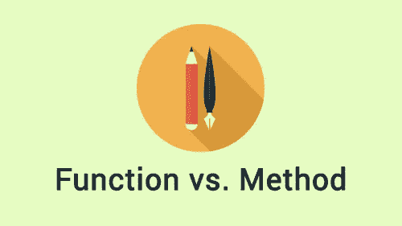

# 科特林程序员词典:函数 vs 方法 vs 过程

> 原文：<https://blog.kotlin-academy.com/kotlin-programmer-dictionary-function-vs-method-vs-procedure-c0216642ee87?source=collection_archive---------1----------------------->

**函数**和**方法**是两个经常混淆的词。虽然每个**方法都是函数**，**但并不是每个函数都是方法**。还有一个词被错误地互换使用:一个**程序**。让我们讨论一下所有这些术语之间的区别。

# 函数与过程

在旧的编程语言中，**函数**和**过程**之间的区别很重要。例如，在 Pascal **中，函数**和**过程**是使用不同的关键字定义的。这两个概念之间的形式差异如下:

> **函数**返回值，而**过程**不返回值。

如果它们如此相似，那么为什么它们会被区分开来呢？真正的原因是，函数式和过程式程序设计的良好实践声称，过程应该只用于调用一组操作，函数应该只用于计算返回值(它们应该没有副作用)。这种良好的设计实践被严重滥用。开发者使用过程来修改由参数(例如`sort(list)`)和函数提供的对象，以调用一些操作并返回一些通知结果的数据(例如`int success = saveData(data)`)。这样就消除了**功能**和**程序**之间的区别。

我们还能定义一个**程序**吗？我们可以用 Java 来实现，因为每个不指定 return [type](/programmer-dictionary-class-vs-type-vs-object-e6d1f74d1e2e) 的方法都是一个过程:

```
voidprintUser(User user) {
    System.*out*.println(user);
}
```

在 Kotlin 中没有过程，因为每个函数至少返回`Unit`对象。注意，`printUser`过程的直接模拟是 Kotlin 中的一个函数，因为它返回`Unit`:

```
fun printUser(user: User) {
    println(user)
}val result = printUser(user)
print(result is Unit) // Prints: true
```

有些人称这种功能为“过程”,我认为这没有什么不对。但是你可以放心地忘记 Kotlin 中的这个词，你将正式正确。这很好，因为你使用的行业术语越少，普通观众就越容易理解。



# 函数与方法

另一个很大的困惑是**函数**和**方法**之间。区别如下:

> **方法**是与[对象](/programmer-dictionary-class-vs-type-vs-object-e6d1f74d1e2e)关联的**函数**。

函数是一个更通用的术语，**所有的方法也是函数**。那么什么是**方法**？肯定所有成员函数和成员属性访问器都是**方法**:

```
class A {
   fun someMethod() {}
}
```

> 在 OOP 中，[类](/programmer-dictionary-class-vs-type-vs-object-e6d1f74d1e2e)拥有代表其数据和行为的**成员**。Kotlin 类的成员要么是方法，要么是属性。这就是为什么在类中定义的属性被称为**成员属性**，而不是与任何类都没有关联的**顶级属性**。

Java 静态方法呢？这是值得商榷的。一方面，Java 术语通常将它们命名为**方法**。另一方面，许多大学权威人士认为它们不是，因为它们与类相关，而不是与对象相关。肯定所有的顶级函数都是**而不是方法**。

更有问题的是*伴随对象*和*对象声明*的函数。*伴随对象*函数通常被用作 Java 静态函数的类似物，它们不是方法:

```
class MainActivity: Activity() {

    companion object {
        fun start(context: Context) {
            val intent = Intent(this, MainActivity::class.java)    
            context.startActivity(intent)
        }
    }
}
```

另一方面，*伴随对象*实际上是一个*对象声明*。*对象声明*实际上是单例模式的 Kotlin 实现，它的所有函数**都与这个单例对象实例**相关联。因此它们是**方法**。

扩展函数呢？成员扩展函数和所有成员函数一样，都是**方法**。顶层扩展函数被编译成静态函数，receiver 作为第一个[参数](https://medium.com/kotlin-academy/programmer-dictionary-parameter-vs-argument-type-parameter-vs-type-argument-b965d2cc6929)放置。他们不是会员。另一方面，通常说它们与接收者类型相关联，基于这种推理，我们也可以称它们为方法。在 C#命名法中，它们被称为**扩展方法**，我认为在这里这样命名它们是完全合理的。

注意，Kotlin 使用的是**函数**的快捷方式`fun`关键字。这是绝对正确的，而函数是更一般的词，包括**方法**，在 Kotlin 中没有**过程**。智能:)

在我们的措辞中，我们可能总是使用**函数**，因为这是一个包含**方法**的更通用的词。尽管在更合适的地方使用**方法**术语是一个好的实践。原因就像当我们知道我们在谈论一只狗时，我们在说“狗”而不是“动物”一样。它提供了更多信息。通过使我们的演讲更具体，我们使它更容易理解。

我要感谢 [Dmitry Jemerov](https://twitter.com/intelliyole) 的技术验证。

这篇文章是 Kotlin 程序员词典的第二部分。要了解最新的新部件，只需关注此媒体或[在 Twitter 上观察我](https://twitter.com/marcinmoskala)。如果你需要帮助，请记住[我愿意接受咨询](https://medium.com/@marcinmoskala/ive-just-opened-up-for-online-consultations-640349aaba55)。

喜欢的话记得鼓掌。请注意，如果您按住鼓掌按钮，您可以留下更多的掌声。

[](http://eepurl.com/diMmGv)

以下是[科特林程序员词典](https://medium.com/kotlin-academy/kotlin-programmer-dictionary-2cb67fff1fe2)的其他出版部分:

*   [形参对实参，类型形参对类型实参](https://medium.com/kotlin-academy/programmer-dictionary-parameter-vs-argument-type-parameter-vs-type-argument-b965d2cc6929)
*   [语句 vs 表达式](https://medium.com/kotlin-academy/kotlin-programmer-dictionary-statement-vs-expression-e6743ba1aaa0)
*   [田地 vs 房产](/kotlin-programmer-dictionary-field-vs-property-30ab7ef70531)
*   [类对类型对对象](/programmer-dictionary-class-vs-type-vs-object-e6d1f74d1e2e)
*   [对象表达式 vs 对象声明](/kotlin-programmer-dictionary-object-expression-vs-object-declaration-791b183ad16b)
*   [接收器](/programmer-dictionary-receiver-b085b1620890)
*   [隐式接收者 vs 显式接收者](/programmer-dictionary-implicit-receiver-vs-explicit-receiver-da638de31f3c)
*   [分机接收机 vs 调度接收机](/programmer-dictionary-extension-receiver-vs-dispatch-receiver-cd154e57e277)
*   [接收者类型与接收者对象](/programmer-dictionary-receiver-type-vs-receiver-object-575d2705ddd9)
*   [函数类型 vs 函数文字 vs Lambda 表达式 vs 匿名函数](/kotlin-programmer-dictionary-function-type-vs-function-literal-vs-lambda-expression-vs-anonymous-edc97e8873e)
*   [高阶函数](/programmer-dictionary-higher-order-function-9cadb07df94e)
*   [带接收方的函数文字与带接收方的函数类型](/programmer-dictionary-function-literal-with-receiver-vs-function-type-with-receiver-cc21dba0f4ff)
*   [不变性 vs 协方差 vs 逆变](/kotlin-generics-variance-modifiers-36b82c7caa39)
*   [事件监听器 vs 事件处理器](/programmer-dictionary-event-listener-vs-event-handler-305c667d0e3c)
*   [代表团 vs 组成](/programmer-dictionary-delegation-vs-composition-3025d9e8ae3d)

