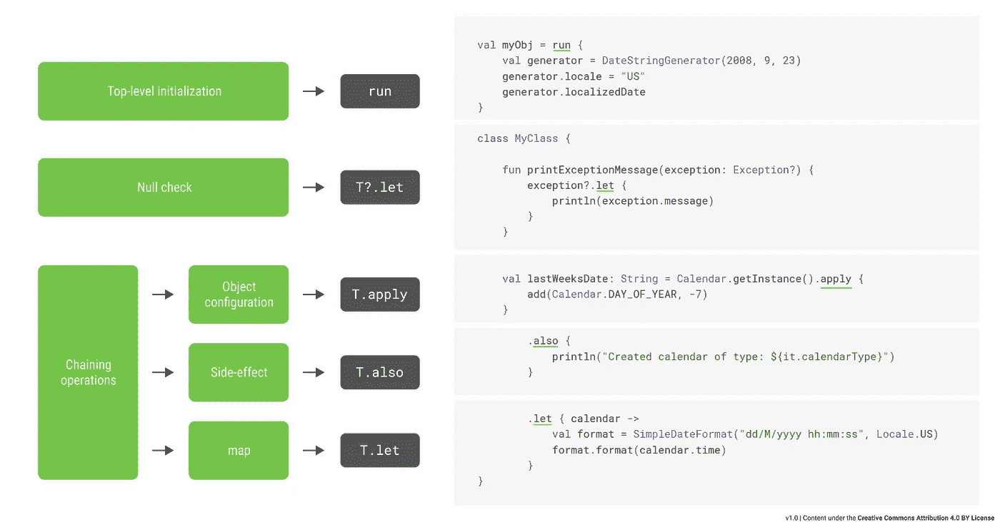

# 科特林标准函数备忘单

> 原文：<https://medium.com/androiddevelopers/kotlin-standard-functions-cheat-sheet-27f032dd4326?source=collection_archive---------4----------------------->

上周，我[在推特](https://twitter.com/ppvi/status/1081168598813601793)上发布了*对 Kotlin 标准函数小抄*的新看法，我发现它比传统方法更好。它不是关注每个功能如何工作，而是根据开发人员想要实现的目标提供指导:

下载 [PNG](https://raw.githubusercontent.com/JoseAlcerreca/kotlin-std-fun/master/Kotlin%20Standard%20Functions%20v1.png) 或 [PDF](https://github.com/JoseAlcerreca/kotlin-std-fun/raw/master/Kotlin%20Standard%20Functions%20v1.pdf) 中的 **Kotlin 标准功能流程图**。

**Kotlin Standard Functions flowchart**

它是固执己见的:从语义到可读性，每一个决定都是有原因的。例如:副作用也可以在一个`apply`中执行，但是在一个单独的函数中指出它更容易阅读，也更安全。

*并不详尽:*还有其他用例没有包括在内。示例:`run`可用于限制范围，但最好提取到一个方法。

还没有完成:随着语言的发展和模式的出现，我们将会更新它。

我还提供了传统的表格:

下载 [PNG](https://raw.githubusercontent.com/JoseAlcerreca/kotlin-std-fun/master/Kotlin%20Standard%20Functions%20Table.png) 或 [PDF](https://github.com/JoseAlcerreca/kotlin-std-fun/raw/master/Kotlin%20Standard%20Functions%20Table.pdf) 中的 **Kotlin 标准功能表**。

链接:

*   [Github 资源库](https://github.com/JoseAlcerreca/kotlin-std-fun)

感谢所有为图表和对话做出贡献的人。