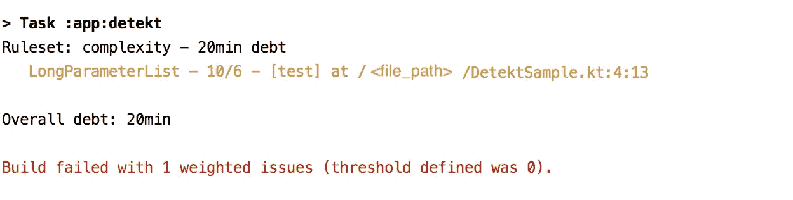

# 使用 Detekt 的 Kotlin 静态代码分析

> 原文：<https://medium.com/globant/kotlin-static-code-analysis-using-detekt-713457745a20?source=collection_archive---------1----------------------->

Designed by [freepik](https://www.freepik.com/)

# 介绍

> 静态代码分析是对软件的分析，它是在不实际执行程序的情况下进行的。

它解决了源代码中的弱点，这可以通过手工代码审查来实现；然而，使用自动化工具更有效，也是更好的方式。

例如，在下面的代码片段中， *sampleMethod()* 有将近 10 个参数，如果参数的数量持续增加，那么维护起来会非常困难。这些类型的问题很难人工识别，这种自动化工具在这里扮演着重要的角色。

在本文中，我们将探讨静态代码检查工具之一的 [**Detekt**](https://detekt.github.io/detekt/) 。

Detekt 试图通过实施一组规则来改进代码库，这些规则包括复杂性、命名等。它可以与 CI 集成，在我们试图将代码与一些代码气味合并的情况下，它将充当安全网。

## 特征

*   Kotlin 项目的代码味道分析
*   高度可配置
*   用 Kotlin 的`@Suppress`和 Java 的`@SuppressWarnings`注释隐藏结果
*   遗留项目的代码气味基线和忽略列表
*   指定代码气味阈值以中断您的构建或打印警告
*   SonarQube 集成

已经说过，Detekt 有广泛的可用规则，让我们看看其中的一些:

## 规则集

*   **注释**:基于函数和属性等公共事物应该总是有文档的原则的规则。
*   **复杂性**:定义类/方法的最大大小、类中方法的最大数量以及嵌套块数量的规则。
*   **空块**:让你的代码易于阅读和识别任何空块的规则。
*   **异常**:关于如何抛出和处理异常的规则。
*   **格式化**:格式化问题的规则。
*   **命名**:与代码库中的名称相关的规则，如类、函数、包等。
*   **性能**:不必要变量的规则和区间上的 forEach。
*   **潜在 bug**:弃用规则，冗余 else，未检查强制转换。
*   **样式**:代码样式的规则，如折叠 if 语句、幻数和可选括号。

现在，让我们看看如何配置 Detekt:

1.  **将 detekt 插件添加到 build.gradle 中**

我们需要将它添加到 *allprojects* 部分下的*顶级 build.gradle* 中，这样它就可以应用到我们所有的模块&中。我们还在 plugins 部分下添加了 Detekt 插件，如下面的代码片段所示。

**2。设置一个配置**

Detekt 是高度可配置的，以满足您的要求。要生成包含各种规则的配置文件，我们需要运行以下命令:

> 。/grad Lew detekgenerateconfig

在 **<项目-root>/config/detekt/detekt . yml**中打开新生成的文件，开始播放各种配置选项。该文件包含各种选项，我们可以根据需要启用或禁用它们。

规则示例:

这里的**长参数列表**是规则，可以使用**激活**选项启用或禁用。 **Threshold** 定义允许违反该规则的次数，当计数达到阈值时，给定的规则将失败。

**3。运行检测**

现在有趣的部分是运行 detekt 命令来检查我们代码库的健康状况。

> 。/gradlew detekt

这个命令将应用所有活动的规则，并给出结果，无论它是否成功。如果失败，那么将显示失败规则和代码位置的所有细节，我们可以对它们采取纠正措施。

例如，如果我们在上面的 *DetektSample* 类上运行 detekt，我们将得到下面的错误，构建将失败。错误是不言自明的，LongParameterList 的阈值被定义为 6，但在实现中，我们有 10 个参数，这违反了规则。

虽然有时候我们真的不能修改代码来适应失败的规则。别担心，我们有办法成功构建…

我们可以使用 **@Suppress()** 注释来隐藏任何规则。要隐藏问题，必须将问题的 id 写入注释的值字段中。例如@Suppress("LongMethod ")

注意:我们应该只在最坏的情况下使用上面的选项。

# 将 Detekt 集成到正在进行的项目中

当我们在项目的开始集成这样的静态分析工具时，它工作得非常好，但是在一个正在进行的项目中添加它们怎么样呢？相信我，将 detekt 添加到一个正在进行的项目中会导致许多错误，因为有多个规则集可用，然而，我们可以决定我们需要哪些规则集，并在开始时只启用那些规则集，其余的可以随着我们的进展而包含进来。

# 将检测集成到配置项

到目前为止，我们所了解的是，每当任何开发人员完成任务时，开发人员都需要运行 detekt 命令来检查它是否有任何代码气味。但是由于这个过程是手工的，开发人员可能会忘记这一步。最棒的是，使用 detekt gradle 脚本，我们可以轻松地将其自动化，以便在持续集成(CI)流程中运行。

我们只需要在适当的步骤将 Gradle 脚本添加到我们的管道中。它们是轻量级的任务，一点也不耗时，但是有很多好处。

# 结论

这就是这篇文章，我们已经在这样简单步骤中建立了真正有效的工具。配置这样的工具肯定有助于保持我们代码的良好健康。我们有许多这样的工具可用，但在我看来，Detekt 是一个真正有效的工具，可以在整个开发过程中自动发现和修复小问题，因为有大量的规则集可用，并且可以根据项目需求进行定制。

快乐编码…:)