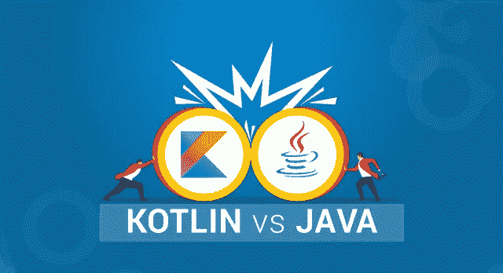
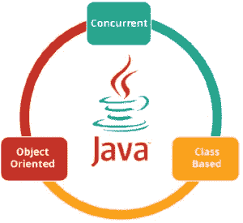
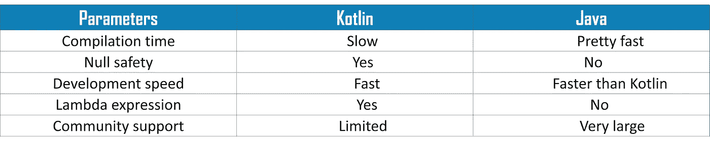

# Kotlin vs Java:哪个是最好的 Android 开发语言？

> 原文：<https://medium.com/edureka/kotlin-vs-java-4f8653f38c04?source=collection_archive---------1----------------------->

Kotlin vs Java — Edureka

随着 Java 作为编程语言无可争议的恶名，Android 被发现想要一种尖端的语言来竞争。Kotlin 被宣布为 Android 开发的官方语言后，立即填补了这个漏洞。所以，我写这篇关于 Kotlin 和 Java 的博客是为了帮助你发现它们之间的主要区别。

我将按以下顺序讨论这些话题:

*   科特林是什么？它的重要性是什么？
*   Java 是什么？
*   用于比较 Kotlin 和 Java 的参数
*   Kotlin 相对于 Java 的优势
*   Java 相对于 Kotlin 的优势
*   Kotlin 会取代 Java 吗？

我们开始吧！

# 科特林是什么？它的重要性是什么？

Kotlin 是一种静态类型的编程语言，用于 Java 虚拟机(JVM)和 JavaScript。科特林项目诞生于对提高生产率的渴望。

Kotlin 由 Google 官方支持，用于 Android 上的移动开发。自从 2017 年 Android Studio 3.0 发布以来，Kotlin 就作为标准 Java 编译器的替代产品被包括在内。

*   它也被描述为一种通用语言。
*   Kotlin 引入了支持 Java 互操作性的功能特性。
*   有助于以实用有效的方式改善编码体验。
*   Kotlin 的优势在于，您可以将其编译成 JavaScript，并与 Java 进行互操作。
*   它受到主流 ide 的支持，并且兼容 Java 版本 6 或 8。

谈到这种语言的重要性，它是 Android 生态系统中除 Java 之外最受支持的 JVM 语言。与 Java 相比，使用 Kotlin 可以编写更少的代码。与 Java 相比，Kotlin 的代码行越少，文件就越小。

# Java 是什么？

Java 是最古老和最简单的语言之一。二十多年来，它一直处于领先地位，现在仍然是一种非常流行的编程语言。它是一种面向对象的编程语言，由 Sun Microsystems 开发，目前归 Oracle 所有。

Java 不仅仅开发 Android 应用程序。所以如果你了解 Java，你就会成为更大的 Java 社区和市场的一部分，因此你会有更多的*职业机会*。

这是一种著名的编程语言。主要是:

*   **并发**可以执行许多语句，而不是顺序执行。
*   **它是基于类的**，是一种**面向对象的**编程语言。
*   **独立的**编程语言，遵循“**一次编写，随处运行**的逻辑，即编译后的代码可以在所有支持 java 的平台上运行。

简而言之，它是一个可以开发应用程序的计算平台。

既然你已经知道了什么是 Kotlin，什么是 Java，那么让我们讨论一下比较 Kotlin 和 Java 的参数。

# 用于比较 Kotlin 和 Java 的参数

我会考虑以下参数来比较 Kotlin 和 Java。

*   编译时间
*   零安全
*   发展速度
*   λ表达式
*   社区支持

## 编译时间

在大多数情况下，Kotlin 的编译速度比 Java 慢。

Java 的编译时间比较快。

## 零安全

Kotlin 内置了**零安全**。不太出名的 *NullPointerException* 是 Android 开发错误的主要原因。Android 主要依靠 n N ull 来表示一个值的缺失，但它可以很容易地破坏一个应用程序。Kotlin 通过引入固有的零安全性轻松解决了这个问题。由于这一增加，许多开发人员不用编写额外的代码来解决这个问题。

Java 不支持空安全，因为这已经包含在最近的更新中。

## 发展速度

Kotlin 的代码开发速度很快。

Java 的代码开发速度相对较快。

## λ表达式

Kotlin 支持 Lambda 表达式，这些表达式本质上是匿名函数，可以作为值来处理。您可以将它们作为参数传递给方法，返回它们，或者对普通对象做任何其他事情。

Java 不支持 lambda 表达式。

## 社区支持

Kotlin 的学习资源有限，因为它是一个小型的新社区。

Java 是一种庞大的编程语言，所以社区圈子比 Kotlin 更大。

# Kotlin 相对于 Java 的优势

*   Kotlin 是可互操作的。
*   简洁。
*   简单的学习曲线。
*   提供增强的运行时性能。

## 互用性

Kotlin 可与 Java 互操作，这意味着您可以利用所有现有的 Java 库、JVM 和框架。

## 简明的

这有助于大幅减少项目中的样板代码。

## 简单学习曲线

懂 Java 的开发人员可以轻松学习 Kotlin。从 Java 转换到 Kotlin 没有太多的开销，适应它也没有任何成本。

## 提供增强的运行时性能

运行时的性能很高。

现在我们来说说科特林的缺点。

# Java 相对于 Kotlin 的优势

*   在科特林，学习科特林绝对有一个陡峭的曲线。它的高度简洁的语法虽然是一个很大的优势，但确实需要提前学习。
*   在大多数情况下，Kotlin 显示出比 Java 慢的编译速度，尽管在少数情况下它确实胜过 Java。
*   Kotlin 社区还很年轻，学习资源有限，因此找到问题的答案可能有点困难。但是，随着它越来越受欢迎，资源和社区将及时扩大。
*   由于 Kotlin 还是新手，找到有经验的开发人员作为你团队的导师可能有点困难。每个人都还在学习和体验。
*   与 Java 相比，Android Studio 的一些功能，如自动完成和编译，在 Kotlin 中运行起来要慢一些。

# Kotlin 会取代 Java 吗？

现在，我来回答你最常问的问题，Kotlin 会取代 Java 吗？答案是否定的，Kotlin 功能强大，Java 也是。他们都捆绑在一起，用更多的即兴版本来对待我们。所以，没错，Java 和 Kotlin 在 android 开发上是齐头并进的。

这就把我们带到了本文的结尾，在这里我们讨论了 Kotlin 和 Java 之间的主要区别。希望你清楚这篇文章中与你分享的所有内容。

如果你想查看更多关于人工智能、DevOps、道德黑客等市场最热门技术的文章，你可以参考 Edureka 的官方网站。

请留意本系列中的其他文章，它们将解释 Java 的各个方面。

> 1.[面向对象编程](/edureka/object-oriented-programming-b29cfd50eca0)
> 
> 2.[Java 中的继承](/edureka/inheritance-in-java-f638d3ed559e)
> 
> 3.[Java 中的多态性](/edureka/polymorphism-in-java-9559e3641b9b)
> 
> 4.[Java 中的抽象](/edureka/java-abstraction-d2d790c09037)
> 
> 5. [Java 字符串](/edureka/java-string-68e5d0ca331f)
> 
> 6. [Java 数组](/edureka/java-array-tutorial-50299ef85e5)
> 
> 7. [Java 集合](/edureka/java-collections-6d50b013aef8)
> 
> 8. [Java 线程](/edureka/java-thread-bfb08e4eb691)
> 
> 9.[Java servlet 简介](/edureka/java-servlets-62f583d69c7e)
> 
> 10. [Servlet 和 JSP 教程](/edureka/servlet-and-jsp-tutorial-ef2e2ab9ee2a)
> 
> 11.[Java 中的异常处理](/edureka/java-exception-handling-7bd07435508c)
> 
> 12.[高级 Java 教程](/edureka/advanced-java-tutorial-f6ebac5175ec)
> 
> 13. [Java 面试问题](/edureka/java-interview-questions-1d59b9c53973)
> 
> 14. [Java 程序](/edureka/java-programs-1e3220df2e76)
> 
> 15. [Java 教程](/edureka/java-tutorial-bbdd28a2acd7)
> 
> 16.[依赖注入使用 Spring Boot](/edureka/what-is-dependency-injection-5006b53af782)
> 
> 17.[Java 中的可比](/edureka/comparable-in-java-e9cfa7be7ff7)
> 
> 18.[十大 Java 框架](/edureka/java-frameworks-5d52f3211f39)
> 
> 19. [Java 反射 API](/edureka/java-reflection-api-d38f3f5513fc)
> 
> 20.[Java 中的 30 大模式](/edureka/pattern-programs-in-java-f33186c711c8)
> 
> 21.[核心 Java 备忘单](/edureka/java-cheat-sheet-3ad4d174012c)
> 
> 22.[Java 中的套接字编程](/edureka/socket-programming-in-java-f09b82facd0)
> 
> 23. [Java OOP 备忘单](/edureka/java-oop-cheat-sheet-9c6ebb5e1175)
> 
> 24.[Java 中的注释](/edureka/annotations-in-java-9847d531d2bb)
> 
> 25.[Java 中的图书管理系统项目](/edureka/library-management-system-project-in-java-b003acba7f17)
> 
> 26.[Java 中的树](/edureka/java-binary-tree-caede8dfada5)
> 
> 27.[Java 中的机器学习](/edureka/machine-learning-in-java-db872998f368)
> 
> 28.[Java 中的顶级数据结构&算法](/edureka/data-structures-algorithms-in-java-d27e915db1c5)
> 
> 29. [Java 开发人员技能](/edureka/java-developer-skills-83983e3d3b92)
> 
> 30.[前 55 名 Servlet 面试问题](/edureka/servlet-interview-questions-266b8fbb4b2d)
> 
> 31.  [顶级 Java 项目](/edureka/java-projects-db51097281e3)
> 
> 32. [Java 字符串备忘单](/edureka/java-string-cheat-sheet-9a91a6b46540)
> 
> 33.[Java 中的嵌套类](/edureka/nested-classes-java-f1987805e7e3)
> 
> 34. [Java 集合面试问答](/edureka/java-collections-interview-questions-162c5d7ef078)
> 
> 35.[Java 中如何处理死锁？](/edureka/deadlock-in-java-5d1e4f0338d5)
> 
> 36.[你需要知道的 50 大 Java 集合面试问题](/edureka/java-collections-interview-questions-6d20f552773e)
> 
> 37.[Java 中的字符串池是什么概念？](/edureka/java-string-pool-5b5b3b327bdf)
> 
> 38.[C、C++和 Java 有什么区别？](/edureka/difference-between-c-cpp-and-java-625c4e91fb95)
> 
> 39.[Java 中的回文——如何检查一个数字或字符串？](/edureka/palindrome-in-java-5d116eb8755a)
> 
> 40.[你需要知道的顶级 MVC 面试问答](/edureka/mvc-interview-questions-cd568f6d7c2e)
> 
> 41.[Java 编程语言的十大应用](/edureka/applications-of-java-11e64f9588b0)
> 
> 42.[Java 中的死锁](/edureka/deadlock-in-java-5d1e4f0338d5)
> 
> 43.[Java 中的平方和平方根](/edureka/java-sqrt-method-59354a700571)
> 
> 44.[Java 中的类型转换](/edureka/type-casting-in-java-ac4cd7e0bbe1)
> 
> 45.[Java 中的运算符及其类型](/edureka/operators-in-java-fd05a7445c0a)
> 
> 46.[Java 中的析构函数](/edureka/destructor-in-java-21cc46ed48fc)
> 
> 47.[Java 中的二分搜索法](/edureka/binary-search-in-java-cf40e927a8d3)
> 
> 48.[Java 中的 MVC 架构](/edureka/mvc-architecture-in-java-a85952ae2684)
> 
> 49. [Hibernate 面试问答](/edureka/hibernate-interview-questions-78b45ec5cce8)

*原载于 2019 年 6 月 28 日*[*https://www.edureka.co*](https://www.edureka.co/blog/kotlin-vs-java/)*。*