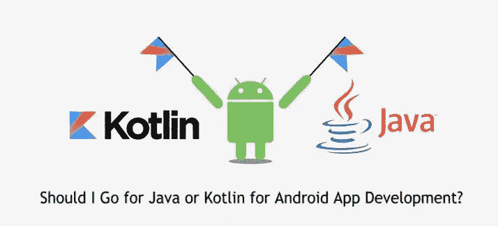
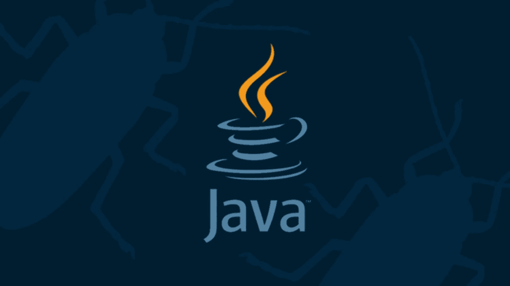
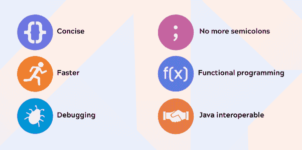
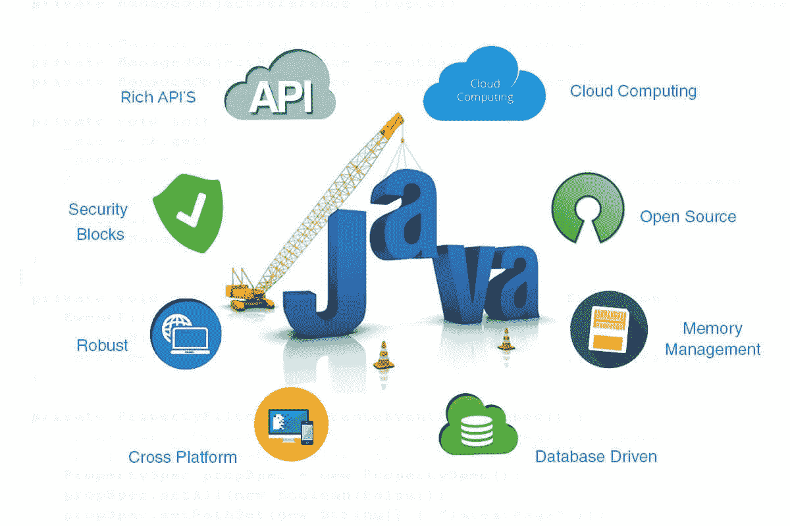
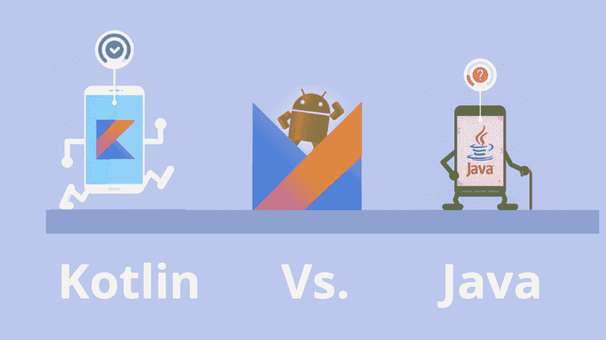
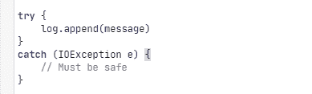
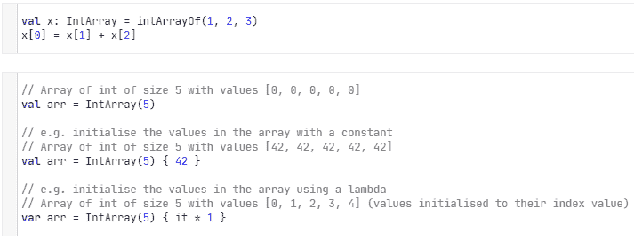
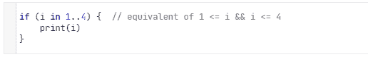
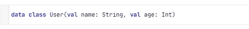
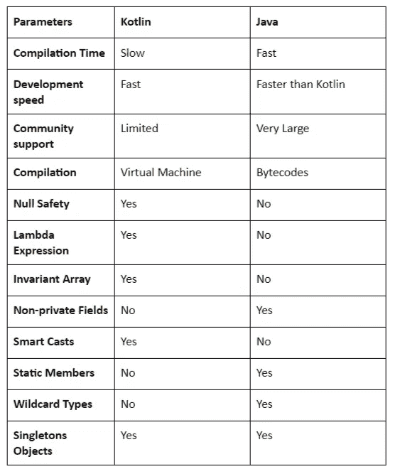

# KOTLIN 与 JAVA——哪个更适合 Android 应用程序开发？

> 原文：<https://medium.com/quick-code/kotlin-vs-java-which-one-is-better-for-android-app-development-3b4322cdb407?source=collection_archive---------0----------------------->

## 科特林 vs Java 大战；这将帮助企业在 Kotlin 和 Java 技术之间选择最佳的 Android 应用程序开发技术。

## 这里提到了 Kotlin vs Java 参数，它们将帮助您的企业为 Android 应用程序开发选择最佳的编程语言。

开发 Android 应用程序是在你的企业中获得成功的一个极好的选择，但与此同时，选择最好的编程语言才是真正的挑战。市场上有“n”种技术，从中选择最好的就像在草中找针。

在这里，我将只谈两个趋势技术，即 Kotlin 和 Java。嗯，这两种技术对于 Android 应用程序开发来说非常有名，但是当企业需要在 Kotlin 和 Java 之间选择任何一个时，困难就出现了。正因为这个创业，中小企业甚至大企业遇到了几个疑问，直到它的发展仍然留在他们的脑海中，如:

*   【Android 开发 Kotlin vs Java 哪个好
*   *Java 技术比科特林快吗？*
*   *2021 年，Java 还是 Kotlin 将打造领先的商业应用？*
*   *我们可以同时使用 Kotlin 和 Java 吗？*
*   *kot Lin 和 Java 哪个技术更容易？*

**永不落幕的名单……**

挑选最适合 Android 应用程序开发的是一项艰巨的任务；但是，可以通过比较 Java 和 Kotlin 来简化。让我们来看看谁会赢得 Kotlin vs Java 的战争。

## 科特林 vs 爪哇战争开始

> 为了开始战争，了解科特林和爪哇的生死攸关的因素是至关重要的；这就是为什么首先我会给技术概述。嗯，了解技术并选择最好的是不够的，为了有效地处理 Android 应用程序开发过程，从顶级软件外包公司雇佣 Android 应用程序开发人员非常重要。

# Kotlin 概述

Kotlin 是一种受 Java 启发的更高级的编程语言；它是它的增强版，有如此多的补充功能。Kotlin 是干净的，相对容易，包括较少的与 Java 和其他技术相关的手续和规则。

## **为什么选择科特林？**

> ***827*** *组织正在他们的技术栈中使用* ***科特林*** *。(Stackshare)*
> 
> ***Kotlin*** *是一款开源工具，拥有****34.1k****GitHub stars。*
> 
> ***Pinterest、Evernote、Twitter*** *最受欢迎的* ***应用*** *使用****Kotlin****。*

# 赞成的意见

*   用 Kotlin 编写的代码比用 Java 编写的代码要小得多。更少的代码意味着更少的错误。
*   Kotlin 应用程序部署可以更快地组装，并防止应用程序规模扩大。
*   Kotlin 脚本可用于自动完成 Android Studio 中的项目。
*   Kotlin 将代码组装成可以在 JVM 中执行的字节码。

# 骗局

*   与 Java 相比，它的支持社区很小。此外，它的库更少。
*   Kotlin 类似弱模式，代码可读性变得很难阅读和理解。
*   科特林的学习曲线很陡。
*   市场上的 Kotlin 程序员越来越少。所以，找一个有经验的很难。

# Java 概述

Java 是 Sun Microsystems 公司开发的面向对象的编程语言。它是允许构建任何程序的本地语言，支持 Android、Windows 和 Linux。

## **为什么选择 Java？**

> ***9465*** *组织正在他们的技术栈中利用****Java****。*
> 
> ***Java*** *是一款开源工具，拥有****32.5k****GitHub stars。*
> 
> ***Spotify、Twitter、Google*** *等等都是非常著名的****apps****使用****Java****。*

# 赞成的意见

*   Java 可以在任何设备、服务器或操作系统上运行
*   这种编程语言可以很容易地创建模块化的应用程序，并重用这些部分。
*   在研究 Kotlin 与 Java 的性能时，Java 易于使用、编译和调试。
*   Java 有几个库是由受信任的组织管理的，比如 Google、Apache 等。

# 骗局

*   与 c++或 Python 等其他语言相比，Java 使用的语法比较复杂。
*   使用 Java，很难访问一些可能不适合正在使用的设备的内容。
*   在 Java 测试驱动开发中，需要编写更多的代码，并且存在更高的编程错误和缺陷风险。
*   与其他编程语言相比，Java 速度较慢。

# Java vs kot Lin:kot Lin 和 Java 哪个最好？

使用 Kotlin 优于 Java 和 Java 优于 Kotlin 的优势将有助于分析 Kotlin 与 Java 之战的结果。

# 与 Java 相比，使用 Kotlin 的优势

来源:谷歌

*   Kotlin 是所有应用程序开发的一站式语言。与 Java 相比，它支持许多 ide，Android Studio。
*   可空性是 Java 程序员面临的主要问题。但是如果我说的是 Kotlin，那么它可以通过在类型系统中放置 null right 来解决可空性问题。
*   在科特林写的代码更短；这减少了产生错误的机会。而在 Java 中，使用了长代码，这就是为什么错误发生率变高的原因。

# 使用 Java 优于 Kotlin 的优势

来源:谷歌

*   在科特林，有一个陡峭的学习曲线。它的语法非常简洁，这也是为什么它需要提前学习的原因。
*   在某些情况下，Kotlin 的编译速度比 Java 慢。
*   Kotlin 社区仍然在成长和学习，所以很难找到问题来回答。
*   与 Java 相比，Android Studio 的一些特性，如自动完成和编译在 Kotlin 中运行较慢。

# kot Lin vs Java:kot Lin 和 Java 的比较

Java 和 Kotlin 之间的比较(Java vs Kotlin)将有助于企业为 Android 应用程序开发选择最佳技术。无论是 Java 还是 Kotlin 都包含多种功能，有时普通用户很难正确使用它，要解决这些问题，你可以[聘请 Kotlin 应用程序开发人员](https://www.valuecoders.com/hire-developers/hire-kotlin-developers)或[聘请顶级 Android 应用程序开发公司的 Java 应用程序开发人员](https://www.valuecoders.com/hire-developers/hire-java-developers)。

# 什么 Java 有而 Kotlin 没有？

## 检查异常

对短程序的检查得出这样的结论:想要异常规范可以提高开发人员的生产率和代码质量。但是大量软件项目的经验表明了一个混合的结果；这降低了生产率和代码质量。

> Kotlin 不包括检查异常。这是有原因的，但这里我讨论了一个简单的例子。

> 下面的例子是由 ***StringBuilder*** 类实现的 JDK:
> 
> ***这个签名说的是什么？***
> 
> 它说每当我向某个东西添加一个字符串时(StringBuilder 是一种日志、控制台等)。)而且还得抓那些 ***IOExceptions*** 。
> 
> ***为什么？***
> 
> 因为它可能会执行 IO，并在各处产生这种代码:

> 编码图片来源:[https://kotlinlang.org/docs/reference/exceptions.html](https://kotlinlang.org/docs/reference/exceptions.html)

这是不好的，但可以用 Java 来纠正。

# 原始类型数组

Kotlin 有专门的类来表达基元类型的数组(意味着 Kotlin 没有基元类型数组的直接功能)而没有装箱开销:****ByteArray***， ***IntArray* ，ShortArray** 等等。这些类与 ***数组*** 类没有继承关系。它们中的每一个也有相似的工厂功能:*

**

*编码图像来源:[https://kotlinlang.org/docs/reference/basic-types.html](https://kotlinlang.org/docs/reference/basic-types.html)*

***通配符类型***

*这是 Java 类型系统中最复杂的部分。Java 中的通配符类型控制泛型类型使用的类型安全性。它可以用在变量声明和实例化以及方法定义中。*

*Kotlin 不包含任何通配符类型。除此之外，Kotlin 不包含静态成员，三元运算符 a？乙:丙。*

# *什么是 Kotlin 拥有而 Java 没有的？*

1.  ***扩展***

*Kotlin 允许您在不使用 Decorator 之类的设计模式的情况下用新功能扩展一个类。这是通过称为扩展的特殊代码实现的；这种机制被称为扩展功能。例如，Kotlin 开发人员可以从第三方库中为一个类编写开发人员无法更改的新函数。*

***2。零安全***

*包括 Java 在内的许多编程语言中最常见的情况是，获取空引用的成员会导致空引用异常。*

*然而，Kotlin 的类型系统旨在从我们的代码中排除空指针异常。Android 主要依靠 Null 来描述值的缺失，但它可以简单地破坏应用程序。Kotlin 通过添加内置的零安全有效地解决了这一障碍。*

***3。范围表达式***

*Kotlin 允许您利用***kotlin . ranges***包中的 ***rangeTo()*** 函数及其运算符形式 **…** 通常， ***rangeTo()*** 由 或 ***中的 ***补充！在*和**功能中。****

**

*图片来源:[https://kotlinlang.org/docs/reference/ranges.html](https://kotlinlang.org/docs/reference/ranges.html)*

***数据类别***

*我们经常创建以保存数据为主要目的的类。在这样的类中，一些通常的功能和效用函数可以从数据中机械地获得。在 Kotlin 中，这被称为*数据类*，并被标记为 ***数据:****

**

***图片来源:**[https://kotlinlang.org/docs/reference/data-classes.html](https://kotlinlang.org/docs/reference/data-classes.html)*

*Kotlin 还包括 Lambda 表达式+内联函数、智能强制转换、字符串模板、属性、主构造函数、一级委托、单例、声明站点差异和类型投影，以及更多特性。*

# *Kotlin 与 Java 对照表*

**

# *片尾语:谁摘了桂冠？*

*通过观察 Java 和 Kotlin 的不同参数，我发现 Kotlin 在 Kotlin vs Java 的竞赛中领先。这是因为 Kotlin 与 Java 交互工作，并向 Java 提供代码的增量修改和优秀的类型系统。*

*为了在 Android 应用程序开发中正确使用 Kotlin，从一家[知名的 Android 应用程序开发公司](https://www.valuecoders.com/android-app-development-company-india)雇佣 Kotlin 开发人员。这将帮助初创公司、中小企业和大型企业获得可靠的应用程序开发解决方案，并在更短的时间内实现业务目标。*