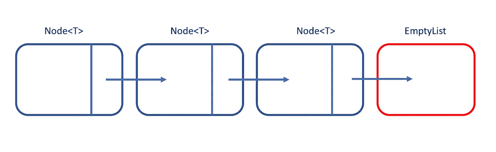

# 科特林的虚无:它在泛型中的有用性

> 原文：<https://blog.kotlin-academy.com/kotlins-nothing-its-usefulness-in-generics-5076a6a457f7?source=collection_archive---------0----------------------->


Image credit: [Unsplash](https://unsplash.com?utm_source=medium&utm_medium=referral)

本文探讨了 Kotlin 的`Nothing`类型在泛型中的用途。我们来看看它与 Java 的关系。举个具体的例子，我们来看一个链表。



Fig. 1: A LinkedList

LinkedList 包装了某种类型`T`。链表可以是

1.  一个有两个属性的`Node<T>`:一个`T`的`payload`，一个`LinkedList<T>`类型的`next`；或者
2.  一个`EmptyList`。

一个`sealed class`强制要求`LinkedList`要么是类型 1 要么是类型 2。

我们可以很容易地将`sealed class`和`Node<T>`编码如下:

A LinkedList definition; the empty list is not defined.

对空列表进行编码更具挑战性。所有空列表都是一样的。因此，空列表是一个`object`。`EmptyList`也必须是`LinkedList<T>`的子类。我们可以试着写

Code cannot compile; Kotlin objects cannot have type parameters.

Kotlin 对象不能有类型参数。上面的代码不会编译。相反，我们可以尝试移除 EmptyList 的类型参数。

Cannot compile; reference to T on line 5 is unresolved.

代码仍然无法编译。第 5 行中对`T`的引用未被解析。我们必须为`T`规定一个具体的类型。

`T`是节点封装的有效载荷的类型。参见上面的图 1。相比之下，空列表不包装任何有效载荷。所以，正确的编码是

Correct code: an empty list is a LinkedList<Nothing>.

Kotlin `Nothing`是什么类型？从 Android Studio 中，选择工具- >科特林- >科特林 REPL。在 REPL 窗口中，输入并运行命令`println(Nothing::class.java)`。结果是

```
println(Nothing::class.java)
class java.lang.Void
```

科特林的`Nothing`类型得到了 Java 的`Void`类型的支持。科特林的`Nothing`型表示*型不存在*型。

作为题外话，为什么不能定义一个 Kotlin 函数来返回`Nothing`？例如，以下代码无法编译:

Kotlin does not allow Nothing to be instantiated.

`Nothing`的构造函数是私有的。将上面的代码与 Java 代码进行比较:

Java does not allow Void to be instantiated.

Java 的`Void`类有一个私有构造函数。`Void`无法实例化。我们不能回一个`Void`。因此，我们不能在 Kotlin 中返回一个`Nothing`似乎是合理的。

我们已经展示了 Kotlin 的`Nothing`类型是由 Java 的`Void`类型支持的。科特林的`Nothing`类型用于表示泛型类型不包装任何类型。该类型不存在。

了解卡帕头最新的重大新闻。学院，[订阅时事通讯](https://kotlin-academy.us17.list-manage.com/subscribe?u=5d3a48e1893758cb5be5c2919&id=d2ba84960a)，[观察 Twitter](https://twitter.com/ktdotacademy) 并在媒体上关注我们。

[](http://eepurl.com/diMmGv)

喜欢的话记得**拍**。请注意，如果您按住鼓掌按钮，您可以留下更多的掌声。