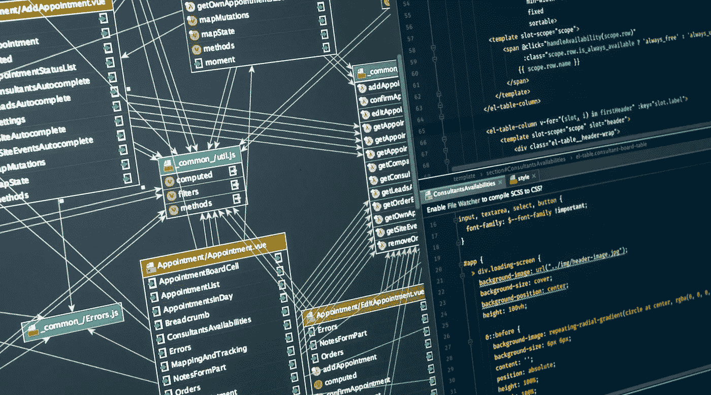
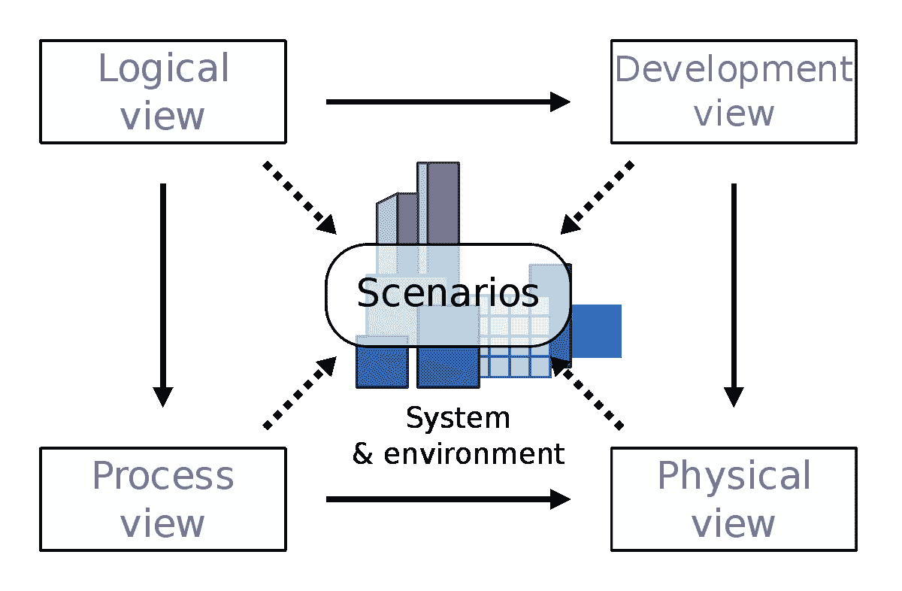

# 克鲁奇滕建筑模型

> 原文：<https://medium.com/globant/kruchten-architecture-model-2f95d0da1c7?source=collection_archive---------0----------------------->

# 克鲁奇滕建筑模型

根据定义，软件架构涉及软件系统抽象的高层结构，通过使用分解和组合，具有架构风格和质量属性。软件体系结构设计必须符合系统的主要功能和性能需求，以及满足非功能需求，如可靠性、可伸缩性、可移植性和可用性。

Kruchten 体系结构模型是一种视图模型，用于描述软件密集型系统的体系结构，基于多个并发视图的使用。视图用于从不同利益相关者的角度描述系统，例如最终用户、开发人员、系统工程师和项目经理。

Kruchten 4 + 1 Architecture Model

引用 Kruchten 的话，这个视图模型是通用的，并不局限于任何符号、工具或设计方法。

该模型的四个视图是逻辑视图、开发视图、过程视图和物理视图。此外，选择的用例或场景用于说明作为“加一”视图的架构。

考虑到前面的评论，架构模型包含“4 + 1”视图:

# 逻辑视图

逻辑视图关注的是系统提供给最终用户的功能。UML 图用于表示逻辑视图，包括类图和状态图。

# 流程视图

进程视图处理系统的动态方面，解释系统进程以及它们如何通信，并关注系统的运行时行为。过程视图解决了并发性、分布、集成、性能和可伸缩性等问题。表示过程视图的 UML 图包括序列图、通信图、活动图。

# 发展观

开发视图从程序员的角度说明了一个系统，并且与软件管理有关。该视图也称为实现视图。它使用 UML 组件图来描述系统组件。用于表示开发视图的 UML 图包括包图。

# 物理视图

物理视图从系统工程师的角度描述系统。它涉及物理层上软件组件的拓扑结构以及这些组件之间的物理连接。该视图也称为部署视图。用于表示物理视图的 UML 图包括部署图。

# 情节

架构的描述使用一小组用例或场景来说明，这成为第五个视图。场景描述了对象之间和过程之间的交互序列。它们用于识别架构元素，并说明和验证架构设计。它们也是架构原型测试的起点。这个视图也被称为用例视图。

# 关于菲利普·克鲁奇滕

Philippe Kruchten 是一名加拿大软件工程师，是加拿大温哥华不列颠哥伦比亚大学的软件工程教授，是 Rational 软件过程开发(RUP)的主管，也是 4 + 1 架构视图模型的开发者。

Philippe Kruchten 的出版物“*架构蓝图——软件架构的 4 + 1 视图模型*”激发了本文的创作。

# 摘要

Kruchten 体系结构模型使用五个并发视图描述软件体系结构，每个视图处理一组特定的关注点。软件设计者可以围绕这些视图组织架构决策的描述，然后用一些选择的用例或场景来说明它们，这些用例或场景构成了另一个视图。该架构部分是从这些场景发展而来的。该模型允许不同的涉众找到他们在软件架构中需要的东西。