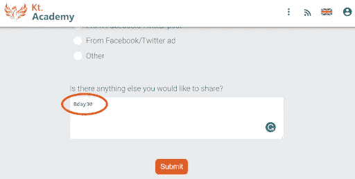
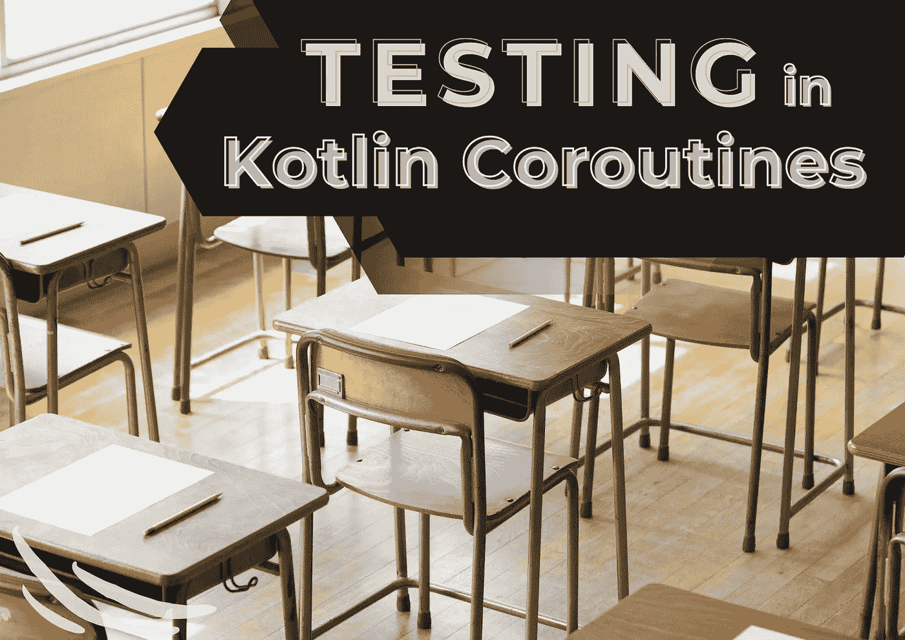
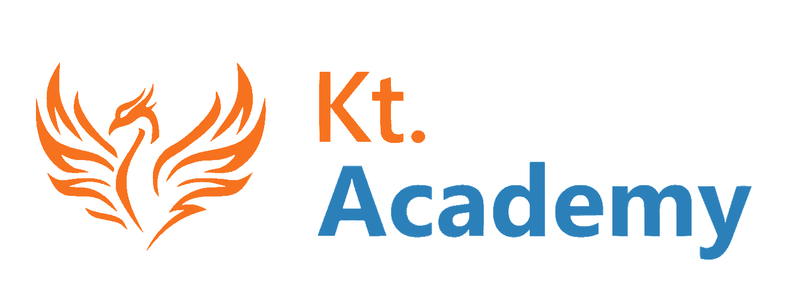

# Kt 学院 4 日& 2 科特林协程文章和作者通缉🔥

> 原文：<https://blog.kotlin-academy.com/kt-academy-4th-bday-2-kotlin-coroutines-articles-authors-wanted-f67ca5624fcc?source=collection_archive---------3----------------------->

亲爱的读者们，你们好！🤩

🍰 🍰 🍰 🍰 🍰 🍰 🍰 🍰 🍰 🍰 🍰 🍰 🍰 🍰 🍰 🍰 🍰 🍰 🍰 🍰 🍰

我们在庆祝我们的第四个生日！🥳

值此之际，我们为我们的订户提供**特别优惠！
**⬇7 折**即将举办的研讨会的正常价格:**

由 **Marcin Moskala** 主持的开放式 **Kotlin Coroutines (EN)** 工作坊！🤩

📅 03–04.03.2022 👇

[科特林协同程序(kt.academy)](https://kt.academy/workshop/coroutines)

✂ Write❗ **Bday30** ❗in“附加信息”字段。

✴优惠有效期至**2022 年 1 月 31 日**。不要错过！🏃‍♀️

📝今天我们将继续讨论由**Marcin moska a .**
撰写的 **Kotlin Coroutines 文章**，以下是它们的简要摘要👇

👉[流楼](https://kt.academy/article/cc-flow-building)
👉[测试 Kotlin 协程](https://kt.academy/article/cc-testing)

你可以在我们的网站上找到更多的文章。📃
享受⏬

每个流程都需要从某个地方开始。

因此，让我们探索所有不同的流构建器。👇

**流动建筑**

[Flow building](https://kt.academy/article/cc-flow-building)

🔻这是《科特林协同程序》一书中的一章。你可以在 LeanPub 上找到早期访问。

协程在 1.6 版本中引入了一个新的测试 API。例如，现在我们使用 runTest 而不是 runBlockingTest。💪

随着这一变化，我们**更新并完全重组了 Kotlin 协同程序**的章节，以更好地展示常见的测试用例，并逐步解释 TestCoroutineScheduler、StandardTestDispatcher 和 TestScope。

👉**测试 Kotlin 协程**

[Testing Kotlin Coroutines](https://kt.academy/article/cc-testing)

🔻这是《科特林协同程序》一书中的一章。你可以在 LeanPub 上找到早期访问。

✅再来一个…
我们知道你喜欢看我们的文章，但是…📰也许你会有兴趣为 Kt 写点东西。学院？✒也许有一天你的文章会成为我们时事通讯的一部分！
是不是很刺激？🤩

📚不管您使用的是 Kotlin、Python、JavaScript、React 还是 TypeScript。也许你擅长测试、机器学习、Android 功能或其他主题。

让我们知道！

📧如果你对你想写的文章有一些想法，只需发送电子邮件到 **contact@kt.academy** 。

更多详情请点击
👉[作者通缉](/write-for-us-authors-wanted-f195a59770d2)

🍰 🍰 🍰 🍰 🍰 🍰 🍰 🍰 🍰 🍰 🍰 🍰 🍰 🍰 🍰 🍰 🍰 🍰 🍰 🍰 🍰

我们迫不及待地阅读和发表您的文章！👏
希望能在我们的研讨会上见到您！👀

如果你有什么想告诉我们的，请回复这封邮件让我们知道！💌

敬请期待！👌
Kt。学院团队

www: [kt.academy](https://kt.academy/)
博客:[blog.kotlin-academy.com](http://blog.kotlin-academy.com/)
Twitter EN:[@ ktdotsacademy](https://twitter.com/ktdotacademy)
Twitter PL:[@ ktdotsacademypl](https://twitter.com/ktdotacademyPL)
FB:[@ ktdotsacademy](https://www.facebook.com/KtDotAcademy)
LinkedIn:[@ Kt。学院](https://www.linkedin.com/company/kt-academy/)

