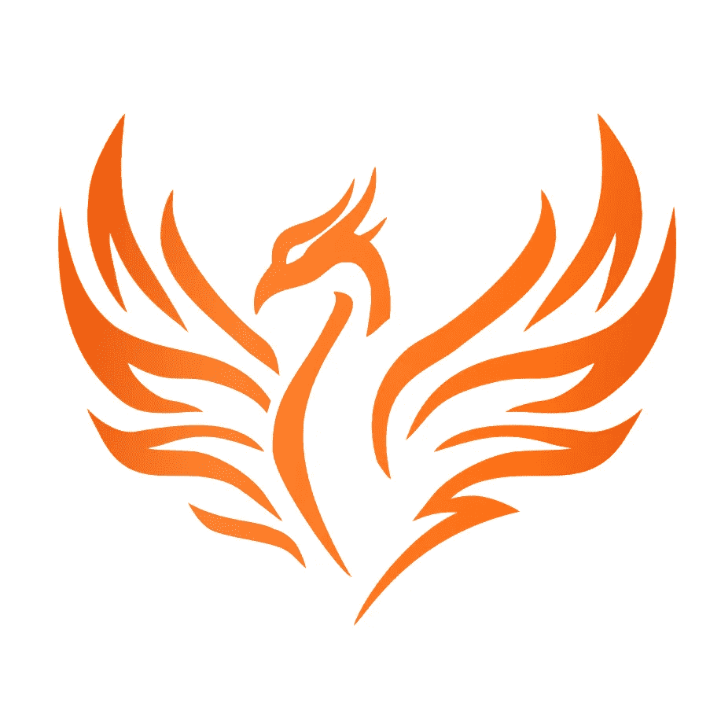

# 卡帕头。学院新标志:凤凰

> 原文：<https://blog.kotlin-academy.com/kt-academy-new-logo-phoenix-43a6e7097bff?source=collection_archive---------2----------------------->

我们决定改变我们的标志。新的一幅描绘了一只凤凰，一只神话中的鸟。

# 为什么？

我们真的很喜欢之前的 logo，但是 Kt。学院不再只是关于科特林。我们有优秀的培训师教授[最佳实践](https://kt.academy/workshop#tag-bestpractices)、[。NET](https://kt.academy/workshop#tag-.NET) 、 [A/B 测试](https://kt.academy/workshop/abTesting)等诸多话题。卡帕头。学院是一个平台，在这里我们将最好的老师与受益于他们教学的公司联系起来。这也是一个我们愿意分享与我们教授编程的使命相一致的最佳内容的地方。因此，一个与科特林联系如此紧密的标志不再最适合我们。

# 科特林呢。

我们仍然热爱科特林，我们将继续教它。我们将继续成为 JetBrains 的合作伙伴，我们与这一伟大语言的关系没有任何变化。

# 凤凰的象征意义

凤凰很有象征意义。对我们来说，它代表了深度学习。当一个英雄学到他最重要的一课时，他人格的很大一部分需要死去，为新的教义腾出地方。这就是凤凰死而复生的原因。当你学习新技术时，你必须停止使用旧技术。当你学会一种更好的方法时，你需要停止用老方法去做。如果你想真正地学习，你必须准备好放弃你已经知道的一切。对我们来说，这是学习的本质，这也是为什么凤凰成为我们的象征。

那里有更多的符号。其中一个相当明显——你可能会注意到它的形状类似于一颗心。这是因为我们关心他人。我们不像典型的企业——为收入而优化。相反，我们希望分享知识，帮助发展。这是我们的使命，我们遵循它，因为我们关心它。

# 网站上的徽标

为了先睹为快，看看我们的网站会是什么样子，请点击[这个链接](https://kt-academy-next.vercel.app/)。