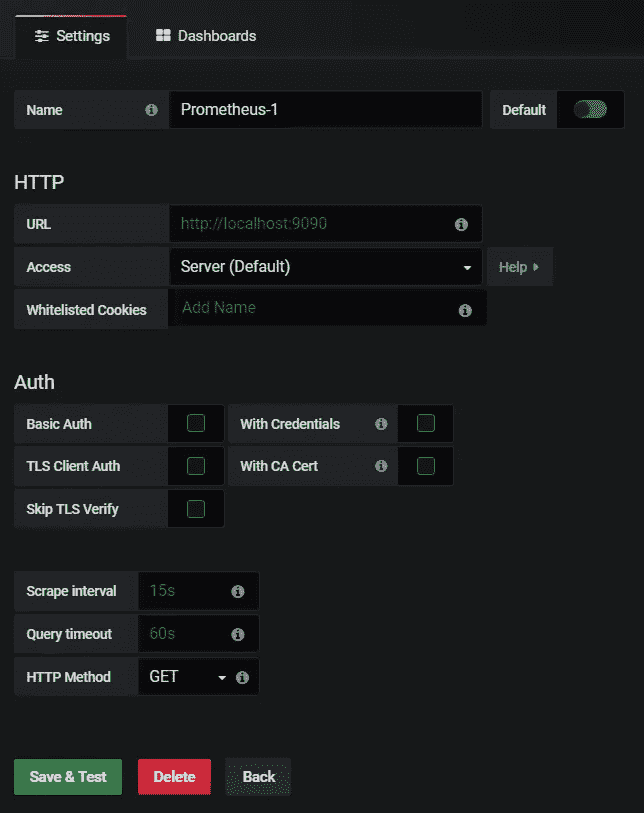
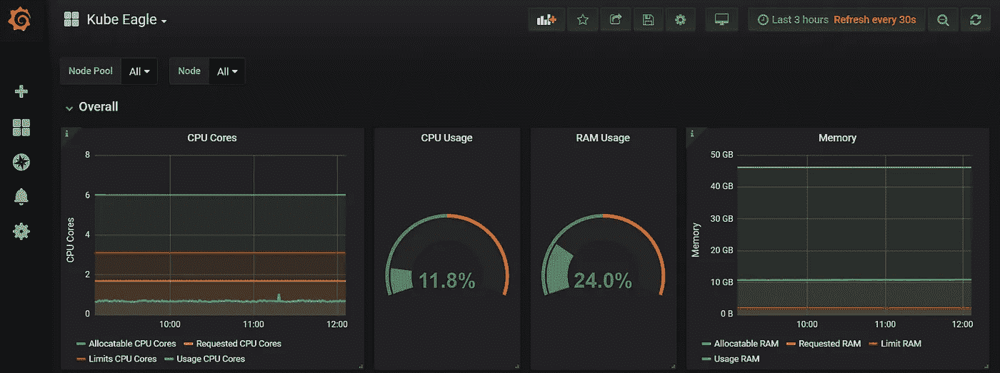

# ORACLE Kubernetes 引擎上的 Kube Eagle

> 原文：<https://medium.com/oracledevs/kube-eagle-on-oracle-kubernetes-engine-f2c8a3730565?source=collection_archive---------0----------------------->

每个人都知道或至少听说过 Prometheus 和 Grafana，这是用于监控 kubernetes 集群的最广泛使用的工具，最常见的指标收集是通过节点导出器或 Kube 状态指标进行的。但是这些指标的问题是理解和分析起来有点复杂。他们没有足够的元数据，两种指标收集工具的聚合变得很困难。最近我偶然发现了一个叫做 Kube Eagle 的项目。这是一个用于监控 kubernetes 集群的开源项目，但正如我在上面提到的，它对当前的监控指标有一些额外的优势。因此，在这篇文章中，我将向您展示如何为 Oracle Kubernetes 引擎配置 K **ube Eagle，该引擎也可以扩展到任何其他 Kubernetes 集群。**

因此，在直接进入 Kube Eagle 的安装步骤之前，让我们了解一下它在其他现有指标之上的具体用途。Kube Eagle 用于 kubernetes 集群监控，每个集群甚至可以监控多达 50 个或更多的节点，并且可以跟踪关于节点的非常精确的信息，这有助于节省资金。
使用 kubernetes 集群固然很好，但如今重要的是资源化地使用它，也就是说要知道为资源分配多少内存，以便控制成本，最终在云中重要的是节约成本。

库伯鹰的**仓库:[https://github.com/google-cloud-tools/kube-eagle](https://github.com/google-cloud-tools/kube-eagle)**

让我们看看如何在 Oracle Kubernetes 集群上安装它。在继续之前，您需要启动并运行一个**集群**，安装 **kubectl** (如果没有，请从[https://storage . Google APIs . com/kubernetes-release/release/v 1 . 13 . 0/bin/windows/amd64/kube CTL . exe](https://storage.googleapis.com/kubernetes-release/release/v1.13.0/bin/windows/amd64/kubectl.exe)下载)并为 Oracle kubernetes 集群正确配置 **kube-config** 文件。
当您执行" **kubetclt get nodes"** 时，它应该会为您提供已配置集群中的节点。

如果您已经设置了一个 Oracle kubernetes 集群，那么您需要完成以下步骤(我将提到的所有步骤都是针对 Windows 系统的):
安装 Metrics server:
-在您的本地系统中使用 git bash 克隆存储库:[https://github.com/kubernetes-incubator/metrics-server](https://github.com/kubernetes-incubator/metrics-server)
-为了在您的集群中部署 metrics-server，从该存储库的顶层目录运行以下命令:
kubectl create -f deploy/1.7/(对于 kubernetes 1.7)
kubectl create -f deploy/1.8/(对于 kubernetes 1.8)
现在，如果您这样做了"**kubectl get pods-n kube-system "**您将看到 metrics server 正在运行

确保度量服务器正在运行。

**为 windows 10 安装 Chocolatey**:
你只需以管理员身份打开 powershell，运行文档中提到的命令:[https://chocolatey.org/docs/installation](https://chocolatey.org/docs/installation)。

现在巧克力已经安装好了，我们将使用它来安装头盔。
choco 安装 kubernetes-helm
或者你可以下载想要的版本:[https://github.com/helm/helm/releases](https://github.com/helm/helm/releases)然后解压 zip 文件并添加到环境变量中的 path。

现在你已经在本地系统中安装了 helm，你需要为 Tiller 配置一个**服务账户:**

Service account creation

创建上述文件后，运行:
$ ku bectl create-f RBAC-config . YAML
service account " tiller " created
clusterrolebinding " tiller " created
$**helm init—service-account tiller**
您可以检查 helm 版本:

您还将看到在 kube-system 名称空间中运行的 **tiller pod**

一旦圣盔初始化，你就可以使用圣盔在圣盔图上安装普罗米修斯，格拉夫纳和库伯鹰。

因为这个帖子是关于 Kube-Eagle 的，所以我不会解释普罗米修斯和 grafana 的来龙去脉，因为我已经写了单独的[帖子](/linuxacademy/100daysoflearning-d1e39bea635a)。但是我们将在本地安装 prometheus 和 grafana，并使用 helm 从 windows 系统本地访问仪表板。

**安装 Prometheus 和 Grafana:
Prometheus**:
helm install—NAME Prometheus stable/Prometheus为了在本地运行 Prometheus 并查看 UI 运行以下命令:$ export POD _ NAME = $(ku bectl get pods-namespace default-l " app = Prometheus，component=server" -o jsonpath="{。items[0]. metadata . NAME } "
$ ku bectl-名称空间默认端口-转发$POD_NAME 9090

以上将安装 prometheus 的稳定版本并在 [http://localhost:9090](http://localhost:9090) 上运行

Prometheus UI

**格拉法纳**:

**helm install—NAME grafana stable/graf ana** 为了在本地运行 graf ana 并查看仪表盘，运行以下命令:
$ export POD _ NAME = $(ku bectl get pods-namespace default-l " app = graf ana "-o JSON path = " {。items[0]. metadata . NAME } "
$ ku bectl-名称空间默认端口-转发$POD_NAME 3000

以上将安装 grafana 的稳定版本，并在 [http://localhost:](http://localhost:9090) 3000 上运行

Grafana Dashboard

现在我们已经为运行 Kube-Eagle 做好了一切准备，让我们继续使用 helm 安装 Kube-Eagle:
repo:[https://github.com/google-cloud-tools/kube-eagle-helm-chart](https://github.com/google-cloud-tools/kube-eagle-helm-chart)
步骤:
-helm repo 添加 Kube-Eagle[https://raw . githubusercontent . com/Google-cloud-tools/Kube-Eagle-helm-chart/master](https://raw.githubusercontent.com/google-cloud-tools/kube-eagle-helm-chart/master)
-helm repo update
-helm install-name = Kube-Eagle Kube-Eagle/Kube-Eagle

上面将安装 Kube-Eagle，您可以看到它在默认的名称空间中运行:

注意:因为您已经安装了 Prometheus 和 Grafana，所以您也将在默认名称空间中看到它们的 pod:

Prometheus and Grafana PODS

既然我们已经设置好了一切，让我们将 prometheus 添加为 grafana 中的数据源:从仪表板转到 Configuration，然后单击 add data source。

并从中选出普罗米修斯:

给出网址并点击保存:

您将看到添加的数据源:

接下来，我们将为 Kube Eagle 创建一个仪表板:
导入仪表板:[https://grafana.com/dashboards/9871](https://grafana.com/dashboards/9871)(仪表板 ID 9871)。选择 import dashboard 并键入 9871，您应该会看到以下内容:

因为我已经有了 Kube Eagle，所以它显示一个警告。
如果到目前为止一切都很成功，并且您能够看到各自的 pod 已创建并正在运行，请转到 Kube Eagle 仪表板，您应该可以看到来自节点的所有数据，这些数据具有精确的细节和适当的聚合。

如您所见，Kube-Eagle 设置成功，并提供了许多有用的指标，可用于定义和限制每个 pod 的核心数。这实际上有助于节省大量硬件资源。就像一些 pod 会在集群仍有内存时耗尽内存。使用 Kube-Eagle 可以很容易地看到这类问题。

Kube Eagle 的创建者 Martin Schneppenheim 也面临着类似的问题，他创建了 Kube Eagle，帮助他和他的团队削减了成本和许多其他好处，包括:
-为微服务分配适当的资源请求&限制
-减少 RAM 过度分配的问题
-跨所有节点平衡硬件利用率。

快乐学习。
赛亚姆·帕塔克
[https://www.linkedin.com/in/saiyam-pathak-97685a64/](https://www.linkedin.com/in/saiyam-pathak-97685a64/)
[https://twitter.com/SaiyamPathak](https://twitter.com/SaiyamPathak)