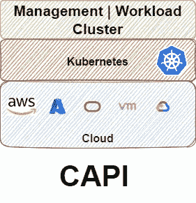

# 使用 CAPOCI 的 Kubeception 集群 API 第 1 部分

> 原文：<https://medium.com/oracledevs/kubeception-with-capoci-cluster-api-for-oci-part-1-14aa5124a4ee?source=collection_archive---------3----------------------->


你可能听说过我们[为 OCI 开源](https://github.com/oracle/cluster-api-provider-oci)集群 API(capo ci)。我甚至在我的好友[乔](https://www.linkedin.com/in/joekratzat/)的[客座博文](/oracledevs/using-cluster-api-to-upgrade-a-kubernetes-cluster-in-oci-d9846e63b08a)中提到了它。在这篇文章中，我将解释什么是集群 API，以及如何在 OCI 使用它。

[出自马嘴](https://cluster-api.sigs.k8s.io/):

> Cluster API 是 Kubernetes 的一个子项目，致力于提供声明性 API 和工具来简化多个 Kubernetes 集群的供应、升级和操作。

## 回忆往事的一次小小旅行

我已经能听到你了:当我可以使用 Terraform、Pulumi 或 SDK 来创建一个工具时，为什么还要使用另一个工具来提供 Kubernetes 呢？事实证明，维护像 Kubernetes 这样复杂的进化系统的脚本是很困难的。*非常辛苦*。

注意，我指的不是提供托管服务的[，比如 OKE](https://github.com/oracle-terraform-modules/terraform-oci-oke) 。不，我指的是构建整个集群的脚本。我们过去一直维护一个版本，直到我们发布了 OKE，但那时 Kubernetes 的变化和选择是有限的。以集群网络子空间为例。当时，大多数集群使用法兰绒或印花布(根据新堆栈的 Kubernetes 生态系统第一版的状态，73%)。现在，他们有 25 个人，而且还在继续。

此外，问题是 IaC 工具和基础设施提供商/Kubernetes 发行版的每种组合都提供了不同的体验。随着最终用户现在部署在多个基础设施上(例如云提供商甚至混合)，这变得更加难以维护。显然，无论基础设施提供商是谁，为 Kubernetes 集群提供一致的生命周期体验的需求已经变得非常迫切。

输入集群 API。

## 集群 API 是做什么的？

集群 API (CAPI)主要使用声明性 API 管理 Kubernetes 集群的生命周期。借助 CAPI，您可以创建、扩展、[升级](/oracledevs/using-cluster-api-to-upgrade-a-kubernetes-cluster-in-oci-d9846e63b08a)或销毁集群。不仅如此，您还可以使用集群 API 来配置您的网络、负载平衡器、虚拟机、配置您的安全规则等等。

打个比方，把 CAPI 想象成一个 Java 接口。CAPI 没有使用 Java APIs，而是使用 Kubernetes 风格的接口来定义 Kubernetes 集群所需的基础设施。

坚持我们的类比，为了使用所说的 Java 接口，我们需要在一个类中实现它。嗯，CAPI 使用一个基础设施模型来扩展和实现对多个基础设施提供商(T2，T3)的支持。对 OCI 来说，那是[卡波奇](https://oracle.github.io/cluster-api-provider-oci/)。

最后，为了使用我们的 Java 类，我们需要创建一个实例。这时，您可以在现有集群中创建首选 CAPI 提供程序的实例。你很可能会说:“请问，现在这个现有的集群是从哪里来的？”请原谅我。

## WebLogic 类比

对于那些以前使用过 WebLogic 的人来说，这是很熟悉的。在 WebLogic 域中，有两种类型的服务器:

*   作为单例运行的管理服务器。通常，我们不使用它来部署我们的应用程序。相反，它有一个管理应用程序，允许管理用户在各种托管服务器或集群上配置和部署各种应用程序和服务
*   受管服务器，通常组合在一个群集中。受管服务器通常是应用程序运行的地方。


WebLogic Admin and Managed servers

嗯，CAPI 也是一样:



Cluster API Management and Workload clusters

但你得到的不是操作系统，而是基础设施或云提供商；您不用 Java 作为运行时，而是使用 Kubernetes，不用管理服务器和托管服务器，而是分别使用集群，比如管理集群和工作负载集群。最后，我们使用管理服务器在 WebLogic 中部署应用程序；管理服务器不提供受管服务器，而对于 CAPI 管理集群，我们使用它来提供其他 Kubernetes 集群，而不是部署应用程序。下表总结了这两种技术的相似之处和不同之处。


Similarities and differences between WebLogic and Cluster API

## 管理集群

管理集群是 Kubernetes 集群，它管理 Kubernetes 工作负载集群的生命周期。在管理集群中，我们创建目标基础设施提供者的*实例*，我们希望在其中部署我们的工作负载 Kubernetes 集群。

创建管理集群很简单:

1.  以某种方式创建一个 Kubernetes 集群。
2.  安装您的目标基础设施提供者

在 OCI 上，[创建管理集群的最简单方法是使用 OKE](https://oracle.github.io/cluster-api-provider-oci/gs/mgmt/mgmt-oke.html) 。一旦它被提供，获取它的 kubeconfig 并遵循下面的其余步骤。

## 安装 clusterctl

首先，在拥有用于 OKE 集群的 kubectl 和 kubeconfig 的主机上，我们下载 clusterctl 工具:

```
curl -L [https://github.com/kubernetes-sigs/cluster-api/releases/download/v1.1.5/clusterctl-linux-amd64](https://github.com/kubernetes-sigs/cluster-api/releases/download/v1.1.5/clusterctl-linux-amd64) -o clusterctlchmod +x clusterctl
sudo mv clusterctl /usr/local/bin
```

从这个主机，我们必须能够到达 OKE 的 Kubernetes API 服务器。你可以使用 OCI 云壳或者如果你使用 [terraform-oci-oke](https://github.com/oracle-terraform-modules/terraform-oci-oke) 项目，你可以使用运营商主机。确保它在您的路径中，并验证:

```
clusterctl version
clusterctl version: &version.Info{Major:"1", Minor:"1", GitVersion:"v1.1.5", GitCommit:"d488bdb875d302eba85221fa35c9f13c00df4ae7", GitTreeState:"clean", BuildDate:"2022-07-04T13:59:55Z", GoVersion:"go1.17.3", Compiler:"gc", Platform:"linux/amd64"}
```

接下来，[配置认证](https://oracle.github.io/cluster-api-provider-oci/gs/install-cluster-api.html#configure-authentication)。我们可以使用用户或[实例主体](https://docs.oracle.com/en-us/iaas/Content/Identity/Tasks/callingservicesfrominstances.htm)进行身份验证。在本例中，我们将使用用户主体:

```
export OCI_TENANCY_ID=**<insert-tenancy-id-here>**
export OCI_USER_ID=**<insert-user-ocid-here>**
export OCI_CREDENTIALS_FINGERPRINT=**<insert-fingerprint-here>**
export OCI_REGION=**<insert-region-here>**
export OCI_TENANCY_ID_B64="$(echo -n "$OCI_TENANCY_ID" | base64 | tr -d '\n')"
export OCI_CREDENTIALS_FINGERPRINT_B64="$(echo -n "$OCI_CREDENTIALS_FINGERPRINT" | base64 | tr -d '\n')"
export OCI_USER_ID_B64="$(echo -n "$OCI_USER_ID" | base64 | tr -d '\n')"
export OCI_REGION_B64="$(echo -n "$OCI_REGION" | base64 | tr -d '\n')"
export OCI_CREDENTIALS_KEY_B64=$(base64 < **<insert-path-to-api-private-key-file-here>** | tr -d '\n')# if Passphrase is present
export OCI_CREDENTIALS_PASSPHRASE=**<insert-passphrase-here>**
export OCI_CREDENTIALS_PASSPHRASE_B64="$(echo -n "$OCI_CREDENTIALS_PASSPHRASE" | base64 | tr -d '\n')"
```

酌情用粗体替换上述内容。请注意以下几点:

*   私钥文件应该是 PEM 格式
*   区域值是区域的标识符。您可以在这里找到区域及其标识符的列表:[https://docs . Oracle . com/en-us/iaas/Content/General/Concepts/regions . htm](https://docs.oracle.com/en-us/iaas/Content/General/Concepts/regions.htm)。

现在，您可以按如下方式初始化管理集群:

```
clusterctl init --infrastructure oci
```

您将看到以下输出:

```
Fetching providers
Installing cert-manager Version="v1.7.2"
Waiting for cert-manager to be available...
Installing Provider="cluster-api" Version="v1.1.5" TargetNamespace="capi-system"
Installing Provider="bootstrap-kubeadm" Version="v1.1.5" TargetNamespace="capi-kubeadm-bootstrap-system"
Installing Provider="control-plane-kubeadm" Version="v1.1.5" TargetNamespace="capi-kubeadm-control-plane-system"
Installing Provider="infrastructure-oci" Version="v0.3.0" TargetNamespace="cluster-api-provider-oci-system"Your management cluster has been initialized successfully!You can now create your first workload cluster by running the following:clusterctl generate cluster [name] --kubernetes-version [version] | kubectl apply -f -
```

这个集群现在是一个管理集群，您可以使用它通过 CAPOCI 配置一个工作负载集群。

## 工作负载集群

根据[定义](https://cluster-api.sigs.k8s.io/user/concepts.html#workload-cluster)，工作负载集群的生命周期由管理集群管理。您可以使用 CAPI 创建各种模板，例如我们的一些客户[更喜欢使用 Ubuntu 和 CAPOCI](https://oracle.github.io/cluster-api-provider-oci/gs/create-workload-cluster.html#create-a-new-workload-cluster-on-virtual-instances-using-an-ubuntu-custom-image) 而不是 [Oracle Linux](https://oracle.github.io/cluster-api-provider-oci/gs/create-workload-cluster.html#create-a-new-workload-cluster-on-virtual-instances-using-an-oracle-linux-custom-image) 。没问题，我们已经为你准备好了模板。

默认的 CAPOCI 模板还将定义[所需的网络结构](https://oracle.github.io/cluster-api-provider-oci/networking/infrastructure.html)，例如:

*   方法
*   路由表
*   子网
*   网络安全组

如果你有一个现存的 VCN，你也可以[重用它](https://oracle.github.io/cluster-api-provider-oci/networking/custom-networking.html#example-spec-for-externally-managed-vcn-infrastructure)。但是，您必须确保以下几点:

*   网络安全组打开了所有必要的端口。需要打开的端口因 CNI 而异。
*   您为 VCN 指定的 CIDR 区块必须*而不是*与您为 Kubernetes 服务指定的 CIDR 区块重叠
*   您为集群中运行的 pod 指定的 CIDR 块不得与您为 Kubernetes API 端点、工作节点和负载平衡器子网指定的 CIDR 块重叠

## 构建计算映像

在创建工作负载集群之前，您需要一个预构建的计算映像。这个计算映像预安装了所有必要的 Kubernetes 组件，并将用于实例化您的 Kubernetes 节点。遵循[这份指南](https://image-builder.sigs.k8s.io/capi/providers/oci.html)为卡波奇树立你的形象。

创建映像后，上传到 OCI 对象存储，然后将其导入到您打算构建集群的区域:


Importing an image

## 创建工作负载集群

在创建工作负载集群之前，您需要一个 ssh 密钥。生成一个，如下所示:

```
ssh-keygen -t ed25519
```

要创建工作负载集群，请运行以下命令:

```
OCI_COMPARTMENT_ID=**<compartment-id>** \
OCI_IMAGE_ID=**<ubuntu-custom-image-id>** \
OCI_SSH_KEY=$(cat **/path/to/public-ssh-key**) \
CONTROL_PLANE_MACHINE_COUNT=1 \
KUBERNETES_VERSION=**v1.22.5** \
NAMESPACE=default \
NODE_MACHINE_COUNT=1 \
clusterctl generate cluster **<cluster-name>** | kubectl apply -f -
```

视情况替换以上粗体值。隔离专区 id 是您要在其中创建所有关联资源(如 VCN、子网、NSG、计算实例、负载平衡器等)的目标隔离专区。名称空间值是指管理集群中定义工作负载集群的名称空间。

请注意，您可以更改额外的[工作负载集群或 Kubernetes 参数](https://oracle.github.io/cluster-api-provider-oci/gs/create-workload-cluster.html#workload-cluster-parameters)。

您应该看到创建了以下资源:

```
cluster.cluster.x-k8s.io/simplecluster created
ocicluster.infrastructure.cluster.x-k8s.io/simplecluster created
kubeadmcontrolplane.controlplane.cluster.x-k8s.io/simplecluster-control-plane created
ocimachinetemplate.infrastructure.cluster.x-k8s.io/simplecluster-control-plane created
ocimachinetemplate.infrastructure.cluster.x-k8s.io/simplecluster-md-0 created
kubeadmconfigtemplate.bootstrap.cluster.x-k8s.io/simplecluster-md-0 created
machinedeployment.cluster.x-k8s.io/simplecluster-md-0 created
```

您可以观察供应情况:

```
kubectl get clusters -wNAME            PHASE          AGE   VERSION
simplecluster   Provisioning   22s
simplecluster   Provisioning   31s
simplecluster   Provisioning   48s
simplecluster   Provisioning   48s
simplecluster   **Provisioned**    48s
```

一旦配置了工作负载集群，您就可以获得它的 kubeconfig:

```
clusterctl get kubeconfig <cluster-name> -n default > <cluster-name>.kubeconfig
```

让我们验证一下我们可以和它交流:

```
k --kubeconfig=simplecluster.kubeconfig get nodes
NAME                                STATUS     ROLES                  AGE   VERSION
simplecluster-control-plane-bxzkr   NotReady   control-plane,master   63s   v1.22.5
```

太棒了。我们能够与我们的工作负载集群通信。

## 安装 CNI

创建工作负载集群后，必须安装 CNI，以便节点进入就绪状态。对于 CAPOCI，我们测试了 [Calico](https://www.tigera.io/project-calico/) 和 [Antrea](https://antrea.io/) 。让我们安装印花布作为 CNI:

```
kubectl --kubeconfig=<cluster-name>.kubeconfig \
 apply -f [https://docs.projectcalico.org/v3.21/manifests/calico.yaml](https://docs.projectcalico.org/v3.21/manifests/calico.yaml)
```

部署 CNI 后，您可以再次检查节点的状态:

```
kubectl --kubeconfig=<cluster-name>.kubeconfig get nodesNAME                                STATUS   ROLES                  AGE     VERSION
simplecluster-control-plane-bxzkr   **Ready**    control-plane,master   4m29s   v1.22.5
simplecluster-md-0-rrjrc            **Ready**    <none>                 2m52s   v1.22.5
```

我们的节点已经准备好了，我们几乎准备好开始部署应用程序，但是首先，我们需要安装云控制器管理器。

## 安装云控制器管理器

为了将工作负载集群链接到 OCI，我们需要安装 [OCI 的云控制器管理器](https://github.com/oracle/oci-cloud-controller-manager) (CCM)。当您创建 Load Balancer 类型的 Kubernetes 服务时，安装 CCM 将使您的集群能够自动创建一个负载平衡器。

首先，在 OCI 控制台中创建一个动态组，并添加以下规则:


以便新创建的节点现在成为这个动态组的一部分。OCIDs 是使用群集创建的控制平面和工作节点的 OCIDs。

接下来，创建一个策略并添加以下语句，替换动态组名称和隔离专区名称:

```
allow dynamic-group [your dynamic group name] to read instance-family in compartment [your compartment name]
allow dynamic-group [your dynamic group name] to use virtual-network-family in compartment [your compartment name]
allow dynamic-group [your dynamic group name] to manage load-balancers in compartment [your compartment name]
```

下载 CCM 的示例清单:

```
curl -L [https://raw.githubusercontent.com/oracle/oci-cloud-controller-manager/master/manifests/provider-config-instance-principals-example.yaml](https://raw.githubusercontent.com/oracle/oci-cloud-controller-manager/master/manifests/provider-config-instance-principals-example.yaml) -o cloud-provider-example.yaml
```

编辑它并替换 VCN ID 和负载平衡器子网 ID。您可以注释第二个负载平衡器子网，因为在默认模板中，我们只有一个负载平衡器子网。同样，您可以对安全列表进行注释，因为我们使用的是 NSG。

更改完成后，创建一个秘密:

```
k --kubeconfig=simplecluster.kubeconfig create secret generic oci-cloud-controller-manager \
-n kube-system \
--from-file=cloud-provider.yaml=cloud-provider-example.yaml
```

根据您的 Kubernetes 版本选择 CCM 发布版本:

```
export CCM_RELEASE_VERSION=v1.22.1
```

下载部署清单以部署 CCM:

```
curl -L "[https://github.com/oracle/oci-cloud-controller-manager/releases/download/${CCM_RELEASE_VERSION}/oci-cloud-controller-manager.yaml](https://github.com/oracle/oci-cloud-controller-manager/releases/download/${CCM_RELEASE_VERSION}/oci-cloud-controller-manager.yaml)" -o oci-cloud-controller-manager.yamlcurl -L "[https://github.com/oracle/oci-cloud-controller-manager/releases/download/${CCM_RELEASE_VERSION}/oci-cloud-controller-manager-rbac.yaml](https://github.com/oracle/oci-cloud-controller-manager/releases/download/${CCM_RELEASE_VERSION}/oci-cloud-controller-manager-rbac.yaml)" -o oci-cloud-controller-manager-rbac.yaml
```

我们现在可以部署 CCM:

```
kubectl --kubeconfig=simplecluster.kubeconfig apply -f oci-cloud-controller-manager.yamlkubectl --kubeconfig=simplecluster.kubeconfig apply -f oci-cloud-controller-manager-rbac.yaml
```

等待它准备好:

```
kubectl  --kubeconfig=simplecluster.kubeconfig -n kube-system get po | grep oci
oci-cloud-controller-manager-b249l                          1/1     Running   0          57s
```

检查日志:

```
kubectl  --kubeconfig=simplecluster.kubeconfig -n kube-system logs -f oci-cloud-controller-manager-b249lUTC))"
I0712 09:31:51.494114       1 leaderelection.go:258] successfully acquired lease kube-system/cloud-controller-manager
I0712 09:31:51.494580       1 event.go:291] "Event occurred" object="kube-system/cloud-controller-manager" kind="ConfigMap" apiVersion="v1" type="Normal" reason="LeaderElection" message="simplecluster-control-plane-bxzkr_94d258fe-b7ac-4e8b-b658-d83a476fdf88 became leader"
2022-07-12T09:31:51.555Z        INFO    oci/node_info_controller.go:74  Sending events to api server.   {"component": "cloud-controller-manager"}
2022-07-12T09:31:51.555Z        INFO    oci/ccm.go:182  Waiting for node informer cache to sync {"component": "cloud-controller-manager"}
2022-07-12T09:31:51.556Z        INFO    oci/node_info_controller.go:112 Starting node info controller   {"component": "cloud-controller-manager"}
I0712 09:31:51.656767       1 controllermanager.go:275] Starting "service"
I0712 09:31:51.657700       1 controllermanager.go:285] Started "service"
I0712 09:31:51.657793       1 controllermanager.go:275] Starting "route"
W0712 09:31:51.657858       1 core.go:110] --configure-cloud-routes is set, but cloud provider does not support routes. Will not configure cloud provider routes.
W0712 09:31:51.657936       1 controllermanager.go:282] Skipping "route"
I0712 09:31:51.657946       1 controllermanager.go:275] Starting "cloud-node"
I0712 09:31:51.657716       1 controller.go:233] Starting service controller
I0712 09:31:51.658089       1 shared_informer.go:240] Waiting for caches to sync for service
I0712 09:31:51.658642       1 node_controller.go:115] Sending events to api server.
I0712 09:31:51.658769       1 controllermanager.go:285] Started "cloud-node"
I0712 09:31:51.658785       1 controllermanager.go:275] Starting "cloud-node-lifecycle"
I0712 09:31:51.659025       1 node_controller.go:154] Waiting for informer caches to sync
I0712 09:31:51.659480       1 node_lifecycle_controller.go:76] Sending events to api server
I0712 09:31:51.659560       1 controllermanager.go:285] Started "cloud-node-lifecycle"
I0712 09:31:51.663342       1 controller.go:265] Node changes detected, triggering a full node sync on all loadbalancer services
I0712 09:31:51.758226       1 shared_informer.go:247] Caches are synced for service
I0712 09:31:51.758402       1 controller.go:741] Syncing backends for all LB services.
I0712 09:31:51.758439       1 controller.go:748] Successfully updated 0 out of 0 load balancers to direct traffic to the updated set of nodes
```

## 测试 CCM

让我们通过部署一个入口控制器来测试 CCM。为了测试成功，我们需要在部署入口控制器时创建一个负载平衡器。

首先，为 ingress-nginx 添加 helm repo:

```
helm repo add ingress-nginx [https://kubernetes.github.io/ingress-nginx](https://kubernetes.github.io/ingress-nginx)helm show values ingress-nginx/ingress-nginx > nginx.yaml
```

编辑 nginx.yaml 并添加以下服务注释:

```
service.beta.kubernetes.io/oci-load-balancer-security-list-management-mode: "None"
oci.oraclecloud.com/oci-network-security-groups: "**<public-lb-nsg-id>**"
```

试运行安装以验证您已经正确设置了服务注释:

```
helm install --dry-run nginx ingress-nginx/ingress-nginx -f nginx.yaml
```

如果您做得很好，您可以继续安装:

```
export KUBECONFIG=simplecluster.kubeconfig
helm install nginx ingress-nginx/ingress-nginx -n ingress-nginx --create-namespace -f nginx.yaml
```

这将创建一个公共 HTTP 负载平衡器。

检查 CCM 日志:

```
" message="Ensuring load balancer"
2022-07-12T09:34:04.117Z        INFO    oci/load_balancer.go:409        Ensuring load balancer  {"component": "cloud-controller-manager", "loadBalancerName": "61826c0f-1f4d-4398-8d58-c2d24800a9b9", "serviceName": "nginx-ingress-nginx-controller", "loadBalancerType": "lb", "nodes": 1}
2022-07-12T09:34:04.240Z        INFO    oci/load_balancer_security_lists.go:96  Security list management mode: "None". Not managing security lists.     {"component": "cloud-controller-manager"}
2022-07-12T09:34:04.240Z        INFO    oci/load_balancer.go:264        Attempting to create a new load balancer        {"component": "cloud-controller-manager", "loadBalancerName": "61826c0f-1f4d-4398-8d58-c2d24800a9b9", "loadBalancerType": "lb"}
2022-07-12T09:34:05.592Z        INFO    oci/load_balancer.go:321        Await workrequest for create loadbalancer       {"component": "cloud-controller-manager", "loadBalancerName": "61826c0f-1f4d-4398-8d58-c2d24800a9b9", "loadBalancerType": "lb", "workRequestID": "ocid1.loadbalancerworkrequest.oc1.ap-sydney-1.aaaaaaaabkuhhprwe7g43hn4ui2gff7igho3zzlbynumpn7buvyb6pecrtka"}
```

检查在 OCI 控制台中是否创建了负载平衡器:


现在我们可以看到 HTTP 负载平衡器已成功创建。

## 初始引导集群

如果您不想使用 OKE 作为您的管理集群，该怎么办？你可以使用一个*初始引导集群*来代替。初始引导集群是您的初始管理集群，您可以使用类似于[种类](https://kind.sigs.k8s.io/)、 [k3s](https://k3s.io/) 或[牧场主桌面](https://rancherdesktop.io/)的集群。其想法是将该初始引导集群用作管理集群来配置工作负载集群，然后通过将 CAPI 安装到该工作负载集群中，将该集群“提升”为管理集群。

完成此步骤后，您可以安全地丢弃初始引导集群，并使用管理集群来配置工作负载集群。女士们，先生们，我向你们致敬。


## 摘要

我希望你喜欢这篇文章，这篇文章介绍了 OCI 上的集群 API，以及如何部署它在 OCI 创建一个 Kubernetes 集群。请注意，您还可以使用 OKE 在其他基础设施提供者中部署工作负载集群。您需要做的只是初始化所需的基础设施提供者以及必要的身份验证参数。

在随后的部分中，我们将进一步拓展边界，并将其与我们最近在本博客中讨论的其他技术结合使用，看看它如何帮助您将工作负载迁移到云。

由我们的[公共松弛频道](https://bit.ly/devrel_slack)摇摆讨论！

想试试吗？[如果您还没有注册，请注册我们的免费等级](https://signup.cloud.oracle.com/?language=en&sourceType=:ex:tb:::::&SC=:ex:tb:::::&pcode=)。

勘误表:在异同表中，我提到了受管 WebLogic 服务器的“运行由受管服务器部署的应用程序”。这应该是“运行由 WebLogic 服务器部署的应用程序”