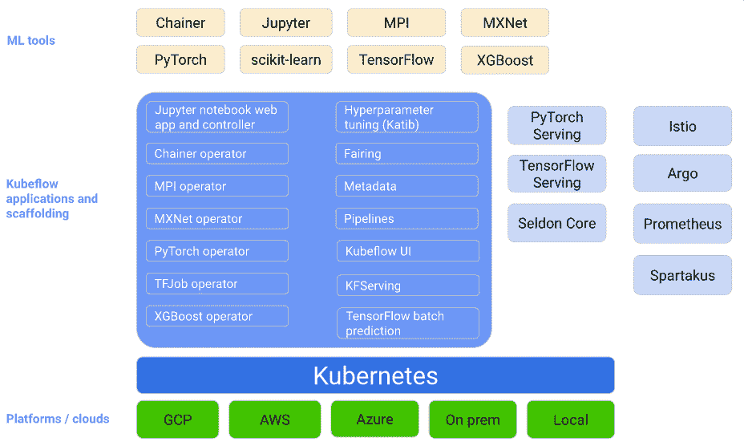
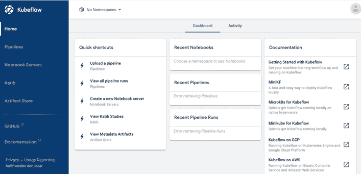

# AWS 上的 Kubeflow

> 原文：<https://medium.com/globant/kubeflow-on-aws-ee50d211cf2b?source=collection_archive---------0----------------------->

在本文中，我将简要介绍 Kubeflow，并展示在 AWS 上安装和设置 Kubeflow 的步骤。在开始技术步骤和命令之前，让我们先看看什么是 Kubeflow，并理解它的用例。

# 介绍

每个利用机器学习(ML)的组织的最终目标都是让他们的 ML 模型成功地在生产中运行，并为企业创造价值。但是，达到这一点需要什么呢？

在模型投入生产之前，可能需要许多步骤来构建和部署 ML 模型:数据加载、验证、分割、处理、特征工程、模型训练和验证、超参数调整和模型服务。

此外，ML 模型可能比传统应用程序需要更多的观察，因为您的数据输入可能会随时间漂移。手动重建模型和数据集既耗时又容易出错。

为了简化这些需求和挑战，Kubeflow 应运而生。

Kubeflow 基于可移植性和可伸缩性原则，利用了 Kubernetes 的底层功能。可移植性意味着模型和应用程序不是特定于平台的，可以跨多个云提供商工作。借助 K8S 的可伸缩性，用户可以轻松地向应用程序添加资源。

# 关于 Kubeflow

下图提供了 Kubeflow 的概念性概述，描述了 ML 系统的关键组件。



每个组件的简要说明如下:

# ML 工具

*   Chainer —一个强大、灵活、直观的神经网络框架。
*   [Jupyter](https://jupyter.org/#:~:text=The%20Jupyter%20Notebook%20is%20an,machine%20learning%2C%20and%20much%20more.)——一个开源的网络应用程序，允许你创建和分享包含实时代码、方程式、可视化和叙述性文本的文档。用途包括:数据清理和转换、数值模拟、统计建模、数据可视化、机器学习等等。
*   [MPI](https://github.com/kubeflow/mpi-operator)—kube flow 中的 MPI operator 使得在 Kubernetes 上运行所有 reduce 风格的分布式培训变得容易。
*   [MXNet](https://mxnet.apache.org/versions/1.6/) —深度学习的灵活高效库。
*   [PyTorch](https://pytorch.org/) —开源深度学习平台，提供从研究原型到生产部署的无缝路径。
*   [sci kit-learn](https://scikit-learn.org/stable/)—sci kit-learn 提供了数十种内置的机器学习算法和模型。
*   [TensorFlow](https://www.tensorflow.org/) —一个端到端的开源机器学习平台，它是一个符号数学库，用于神经网络等机器学习应用。
*   [XGBoost](https://xgboost.readthedocs.io/en/latest/) —这是一个优化的分布式梯度增强库，旨在高效、灵活和可移植。它在梯度推进框架下实现机器学习算法。

# Kubeflow 组件

*   [Jupyterhub](https://jupyter.org/hub) —为公司、教室和研究实验室设计的多用户版本的笔记本电脑。
*   [Chainer Operator](https://github.com/kubeflow/chainer-operator) —提供一个 Kubernetes 定制资源来运行分布式或非分布式链接作业。
*   [MPI 操作员](https://github.com/kubeflow/mpi-operator) — Kubernetes 操作员，用于全还原式分布式培训。
*   [MXNet 操作员](https://github.com/kubeflow/mxnet-operator) — Kubernetes 操作员运行分布式或非分布式 MXNet 作业以进行培训和调整。
*   [PyTorch 操作员](https://github.com/kubeflow/pytorch-operator) —提供创建和管理 PyTorch 作业的资源。
*   [TFJob Operator](https://github.com/kubeflow/tf-operator) — TFJob 提供了一个 Kubernetes 自定义资源，可以轻松地在 Kubernetes 上运行分布式或非分布式 TensorFlow 作业。
*   [XGBoot 操作员](https://github.com/kubeflow/xgboost-operator) —这是[XG boot](https://github.com/dmlc/xgboost)操作员的孵化项目。XGBoost 操作符使得在 Kubernetes 集群上运行分布式 XGBoost 作业培训和批量预测变得很容易。
*   [Katlib](https://github.com/kubeflow/katib) — Katib 是一个基于 Kubernetes 的系统，用于[超参数调整](https://en.wikipedia.org/wiki/Hyperparameter_optimization)和神经架构搜索。Katib 支持许多 ML 框架，包括 TensorFlow、Apache MXNet、PyTorch、XGBoost 等。
*   [整流罩](https://github.com/kubeflow/fairing) — Kubeflow 整流罩是一个 Python 包，它简化了在混合云环境中构建、训练和部署机器学习(ML)模型的过程。通过使用 Kubeflow 整流并添加几行代码，您可以直接从 Python 代码或 Jupyter 笔记本在本地或云中运行您的 ML 训练作业。训练工作完成后，您可以使用 kube flow strength 将训练好的模型部署为预测端点。
*   [元数据](https://github.com/kubeflow/metadata) —元数据相关资产的存储库。
*   [管道](https://github.com/kubeflow/pipelines) — Kubeflow 管道是使用 Kubeflow 管道 SDK 构建的可重复使用的端到端 ML 工作流。
*   [Kubeflow UI](https://www.kubeflow.org/docs/components/central-dash/overview/) —跟踪所有组件的中央仪表盘。
*   [KFServing](https://www.kubeflow.org/docs/components/serving/kfserving/) — KFServing 支持 Kubernetes 上的无服务器推理，并为 TensorFlow、XGBoost、scikit-learn、PyTorch 和 ONNX 等常见机器学习(ML)框架提供高性能、高抽象的接口，以解决生产模型服务用例。
*   [TensorFlow 批处理预测](https://v0-6.kubeflow.org/docs/components/serving/tfbatchpredict/) —允许用户在批处理模式下以 SavedModel 格式对经过训练的 TensorFlow 模型运行预测作业。
*   [PyTorch Serving](https://pytorch.org/blog/model-serving-in-pyorch/#:~:text=This%20is%20an%20application%20built,of%20managing%20and%20serving%20models.) —它允许您上传多个模型，并为每个模型获取不同的预测终点。通常这样的系统包括许多其他的特性来帮助解决更多的管理和服务模型的问题。
*   [TensorFlow serving](https://www.tensorflow.org/tfx/guide/serving) —这是一个灵活、高性能的机器学习模型服务系统，专为生产环境而设计。TensorFlow 服务可以轻松部署新的算法和实验，同时保持相同的服务器架构和 API。
*   [Seldon core](https://docs.seldon.io/projects/seldon-core/en/v0.4.0/#:~:text=Seldon%20Core%20is%20an%20open,the%20cloud%20or%20on%2Dpremise.&text=Provide%20a%20consistent%20serving%20layer%20for%20models%20built%20using%20heterogeneous%20ML%20toolkits.) —在 Kubernetes 集群上部署机器学习模型的开源平台。在云中或内部部署机器学习模型。为使用异构 ML 工具包构建的模型提供一致的服务层。
*   [Istio](https://cloud.google.com/istio) —这是一个开源的独立服务网格，提供了成功运行分布式微服务架构所需的基础。Istio 通过提供统一的方法来保护、连接和监控微服务，降低了管理微服务部署的复杂性。
*   [Argo](https://argoptoj.github.io/argo)—Kubernetes 的一个健壮的工作流引擎，支持将工作流中的每个步骤作为一个容器来实现。
*   Prometheus —系统监控和警报工具包。
*   [Spartakus](https://github.com/kubernetes-incubator/spartakus) —它用于报告和收集指标。

# 在 AWS 上安装 Kubeflow 的步骤

# 先决条件:

*   安装 kubectl。
*   安装和配置 AWS 命令行界面(AWS CLI):

```
1\. Install the [AWS Command Line Interface](https://docs.aws.amazon.com/cli/latest/userguide/cli-chap-install.html).
2\. Configure the AWS CLI by running the following command: 
           **Command:** aws configure
3\. Enter your Access Keys ([Access Key ID and Secret Access Key](https://docs.aws.amazon.com/general/latest/gr/aws-sec-cred-types.html#access-keys-and-secret-access-keys)).
4\. Enter your preferred AWS Region and default output options.
```

*   安装 eksctl(版本 0.1.31 或更高版本)和 aws-iam-authenticator。

# 创建 EKS 集群:

使用 AWS EKS CLI、CloudFormation 或 Terraform、AWS CDK 或 eksctl，可以通过多种方式调配 EKS 集群。如果这是您第一次**创建**亚马逊 **EKS 集群**建议使用 eksctl 创建 EKS 集群，因为它会自动满足所有基础架构供应需求。您只需使用 eksctl 工具传递参数，如下所示。即创建自动调用者、设置 VPC、rbac 认证等。

```
**Example:** eksctl create cluster \
         --name prod \
         --version 1.17 \
         --region us-west-2 \
         --nodegroup-name linux-nodes \
         --node-type t3.medium \
         --nodes 3 \
         --nodes-min 1 \
         --nodes-max 4 \
         --ssh-access \
         --ssh-public-key my-public-key.pub \
         --managed
```

# 准备您的环境:

为了在现有的亚马逊 EKS 集群上部署 Kubeflow，您需要提供 AWS_CLUSTER_NAME、集群区域和 worker 角色。按照以下步骤为 Kubeflow CLI 下载 kfctl 二进制文件，并设置一些方便的环境变量:

1.  从 kubeflow 发布页面下载 kfctl v1.1.0 版本。
2.  打开焦油球包装:

```
**Command:** tar -xvf kfctl_v1.1.0_<platform>.tar.gz
```

3.创建环境变量以简化部署过程:

*   将 kfctl 添加到 PATH 中，以使 kfctl 二进制文件更易于使用:

```
**Command:** export PATH=$PATH:"<path to kfctl>"
```

*   使用以下 kfctl 配置文件进行 AWS 设置，无需验证:

```
**Command:** export CONFIG_URI="https://raw.githubusercontent.com/kubeflow/manifests/v1.1-branch/kfdef/kfctl_aws.v1.1.0.yaml"
```

*   或者，如果要启用身份验证、授权和多用户，请使用以下 kfctl 配置:

```
**Command:** export CONFIG_URI="https://raw.githubusercontent.com/kubeflow/manifests/v1.1-branch/kfdef/kfctl_aws_cognito.v1.1.0.yaml"
```

*   为 AWS 集群名设置一个环境变量:

```
**Command:** export AWS_CLUSTER_NAME=<YOUR EKS CLUSTER NAME>
```

*   创建要存储部署的目录，该目录必须是${AWS_CLUSTER_NAME}:

```
**Command:** mkdir ${AWS_CLUSTER_NAME} && cd ${AWS_CLUSTER_NAME}
```

*   下载您的配置文件，以便您可以在部署 Kubeflow 之前定制配置:

```
**Command:** wget -O kfctl_aws.yaml $CONFIG_URI
```

# 配置 kubeflow:

我们可以用两种方式配置 kubeflow:

**选项 1:将 IAM 用于服务帐户**

kfctl 将帮助创建或重用 IAM OIDC 身份提供者，创建角色并处理与 Kubernetes 服务帐户的信任关系绑定。

**注意:**默认情况下，我们不会为 KF-user-$ { region }-$ { cluster _ name }附加任何策略，您可以根据需要附加策略。

在＄{ CONFIG _ URI }文件中添加 enablePodIamPolicy: true:

```
region: us-west-2
enablePodIamPolicy: true# you can delete following roles settings.
#roles:
#- eksctl-kubeflow-example-nodegroup-ng-185-NodeInstanceRole-1DDJJXQBG9EM6
```

**选项 2:使用节点组角色**

1.  检索工作节点的 AWS 区域和 IAM 角色名。要获取 Amazon EKS 工作节点的 IAM 角色名，请运行以下命令:

```
aws iam list-roles \
    | jq -r ".Roles[] \
    | select(.RoleName \
    | startswith(\"eksctl-$AWS_CLUSTER_NAME\") and contains(\"NodeInstanceRole\")) \
    .RoleName"eksctl-kubeflow-example-nodegroup-ng-185-NodeInstanceRole-1DDJJXQBG9EM6
```

2.在 kfctl_aws.yaml 文件中更改集群区域和工作角色名称:

```
region: us-west-2
roles:
- eksctl-kubeflow-example-nodegroup-ng-185-NodeInstanceRole-1DDJJXQBG9EM6
```

# 部署 Kubeflow:

1.  运行以下命令来初始化 Kubeflow 集群:

```
**Command:** kfctl apply -V -f kfctl_aws.yaml
```

2.等待 kubeflow 名称空间中的所有资源准备就绪:

```
**Command:** kubectl -n kubeflow get all
```

**访问 Kubeflow 中央仪表盘:**

运行以下命令获取 Kubeflow 服务的端点主机名，并在浏览器中复制链接。

```
**Command:** kubectl get ingress -n istio-systemNAMESPACE      NAME            HOSTS   ADDRESS                                                             PORTS   AGE
istio-system   istio-ingress   *       a743484b-istiosystem-istio-2af2-xxxxxx.us-west-2.elb.amazonaws.com   80      1h
```



# 主要学习内容

根据安装该工具的经验，可以观察到以下几点:

*   请注意，每个实例类型的每个节点都有 POD 限制。在 AWS 中，最大 Pod 限制基于实例类型。我们不能更改每个节点的单元数量，因此在调配基础架构时选择节点非常重要。
*   Kubeflow 文档是一个很好的开端，但用户应该熟悉 kubernetes/集装箱化平台来设置 kubeflow。
*   当我们使用 eksctl 工具创建 EKS 集群时，它会自动创建并执行两个云结构堆栈，一个用于集群，另一个用于节点组。我们可以通过 CloudFormation 堆栈事件跟踪集群和节点创建的进度。
*   我们需要一台专用的机器/服务器，用于安装和设置使用 eksctl 启动 EKS 集群所需的所有工具，例如 kubectl、kfctl、eksctl 和 aws-iam-authenticator。
*   由于 EKS 主机完全由 AWS 自己管理，我们在那里没有任何控制权，因此在撰写本文时启动/停止选项不可用，但是我们可以控制属于同一个集群的 worker-nodes，根据需要调整其大小。这些动作也可以通过手动或使用自动缩放功能来处理。这取决于您如何启动集群。

# 摘要

*   Kubeflow 是一个面向数据科学家和 ML 工程师的平台，他们希望在各种环境中构建和部署 ML 系统，用于开发、测试和生产级服务。
*   Kubeflow 可以根据用户需求托管在托管和自托管的 kubernetes 集群上。
*   要在 AWS 上设置 kubeflow，我们需要首先创建 EKS 集群，可以使用 AWS EKS CLI、CloudFormation 或 Terraform、AWS CDK 或 eksctl 以多种方式进行配置。
*   为了在现有的亚马逊 EKS 集群上部署 Kubeflow，您需要提供 AWS_CLUSTER_NAME、集群区域和 worker 角色。
*   AWS 上的 Kubeflow 可以通过两种方式进行配置，一种是将 IAM 用于服务帐户，另一种是节点组角色。