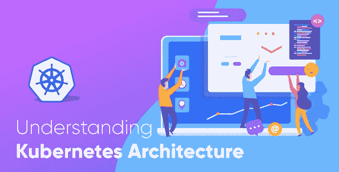
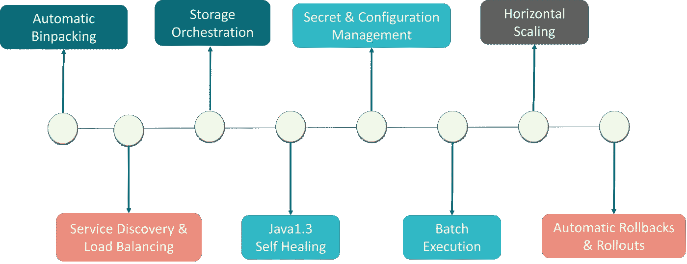
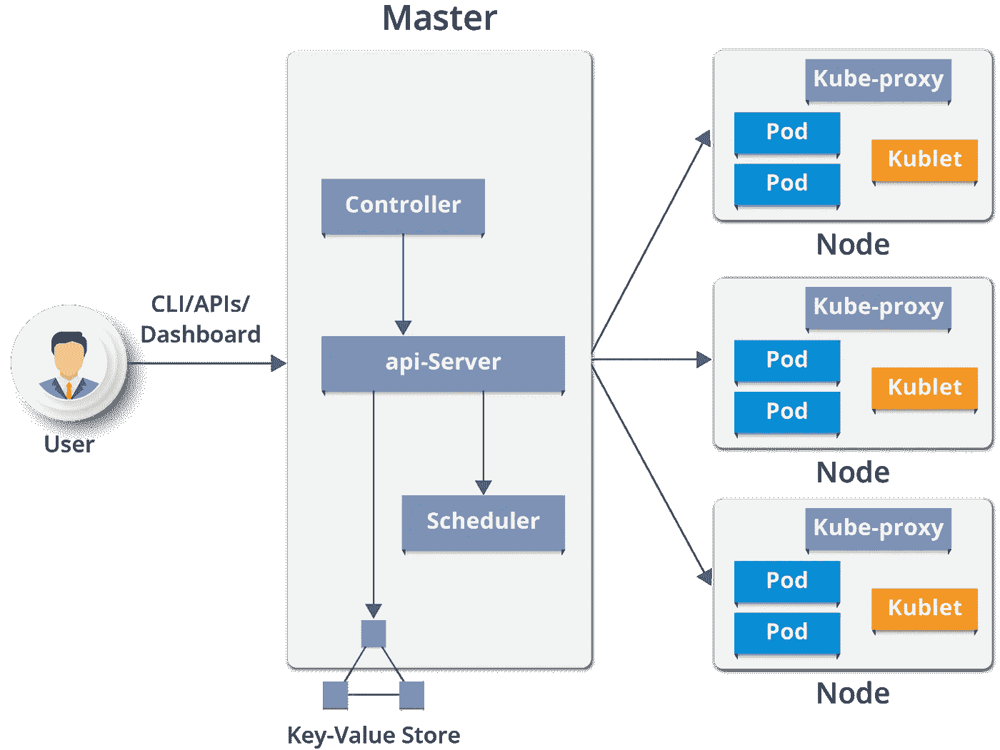
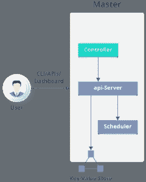
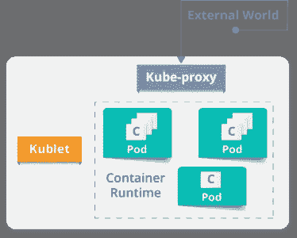
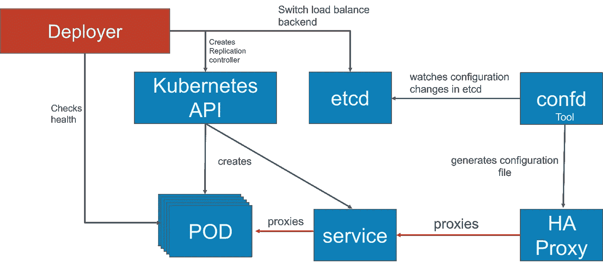
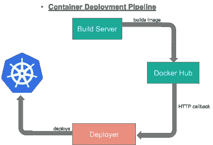

# 通过一个用例理解 Kubernetes 架构

> 原文：<https://medium.com/edureka/kubernetes-architecture-c43531593ca5?source=collection_archive---------0----------------------->

Understanding Kubernetes Architecture - Edureka

容器已经成为开发应用程序的决定性方式，因为它们提供了包含运行应用程序所需的一切的包。在这个博客中，我们将讨论 Kubernetes 建筑，Kubernetes 的移动部分，以及什么是关键元素，它们在 Kubernetes 建筑中的角色和职责是什么。

# Kubernetes:概述

Kubernetes 是一个开源的容器管理工具，可以自动进行容器部署、容器伸缩和容器负载平衡。

*   写在 Golang 上，它有一个巨大的社区，因为它最初是由谷歌开发的&后来捐赠给了 T2 CNCF T3
*   可以将“n”个容器组合成一个逻辑单元，以便轻松管理和部署它们

***注*** *: Kubernetes 不是一个容器化的平台。这是一个多容器管理解决方案。*

# 库伯内特的特点

详细解释，看这个[博客](/edureka/what-is-kubernetes-container-orchestration-tool-d972741550f6)。

Features of Kubernetes - Kubernetes Architecture

# Kubernetes 架构/Kubernetes 组件

Components of Kubernetes Architecture - Kubernetes Architecture

Kubernetes 架构有以下主要组件:

*   主节点
*   工作/从属节点
*   分布式键值存储(etcd)

# 主网点

Master Node of Kubernetes - Kubernetes Architecture

它是负责管理 Kubernetes 集群的所有管理任务的入口点。集群中可以有多个主节点来检查容错能力。多个主节点将系统置于高可用性模式，其中一个将成为我们执行所有任务的主节点。

为了管理集群状态，它使用 **etcd** ，其中所有主节点都连接到它。

让我们讨论一下主节点的组成部分。如上图所示，它由 4 个组件组成:

**API 服务器:**

*   通过主节点中的 API 服务器执行所有管理任务。
*   在这个 REST 中，命令被发送到验证和处理请求的 API 服务器。
*   请求后，集群的结果状态存储在分布式键值存储中。

**调度程序:**

*   调度器将任务调度给从节点。它存储每个从节点的资源使用信息。
*   它以 pod 和服务的形式安排工作。
*   在调度任务之前，调度器还考虑服务需求的质量、数据局部性、亲和性、反亲和性等。

**控制器管理器:**

*   也被称为**控制器**。
*   它是一个管理 Kubernetes 集群的守护进程，该集群管理不同的非终止控制循环。
*   它还执行生命周期功能，例如名称空间创建和生命周期、事件垃圾收集、终止 pod 垃圾收集、级联删除垃圾收集、节点垃圾收集等。
*   基本上，控制器通过 API 服务器观察它管理的对象的期望状态和它们的当前状态。如果它管理的对象的当前状态不符合期望状态，则控制回路采取校正步骤以确保当前状态与期望状态相同。

**什么是 ETCD？**

*   etcd 是存储集群状态的分布式键值存储。
*   它可以是 Kubernetes 主服务器的一部分，也可以在外部配置。
*   etcd 是用 Go 编程语言编写的。在 Kubernetes 中，除了存储集群状态(基于 **Raft 共识算法**)之外，它还用于存储配置细节，如子网、配置图、机密等。
*   raft 是一种共识算法，旨在替代 Paxos。一致性问题涉及多个服务器对值达成一致；这是复制状态机环境中出现的一个常见问题。Raft 定义了三种不同的角色(领导者、追随者和候选人),并通过选出的领导者达成共识

现在您已经了解了主节点的功能。让我们看看什么是 Worker/Minions 节点及其组件。

# 工作者节点(以前称为 minions)

Worker Node of Kubernetes - Kubernetes Architecture

它是一个物理服务器，或者你可以说是一个虚拟机，它使用由主节点控制的 pod(**一个 pod 调度单元**)运行应用程序。在物理服务器(工作节点/从属节点)上，对 pod 进行调度。为了从外部世界访问应用程序，我们连接到节点。

让我们看看以下组件是什么:

**容器运行时间:**

*   为了运行和管理容器的生命周期，我们需要在 worker 节点上有一个**容器运行时**。
*   有时，Docker 也被称为容器运行时，但准确地说，Docker 是一个使用**容器**作为容器运行时的平台。

**库伯莱:**

*   它是一个与主节点通信并在节点或工作节点上执行的代理。它通过 API 服务器获取 Pod 规范，执行与 Pod 相关联的容器，并确保这些 Pod 中描述的容器正在运行且正常。

**Kube-proxy:**

*   Kube-proxy 在每个节点上运行，处理单个主机子网，并确保服务对外部各方可用。
*   它充当单个工作节点上服务的网络代理和负载平衡器，并管理 TCP 和 UDP 数据包的网络路由。
*   它是运行在每个工作节点上的网络代理，并监听 API 服务器的每个服务端点创建/删除。
*   对于每个服务端点，kube-proxy 都设置了路由，这样它就可以到达它。

# 分离舱

pod 是逻辑上组合在一起的一个或多个容器。pod 在节点上运行。pod 作为一个逻辑单元一起运行。所以它们有相同的共享内容。它们共享相同的 IP 地址，但可以通过本地主机和共享存储访问其他 pod。pod 不需要全部运行在同一台机器上，因为容器可以跨越多台机器。一个节点可以运行多个单元。

# 用例:Luminis Technologies 如何在生产中使用 Kubernetes

**问题:** Luminis 是一家软件技术公司，他们使用 [AWS](https://www.edureka.co/blog/amazon-aws-tutorial/?utm_source=medium&utm_medium=content-link&utm_campaign=kubernetes-architecture) 来部署他们的应用程序。为了部署应用程序，需要定制脚本和工具来实现自动化，这对于运营团队以外的团队来说并不容易。此外，小团队没有资源来学习关于脚本和工具的所有细节。

**主要问题:**没有**部署单元**，这在开发和运营团队之间造成了隔阂。

**解决方案:**

**他们在 Kubernetes 是如何部署的:**

Use Case of Deploying in Kubernetes - Kubernetes Architecture

他们使用蓝绿色部署机制来降低处理多个并发版本的复杂性。(因为总是只有一个版本的应用程序在后台运行)

在这种情况下，作为 Amdatu umbrella 项目的一部分，他们的团队通过在 Apache 许可下开源他们的实现，创建了一个名为“ **Deployer** ”的组件来协调部署。这种机制在重新配置负载平衡器之前对 pod 执行健康检查，因为它们希望部署的每个组件都提供健康检查。

**他们如何实现部署自动化？**

Automate Deployments - Kubernetes Architecture

随着**部署者**的到位，他们能够将部署加入到构建管道中。在成功构建之后，他们的构建服务器将新的 Docker 映像推送到 Docker Hub 上的注册表中。然后构建服务器调用**部署器**自动将新版本部署到测试环境中。通过在生产环境中触发**部署者**，同一个映像被提升到生产环境中。

这就是库伯内特简单的建筑风格。这个关于 Kubernetes 建筑的博客到此结束。如果你想查看更多关于人工智能、Python、道德黑客等市场最热门技术的文章，你可以参考 Edureka 的官方网站。

请留意本系列中的其他文章，它们将解释 Kubernetes 的各个方面。

> 1.[什么是 Kubernetes？](/edureka/what-is-kubernetes-container-orchestration-tool-d972741550f6)
> 
> 2.[在 Ubuntu 上安装 Kubernetes](/edureka/install-kubernetes-on-ubuntu-5cd1f770c9e4)
> 
> 3. [Kubernetes 教程](/edureka/kubernetes-tutorial-fe6de6a20325)
> 
> 4. [Kubernetes 仪表板安装&视图](/edureka/kubernetes-dashboard-d909b8b6579c)
> 
> 5. [Kubernetes 网络](/edureka/kubernetes-networking-a46d9f994bab)
> 
> 6.[Kubernetes vs Docker Swarm](/edureka/kubernetes-vs-docker-45231abeeaf1)
> 
> 7. [Kubernetes 面试问题](/edureka/kubernetes-interview-questions-c9790e5abddb)
> 
> 8.[与亚马逊 EKS 合作开发 Kubernetes 应用](/edureka/amazon-eks-ac646c23abf8)
> 
> 9.[在 AWS 上设置 Kubernetes 入口控制器](/edureka/kubernetes-ingress-controller-nginx-c5cf9e8ff031)
> 
> 10.[如何用 Elasticsearch 和 Kibana 可视化 Kubernetes 集群](/edureka/logging-monitoring-elasticsearch-fluentd-kibana-e2cd477a576b)

*原载于 2018 年 9 月 6 日*[*www.edureka.co*](https://www.edureka.co/blog/kubernetes-architecture/)*。*