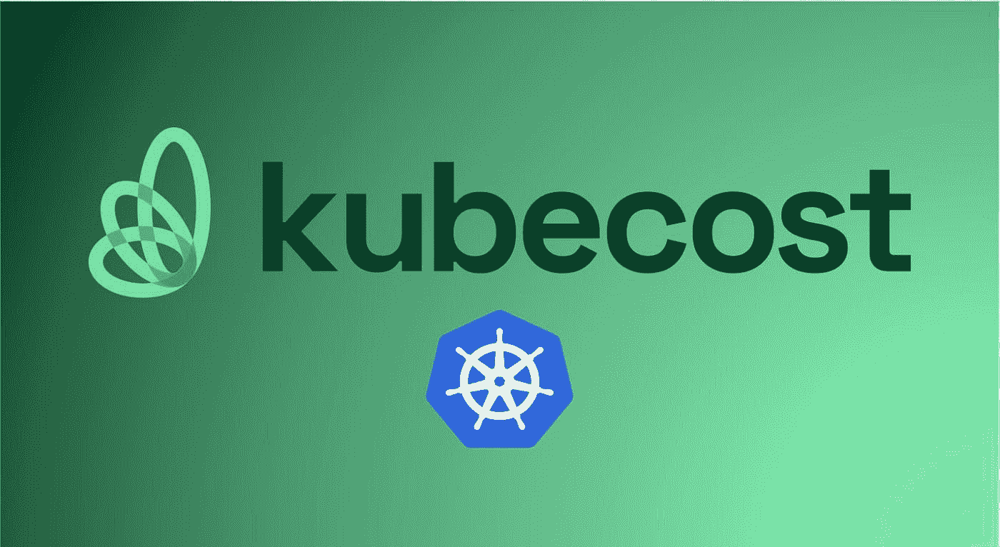
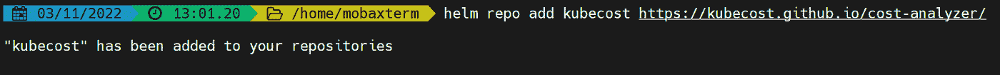
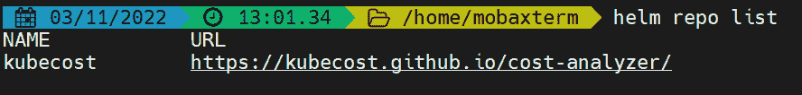
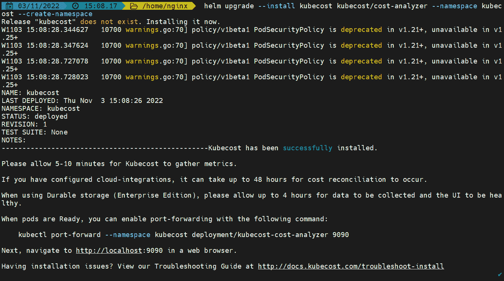
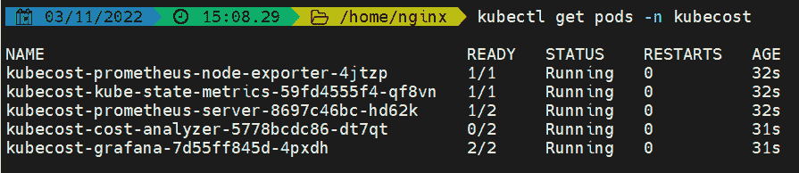
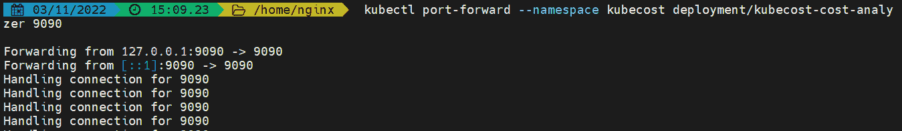
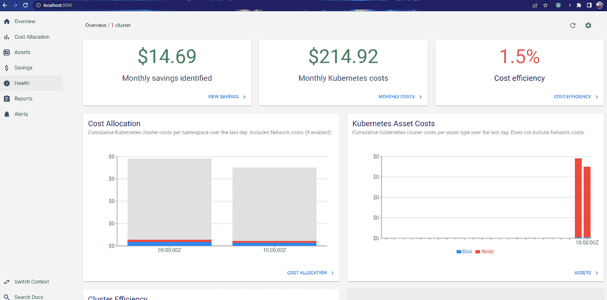
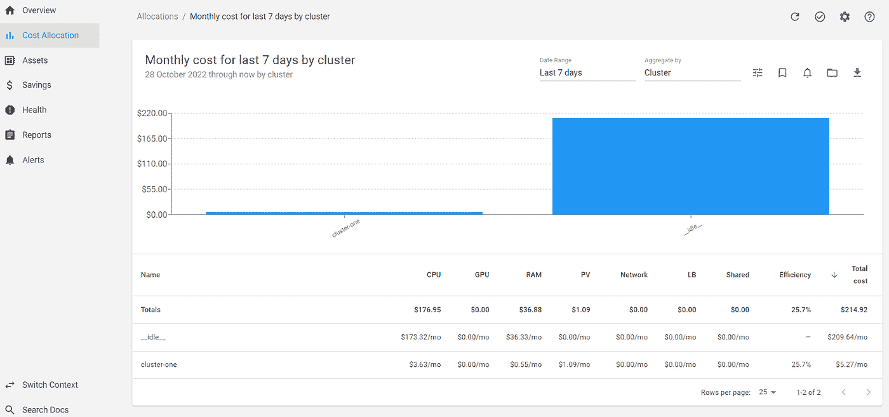
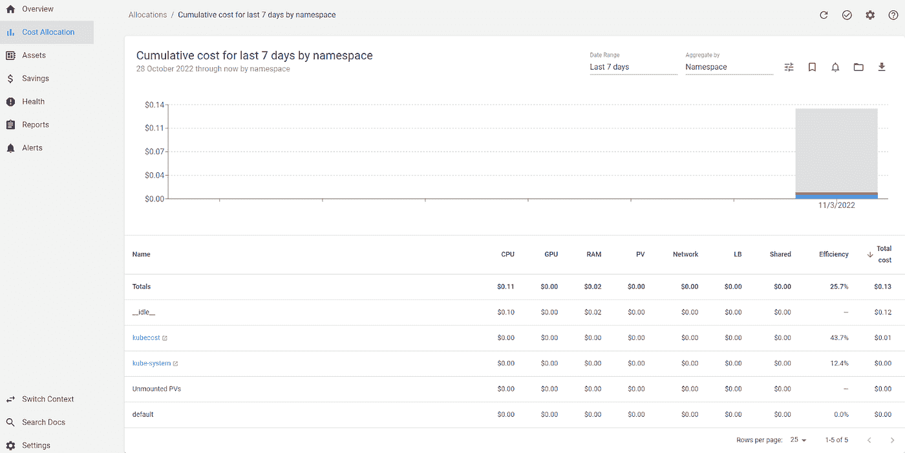

# 使用 Kubecost 优化 Kubernetes 成本

> 原文：<https://medium.com/globant/kubernetes-cost-optimization-with-kubecost-55f68aa8743?source=collection_archive---------0----------------------->

## 深入了解 Kubernetes 并优化成本



在这个基于微服务的架构时代，大规模运行多个 Kubernetes 集群，监控和分配成本成为一项艰巨的任务。使用 Kubecost，您可以更好地了解 Kubernetes 的当前和历史支出和资源分配，并在支持多个应用程序、团队、部门等的 Kubernetes 环境中体验成本透明度。Kubecost 是一个独立于供应商的工具，用于实时成本监控和优化，并提供对 Kubernetes 的深入了解。Kubecost 可以帮助我们在 Kubernetes 的支出上节省数十亿美元。

在本文中，我们将讨论 Kubecost 的主要特性，并研究它的实现。

# Kubecost 的主要特点

以下是 Kubecost 的本质特征。

*   **成本分配**
    Kubecost 将成本分配给所有本地 Kubernetes 概念，如名称空间、部署、服务等。，并允许基于组织概念(如团队、个人应用程序、产品/项目、部门等)进行定制。
*   **统一成本监控**
    它显示 CPU 和内存等集群内成本，以及 S3 存储桶、RDS 实例等云基础架构服务的集群外支出。、(支持 AWS、GCP 和 Azure 的所有服务)实现全面的成本可见性。
*   **优化洞察**
    Kubecost 生成洞察以节省基础设施支出。这种定制的建议是基于我们的环境和行为模式。
*   **警报&治理**(付费功能)
    我们可以设置定制的实时警报(通过 Slack 或电子邮件)并生成报告。

除了这种统一的多集群视图，保存报告、SSO/SAML 登录、自定义指标保留、业务或企业支持等。，是付费版本中的一些附加功能。

Kubecost 有 3 种定价模式——免费、商业和企业。我们将使用免费定价模式。请记住，对于不同的定价模式，安装步骤是相同的。

现在让我们讨论为 Kubernetes 集群实现和设置 Kubecost 工具。

# Kubecost 实施

Kubecost 实现的先决条件是 Kubernetes 集群(版本 1.8 以上)和 Helm 客户端(版本 3.0 以上)。如果您已经有了，我们可以看看如何为 Kubernetes 集群从头开始配置 Kubecost。

1.  添加 Kubecost helm 存储库。

```
helm repo add kubecost https://kubecost.github.io/cost-analyzer/
```



验证已使用“helm repo list”命令添加了 helm 存储库。



2.安装 Kubecost。

```
 helm upgrade — install kubecost kubecost/cost-analyzer — namespace kubecost — create-namespace
```



3.验证 kubecost/成本分析器窗格是否在 kube cost 命名空间中运行。

```
kubectl get pods -n kubecost
```



4.pod 运行后，将 pod 的端口 9090 映射到您机器上的任何可用端口。(例如，我们使用的是 9090)

```
kubectl port-forward — namespace kubecost deployment/kubecost-cost-analyzer 9090
```



5.在 web 浏览器中通过`[http://localhost:9090](http://localhost:9090`)` URL 访问 Kubecost 仪表板。



下面的仪表板显示了成本分配指标，包括 CPU、GPU、内存等。、集群的消耗和命名空间。



这将在当前集群中安装 Kubecost。在仪表板中，您可以看到与 Kubernetes 相关的指标，如成本分配、集群效率等。，并根据它们采取行动。另外，你可以在这里参考官方的 Kubecost 文档来获得进一步的实现。

# 摘要

这样，您将有一个 Kubecost pod 在您的集群中运行，它可以帮助您查看成本分配趋势，并寻求成本节约和可靠性改进。

如果您正在寻找其他功能，如警报和治理、统一的多集群视图、保存报告、SSO/SAML 登录等，请选择付费版本。

# 参考

[https://www.kubecost.com/](https://www.kubecost.com/)

[https://guide.kubecost.com/hc/en-us](https://guide.kubecost.com/hc/en-us)