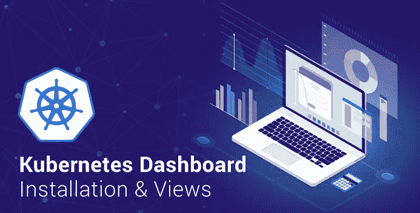
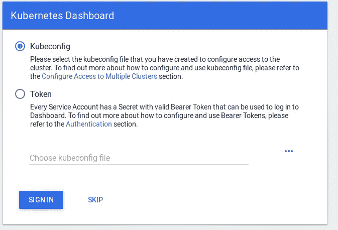
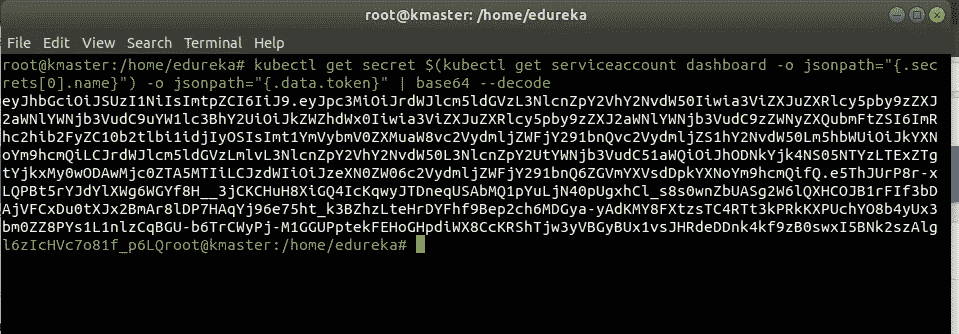
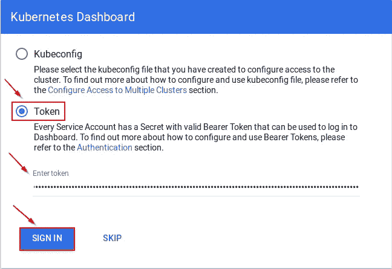
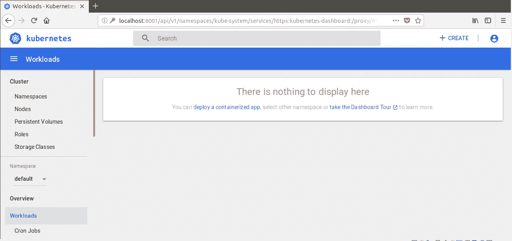
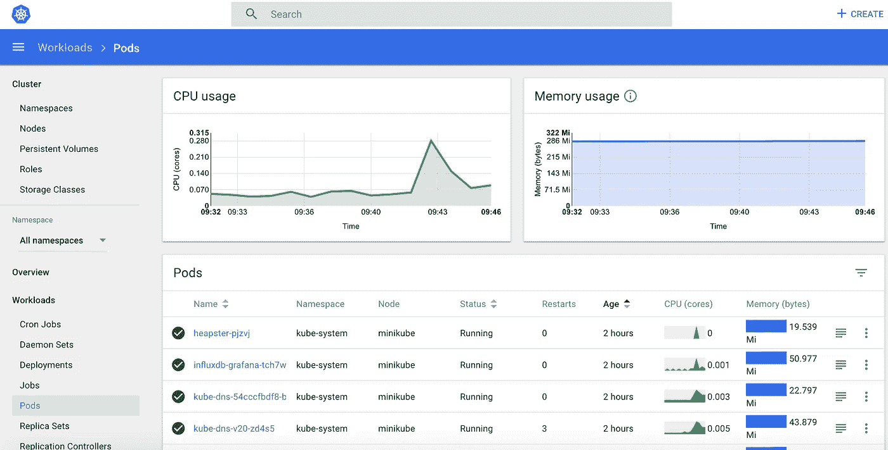
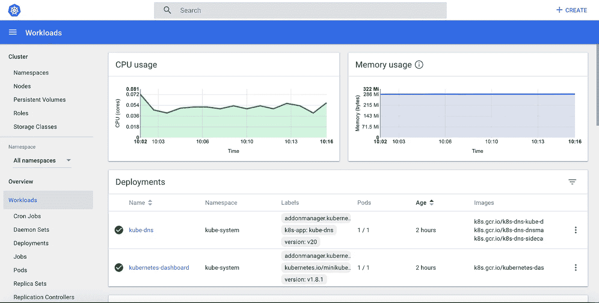
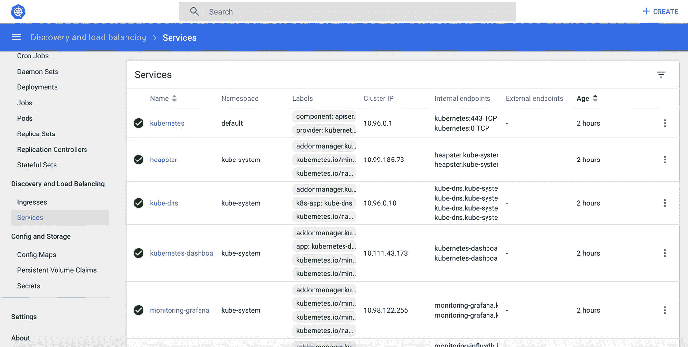
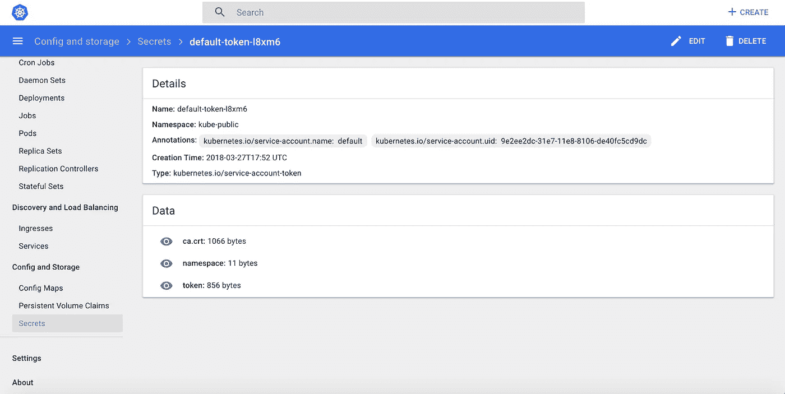

# 安装和使用 Kubernetes Dashboard 的分步指南

> 原文：<https://medium.com/edureka/kubernetes-dashboard-d909b8b6579c?source=collection_archive---------0----------------------->



Kubernetes Dashboard — Edureka

***Kubernetes Dashboard***是一个通用的、基于 web 的用户界面，用于 Kubernetes 集群。它允许用户管理集群中运行的应用程序并对其进行故障排除，以及管理集群本身。

因此，在继续之前，让我们看看我们将在本博客中涉及的主题:

*   什么是 Kubernetes 仪表板？
*   安装 Kubernetes 仪表板
*   Kubernetes 仪表板 UI 的视图

# 什么是 Kubernetes 仪表板？

Kubernetes 仪表板是一个基于 web 的 Kubernetes 用户界面，用于将容器化的应用程序部署到 Kubernetes 集群，对应用程序进行故障排除，以及管理集群本身及其附带的资源。

# Kubernetes 仪表板的使用

*   获得集群上运行的应用程序的概述。
*   创建或修改单个 Kubernetes 资源，例如部署、作业等。
*   它提供了集群中 Kubernetes 资源的状态信息，以及可能发生的任何错误的信息。

# 安装 Kubernetes 仪表板

**如何部署 Kubernetes Dashboard？**

运行以下命令来部署仪表板:

```
kubectl create -f https://raw.githubusercontent.com/kubernetes/dashboard/master/src/deploy/recommended/kubernetes-dashboard.yaml
```

# 使用 kubectl 访问仪表板

```
kubectl proxy
```

它将在你的机器和 Kubernetes API 服务器之间代理服务器。

现在，要在浏览器中查看控制面板，请在主虚拟机的浏览器中导航到以下地址:

```
http://localhost:8001/api/v1/namespaces/kube-system/services/https:kubernetes-dashboard:/proxy/
```

然后，此页面会提示您输入凭据:



# 创建群集管理服务帐户

在这一步中，我们将为仪表板创建一个服务帐户并获取其凭据。
***注意*** *:运行所有这些命令在一个* ***新的*** *终端，否则你的****kubectl proxy****命令会停止。*

运行以下命令:

此命令将在默认命名空间中为仪表板创建服务帐户

```
kubectl create serviceaccount dashboard -n default
```

将群集绑定规则添加到您的仪表板帐户

```
kubectl create clusterrolebinding dashboard-admin -n default \ --clusterrole=cluster-admin \ --serviceaccount=default:dashboard
```

使用以下命令复制您的仪表板登录所需的密钥令牌:

```
kubectl get secret $(kubectl get serviceaccount dashboard -o jsonpath="{.secrets[0].name}") -o jsonpath="{.data.token}" | base64 --decode
```



通过选择令牌选项，复制机密令牌并将其粘贴到仪表板登录页面中



登录后，您将进入 Kubernetes 主页。

**主页**
您将看到主页/欢迎页面，在该页面中，您可以查看哪些系统应用程序在集群的`kube-system`命名空间中默认运行，例如仪表板本身。



# Kubernetes 仪表板 UI 的视图

Kubernetes 仪表板由以下仪表板视图组成:

*   管理视图
*   工作负载视图
*   服务视图
*   存储和配置视图

让我们从管理视图开始。

# 管理视图

它列出了节点、命名空间和持久性卷，并提供了它们的详细视图，其中节点列表视图包含所有节点上聚合的 CPU 和内存使用情况指标，详细视图显示了节点的指标、其规格、状态、分配的资源、事件和节点上运行的单元。



# 工作负载视图

入口点视图显示了在所选名称空间中运行的所有应用程序。它汇总了有关工作负载的可操作信息，例如，副本集的就绪 Pod 数量或 Pod 的当前内存使用情况。



# 服务视图

它显示了 shows Kubernetes 资源，这些资源允许向外部世界公开服务并在集群中发现它们。



# 存储和配置视图

Storage 视图显示应用程序用于存储数据的持久卷声明资源，而 config 视图用于显示所有 Kubernetes 资源，这些资源用于在集群中运行的应用程序的实时配置。



这就结束了 Kubernetes Dashboard 上的博客。如果你想查看更多关于人工智能、Python、道德黑客等市场最热门技术的文章，你可以参考 Edureka 的官方网站。

请留意本系列中的其他文章，它们将解释 Kubernetes 的各个方面。

> 1.[什么是 Kubernetes？](/edureka/what-is-kubernetes-container-orchestration-tool-d972741550f6)
> 
> 2.[在 Ubuntu 上安装 Kubernetes](/edureka/install-kubernetes-on-ubuntu-5cd1f770c9e4)
> 
> 3. [Kubernetes 教程](/edureka/kubernetes-tutorial-fe6de6a20325)
> 
> 4. [Kubernetes 建筑](/edureka/kubernetes-architecture-c43531593ca5)
> 
> 5. [Kubernetes 网络](/edureka/kubernetes-networking-a46d9f994bab)
> 
> 6.[Kubernetes vs Docker Swarm](/edureka/kubernetes-vs-docker-45231abeeaf1)
> 
> 7. [Kubernetes 面试问题](/edureka/kubernetes-interview-questions-c9790e5abddb)
> 
> 8.[与亚马逊 EKS 合作开发 Kubernetes 应用](/edureka/amazon-eks-ac646c23abf8)
> 
> 9.[在 AWS 上设置 Kubernetes 入口控制器](/edureka/kubernetes-ingress-controller-nginx-c5cf9e8ff031)
> 
> 10.[如何用 Elasticsearch 和 Kibana 可视化 Kubernetes 集群](/edureka/logging-monitoring-elasticsearch-fluentd-kibana-e2cd477a576b)

*原载于 2018 年 9 月 7 日*[*【www.edureka.co】*](https://www.edureka.co/blog/kubernetes-dashboard/)*。*