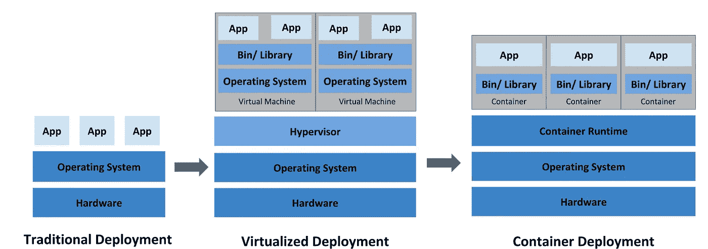
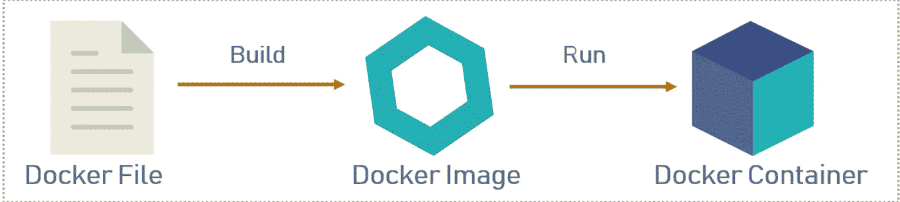
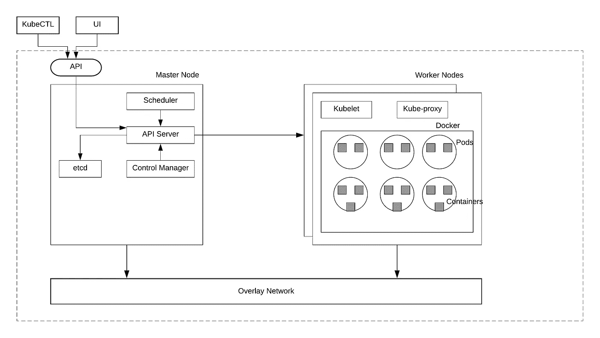
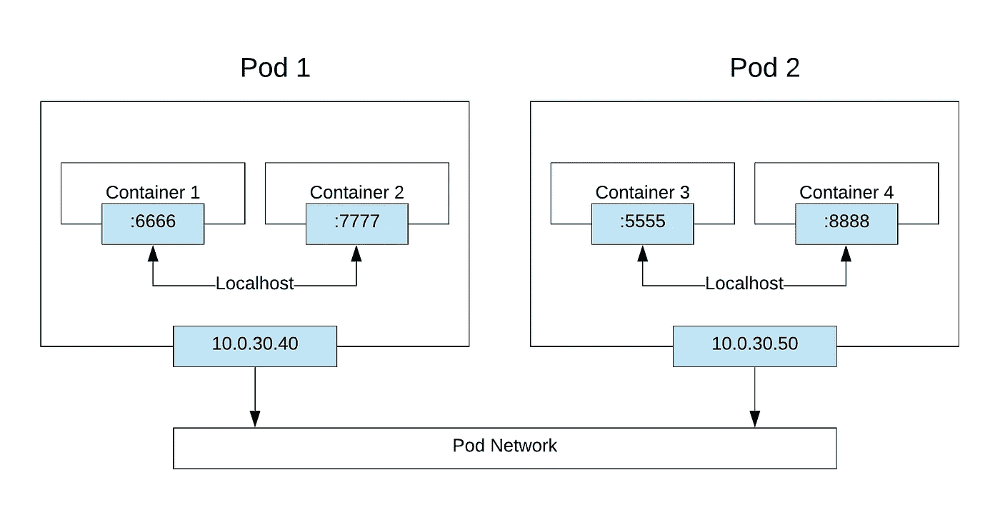
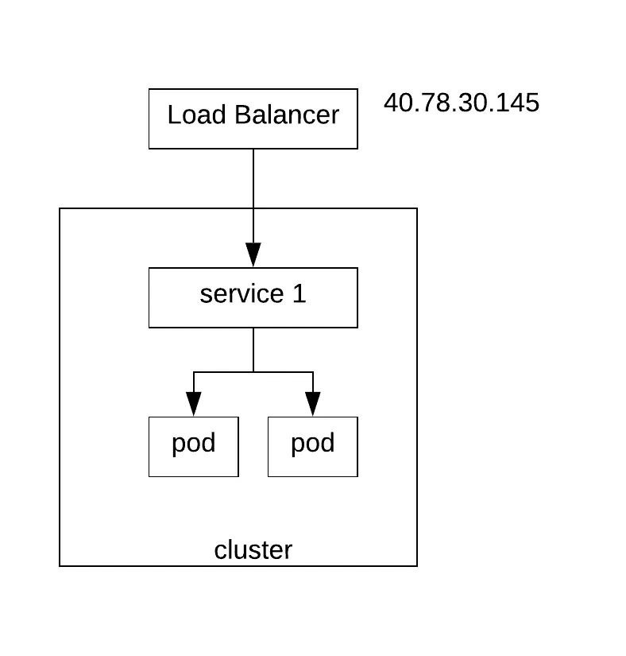
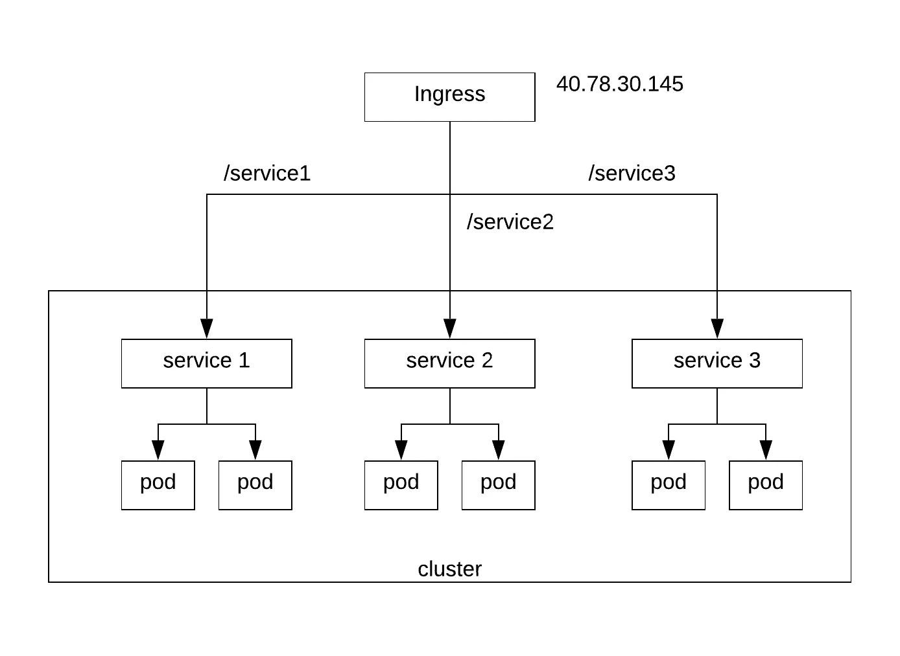

# Kubernetes —深潜

> 原文：<https://medium.com/walmartglobaltech/kubernetes-deep-dive-aeebfa1516c3?source=collection_archive---------2----------------------->


## **Kubernetes 简介**

Kubernetes (K8s)是一个用于自动化部署、扩展和管理容器化应用程序的开源系统。这是在 https://www.cncf.io/的[毕业的第一个项目。它最初是由谷歌开发的。](https://www.cncf.io/)

## **集装箱化简史**



> 传统部署

早期，组织在物理服务器上运行应用程序。没有办法为物理服务器中的应用程序定义资源边界，这导致了资源分配问题

> 虚拟化部署

它允许您在一台物理服务器的 CPU 上运行多个虚拟机(VM)。虚拟化允许应用程序在虚拟机之间隔离，并提供一定程度的安全性，因为一个应用程序的信息不能被另一个应用程序自由访问。

虚拟化允许更好地利用物理服务器中的资源，并允许更好的可扩展性，因为可以轻松地添加或更新应用程序，降低硬件成本，等等。借助虚拟化，您可以将一组物理资源呈现为一个可任意使用的虚拟机集群。

每个虚拟机都是在虚拟化硬件之上运行所有组件的完整机器，包括其自己的操作系统。

> 集装箱部署

容器类似于虚拟机，但是它们具有宽松的隔离属性，以便在应用程序之间共享操作系统(OS)。因此，容器被认为是轻量级的。与 VM 类似，容器有自己的文件系统、CPU、内存、进程空间等等。因为它们与底层基础设施相分离，所以它们可以跨云和操作系统发行版进行移植。

## **Docker 是什么？**

Docker 是一个平台，它以容器的形式将应用程序及其所有依赖项打包在一起。Docker 的容器化特性确保了应用程序可以在任何环境下工作。Docker 引擎在操作系统级别进行虚拟化。Kubernetes 使用 Docker 作为底层容器平台。



## **容器编排引擎**

容器编排引擎自动在一组服务器上部署、扩展和管理容器化的应用程序。它们提供以下功能:

> 群集—群集由一组主节点和一组运行应用程序的工作节点组成
> 
> 调度— COE 负责将容器调度到适当的工作节点
> 
> 可伸缩性—它们支持容器级和节点级的可伸缩性
> 
> 负载平衡—应用程序的多个实例作为容器运行。负载均衡器负责在多个工作节点上跨这些容器路由流量
> 
> 容错—监控工作节点和容器的健康状况，并确保定义数量的容器始终正常运行
> 
> 部署—支持多种部署策略，如滚动更新、蓝绿色、金丝雀等

以下是流行的容器编排引擎:

*   库伯内特斯
*   码头工人群
*   阿帕奇 Mesos

## **为什么选择 Kubernetes？**

*   最初是由谷歌设计的。已经在谷歌工作多年了。经过 Gmail、youtube 等应用程序的实战测试
*   cncf 毕业的第一个项目。非常活跃的开发生态系统。由行业领导者如谷歌、微软、亚马逊、IBM、甲骨文等支持
*   成熟稳定。当今大多数大公司都在使用它

## **库伯内特建筑**



Kubernetes Architecture

一个集群包含一个或多个主节点和许多工作节点。工作节点是运行应用程序的工作主机。

> **Kubernetes 大师**

负责管理集群。它协调集群内部的所有活动，并与工作人员进行交互。以下是主控器的主要组件:

> API 服务器—公开用于处理集群的各种 API
> 
> 调度程序—负责跨工作节点调度 pod
> 
> 控制管理器—在内部与各种控制器(如节点控制器、复制控制器)配合工作，以管理群集的整体运行状况
> 
> etcd —存储集群状态信息的分布式键值数据存储

## **Kubernetes 工人**

每个工作节点都有一个容器运行时。Docker 和 rocket 都支持。除此之外，每个工作节点上还运行以下组件

> Kubelet —在集群中的每个节点上运行的代理。它确保容器在 pod 中运行
> 
> kube proxy——在集群中的每个节点上运行的网络代理，实现了 Kubernetes [服务](https://kubernetes.io/docs/concepts/services-networking/service/)概念的一部分。它维护节点上的网络规则。这些网络规则允许从集群内部或外部的网络会话与您的 pod 进行网络通信。
> 
> 容器——它们是应用程序运行时。旨在运行微服务。docker 和基于 rocket 的容器都受支持
> 
> pods——它们是 Kubernetes 中调度的原子单位。每个 pod 包含一个或多个容器。



Pod networking

Pod 网络

*   每个 pod 都有一个 IP 地址
*   pod 中的每个容器都继承了 ip 并有一个端口
*   pod 内容器使用本地主机在 pod 内相互通信(pod 内通信)
*   跨 pod 的容器使用它们的 IP 地址相互通信(pod 间通信)

**复制集**

确保指定数量的 pod 随时运行 a .如果有多余的 pod，它们会被终止，反之亦然 b .当它们出现故障、被删除或终止时，会启动新的 pod

**部署**

一个*部署*为[吊舱](https://kubernetes.io/docs/concepts/workloads/pods/pod/)和[复制集](https://kubernetes.io/docs/concepts/workloads/controllers/replicaset/)提供声明性更新。你描述一个部署中的*期望状态*，部署[控制器](https://kubernetes.io/docs/concepts/architecture/controller/)以受控的速率将实际状态改变为期望状态。您可以定义部署来创建新的副本集，或者删除现有部署，并在新部署中采用它们的所有资源。

让我们来看一个名为 nginx-deployment.yaml 的示例部署:

```
apiVersion: apps/v1
kind: Deployment
metadata:
  name: nginx-deployment
  labels:
    app: nginx
spec:
  replicas: 3
  selector:
    matchLabels:
      app: nginx
  template:
    metadata:
      labels:
        app: nginx
    spec:
      containers:
      - name: nginx
        image: nginx:1.7.9
        ports:
        - containerPort: 80
```

***ku bectl apply-f ~/Documents/nginx-deployment . YAML***

***ku bectl get pods-o wide***

```
NAME                                READY     STATUS    RESTARTS   AGE       IP            NODEnginx-deployment-76bf4969df-6hpqr   1/1       Running   0          1m        10.244.5.14   aks-agentpool-22051123-1nginx-deployment-76bf4969df-8qv2z   1/1       Running   0          1m        10.244.4.11   aks-agentpool-22051123-0nginx-deployment-76bf4969df-sg787   1/1       Running   0          1m        10.244.3.12   aks-agentpool-22051123-3
```

## 达蒙塞特

DaemonSet 确保所有节点运行一个 pod 实例。这对于以下情况很有用

*   节点监控守护进程，如 collectD
*   日志收集守护程序:例如:fluentd

当新节点加入群集时，DaemonSet 会创建 pod，当任何节点离开群集时，它会销毁 pod。

```
apiVersion: apps/v1
kind: DaemonSet
metadata:
  name: fluentd-ds
spec:
template:
metadata:
      labels:
        name: fluentd
spec:
      containers:
      - name: fluentd
image: gcr.io/google-containers/fluentd-elasticsearch:1.20
selector:
    matchLabels:
      name: fluentd
```

## 乔布斯

作业可用于以下类型的工作负载

*   pod 应该启动、完成工作并终止
*   应该按照定义的计划运行的 pod

```
apiVersion: batch/v1
kind: Job
metadata:
name: countdown
spec:
template:
metadata:
name: countdown
spec:
containers:
- name: counter
image: centos:7
command:
- "bin/bash"
- "-c"
- "for i in 9 8 7 6 5 4 3 2 1 ; do echo $i ; done"
restartPolicy: Never
```

## 负载平衡器



Load balancer

负载平衡器服务是向互联网公开服务的标准方式。基于云提供商，它将生成各自的负载平衡器，并为您提供一个单一的 IP 地址，将所有流量转发到您的服务。

```
apiVersion: v1
kind: Service
metadata:
  name: helloindia
spec:
  type: LoadBalancer
  ports:
  - name: http
    port: 80
    targetPort: 8080
    protocol: TCP
  selector:
    app: helloindia
```

部署后，获取服务详细信息

```
kubectl get svcNAME         TYPE           CLUSTER-IP    EXTERNAL-IP     PORT(S)        AGEhelloindia   LoadBalancer   10.0.26.251   40.78.145.151   80:32076/TCP   15mkubernetes   ClusterIP      10.0.0.1      <none>          443/TCP        24m
```

## 入口控制器



当您在一个集群上部署了多个服务，并且想要公开一个入口点时，您可以使用 Ingress。稍后，您可以基于 URL 路径定义规则，将流量路由到适当的服务

```
apiVersion: extensions/v1beta1
kind: Ingress
metadata:
  name: ingress
  annotations:
    nginx.ingress.kubernetes.io/rewrite-target: /
spec:
  rules:
  - http:
      paths:
      - path: /service1
        backend:
          serviceName: service1
          servicePort: 80
      - path: /service2
        backend:
          serviceName: service2
          servicePort: 80
      - path: /service3
        backend:
          serviceName: service3
          servicePort: 80
```