# 如何在 AWS 上设置 Kubernetes Ingress 控制器？

> 原文：<https://medium.com/edureka/kubernetes-ingress-controller-nginx-c5cf9e8ff031?source=collection_archive---------1----------------------->

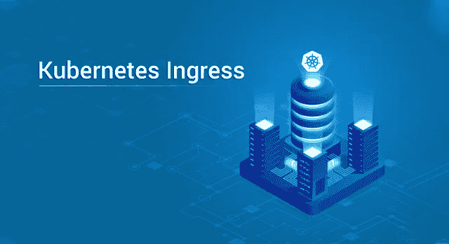

Kubernetes Ingress — Edureka

每个 Kubernetes 集群都需要两样东西——一是公开部署在容器上的服务的方法，二是平衡这些部署的服务的负载/流量的方法。在本文中，我们将讨论 Kubernetes Ingress 如何帮助我们实现这些目标。

本文将涉及以下主题:

*   什么是 Kubernetes？
*   公开应用程序/服务的不同方式
*   我们为什么需要 Kubernetes Ingress？
*   什么是 Kubernetes Ingress？
*   在 AWS 上设置 Kubernetes 集群并为集群设置入口的实践演示

# 什么是 Kubernetes？

在了解什么是 Kubernetes Ingress 之前，我们先来概述一下什么是 Kubernetes。Kubernetes 是一个开源平台，可以自动执行容器操作，如部署容器、向上扩展、向下扩展容器、负载平衡等。您可以将运行容器的主机集群化，Kubernetes 将帮助您轻松高效地管理这些集群。

# 在 Kubernetes 中公开应用程序的不同方式

一旦您在容器上部署了应用程序，您就需要一种方法将它暴露在集群之外以获取外部流量，或者更简单地说，将它暴露在互联网上，这样全世界都可以访问它。

有三种方法可以做到这一点:

## 将服务类型用作集群 IP:

ClusterIP 是默认的 Kubernetes 服务类型。使用此服务类型，一个名为 ClusterIP 的全局 IP 被分配给该群集，该群集在群集活动之前一直处于活动状态。使用此 IP，我们可以访问与该集群相关的所有服务。因此，基本上，当我们想要向同一个集群中的其他 pods 公开服务时，我们使用这种类型的服务。这个服务是使用 Kubernetes 代理访问的。

## 使用 NodePort 类型的 Kubernetes 服务:

当使用服务类型作为节点端口时，属于群集的每个节点上都打开一个端口，应用程序可以部署在该节点上，或者外部流量被路由到该节点端口，即使该节点上没有运行应用程序。我们可以明确地提到要激活的端口，或者 Kubernetes 默认分配一个节点端口。

## 使用负载平衡器类型的 Kubernetes 服务:

使用服务类型作为负载平衡器，它会自动创建一个指向 Kubernetes 集群的外部负载平衡器，该外部负载平衡器与特定的 IP 地址相关联，并将外部流量路由到集群中的 Kubernetes 服务。负载平衡器的实施取决于您的云服务提供商。

## 使用 Kubernetes 入口:

Kubernetes ingress 不是一项服务，而是管理外部用户如何访问 Kubernetes 集群上运行的服务的路由规则的集合。入口位于集群的前面，充当智能路由器。这总是使用称为代理的第三方来实现。流量路由由入口控制器完成。

我敢肯定你们想知道入口控制器是什么，但不要担心，这是我们将在本文中进一步详细讨论的主题，但首先让我们看看是什么让我们需要 Kubernetes 入口。

# 为什么选择 Kubernetes Ingress？

当您在集群上部署了一个应用程序时，您显然希望将它暴露给互联网以获取入站流量，否则部署是为了什么，对吗？Kubernetes Ingress 是一个内置的负载平衡框架，用于路由外部流量。

***我们使用 Kubernetes Ingress 主要有两个原因:***

1.  当在 AWS 或 GKE 等云平台上运行集群和部署时，负载平衡功能是现成可用的，不需要定义进入规则。但同样，使用外部负载平衡器意味着花费更多的钱，尤其是当您的部署是小规模部署并且您的预算紧张时，您还不如使用 Kubernetes Ingress，它绝对免费且经济实惠。
2.  入口是第 7 层负载平衡的抽象，而不是第 4 层。当我们谈到第 7 层时，我们指的是 OSI 模型的第 7 层，即应用层。它使用消息的实际内容来路由流量。与使用第 4 层(传输层)的反向负载均衡技术相比，当负载均衡器可以访问消息内容时，它显然可以做出更智能的路由决策。

# 什么是 Kubernetes Ingress？

到目前为止，您应该已经理解了 Kubernetes Ingress 是一组路由规则的集合，这些规则控制外部用户如何访问运行在 Kubernetes 集群上的服务。

Kubernetes Ingress 提供的功能:

1.  第 7 层负载平衡—如上所述
2.  SSL 终端—使用 SSL 终端保护您的连接
3.  基于名称的虚拟主机—根据传入请求的主机名定义服务路由。这允许您在同一个 IP 地址上运行多个服务。

让我们进一步深入细节。入口分为两个主要部分—入口资源和入口控制器

1.  **入口资源**
    入口资源定义了您希望服务请求如何被路由。它包含主要的路由规则。
2.  **入口控制器** 入口控制器的作用是读取入口资源的信息，并相应地处理数据。因此，基本上，入口资源包含路由流量的规则，入口控制器路由流量。

使用入口的路由没有标准化，即不同的入口控制器具有不同的语义(不同的路由方式)。

最终，您需要根据您的需求和实现来构建自己的入口控制器。入口是可用的最灵活和可配置的路由功能。

# 演示 1:在 AWS 上创建一个 Kubernetes 集群

在 Kubernetes 上部署任何类型的服务/应用程序首先需要的是一个集群。每个集群由一个主节点和一个或多个节点组成，具体取决于需求。在这个演示中，我将向您展示如何在 AWS 上创建一个 Kubernetes 集群。

**第一步:**创建一个实例，命名为 kubectl。我们将使用该实例部署集群。这个实例只安装了将与主实例交互的 kubectl 工具，没有安装 Kubernetes。

> **注意:**我们在 AWS 中使用了三个服务——存储所有文件的 s3 bucket，用于创建实例和部署服务的 EC2，以及用于配置权限的 IAM。这三张图片没有关于彼此存在的线索，因此角色进入了图片。

**步骤 2:** 在 IAM 部分创建一个角色

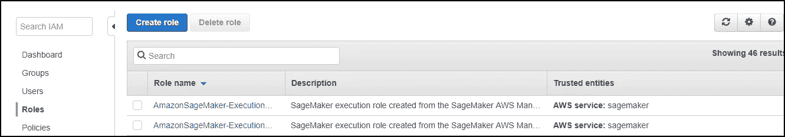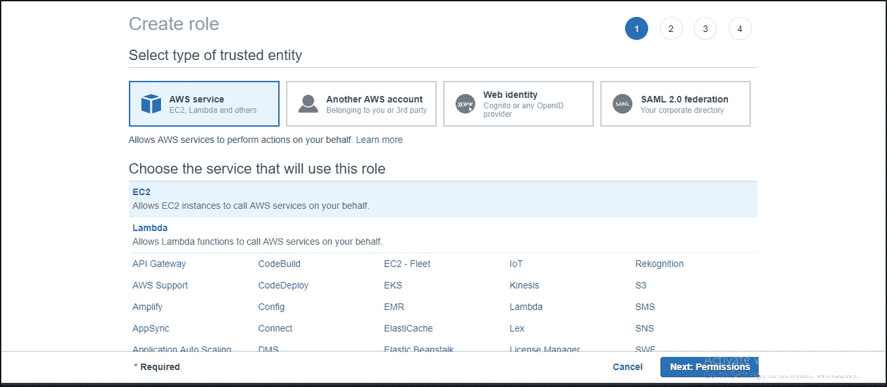

将适当的策略附加到您的角色上(在本例中，授予了管理员访问权限)

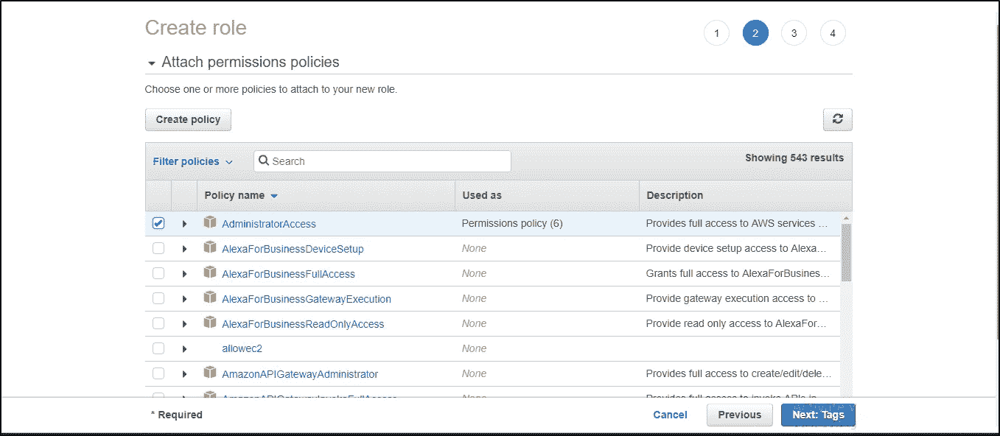

接下来，它会要求您添加可选的标签。就我而言，我没有附加任何标签。

为您的角色命名并查看分配给它的策略，然后按**创建角色**。

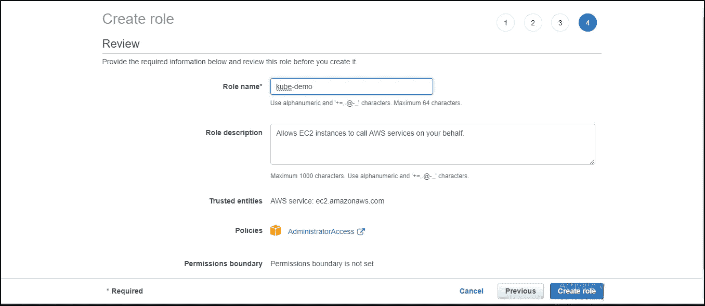

**第三步:**将角色附加到实例上。转到**实例设置- >附加/替换 IAM 角色** - >附加您创建的角色，然后点击**应用**。

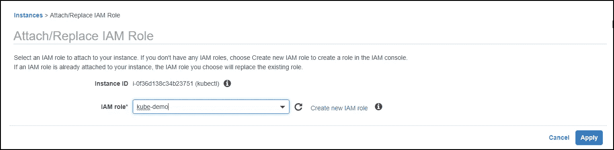

**步骤 4:** 创建实例并附加角色后，打开命令模拟器，即 cmder 或 putty，并连接到 AWS 实例。在这个演示中，我将使用 cmder。连接到实例后，使用以下命令更新存储库并安装 aws-cli:

```
$ sudo apt-get install  
$ sudo apt-get install awscli
```

**第 5 步:**使用以下命令安装并设置 kubectl:

```
$ sudo apt-get update && sudo apt-get install -y apt-transport-https
$ curl -s https://packages.cloud.google.com/apt/doc/apt-key.gpg | sudo apt-key add -
$ echo "deb http://apt.kubernetes.io/ kubernetes-xenial main" | sudo tee -a /etc/apt/sources.list.d/kubernetes.list
$ sudo apt-get update
$ sudo apt-get install -y kubectl
```

**步骤 6:** 使用以下命令在系统上安装 Kops:

```
$ wget https://github.com/kubernetes/kops/releases/download/1.10.0/kops-linux-amd64
$ chmod +x kops-linux-amd64 
$ mv kops-linux-amd64 /usr/local/bin/kops
```

**步骤 7:** 安装了 Kops 之后，您必须为您的集群配置一个域，以便从外部访问它。为其创建托管区域

**服务- >路由 53- >托管区域- >创建托管区域**

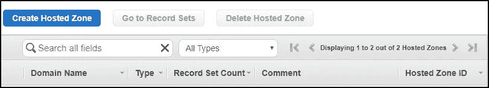

为您的集群添加域名，将亚马逊 VPC 的类型从**公共托管区域**更改为**私人托管区域**，并将您的实例 **VPC ID** 从实例页面复制到 VPC ID 列，并添加您想要创建托管区域的区域。

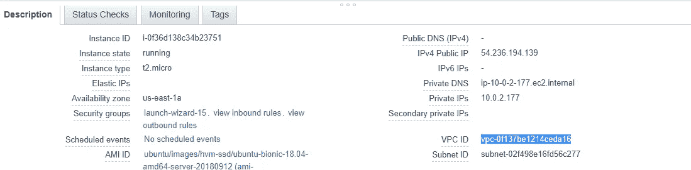

复制 VPC 身份证

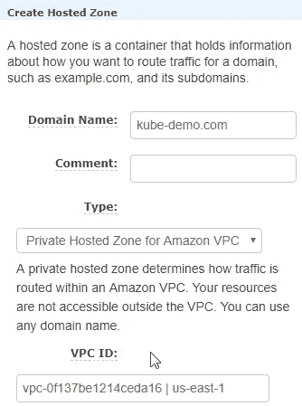

上面的截图显示了添加域名和 VPC ID 的位置

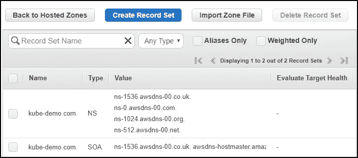

现在，您可以看到您的托管区域已创建。

**步骤 8:** 使用以下命令创建一个与域名同名的 bucket:

```
$ aws s3 mb s3://kube-demo.com
```

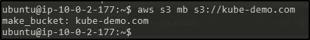

一旦创建了存储桶，就执行以下命令:

```
$ export KOPS_STATE_STORE=s3://kube-demo.com
```

**第 9 步:**在创建集群之前，您必须创建 SSH 公共密钥。

```
$ ssh-keygen
```

输入保存密钥对的文件，并创建一个密码来访问 ssh 公钥。在本例中，我选择了默认位置，并且没有使用密码。

**步骤 10:** 现在您已经创建了 SSH 密钥，使用以下命令创建集群:

```
$ kops create cluster –cloud=aws –zones=us-east-1a –name=useast1.kube-demo.com –dns-zone=kube-demo.com –-dns private
```

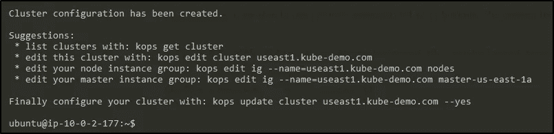

然后更新集群

```
$ kops update cluster useast1.kube-demo.com
```

这将创建群集运行所需的资源。它将创建一个主实例和两个节点实例。

现在，当您检查实例时，您会看到已经创建了三个新实例。其中一个将是您的主节点，另外两个是您的工作节点和 TADA！您的集群已创建。

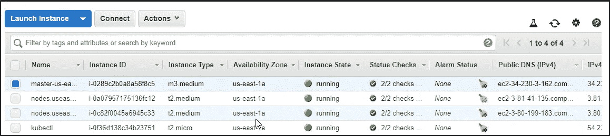

您的 s3 bucket 现在将包含一些文件夹，这基本上是您的集群配置文件。

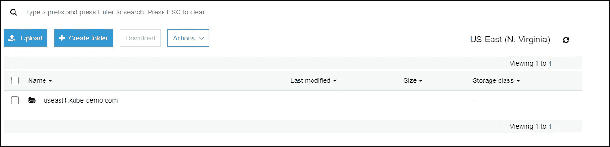

**步骤 11:** 现在，如果您通过 ssh 进入您的主节点，并执行 kubectl get nodes，您应该会发现您的节点处于就绪状态。

```
$ ssh  -i .ssh/id_rsa admin@ipv4-public-ip-of-master 
$ kubectl get nodes
```

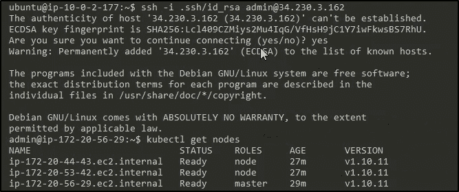

# 演示 2:创建入口(nginx)负载平衡器控制器

**步骤 1:** 以下命令对于所有配置都是强制性的

```
$ kubectl apply -f https://raw.githubusercontent.com/kubernetes/ingress-nginx/master/deploy/mandatory.yaml
```

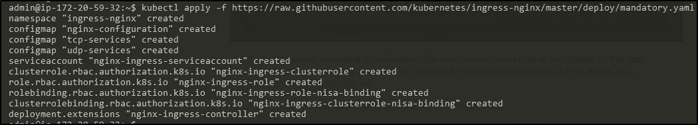

**步骤 2:** 现在，下一个命令取决于您使用集群的环境。

在本例中，我们将使用 AWS L4 配置:

```
$ kubectl apply -f https://raw.githubusercontent.com/kubernetes/ingress-nginx/master/deploy/provider/aws/service-l4.yaml  
$ kubectl apply -f https://raw.githubusercontent.com/kubernetes/ingress-nginx/master/deploy/provider/aws/patch-configmap-l4.yaml
```

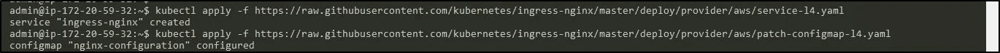

**步骤 3:** 检查您的 pod，查看所有入口 pod 都已启动并运行

```
$ kubectl get pods --all-namespaces
```

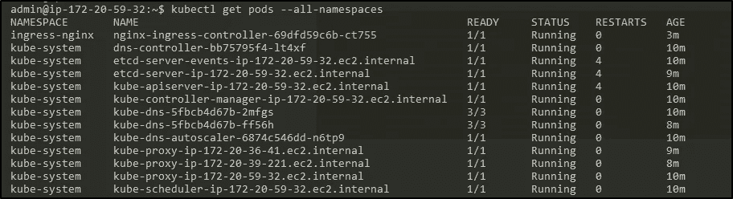

**步骤 4:** 检查服务，以验证入口服务正在工作

```
$ kubectl get svc –all-namspaces
```


**步骤 5:** 现在像我们之前做的那样创建一个部署
这里我们使用 httpd 部署作为例子

**步骤 6:** 创建一个 httpd 集群 ip 服务

```
$ kubectl create service clusterip httpd --tcp=80:80
```

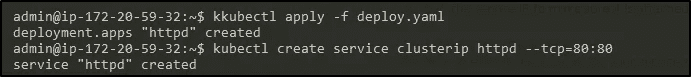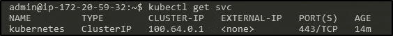

**步骤 7:** 卷曲服务 IP，确保其连接到 pod

```
$ curl <Cluster IP address>
```

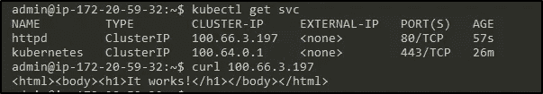

**步骤 8:** 现在，为您的服务创建一个入口规则，这样您就可以在/test 访问服务来路由外部流量。

```
$ vi ingress.yaml
```

现在，在 yaml 文件中写入以下细节。

```
apiVersion: extensions/v1beta1
kind: Ingress
metadata:
  name: test-ing
  annotations:
    nginx.ingress.kubernetes.io/rewrite-target: /
spec:
  rules:
  - http:
      paths:
      - path: /test
        backend:
          serviceName: httpd
          servicePort: 80
```

**第 9 步:**部署入口规则

```
$ kubectl apply -f ingress.yaml
```

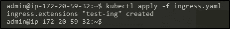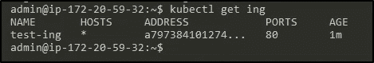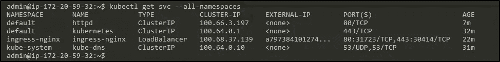

**步骤 10:** 现在复制入口服务外部 IP，并在您的浏览器中添加/测试它以进行验证

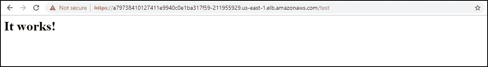

同样的事情也可以在其他云平台上完成。我在我的环境设置中使用了本安装指南，其中也有关于在其他平台上安装的详细说明。

当然，这只是路由流量的一个小演示，但是如果实现得好，它可以创造奇迹。像 Pokémon Go 这样的游戏部署在 Kubernetes 上，使用 Ingress。我敢肯定，如果你们没有玩过热门游戏 Pokémon Go *，你们一定都听说过。现在，流量飙升，超出了公司的预期，这也是他们能够处理这么多流量的唯一原因，因为 Kubernetes。*

因此，我们来到了这篇 Kubernetes Ingress 文章的结尾。我希望你已经发现这信息。如果你想查看更多关于人工智能、Python、道德黑客等市场最热门技术的文章，你可以参考 Edureka 的官方网站。

请留意本系列中的其他文章，它们将解释 Kubernetes 的各个方面。

> 1.[什么是 Kubernetes？](/edureka/what-is-kubernetes-container-orchestration-tool-d972741550f6)
> 
> 2.[在 Ubuntu 上安装 Kubernetes](/edureka/install-kubernetes-on-ubuntu-5cd1f770c9e4)
> 
> 3. [Kubernetes 教程](/edureka/kubernetes-tutorial-fe6de6a20325)
> 
> 4. [Kubernetes 仪表板安装&视图](/edureka/kubernetes-dashboard-d909b8b6579c)
> 
> 5. [Kubernetes 建筑](/edureka/kubernetes-architecture-c43531593ca5)
> 
> 6. [*Kubernetes 网络*](/edureka/kubernetes-networking-a46d9f994bab)
> 
> 7.[Kubernetes vs Docker Swarm](/edureka/kubernetes-vs-docker-45231abeeaf1)
> 
> 8. [Kubernetes 面试问题](/edureka/kubernetes-interview-questions-c9790e5abddb)
> 
> 9.[与亚马逊 EKS 合作开发 Kubernetes 应用](/edureka/amazon-eks-ac646c23abf8)
> 
> 10.[如何用 Elasticsearch 和 Kibana 可视化 Kubernetes 集群](/edureka/logging-monitoring-elasticsearch-fluentd-kibana-e2cd477a576b)

*原载于 2019 年 1 月 25 日*[*www.edureka.co*](https://www.edureka.co/blog/kubernetes-ingress-controller-nginx)*。*