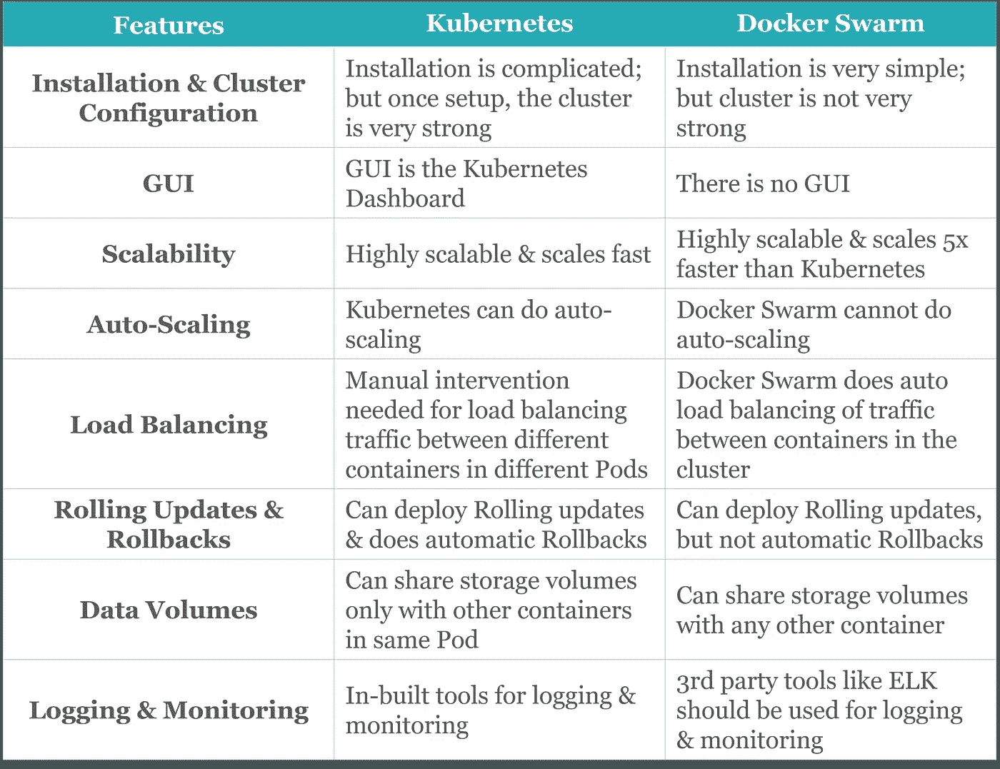
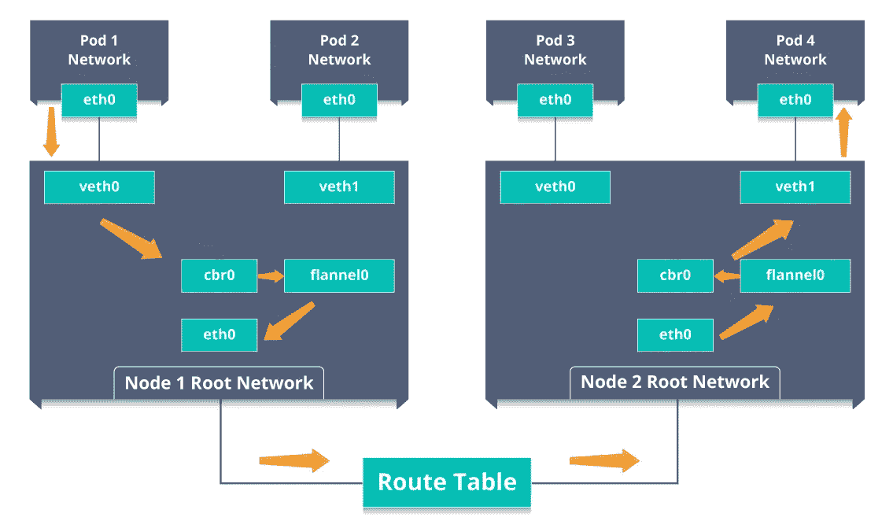
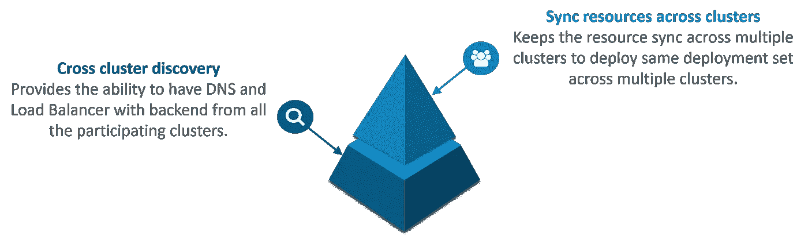

# 2019 年你必须准备的 50 个 Kubernetes 面试问题

> 原文：<https://medium.com/edureka/kubernetes-interview-questions-c9790e5abddb?source=collection_archive---------0----------------------->

Kubernetes Interview Questions - Edureka

Kubernetes 已经成为当今市场的时髦词汇，是最好的编排工具。它吸引了许多有经验的专业人士，他们希望将自己的职业生涯提升一个档次。Huwaei、Pokemon、Box、易贝、Ing、雅虎日本、SAP、纽约时报、Open AI、Sound Cloud 等跨国公司也使用 Kubernetes。我相信你已经知道了这些事实，这让你登陆了这个 Kubernetes 面试问题博客。

在这个关于 Kubernetes 面试问题的博客中，我将讨论在你的面试中被问到的与 Kubernetes 相关的问题。所以，为了让你更好的理解，我把这个博客分成了以下四个部分:

*   Kubernetes 基本面试问题
*   基于架构的面试问题
*   基于情景的面试问题
*   多项选择问题

所以让我们开始吧伙计们！！

# 基本的 Kubernetes 面试问题

这部分问题将包括所有你需要知道的与 Kubernetes 工作相关的基本问题。

# Q1。Kubernetes 和 Docker Swarm 有什么不同？

Differences Between Kubernetes & Docker Swarm - Kubernetes Interview Questions

# Q2。什么是 Kubernetes？

What is Kubernetes - Kubernetes Interview Questions

Kubernetes 是一个开源的容器管理工具，负责容器部署、容器的伸缩和负载平衡。作为谷歌的创意，它提供了优秀的社区，并与所有的云提供商合作愉快。因此，我们可以说 Kubernetes 不是一个容器化平台，但它是一个多容器管理解决方案。

# Q3。Kubernetes 和 Docker 有什么关系？

众所周知，Docker 提供容器的生命周期管理，Docker 映像构建运行时容器。但是，由于这些单独的容器必须进行通信，因此使用了 Kubernetes。因此，Docker 构建容器，这些容器通过 Kubernetes 相互通信。因此，运行在多个主机上的容器可以使用 Kubernetes 手动链接和编排。

# Q4。在主机和容器上部署应用程序有什么区别？

Deploying Applications On Host vs Containers - Kubernetes Interview Questions

参考上图。左侧架构表示在主机上部署应用程序。因此，这种体系结构将有一个操作系统，然后操作系统将有一个内核，该内核将在操作系统上安装应用程序所需的各种库。因此，在这种框架中，您可以有 n 个应用程序，并且所有应用程序将共享该操作系统中的库，而在容器中部署应用程序时，架构略有不同。

这种架构将有一个内核，这将是所有应用程序之间唯一的共同点。因此，如果有一个特定的应用程序需要 Java，那么这个特定的应用程序将可以访问 Java，如果有另一个应用程序需要 Python，那么只有这个特定的应用程序可以访问 Python。

您可以在图的右侧看到的各个模块基本上都是容器化的，并且与其他应用程序隔离开来。因此，应用程序拥有与系统其余部分隔离的必要库和二进制文件，不能被任何其他应用程序侵占。

# Q5。什么是容器编排？

考虑一个场景，您有 5-6 个微服务用于一个应用程序。现在，这些微服务被放在单独的容器中，但如果没有容器编排，将无法进行通信。因此，正如编排意味着所有乐器在音乐中和谐演奏的融合，类似地，容器编排意味着各个容器中的所有服务一起工作来满足单个服务器的需求。

# Q6。容器编排的需求是什么？

假设您有 5–6 个微服务用于执行各种任务的单个应用程序，所有这些微服务都放在容器中。现在，为了确保这些容器相互通信，我们需要容器编排。

Challenges Without Container Orchestration - Kubernetes Interview Questions

正如您在上图中看到的，在没有使用容器编排的情况下，也出现了许多挑战。因此，为了克服这些挑战，容器编排应运而生。

# Q7。Kubernetes 有什么特点？

Kubernetes 的特点如下:

Features Of Kubernetes - Kubernetes Interview Questions

# Q8。Kubernetes 如何简化容器化部署？

由于典型的应用程序会有一个跨多个主机运行的容器集群，所有这些容器都需要相互通信。因此，要做到这一点，你需要一个大的东西来负载平衡、伸缩和监控容器。由于 Kubernetes 与云无关，可以在任何公共/私有提供商上运行，因此简化容器化部署肯定是您的选择。

# Q9。你对 Kubernetes 的星团了解多少？

Kubernetes 背后的基本原理是，我们可以强制执行所需的状态管理，我的意思是，我们可以提供特定配置的集群服务，并且由集群服务在基础架构中运行该配置。

Representation Of Kubernetes Cluster - Kubernetes Interview Questions

因此，正如您在上面的图表中所看到的，部署文件将包含需要提供给集群服务的所有配置。现在，部署文件将被提供给 API，然后由集群服务来决定如何在环境中调度这些单元，并确保正确数量的单元正在运行。

因此，位于服务前面的 API、工作节点&节点运行的 Kubelet 进程，一起构成了 Kubernetes 集群。

# Q10。什么是谷歌容器引擎？

**谷歌容器引擎(GKE)** 是 Docker 容器和集群的开源管理平台。这个基于 Kubernetes 的引擎只支持那些在 Google 的公共云服务中运行的集群。

# Q11。Heapster 是什么？

Heapster 是一个集群范围的数据聚合器，由运行在每个节点上的 Kubelet 提供。这个容器管理工具在 Kubernetes 集群上得到本机支持，并作为一个 pod 运行，就像集群中的任何其他 pod 一样。因此，它主要通过机器上的 Kubernetes 代理发现集群中的所有节点，并从集群中的 Kubernetes 节点查询使用信息。

# Q12。Minikube 是什么？

Minikube 是一个让本地运行 Kubernetes 变得容易的工具。这在一个虚拟机内运行一个单节点 Kubernetes 集群。

# Q13。什么是 Kubectl？

Kubectl 是一个平台，您可以使用它向集群传递命令。因此，它基本上提供了针对 Kubernetes 集群运行命令的 CLI，以及创建和管理 Kubernetes 组件的各种方法。

# Q14。库伯莱是什么？

这是一个代理服务，运行在每个节点上，使从节点能够与主节点通信。因此，Kubelet 处理 PodSpec 中提供给它的容器描述，并确保 PodSpec 中描述的容器是健康的和运行的。

# Q15。你所理解的 Kubernetes 中的一个节点是什么？

Node In Kubernetes - Kubernetes Interview Questions

# 基于架构的 Kubernetes 面试问题

这部分问题将涉及与 Kubernetes 架构相关的问题。

# Q1。Kubernetes 建筑有哪些不同的组成部分？

Kubernetes 架构主要有两个组件——主节点和工作节点。正如您在下图中看到的，主节点和工作节点中有许多内置组件。主节点有 kube 控制器管理器、kube API server、kube 调度器等。而 worker 节点在每个节点上运行 kubelet 和 kube-proxy。

Architecture Of Kubernetes - Kubernetes Interview Questions

# Q2。你所理解的 Kube-proxy 是什么？

Kube-proxy 可以在每一个节点上运行，并可以跨后端网络服务进行简单的 TCP/UDP 数据包转发。所以基本上，它是一个网络代理，反映每个节点上 Kubernetes API 中配置的服务。因此，Docker 可链接的兼容环境变量提供了由代理打开的集群 IP 和端口。

# Q3。你能简单介绍一下 Kubernetes 中主节点的工作吗？

Kubernetes master 控制节点，并且在节点内部存在容器。现在，这些单独的容器包含在单元中，在每个单元中，您可以根据配置和要求拥有不同数量的容器。因此，如果必须部署 pod，那么可以使用用户界面或命令行界面来部署它们。然后，在节点上调度这些单元，并基于资源需求，将单元分配给这些节点。kube-apiserver 确保在 Kubernetes 节点和主组件之间建立通信。

Representation Of Kubernetes Master Node - Kubernetes Interview Questions

# Q4。kube-apiserver 和 kube-scheduler 的作用是什么？

kube -apiserver 遵循横向扩展架构，是主节点控制面板的前端。这公开了 Kubernetes 主节点组件的所有 API，并负责在 Kubernetes 节点和 Kubernetes 主组件之间建立通信。

kube-scheduler 负责在工作节点上分配和管理工作负载。因此，它根据资源需求选择最合适的节点来运行未调度的 pod，并跟踪资源利用情况。它确保工作负载不会被安排在已经满了的节点上。

# Q5。你能简单介绍一下 Kubernetes 控制器管理器吗？

多个控制器进程在主节点上运行，但是被编译在一起作为一个进程运行，这个进程就是 Kubernetes 控制器管理器。因此，控制器管理器是一个守护进程，它嵌入控制器并进行命名空间创建和垃圾收集。它负责并与 API 服务器通信来管理端点。

因此，在主节点上运行的不同类型的控制器管理器是:

Types Of Controllers - Kubernetes Interview Questions

# Q6。什么是 ETCD？

Etcd 是用 Go 编程语言编写的，是一个分布式键值存储，用于协调分布式工作。因此，Etcd 存储 Kubernetes 集群的配置数据，表示集群在任何给定时间点的状态。

# Q7。Kubernetes 有哪些不同类型的服务？

以下是所使用的不同类型的服务:

Types Of Services - Kubernetes Interview Questions

# Q8。你对 Kubernetes 中负载均衡器的理解是什么？

负载平衡器是公开服务的最常见和标准的方式之一。根据工作环境，使用两种类型的负载平衡器，即内部负载平衡器或外部负载平衡器。内部负载平衡器自动平衡负载并分配具有所需配置的单元，而外部负载平衡器将流量从外部负载导向后端单元。

# Q9。什么是入口网络，它是如何工作的？

入口网络是规则的集合，充当 Kubernetes 集群的入口点。这允许入站连接，可以将入站连接配置为通过可到达的 URL、负载平衡流量或通过提供基于名称的虚拟主机向外部提供服务。因此，Ingress 是一个 API 对象，它通常通过 HTTP 管理对集群中服务的外部访问，并且是公开服务的最强大的方式。

现在，让我用一个例子向你解释入口网络的工作原理。

有两个节点具有 pod 和根网络名称空间，并带有一个 Linux 桥。除此之外，根网络中还添加了一个名为 flannel0(网络插件)的新虚拟以太网设备。

现在，假设我们希望数据包从 pod1 流向 pod 4。请参考下图。

Working Of Ingress Network - Kubernetes Interview Questions

*   因此，数据包在 eth0 离开 pod1 的网络，并在 veth0 进入根网络。
*   然后，它被传递到 cbr0，CB r0 发出 ARP 请求来查找目的地，结果发现该节点上没有人拥有目的地 IP 地址。
*   因此，网桥将数据包发送到 flannel0，因为该节点的路由表配置了 flannel0。
*   现在，法兰绒守护进程与 Kubernetes 的 API 服务器对话，以了解所有 pod IPss 及其各自的节点，从而创建 pod IP 到节点 IP 的映射。
*   网络插件将此数据包封装在 UDP 数据包中，并使用额外的报头将源和目的 IP 更改为各自的节点，然后通过 eth0 将此数据包发送出去。
*   现在，因为路由表已经知道如何在节点之间路由流量，所以它将数据包发送到目的节点 2。
*   数据包到达节点 2 的 eth0，然后返回到 flannel0 进行解封装，并在根网络命名空间中将其发送回去。
*   同样，数据包被转发到 Linux 网桥，以发出 ARP 请求来找出属于 veth1 的 IP。
*   数据包最终穿过根网络，到达目的地 Pod4。

# Q10。你所理解的云控制器管理器是什么？

云控制器管理器负责持久存储、网络路由、从核心 Kubernetes 特定代码中提取特定于云的代码，以及管理与底层云服务的通信。根据您运行的云平台，它可能会被拆分成几个不同的容器，然后它使云供应商和 Kubernetes 代码的开发没有任何相互依赖性。因此，云供应商开发他们的代码，并在运行 Kubernetes 时与 Kubernetes 云控制器管理器连接。

各种类型的云控制器管理器如下:

Types Of Cloud Controller Manager - Kubernetes Interview Questions

# Q11。什么是容器资源监控？

对于用户来说，了解所有不同抽象层的应用性能和资源利用率非常重要，Kubernetes 通过在不同级别(如容器、容器、服务和整个集群)创建抽象来考虑集群的管理。现在，每个级别都可以被监控，这就是容器资源监控。

各种容器资源监控工具如下:

Container Resource Monitoring Tools - Kubernetes Interview Questions

# Q12。副本集和复制控制器之间有什么区别？

副本集和复制控制器做几乎相同的事情。它们都确保在任何给定的时间都有指定数量的 pod 副本在运行。不同之处在于使用选择器来复制 pod。副本集使用基于集合选择器，而复制控制器使用基于权益的选择器。

*   **基于股权的选择器:**这种选择器允许通过标签键和值进行过滤。因此，用外行的话来说，基于股票的选择器将只寻找与标签的短语完全相同的豆荚。
    **举例**:假设你的标签键说 app=nginx，那么，用这个选择器，你只能寻找那些标签 app 等于 nginx 的 pod。
*   **基于选择器的选择器:**这种选择器允许根据一组值过滤键。因此，换句话说，基于选择器的选择器将寻找标签在集合中被提及的 pod。
    **举例:**说你的标签键在(nginx，NPS，Apache)里说 app。然后，有了这个选择器，如果你的 app 等于 nginx，NPS，或者 Apache 中的任何一个，那么选择器就会把它当成真结果。

# Q13。什么是无头服务？

无头服务类似于“普通”服务，但没有群集 IP。该服务使您能够直接访问 pod，而无需通过代理进行访问。

# Q14。在使用 Kubernetes 时，你能采取的最好的安全措施是什么？

以下是您在使用 Kubernetes 时可以遵循的最佳安全措施:

Best Security Measures - Kubernetes Interview Questions

# Q15。什么是联合集群？

在联合集群的帮助下，多个 Kubernetes 集群可以作为一个集群进行管理。因此，您可以在一个数据中心/云中创建多个 Kubernetes 集群，并使用联盟在一个地方控制/管理它们。

联合集群可以通过以下两件事来实现这一点。请参考下图。

Federated Clusters - Kubernetes Interview Questions

# 基于情景的面试问题

这部分问题将由你在面试中可能会遇到的各种情景问题组成。

## **场景 1:**

假设一个建立在整体架构上的公司处理许多产品。现在，随着该公司在当今扩展行业的扩张，他们的整体架构开始引发问题。

*你认为该公司如何从整体服务转向微服务并部署他们的服务容器？*

**解决方案:**

由于该公司的目标是从他们的单片应用程序转移到微服务，他们可以一件一件地并行构建，只需在后台切换配置。然后他们可以将这些内置的微服务放在 Kubernetes 平台上。因此，他们可以从迁移一次或两次服务开始，并监控它们以确保一切运行稳定。一旦他们觉得一切顺利，他们就可以将应用程序的其余部分迁移到他们的 Kubernetes 集群中。

## **情景二:**

假设一家跨国公司拥有非常分散的系统，有大量的数据中心、虚拟机和从事各种工作的员工。

你认为这样一家 *的公司如何能以与 Kubernetes 一致的方式管理所有任务？*

**解决方案:**

众所周知，信息技术部门启动了数以千计的容器，任务在分布于世界各地的众多节点上运行。

在这种情况下，公司可以使用能够为他们提供敏捷性、横向扩展能力和开发实践的东西来开发基于云的应用程序。

因此，该公司可以使用 Kubernetes 定制他们的调度架构，并支持多种容器格式。这使得容器任务之间的密切关系成为可能，通过对各种容器网络解决方案和容器存储的广泛支持来提高效率。

## **场景三:**

考虑这样一种情况，一家公司希望通过保持最低的成本来提高其效率和技术运作的速度。

你认为公司将如何努力实现这一目标？

**解决方案:**

该公司可以通过构建 CI/CD 管道来实施 DevOps 方法，但这里可能会出现一个问题，即配置启动和运行可能需要时间。因此，在实施 CI/CD 管道后，公司的下一步应该是在云环境中工作。一旦他们开始在云环境上工作，他们就可以在集群上调度容器，并可以在 Kubernetes 的帮助下进行编排。这种方法将有助于公司减少部署时间，并加快跨各种环境的速度。

## **情景 4:**

假设一家公司希望修改其部署方法，并希望构建一个更具可扩展性和响应能力的平台。

*你认为这家公司如何实现这一目标来满足他们的客户？*

**解决方案:**

为了给数百万客户带来他们所期望的数字体验，该公司需要一个可扩展且响应迅速的平台，以便他们能够快速将数据传输到客户网站。现在，要做到这一点，该公司应该从他们的私有数据中心(如果他们使用任何数据中心)转移到任何云环境，如 AWS。不仅如此，他们还应该实现微服务架构，以便可以开始使用 Docker 容器。一旦他们准备好基础框架，他们就可以开始使用最好的编排平台，即 Kubernetes。这将使团队能够自主地构建应用程序并快速交付它们。

## **场景 5:**

考虑一家拥有高度分布式系统的跨国公司，期待解决单一代码库问题。

你认为公司会如何解决他们的问题？

**解决方案**

为了解决这个问题，我们可以将他们的整体代码基础转移到微服务设计，然后每个微服务都可以被视为一个容器。因此，所有这些容器都可以在 Kubernetes 的帮助下进行部署和编排。

## **情景六:**

我们都知道，从整体服务到微服务的转变解决了开发端的问题，但增加了部署端的问题。

*公司如何解决部署方面的问题？*

**解决方案**

该团队可以试验容器编排平台，如 Kubernetes，并在数据中心运行。因此，有了它，公司可以生成一个模板化的应用程序，在五分钟内部署它，并在那时将实际的实例容器化到登台环境中。这种 Kubernetes 项目将有几十个并行运行的微服务来提高生产率，因为即使一个节点出现故障，也可以立即重新调度，而不会影响性能。

## **场景 7:**

假设一家公司希望通过采用新技术来优化其工作负载的分布。

*公司如何高效地实现这种资源分配？*

**解决方案**

这个问题的解决方案不是别人，正是 Kubernetes。Kubernetes 确保资源得到有效优化，并且只使用特定应用程序所需的资源。因此，使用最好的容器编排工具，公司可以有效地实现资源的分配。

## **场景 8:**

假设一家拼车公司希望通过同时扩展其平台来增加服务器数量。

*您认为公司将如何处理服务器及其安装？*

**解决方案**

公司可以采用集装箱化的概念。一旦他们将所有应用程序部署到容器中，他们就可以使用 Kubernetes 进行编排，并使用 Prometheus 等容器监控工具来监控容器中的操作。因此，通过容器的这种使用，为他们提供了更好的数据中心容量规划，因为由于服务和运行它们的硬件之间的这种抽象，他们现在将受到更少的限制。

## **场景 9:**

考虑一个场景，其中一家公司想要向其具有各种环境的客户提供所有需要的分发。

你认为他们如何以动态的方式实现这一关键目标？

**解决方案**

该公司可以使用 Docker 环境，组建一个跨部门团队，使用 Kubernetes 构建一个 web 应用程序。这种框架将帮助公司实现在最短的时间内将所需的东西投入生产的目标。因此，随着这样一台机器的运行，公司可以向具有不同环境的所有客户分发资料。

## **场景 10** :

假设一家公司希望在从裸机到公共云的不同云基础架构上运行各种工作负载。

*在存在不同界面的情况下，公司将如何实现这一目标？*

**解决方案**

该公司可以将其基础设施分解为微服务，然后采用 Kubernetes。这将使公司能够在不同的云基础设施上运行各种工作负载。

# 多项选择面试问题

这部分问题将由多项选择面试问题组成，这些问题在面试中经常被问到。

## **Q1。Kubernetes 集群中有哪些爪牙？**

1.  它们是主节点的组件。
2.  它们是集群的工作马/工作节点。[答案]
3.  他们正在监控广泛应用于 kubernetes 的发动机。
4.  它们是码头集装箱服务。

## **Q2。Kubernetes 集群数据存储在以下哪个位置？**

1.  Kube-apiserver
2.  库伯莱
3.  Etcd[Ans]
4.  以上都不是

## **Q3。他们中的哪一个是 Kubernetes 控制器？**

1.  复制集
2.  部署
3.  滚动更新
4.  复制集和部署[Ans]

## **Q4。以下哪些是 Kubernetes 的核心对象？**

1.  分离舱
2.  服务
3.  卷
4.  以上所有[答案]

## **Q5。Kubernetes 网络代理运行在哪个节点上？**

1.  主网点
2.  工作节点
3.  所有节点[答案]
4.  以上都不是

## **Q6。** **节点控制器的职责是什么？**

1.  将 CIDR 块分配给节点
2.  维护节点列表
3.  为了监控节点的健康状况
4.  以上所有[答案]

## **Q7。复制控制器的职责是什么？**

1.  用一个命令更新或删除多个窗格
2.  有助于达到期望的状态
3.  如果现有 pod 崩溃，则创建新的 pod
4.  以上所有[答案]

## **Q8。如何定义一个没有选择器的服务？**

1.  指定外部名称[Ans]
2.  指定带有 IP 地址和端口的端点
3.  只需指定 IP 地址
4.  指定标签和 api 版本

## **Q9。1.8 版本的 Kubernetes 引入了什么？**

1.  污点和容忍[Ans]
2.  集群级日志记录
3.  秘密
4.  联合集群

## **Q10。由** **Kubelet 调用的检查容器的 IP 地址是否开放的处理程序是？**

1.  http 操作
2.  执行
3.  TCPSocketAction[Ans]
4.  以上都不是

我希望你发现这个 Kubernetes 面试问题博客信息丰富。你在 Kubernetes 面试问题博客中学到的问题是面试中最受欢迎的问题。如果你想查看更多关于人工智能、Python、道德黑客等市场最热门技术的文章，你可以参考 Edureka 的官方网站。

请留意本系列中的其他文章，它们将解释 Kubernetes 的各个方面。

> 1.[什么是 Kubernetes？](/edureka/what-is-kubernetes-container-orchestration-tool-d972741550f6)
> 
> 2.[在 Ubuntu 上安装 Kubernetes](/edureka/install-kubernetes-on-ubuntu-5cd1f770c9e4)
> 
> 3. [Kubernetes 教程](/edureka/kubernetes-tutorial-fe6de6a20325)
> 
> 4. [Kubernetes 仪表板安装&视图](/edureka/kubernetes-dashboard-d909b8b6579c)
> 
> 5. [Kubernetes 建筑](/edureka/kubernetes-architecture-c43531593ca5)
> 
> 6. [*Kubernetes 网络*](/edureka/kubernetes-networking-a46d9f994bab)
> 
> 7.[Kubernetes vs Docker Swarm](/edureka/kubernetes-vs-docker-45231abeeaf1)
> 
> 8.[与亚马逊 EKS 合作开发 Kubernetes 应用](/edureka/amazon-eks-ac646c23abf8)
> 
> 9.[在 AWS 上设置 Kubernetes 入口控制器](/edureka/kubernetes-ingress-controller-nginx-c5cf9e8ff031)
> 
> 10.[如何用 Elasticsearch 和 Kibana 可视化 Kubernetes 集群](/edureka/logging-monitoring-elasticsearch-fluentd-kibana-e2cd477a576b)

*最初发表于*[*www.edureka.co*](https://www.edureka.co/blog/interview-questions/kubernetes-interview-questions/)*。*