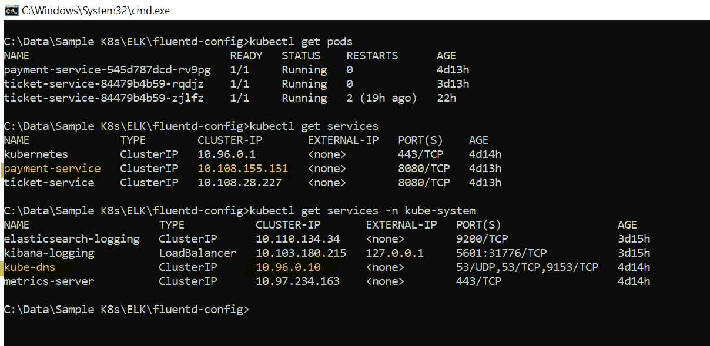

# Kubernetes —微服务发现

> 原文：<https://medium.com/globant/kubernetes-microservices-discovery-2dd754712606?source=collection_archive---------0----------------------->


Photo by [N.](https://unsplash.com/@ellladee?utm_source=medium&utm_medium=referral) on [Unsplash](https://unsplash.com?utm_source=medium&utm_medium=referral)

在非基于 Kubernetes 的项目中，我们有一个发现服务器(像 Eureka 服务)来处理服务发现。所以我很好奇我们应该在 Kubernetes 中使用哪种组件。我在互联网上搜索，以检查是否有任何文章涉及上游微服务调用下游微服务的发现，但没有发现；于是想到写这篇文章。

以下是先决条件:

*   Spring Boot 版本:2.7.3
*   Minikube 版本:v1.25.1
*   Kubectl: v1.22.5

在本文中，我将解释微服务如何在 [Kubernetes](https://kubernetes.io/) (K8s)环境中发现彼此。我将使用基于 SpringBoot 的微服务来演示它(使用一个[假客户端](https://github.com/OpenFeign/feign)上游调用下游)。

## Kubernetes 如何支持探索？

[Kubernetes](https://kubernetes.io/docs/concepts/services-networking/service/#discovering-services)中的发现有两种支持方式。

## 1.**环境变量**

Kubernetes 为集群中创建的每个 pod 添加了`{SVCNAME}_SERVICE_HOST`和`{SVCNAME}_SERVICE_PORT`环境变量。下面是一个例子。

```
PAYMENT_SERVICE_SERVICE_HOST=10.108.155.131
PAYMENT_SERVICE_SERVICE_PORT=8080
TICKET_SERVICE_SERVICE_PORT=8080
TICKET_SERVICE_SERVICE_HOST=10.108.155.131
```

在 Feign Client 中，使用这些变量来创建服务 URL，如下所示。

```
url = ${PAYMENT_SERVICE_SERVICE_HOST}:${PAYMENT_SERVICE_SERVICE_PORT}
```

这种方法并不常用，因为它有一个问题:如果客户机 Pod 是在服务之前创建的，那么服务环境变量就不可用。因此，您必须在客户端 Pods 出现之前创建服务。否则，这些客户机单元不会填充它们的环境变量。

## 2.**使用 CoreDNS 进行发现**

每个 Kubernetes 集群都有一个 CoreDNS pod，它基本上充当 DNS 服务器。它监视新服务的 Kubernetes API，并为每个服务创建 DNS 记录集。

现在让我们实际看看这是如何发生的。通过查询，我们可以看到 CoreDNS pod 是现成可用的，如下所示。

```
kubectl get pods -n kube-system 
```


CoreDNS POD

要获得关于 CoreDNS **服务的数据，请使用下面的命令。**

```
kubectl get service -n kube-system
```


当一个微服务想要与其他微服务连接时，它们使用 CoreDNS 服务进行查找。

为了了解这是如何工作的，让我们创建**两个**简单的基于 SpringBoot 的项目。

1.`ticket-service`(上游)

2.`payment-service`(下游)

在`pom.xml`中添加以下依赖项。

```
 <dependency>
   <groupId>org.springframework.boot</groupId>
   <artifactId>spring-boot-starter-web</artifactId>
  </dependency>
  <dependency>
   <groupId>org.springframework.cloud</groupId>
   <artifactId>spring-cloud-starter-openfeign</artifactId>
  </dependency>
  <dependency>
   <groupId>org.springframework.cloud</groupId>
   <artifactId>spring-cloud-starter-kubernetes-fabric8-all</artifactId>
  </dependency>
```

*   **步骤 1** :创建`ticket-service`应用程序，添加以下代码:

```
@SpringBootApplication
@RestController
@EnableFeignClients
@EnableDiscoveryClient
@Slf4j
public class TicketServiceApplication {

  @Autowired
  IPayment iPayment;

  public static void main(String[] args) {
     SpringApplication.run(TicketServiceApplication.class, args);
  }

  @PostMapping("/ticket/pay")
  public String pay(){
     log.info("Calling payment service");
     //wallet payment
     String paymentResponse = iPayment.pay();
     log.info("Payment done..");
     return paymentResponse + ", Ticket confirmed!";
  }
} 
```

将`IPayment`客户端添加到`ticket-service`项目中，如下所示:

```
@FeignClient(name="payment-service")
public interface IPayment {

   @PostMapping("/pay")
   public String pay();
}
```

*   **第 2 步**:创建一个`payment-service`应用程序，并添加以下代码:

```
@SpringBootApplication
@RestController
@EnableDiscoveryClient
public class PaymentServiceApplication {

  public static void main(String[] args) {
     SpringApplication.run(PaymentServiceApplication.class, args);
  }

  @GetMapping
  public String status(){
     return "success";
  }

  @PostMapping("/pay")
  public String pay(){
     return "payment successful";
  }
}
```

*   **第三步**:使用 Postman 调用票端点，如下图所示(内部调用下游— `payment-service`)。


Test downstream call works

我们可以看到，票务微服务成功发现了支付微服务，并得到了支付服务的响应！！！我们现在可以发现并调用下游服务。

现在让我们深入内部，看看这是如何工作的。

首先，让我们列出并注意到如下所示的 pod 和服务的 IP。



List IP's

```
Note : #1 kube-dns IP is : 10.96.0.10 #2 payment-service IP is : 10.108.155.131
```

每当创建一个新的 pod 时，Kubernetes 都会在 POD 的`resolv.conf`文件中添加一个 DNS 服务器条目。(Pod OS — Linux 跟踪`/etc/resolv.conf`文件中的网络信息)。看到这让`sh`进入如下所示的一个吊舱。

```
kubectl exec <PODName> -it sh
```

示例:

```
 kubectl exec ticket-service-84479b4b59-rqdjz -it sh
```

现在导航到`/etc`并打开`resolv.conf`，如下所示。

```
# cat /etc/resolv.conf
```


DNS Name server entry

正如我们在输出中看到的，DNS 服务 IP— 10.96.0.10 是可用的(与上面#1 提到的 IP 交叉检查)；因此，每个 POD 将能够联系 DNS 服务，以**将服务名称解析为实际服务的 IP 地址**，从而相互通信。

当我们在票证窗格控制台上时，让我们使用`nslookup`查询`payment-service` IP，如下所示。


payment-service name to IP

正如我们在上面的输出中看到的，ticket microservice pod 可以根据名称查询`payment-service`(它将请求委托给`payment-pods`)，这将它解析为服务运行的实际 IP。

# 结论

我们已经成功部署了一个 SpringBoot 微服务并调用了一个下游微服务，并看到了 Kubernetes 如何使用 CoreDNS 服务器发现服务。

*感谢* [*费德里科*](https://medium.com/u/cfab8f825ee8?source=post_page-----2dd754712606--------------------------------) *对他的投入。*