# Kubernetes 网络——Kubernetes 网络概念的综合指南

> 原文：<https://medium.com/edureka/kubernetes-networking-a46d9f994bab?source=collection_archive---------0----------------------->

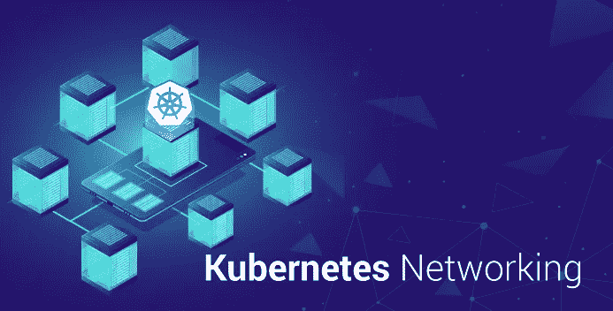

Kubernetes Networking — Edureka

在之前关于**什么是 Kubernetes** 的博客中，你一定对 Kubernetes 有所了解。在这个关于 Kubernetes 网络的博客中，我将主要关注 Kubernetes 中涉及的网络概念。

在这个关于 Kubernetes 网络的博客中，您将了解以下主题:

*   什么是 Kubernetes？
*   Kubernetes 的网络
*   财富向导用例
*   亲自动手

# 什么是 Kubernetes？

您可以将 Kubernetes 定义为一个开源容器编排工具，它为自动化容器化应用程序的部署提供了一个可移植的平台。

现在，任何与 Kubernetes 一起工作的人都必须对 Kubernetes 集群有一个清楚的了解，因为这将有助于你理解 Kubernetes 网络。

# 库伯内特星团

Kubernetes 平台提供了所需的状态管理，这使得集群服务能够运行，并在基础设施中进行 fed 配置。我举个例子解释一下。

考虑一个 YAML 文件，其中包含需要提供给集群服务的所有配置信息。因此，这个文件被提供给集群服务的 API，然后由集群服务来决定如何在环境中调度 pods。因此，假设 pod 1 有两个包含三个副本的容器映像，pod 2 有一个包含两个副本的容器映像，将由群集服务将这些 pod-副本对分配给工作线程。

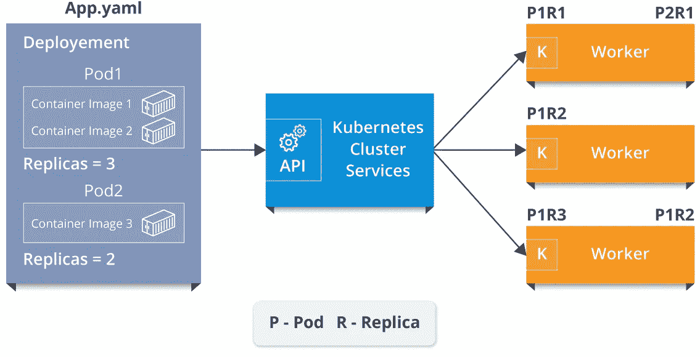

Kubernetes Cluster Services - Kubernetes Networking

参考上图。现在，如您所见，集群服务为第一个工作线程分配了两个 pod 副本对，为第二个工作线程分配了一个 pod 副本对，为第三个工作线程分配了两个 pod 副本对。现在，Kubelet 进程负责将集群服务与工作人员进行通信。

因此，集群服务的整个设置和工作人员本身组成了这个 **Kubernetes 集群**！！

你认为这些单独分配的吊舱是如何相互通信的？

答案就在 Kubernetes 网络！

网络概念主要有 4 个问题需要解决。

*   集装箱对集装箱通信
*   吊舱对吊舱通信
*   Pod 到服务通信
*   服务通信外部

现在，让我告诉你如何解决上述问题与 Kubernetes 网络。

# Kubernetes 网络

集群中的 pod、服务和外部服务之间的通信引入了 Kubernetes 网络的概念。

所以，为了让你更好的理解，让我把这些概念分成以下几个部分。

*   pod 和集装箱通信
*   服务
*   通过入口网络连接外部服务

# pod 和集装箱通信

在我告诉你吊舱是如何通信的之前，我先给你介绍一下什么是吊舱？

## 分离舱

Pods 是 Kubernetes 应用程序的基本单元，它由一个或多个容器组成，这些容器分配在同一台主机上，用于共享网络堆栈和其他资源。因此，这意味着 pod 中的所有容器都可以到达本地主机上的其他容器。

现在，让我简单介绍一下这些豆荚是如何交流的？

有两种类型的沟通。**节点间通信**和**节点内通信。**

因此，让我们从节点内通信开始，但在此之前，让我向您介绍一下 pod 网络的组件。

**节点内 Pod 网络**

节点内 pod 网络基本上是同一 pod 上两个不同节点之间的通信。我举个例子给你解释一下。

假设数据包从 pod1 传输到 pod2。

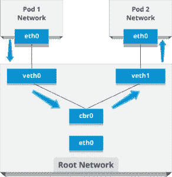

Intra-node Pod Network - Kubernetes Networking

*   数据包在 eth0 离开 Pod 1 的网络，并在 veth0 进入根网络
*   然后，数据包传递到 Linux 网桥(cbr0 ),它使用 ARP 请求发现目的地
*   因此，如果 veth1 有 IP，网桥现在知道将数据包转发到哪里。

现在，类似地，让我告诉你关于节点间 pod 通信。

**节点间 pod 网络**

考虑两个具有不同网络名称空间、网络接口和 Linux 桥的节点。

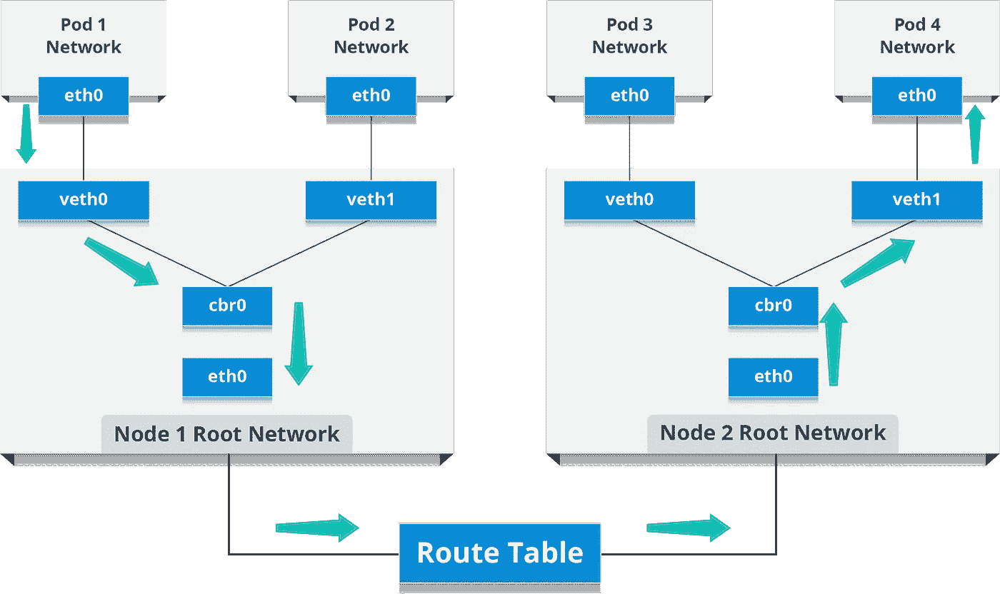

Inter-node Pod Network - Kubernetes Networking

现在，假设数据包从 pod1 传输到位于不同节点的 pod4。

*   数据包离开 pod 1 网络，并在 veth0 进入根网络
*   然后数据包被传递到 Linux 网桥(cbr0 ),它的职责是发出一个 ARP 请求来找到目的地。
*   当网桥意识到这个数据包没有目的地址时，它会返回到主网络接口 eth0。
*   数据包现在离开节点 1，在另一个节点上找到它的目的地，并进入路由表，路由表将数据包路由到其 CIDR 块包含 pod4 的节点。
*   现在，数据包到达节点 2，然后网桥接收数据包，发出 ARP 请求，以确定属于 veth0 的 IP。
*   最后，数据包穿过管道对，到达 pod4。

这就是豆荚之间的交流方式。现在，让我们继续，看看服务是如何帮助 pod 通信的。

那么，你认为服务是什么？

## 服务

基本上，服务是一种资源，它配置一个代理将请求转发给一组 pod，这些 pod 将接收流量&这由选择器决定。一旦服务被创建，它就有一个分配的 IP 地址，该地址将接受端口上的请求。

现在，有各种服务类型可以让您选择在集群 IP 地址之外公开服务。

**服务类型**

主要有 4 种类型的服务。

**ClusterIP:** 这是默认的服务类型，它通过使服务仅在集群内可达来公开集群内部 IP 上的服务。

**NodePort:** 这在一个静态端口上公开了每个节点的 IP 上的服务。因为节点端口服务将路由到的**集群 IP** 服务是自动创建的。我们可以联系集群外部的节点端口服务。

**负载平衡器:**这是一种使用云提供商的负载平衡器对外公开服务的服务类型。因此，会自动创建外部负载平衡器将路由到的 NodePort 和 ClusterIP 服务。

**ExternalName** :该服务类型通过返回一个 **CNAME** 记录及其值，将服务映射到 **externalName** 字段的内容。

伙计们，这就是服务。现在，您可能想知道外部服务如何连接到这些网络，对吗？

嗯，那不是别人，正是**入口网络**。

# 入口网络

嗯，入口网络是公开服务的最强大的方式，因为它是允许入站连接的规则的集合，可以配置为通过可到达的 URL 向外部提供服务。因此，它基本上充当 Kubernetes 集群的入口点，管理对集群中服务的外部访问。

现在，让我用一个例子向你解释入口网络的工作原理。

我们有两个节点，具有 pod 和根网络名称空间，带有一个 Linux 桥。除此之外，我们还在根网络中添加了一个名为 flannel0(网络插件)的新虚拟以太网设备。

现在，我们希望数据包从 pod1 流向 pod 4。

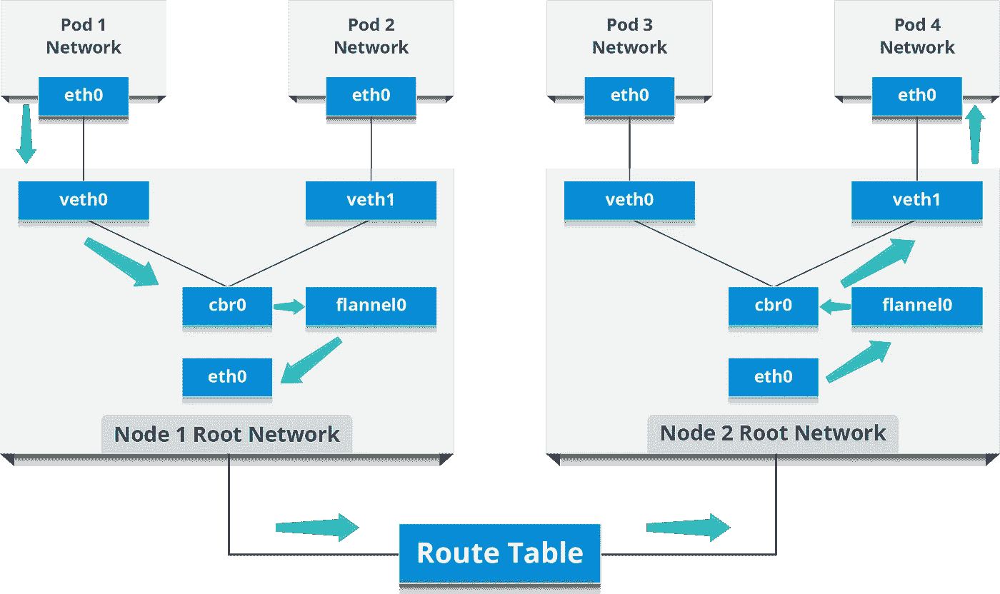

Ingress Network - Kubernetes Networking

*   因此，数据包在 eth0 离开 pod1 的网络，并在 veth0 进入根网络。
*   然后，它被传递到 cbr0，CB r0 发出 ARP 请求以找到目的地，此后它发现该节点上没有人拥有目的地 IP 地址。
*   因此，网桥将数据包发送到 flannel0，因为该节点的路由表配置了 flannel0。
*   现在，法兰绒守护进程与 Kubernetes 的 API 服务器对话，以了解所有 pod IPss 及其各自的节点，从而创建 pod IP 到节点 IP 的映射。
*   网络插件将此数据包封装在 UDP 数据包中，并使用额外的报头将源和目的 IP 更改为各自的节点，然后通过 eth0 将此数据包发送出去。
*   现在，因为路由表已经知道如何在节点之间路由流量，所以它将数据包发送到目的节点 2。
*   数据包到达节点 2 的 eth0，然后返回到 flannel0 进行解封装，并在根网络命名空间中将其发送回去。
*   同样，数据包被转发到 Linux 网桥，以发出 ARP 请求来找出属于 veth1 的 IP。
*   数据包最终穿过根网络，到达目的地 Pod4。

这就是外部服务如何在入口网络的帮助下连接的。现在，当我谈到网络插件时，让我给你介绍一下流行的网络插件列表。

现在，我已经告诉你这么多关于 Kubernetes 网络，让我给你看一个现实生活中的案例研究。

# 案例研究:使用 Kubernetes 网络的财富向导

Wealth Wizards 是一个在线财务规划平台，结合了财务规划和智能软件技术，以可承受的成本提供专家建议。

# 挑战

现在，对于该公司来说，快速发现并消除代码漏洞，同时全面了解其云环境非常重要，但他们希望通过访问限制来控制流量。

因此，他们使用 Kubernetes 基础架构来管理集群的供应和部署，并借助工具来管理跨 Kube 集群的微服务部署和配置。

他们还使用了 Kubernetes 的网络策略功能，允许他们通过访问限制来控制流量。

现在的问题是，这些策略是面向应用程序的，只能随着应用程序的发展而发展，但是，没有强制执行这些策略的组件。

因此，该公司能找到的唯一解决方案是使用网络插件，因此他们开始使用 Weave Net。

# 解决办法

这个网络插件创建了一个虚拟网络，它有一个网络策略控制器来管理和执行 Kubernetes 中的规则。不仅如此，它还跨多个主机连接 Docker 容器，并支持它们的自动发现。

因此，假设您在集群中有一个工作负载，并且您想要停止集群中任何其他工作负载与它的对话。您可以通过创建一个网络策略来实现这一点，该策略限制访问，只允许通过特定端口上的入口控制器进入。

现在，随着他在每个 Kubernetes 节点上的部署，该插件管理 pod 间的路由，并可以操纵 IPtables 规则。简单地说，每个策略都被转换成一组 IPtables 规则，在每台机器上进行协调和配置，以翻译 Kubernetes 标记。

好了，现在你已经了解了这么多关于 Kubernetes 网络的理论，让我来告诉你实际上是怎么做的。

# 亲自动手

所以，假设你们所有人都在系统上安装了 Kubernetes，我有一个场景要展示。

假设您想要存储产品名称和产品 ID，为此您将需要一个 web 应用程序。基本上，你需要一个 web 应用程序容器，你还需要一个后端的 MySQL 容器，这个 MySQL 容器应该链接到 web 应用程序容器。

我实际执行上面的例子怎么样。

我们开始吧！

**第一步:**在你想要的目录下创建一个文件夹，并更改该文件夹的工作目录路径。

```
mkdir HandsOn 
cd HandsOn/
```

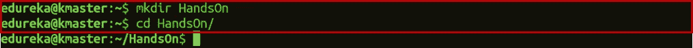

**步骤 2:** 现在为 web 应用程序和 MySQL 数据库创建部署 YAML 文件。

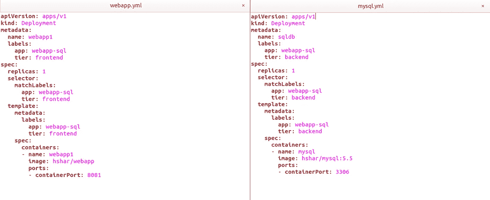

**步骤 3:** 一旦创建了部署文件，就部署这两个应用程序。

```
kubectl apply -f webapp.yml 
kubectl apply -f mysql.yml
```

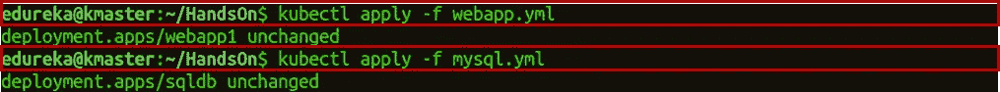

**步骤 3.1:** 检查两个部署。

```
kubectl get deployment
```

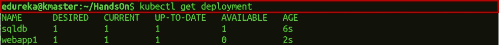

步骤 4: 现在，您必须为这两个应用程序创建服务。

```
kubectl apply -f webservice.yml 
kubectl apply -f sqlservice.yml
```

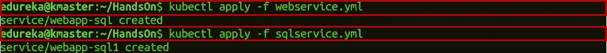

**步骤 4.1:** 创建服务后，部署服务。

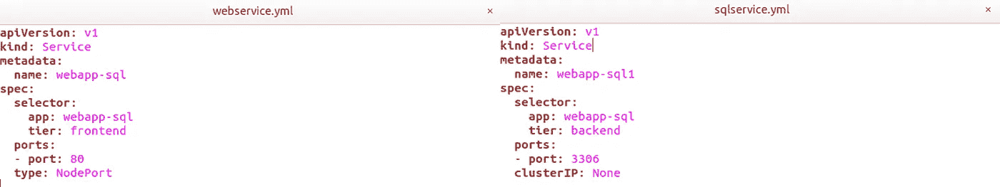

**步骤 4.2:** 检查服务是否已经创建。

```
kubectl get service
```

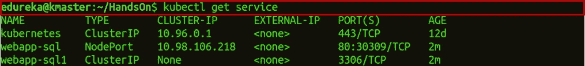

**第 5 步:**现在，检查运行 pod 的配置。

```
kubectl get pods
```

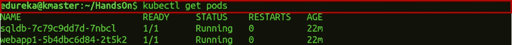

**步骤 6:** 进入 webapp pod 内的容器。

```
kubectl exec -it container_id bash 
nano var/www/html/index.php
```

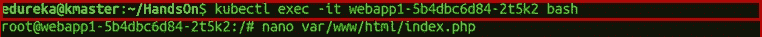

**步骤 6.1** :现在，将 **$servername** 从 localhost 改为 SQL 服务名，本例中为“ **webapp-sql1** ”，将 **$password** 从“”改为“ **edureka** ”。此外，填写所需的所有数据库详细信息，并使用键盘快捷键 **Ctrl+x** 保存您的 index.php 文件，然后按 **y** 保存并按**输入**。

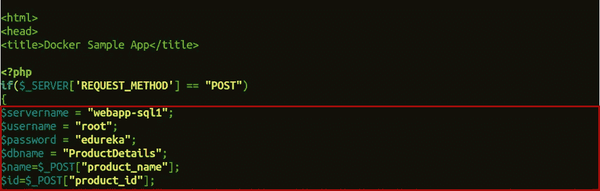

**第 7 步:**现在，进入 pod 中的 MySQL 容器。

```
kubectl exec it container_id bash
```

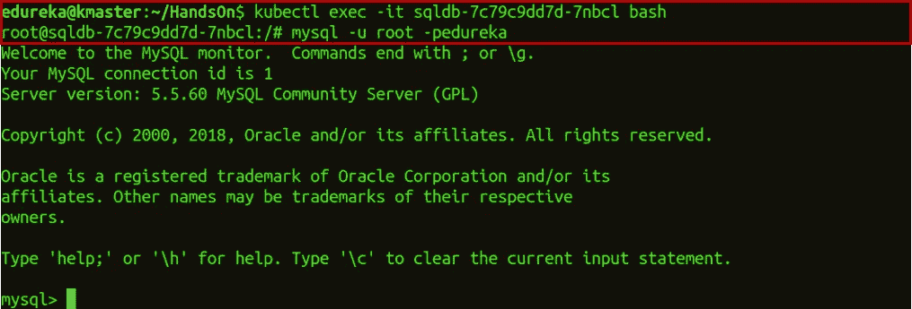

**步骤 7.1:** 获得使用 MySQL 容器的权限。

```
mysql -u root -p edureka
```

其中-u 代表用户，而-p 是您的机器的密码。

**步骤 7.2:** 在 MySQL 中创建一个数据库，用于从 webapp 获取数据。

```
CREATE DATABASE ProductDetails;
```

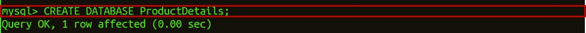

**步骤 7.3:** 使用创建的数据库。

```
USE ProductDetails;
```

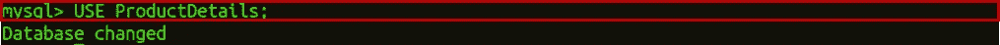

**步骤 7.4:** 在 MySQL 数据库中创建一个表，用于从 webapp 获取数据。

```
CREATE TABLE products(product_name VARCHAR(10), product_id VARCHAR(11));
```

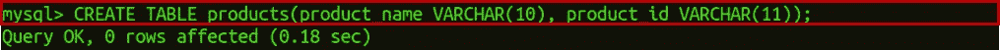

**步骤 7.5:** 现在，使用命令 **exit** 退出 MySQL 容器。

**步骤 8:** 检查您的 web 应用程序工作的端口号。

```
kubectl get services
```

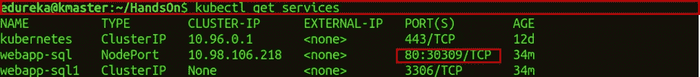

**步骤 8.1:** 现在，在分配的端口号上打开 web 应用程序。


**步骤 9:** 一旦你点击**提交查询**，转到你的 MySQL 服务正在运行的节点，然后进入容器内部。


这将向您显示所有列表产品的输出，您已经填写了这些产品的详细信息。

这就结束了这个关于 Kubernetes 网络的博客。如果你想查看更多关于人工智能、Python、道德黑客等市场最热门技术的文章，那么你可以参考 [Edureka 的官方网站。](https://www.edureka.co/blog/?utm_source=medium&utm_medium=content-link&utm_campaign=kubernetes-networking)

请留意本系列中的其他文章，它们将解释 Kubernetes 的各个方面。

> 1.[什么是 Kubernetes？](/edureka/what-is-kubernetes-container-orchestration-tool-d972741550f6)
> 
> 2.[在 Ubuntu 上安装 Kubernetes](/edureka/install-kubernetes-on-ubuntu-5cd1f770c9e4)
> 
> 3. [Kubernetes 教程](/edureka/kubernetes-tutorial-fe6de6a20325)
> 
> 4. [Kubernetes 仪表板安装&视图](/edureka/kubernetes-dashboard-d909b8b6579c)
> 
> 5. [Kubernetes 建筑](/edureka/kubernetes-architecture-c43531593ca5)
> 
> 6.[Kubernetes vs Docker Swarm](/edureka/kubernetes-vs-docker-45231abeeaf1)
> 
> 7. [Kubernetes 面试问题](/edureka/kubernetes-interview-questions-c9790e5abddb)
> 
> 8.[与亚马逊 EKS 合作开发 Kubernetes 应用](/edureka/amazon-eks-ac646c23abf8)
> 
> 9.[在 AWS 上设置 Kubernetes 入口控制器](/edureka/kubernetes-ingress-controller-nginx-c5cf9e8ff031)
> 
> 10.[如何用 Elasticsearch 和 Kibana 可视化 Kubernetes 集群](/edureka/logging-monitoring-elasticsearch-fluentd-kibana-e2cd477a576b)

*原载于 2018 年 9 月 24 日 www.edureka.co**的* [*。*](https://www.edureka.co/blog/kubernetes-networking/)