# Kubernetes 教程——编排巨人综合指南

> 原文：<https://medium.com/edureka/kubernetes-tutorial-fe6de6a20325?source=collection_archive---------1----------------------->

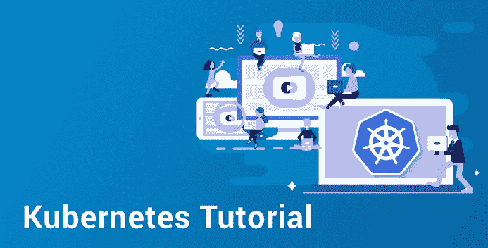

Kubernetes Tutorial - Edureka

Kubernetes 是一个平台，它消除了部署容器化应用程序所涉及的手动过程。在 Kubernetes 教程的这篇博客中，您将浏览与这个多容器管理解决方案相关的所有概念。

本教程将涵盖以下主题:

*   没有容器编排的挑战
*   Docker Swarm 或 Kubernetes
*   什么是 Kubernetes？
*   Kubernetes 功能
*   库伯内特建筑
*   Kubernetes 案例研究
*   亲自动手

现在，在继续这篇博客之前，让我简单介绍一下集装箱化。

因此，在容器出现之前，开发人员和测试人员之间总是会发生口角。这通常是因为在开发端起作用的东西，在测试端不起作用。两者存在于不同的环境中。现在，为了避免这种情况，引入了容器，这样开发人员和测试人员就在同一个页面上。

处理大量的集装箱也是一个问题。有时在运行容器时，在产品方面，很少出现开发阶段不存在的问题。这种场景引入了容器编排系统。

在我深入研究编排系统之前，让我快速列出没有这个系统所面临的挑战。

# Kubernetes 教程:没有容器编排的挑战

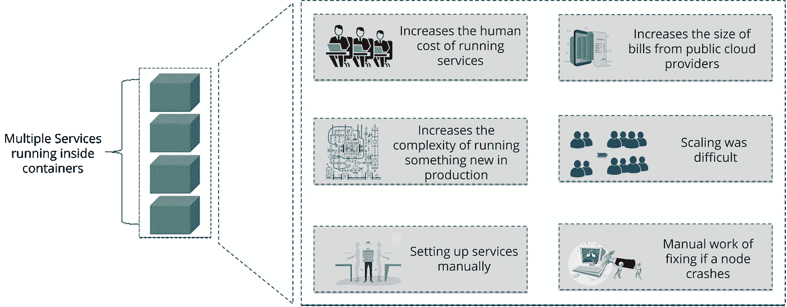

Challenges Without Container Orchestration - Kubernetes Tutorial

正如您在上图中看到的，当多个服务在容器中运行时，您可能想要伸缩这些容器。在大规模工业中，这真的很难做到。这是因为这将增加维护服务的成本，以及并行运行这些服务的复杂性。

现在，为了避免手动设置服务和克服挑战，需要一些大的东西。这就是容器编排引擎发挥作用的地方。

这个引擎让我们组织多个容器，以这样的方式启动所有底层机器，容器是健康的并且分布在集群环境中。当今世界，这样的引擎主要有两种:**Kubernetes**&**Docker Swarm**。

# Kubernetes 教程:Kubernetes vs Docker Swarm

**Kubernetes** 和 **Docker Swarm** 是当今市场上领先的容器编排工具。所以在 prod 中使用它们之前，您应该知道它们到底是什么以及它们是如何工作的。

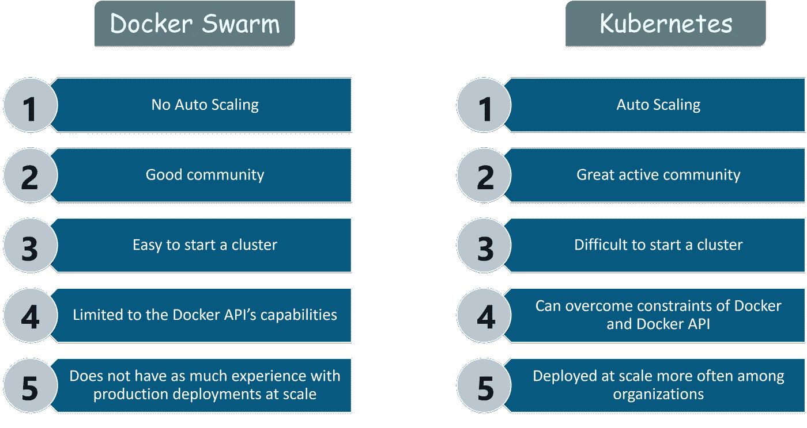

Docker Swarm vs Kubernetes - Kubernetes Tutorial

你可以参考上面的图片，Kubernetes 与 Docker Swarm 相比，拥有一个非常活跃的社区，并在许多组织中实现了自动扩展。类似地，与 Kubernetes 相比，Docker Swarm 有一个易于启动的集群，但它受限于 Docker API 的功能。

好了，伙计们，这些不是这些顶级工具之间的唯一区别。如果你想知道这两种容器编排工具之间的详细区别，那么你可以参考我关于 Kubernetes vs Docker Swarm 的文章。

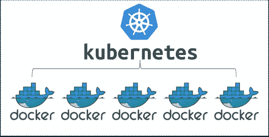

Representation of Kubernetes - Kubernetes Tutorial

如果我可以在这两者中选择一个，那么它必须是 Kubernetes，因为容器需要被管理并连接到外部世界，以完成诸如调度、负载平衡和分发之类的任务。

但是，如果你从逻辑上考虑，Docker Swarm 会是一个更好的选择，因为它运行在 Docker 之上，对吗？如果我是你，我肯定会对使用哪个工具感到困惑。但是，嘿，Kubernetes 是市场上无可争议的领导者，也确实运行在 Docker 容器之上，具有更好的功能。

现在，既然你已经理解了 Kubernetes 的必要性，那我就告诉你什么是 Kubernetes 吧？

# Kubernetes 教程:什么是 Kubernetes？

Kubernetes 是一个开源系统，它处理将容器调度到计算集群上的工作，并管理工作负载，以确保它们按照用户的意图运行。作为谷歌的创意，它提供了优秀的社区，并与所有的云提供商出色地合作，成为一个*多容器管理解决方案。*

# Kubernetes 教程:Kubernetes 特性

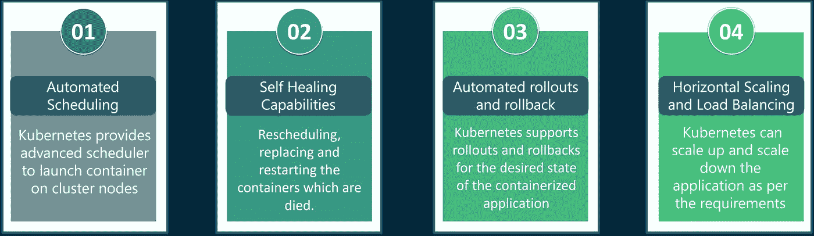

Kubernetes Features - Kubernetes Tutorial

Kubernetes 的特点如下:

*   **自动化调度:** Kubernetes 提供了一个高级调度器，可以根据集群节点的资源需求和其他约束在集群节点上启动容器，同时不会牺牲可用性。
*   **自我修复能力:** Kubernetes 允许在节点失效时替换和重新安排容器。它还杀死不响应用户定义的健康检查的容器，并且在它们准备好服务之前不向客户端通告它们。
*   **自动推出&回滚:** Kubernetes 推出对应用程序或其配置的更改，同时监控应用程序的健康状况，以确保它不会同时终止所有实例。如果出现问题，使用 Kubernetes，您可以回滚更改。
*   **水平扩展&负载平衡:** Kubernetes 可以通过一个简单的命令，使用一个 UI，或者根据 CPU 的使用情况自动地根据需求扩展和缩小应用程序。

# Kubernetes 教程:Kubernetes 建筑

Kubernetes 架构有以下主要组件:

*   主节点
*   工作/从属节点

我将逐一讨论它们。因此，首先让我们从了解**主节点**开始。

# 主网点

主节点负责管理 Kubernetes 集群。它主要是所有管理任务的入口点。集群中可以有多个主节点来检查容错能力。

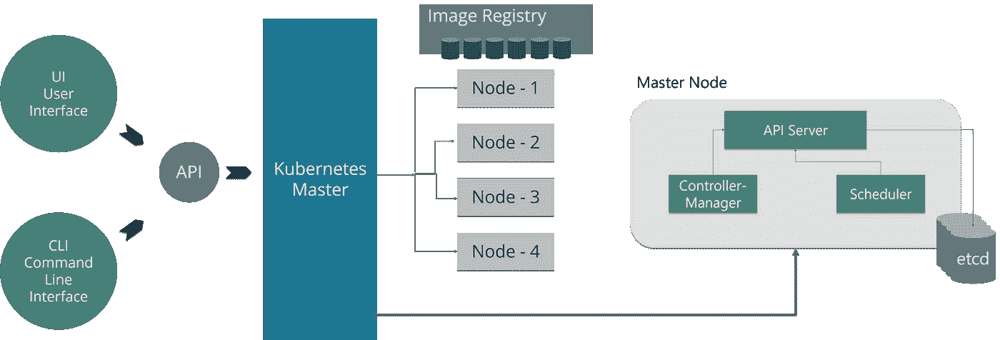

Kubernetes Master Node - Kubernetes Tutorial

如上图所示，主节点有各种组件，如 API 服务器、控制器管理器、调度器和 ETCD。

*   **API 服务器:**API 服务器是所有用于控制集群的 REST 命令的入口点。
*   **控制器管理器:**是一个监控 Kubernetes 集群的守护进程，管理不同的非终止控制循环。
*   **调度器:**调度器将任务调度给从节点。它存储每个从节点的资源使用信息。
*   ETCD: ETCD 是一个简单的、分布式的、一致的键值存储。它主要用于共享配置和服务发现。

# 工作/从属节点

工作节点包含管理容器之间的网络、与主节点通信以及向调度容器分配资源的所有必要服务。

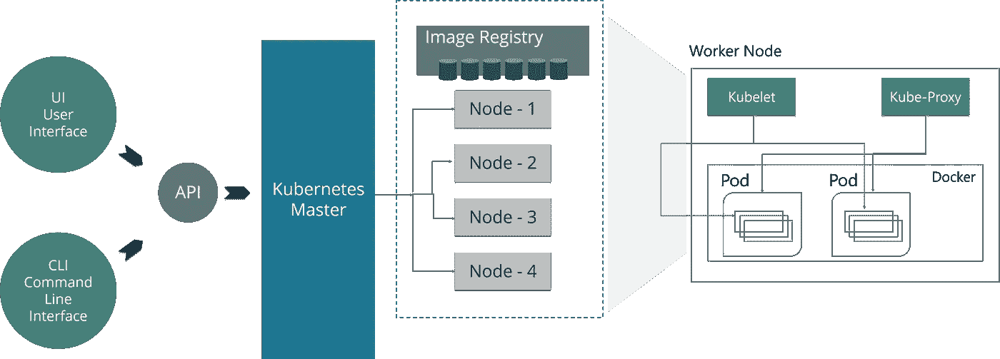

Kubernetes Slave Node - Kubernetes Tutorial

如上图所示，worker 节点有各种组件，如 Docker 容器、Kubelet、Kube-proxy 和 Pods。

*   **Docker 容器:** Docker 运行在每个 worker 节点上，并运行配置好的 pod
*   **Kubelet:** Kubelet 从 API 服务器获取 Pod 的配置，并确保所描述的容器启动并运行。
*   **Kube-proxy:** Kube-proxy 充当单个工作节点上服务的网络代理和负载平衡器
*   **pod:**pod 是逻辑上在节点上一起运行的一个或多个容器。

如果你想要 Kubernetes 架构所有组件的详细解释，那么你可以参考我们关于 **Kubernetes 架构的博客。**

# Kubernetes 教程:Kubernetes 案例研究


雅虎！日本是一家网络服务提供商，总部位于加利福尼亚州森尼维尔。由于该公司的目标是虚拟化硬件，该公司在 2012 年开始使用 **OpenStack** 。他们的内部环境变化很快。然而，由于云和容器技术的进步，该公司希望能够在各种平台上推出服务。

**问题:**如何从一个应用程序代码为所有需要的平台创建映像，并将这些映像部署到每个平台上？

为了更好地理解，请参考下图。当在代码注册处更改代码时，持续集成工具会创建裸机映像、Docker 容器和 VM 映像，并将其推入映像注册处，然后部署到每个基础架构平台。

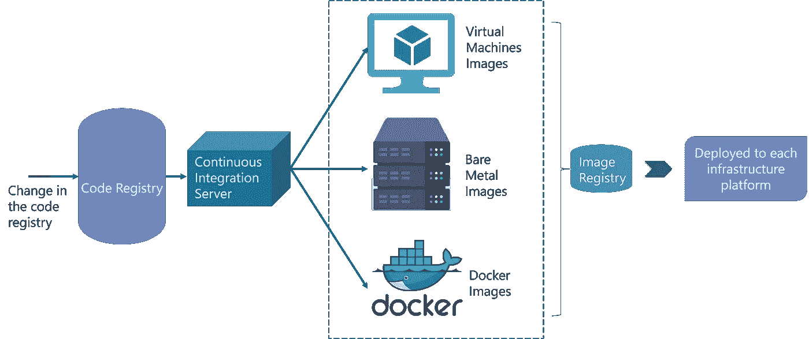

Process Flow of Yahoo Japan - Kubernetes Tutorial

现在，让我们关注容器工作流，了解他们如何使用 Kubernetes 作为部署平台。参考下图，先睹为快平台架构。

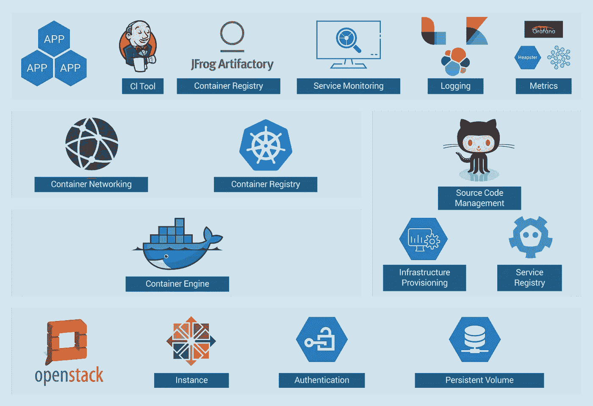

The solution for Case Study - Kubernetes Tutorial

使用 OpenStack 实例，在其上使用 Docker、Kubernetes、Calico 等来执行各种操作，如容器联网、容器注册等。

当您有许多集群时，管理它们就变得很困难，对吗？

因此，他们只想创建一个简单的基本 OpenStack 集群，以提供 Kubernetes 所需的基本功能，并使 OpenStack 环境更易于管理。

通过图像创建工作流和 Kubernetes 的结合，他们建立了下面的工具链，使得从代码推送到部署变得容易。

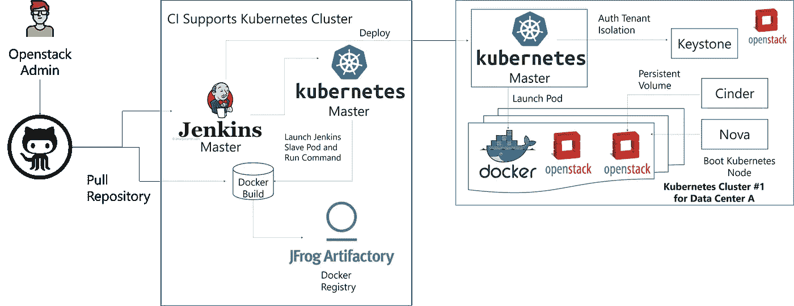

Process Flow of Solution - Kubernetes Tutorial

这种工具链确保生产部署的所有因素都得到考虑，例如多租户、身份验证、存储、网络、服务发现。

乡亲们就是这样，**雅虎！日本**在**谷歌**和 **Solinea** 的帮助下，为运行在 OpenStack 上的 Kubernetes“一键式”代码部署建立了一个自动化工具链。

# Kubernetes 教程:动手操作

在这次实践中，我将向您展示如何创建部署和服务。我使用一个 Amazon EC2 实例来使用 Kubernetes。嗯，亚马逊已经为 **Kubernetes(亚马逊 EKS)** 提供了**亚马逊弹性容器服务**，这允许他们非常快速和容易地在云中创建 Kubernetes 集群。如果你想了解更多，你可以参考博客[这里](https://www.edureka.co/blog/amazon-eks/?utm_source=medium&utm_medium=content-link&utm_campaign=kubernetes-tutorial)。

**步骤 1:** 首先**创建一个文件夹**，您将在其中创建您的部署和服务。之后，使用编辑器**打开一个部署文件**。

```
mkdir handsOn 
cd handsOn 
vi Deploy.yaml
```


**步骤 2:** 打开部署文件后，提及您想要部署的应用程序的所有规范。在这里，我试图部署一个 httpd T21 应用程序。

```
apiVersion: apps/v1  #Defines the API Version
kind: Deployment     #Kinds parameter defines which kind of file is           it, over here it is Deployment
metadata:
  name: dep1        #Stores the name of the deployment
spec:               # Under Specifications, you mention all the specifications for the deployment
  replicas: 3       # Number of replicas would be 3
  selector:
    matchLabels:
      app: httpd     #Label name which would be searched is httpd
  template:
    metadata:
      labels:
        app: httpd   #Template name would be httpd
    spec:            # Under Specifications, you mention all the specifications for the containers
      containers:
      - name: httpd   #Name of the containers would be httpd
      image: httpd:latest  #The image which has to be downloaded is httpd:latest
      ports:
        - containerPort: 80 #The application would be exposed on port 80
```

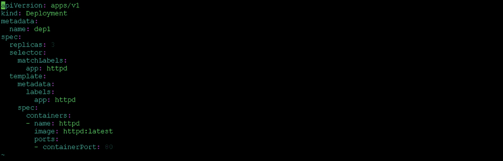

**步骤 3:** 在编写了部署文件之后，使用下面的命令应用部署。

```
kubectl apply -f Deploy.yaml
```

这里-f 是用于文件名的标志名。

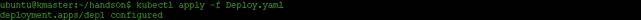

**步骤 4:** 现在，一旦应用了部署，就可以运行 pod 列表了。

```
kubectl get pods -o wide
```

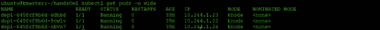

这里，-o wide 用于了解部署在哪个节点上运行。

**步骤 5:** 在您创建了一个部署之后，现在您需要创建一个服务。再次使用编辑器，打开一个空白的 **service.yaml 文件**。

```
vi service.yaml
```


**第六步:**打开服务文件后，提及服务的所有规格。

```
apiVersion: v1  #Defines the API Version 
kind: Service   #Kinds parameter defines which kind of file is it, over here it is Service
metadata:
  name: netsvc   #Stores the name of the service
spec:            # Under Specifications, you mention all the specifications for the service
  type: NodePort
  selector:
    app: httpd
  ports:
  -protocol: TCP
   port: 80
   targetPort: 8084    #Target Port number is 8084
```

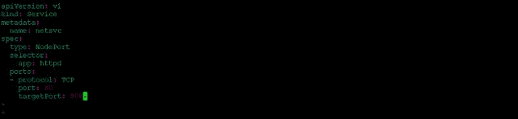

**第 7 步:**编写服务文件后，使用以下命令应用服务文件。

```
kubectl apply -f service.yaml
```

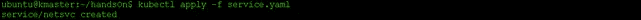

**步骤 8:** 现在，一旦应用了您的服务，使用下面的命令检查服务是否正在运行。

```
kubectl get svc
```

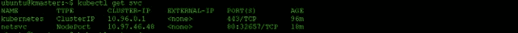

**步骤 9:** 现在，要查看服务的规范，并检查它绑定到哪个端点，使用下面的命令。

```
kubectl describe svc <name of the service>
```

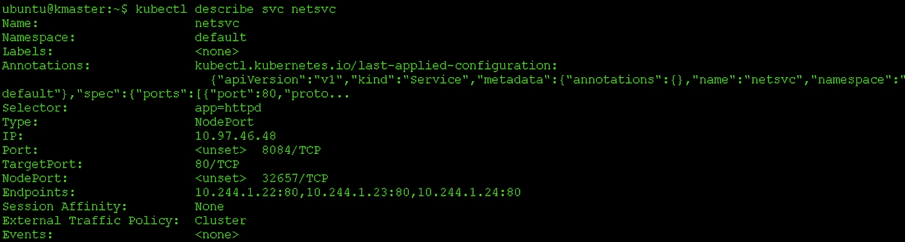

**步骤 10:** 现在，由于我们使用 amazon ec2 实例，要获取网页并检查输出，请使用以下命令。

```
curl ip-address
```


这就结束了这个关于 Kubernetes 教程的博客。如果你想查看更多关于人工智能、Python、道德黑客等市场最热门技术的文章，你可以参考 Edureka 的官方网站。

请留意本系列中的其他文章，它们将解释 Kubernetes 的各个方面。

> 1.[什么是 Kubernetes？](/edureka/what-is-kubernetes-container-orchestration-tool-d972741550f6)
> 
> 2.[在 Ubuntu 上安装 Kubernetes](/edureka/install-kubernetes-on-ubuntu-5cd1f770c9e4)
> 
> 3. [Kubernetes 仪表板安装&视图](/edureka/kubernetes-dashboard-d909b8b6579c)
> 
> 4. [Kubernetes 建筑](/edureka/kubernetes-architecture-c43531593ca5)
> 
> 5. [Kubernetes 网络](/edureka/kubernetes-networking-a46d9f994bab)
> 
> 6.[Kubernetes vs Docker Swarm](/edureka/kubernetes-vs-docker-45231abeeaf1)
> 
> 7. [Kubernetes 面试问题](/edureka/kubernetes-interview-questions-c9790e5abddb)
> 
> 8.[与亚马逊 EKS 合作开发 Kubernetes 应用](/edureka/amazon-eks-ac646c23abf8)
> 
> 9.[在 AWS 上设置 Kubernetes 入口控制器](/edureka/kubernetes-ingress-controller-nginx-c5cf9e8ff031)
> 
> 10.[如何用 Elasticsearch 和 Kibana 可视化 Kubernetes 集群](/edureka/logging-monitoring-elasticsearch-fluentd-kibana-e2cd477a576b)

*原载于 2018 年 11 月 27 日*[*www.edureka.co*](https://www.edureka.co/blog/kubernetes-tutorial/)*。*