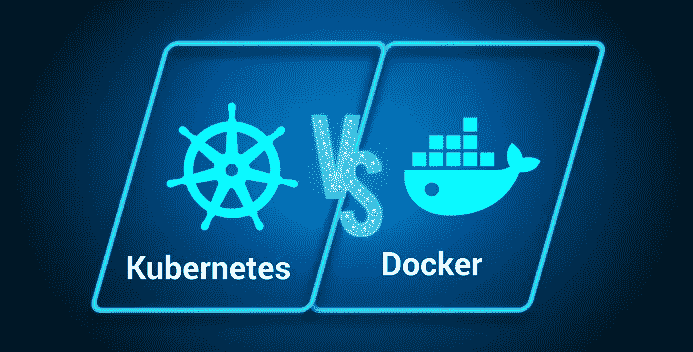
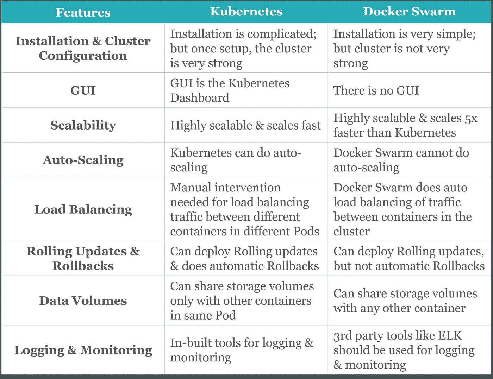
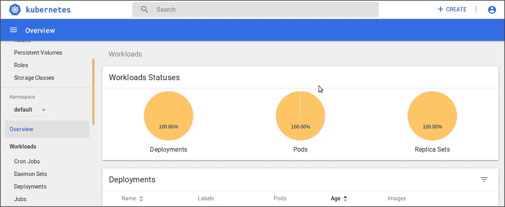
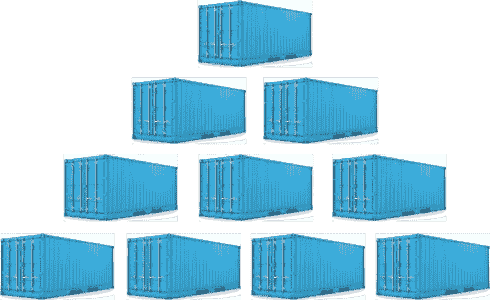
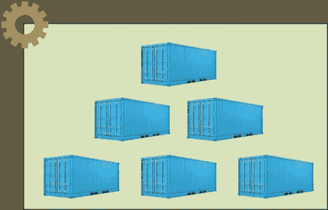
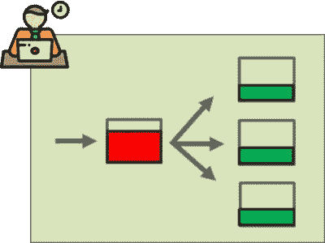

# kubernetes vs Docker——比较编排巨头

> 原文：<https://medium.com/edureka/kubernetes-vs-docker-45231abeeaf1?source=collection_archive---------0----------------------->

Kubernetes vs Docker - Edureka

Kubernetes 和 T2 Docker Swarm 是当今领先的容器编排工具。因此，在您的产品中使用它们之前，您应该知道它们到底是什么以及它们是如何工作的。要理解这一点，请阅读这篇博客，它讨论了 Kubernetes 与 Docker Swarm 之间的性能和可用性对峙。

下表简要总结了 **Kubernetes** 与 **Docker Swarm** 的区别。详细的解释将在博客的后面提供。

Differences Between Kubernetes & Docker Swarm - Kubernetes vs Docker Swarm

# Kubernetes vs Docker Swarm

我还想提醒你，人们把 Docker Swarm 误解为 Docker。Docker 只是一个集装箱化的平台。 **Docker Swarm** 是一个容器编排平台，与 **Kubernetes** 相同。因此，在同一组参数上比较两者是唯一正确的。我将比较的参数是:

*   安装和集群配置
*   图像使用者界面
*   可量测性
*   自动缩放
*   负载平衡
*   滚动更新和回滚
*   数据量
*   记录和监控

# 安装和集群配置

用 **Docker Swarm** 建立一个集群只需动动手指就能完成。只需要执行两个命令。一个在经理端，另一个在工人端。从字面上看，这就是全部。之后，您可以立即开始部署。

然而，有了 Kubernetes，设置就没有 Swarm 那么容易了。您需要运行命令来启动集群，然后定义您的环境，然后定义 Pod 网络(供容器交互)，然后启动仪表板，最后集群将被托管。

# GUI (Kubernetes 仪表板)

GUI 基本上是一个**仪表板**，可以用来毫不费力地控制您的集群。没有 CLI 命令麻烦，没有技术工作，简单的英语，即使是非技术背景的专业人员也可以应付。你可以在***localhost:8001***通过 **Kubernetes 仪表盘**获得这一切。

Kubernetes Dashboard - Kubernetes vs Docker Swarm

然而，**码头工人群**回复说，“*对不起，我们现在没有这样的设施*”。是的，没有仪表板！这是一种不安。但是，嘿，权威人士会为它辩护说，如果你在处理容器，那么你就有足够的技术来处理没有 GUI 的情况。而且，这也是部分正确的。

# 可量测性

Scalability of Containers - Kubernetes vs Docker Swarm

扩大集装箱数量是任何公司的最终需求。那里没有例外。在这里，Kubernetes 和 Swarm 都立场坚定。双方都不赢。Kubernetes 在保持集群强度方面稍好，而 Swarm 在扩展方面稍快(比 K8s 快 5 倍)。

我对这一点的看法是，集群的力量比什么都重要。在 Prod 中，我宁愿确保更高的稳定性，而不是灵活性。因此，Kubernetes 是我的赢家。

# 自动缩放

Auto-scaling feature - Kubernetes vs Docker Swarm

明显的赢家是库伯内特斯。这是因为，K8s 足够智能，可以分析您的服务器负载，并根据需要进行伸缩。不需要人工干预。这是一个很大的帮助，因为著名的“交通大灾难”可以完全避免。

但是**码头工人群**在这里并不是自信的防守者。当流量涌入时，它崩溃了，没有可用的帮助。而手动干预是唯一的出路(不支持自动缩放)。

# 负载平衡

Representation of Load Balancing Kubernetes vs Docker Swarm

**Kubernetes** 在这里挨打。有时，您需要手动配置负载平衡设置。多个容器作为一个容器。并且每个服务可以被定义为一组 pod。现在的挑战是让这些豆荚互相交谈，因为它们应该很容易被发现。因为服务用于发现，而不是它们的 IP 地址，因此存在挑战。

使用 **Swarm** 进行负载平衡很简单，因为 Swarm 会自动进行负载平衡。没有 pod 的概念，因此所有容器都使用网络 IP 地址相互发现，只要节点连接到集群，这就会自动发生。

# 滚动更新和回滚

Kubernetes 又赢了。事实上，K8s 和 Swarm 集群都支持对容器进行‘滚动更新’的概念。k8s 对 pod 整体执行滚动更新，而 Swarm 直接对容器执行。滚动更新是逐步将更新部署到所有容器中的现有应用程序的过程。

但是 **Swarm** 被打败了，因为它不能自动回滚。每当部署更新时出现问题，K8s 和 Swarm 都提供了一个回滚到之前稳定部署的选项。但是，只有 Kubernetes 在出现故障的情况下会自动回滚。集群的主服务器密切监视更新和部署。

# 数据量

**Kubernetes** 允许我们在同一个 Pod 内的多个容器之间共享存储容量。然而， **Docker Swarm** 允许我们与任何其他容器共享存储容量。但 K8s 的优势在于，存储可以很容易地安装在本地存储上，或者安装在像 AWS、GCP 这样的公共云上，甚至安装在像 NFS 这样的共享网络上。

# 记录和监控

Kubernetes 提供了用于记录和监控的内置工具。日志记录有助于在出现故障时快速分析日志并了解问题所在。监控有助于主节点持续了解节点的健康状态以及它们所封装的服务。Kubernetes 进行内置日志记录和监控。然而，有了 **Swarm** ，我们可以使用像 ELK 这样的第三方工具。

因此，在选择 Kubernetes 还是 Docker Swarm 之前，这些是你必须记住的相关参数。

这篇关于 Kubernetes vs Docker Swarm 的文章到此结束。如果你想查看更多关于人工智能、Python、道德黑客等市场最热门技术的文章，你可以参考 [Edureka 的官方网站。](https://www.edureka.co/blog/?utm_source=medium&utm_medium=content-link&utm_campaign=kubernetes-vs-docker)

请留意本系列中的其他文章，它们将解释 Kubernetes 的各个方面。

> 1.[什么是 Kubernetes？](/edureka/what-is-kubernetes-container-orchestration-tool-d972741550f6)
> 
> 2.[在 Ubuntu 上安装 Kubernetes](/edureka/install-kubernetes-on-ubuntu-5cd1f770c9e4)
> 
> 3. [Kubernetes 教程](/edureka/kubernetes-tutorial-fe6de6a20325)
> 
> 4. [Kubernetes 仪表板安装&视图](/edureka/kubernetes-dashboard-d909b8b6579c)
> 
> 5. [Kubernetes 建筑](/edureka/kubernetes-architecture-c43531593ca5)
> 
> 6. [Kubernetes 网络](/edureka/kubernetes-networking-a46d9f994bab)
> 
> 7. [Kubernetes 面试问题](/edureka/kubernetes-interview-questions-c9790e5abddb)
> 
> 8.[与亚马逊 EKS 合作开发 Kubernetes 应用](/edureka/amazon-eks-ac646c23abf8)
> 
> 9.[在 AWS 上设置 Kubernetes 入口控制器](/edureka/kubernetes-ingress-controller-nginx-c5cf9e8ff031)
> 
> 10.[如何用 Elasticsearch 和 Kibana 可视化 Kubernetes 集群](/edureka/logging-monitoring-elasticsearch-fluentd-kibana-e2cd477a576b)

*原载于 2017 年 12 月 18 日*[*www.edureka.co*](https://www.edureka.co/blog/kubernetes-vs-docker/)*。*